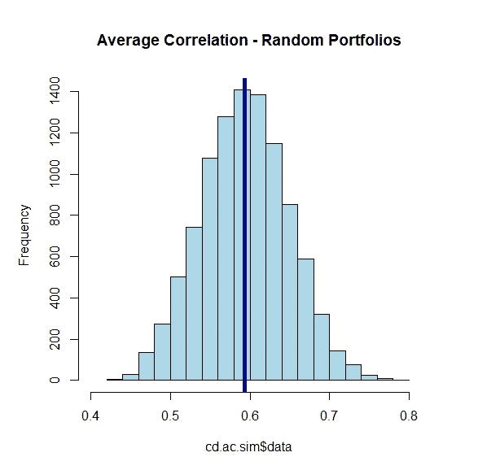
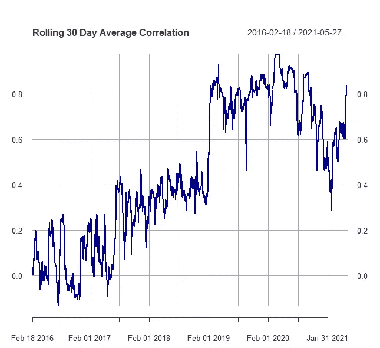
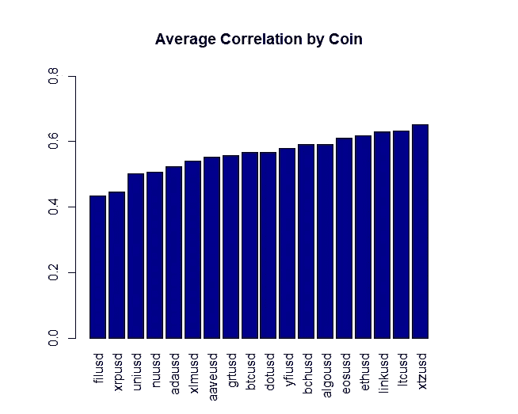
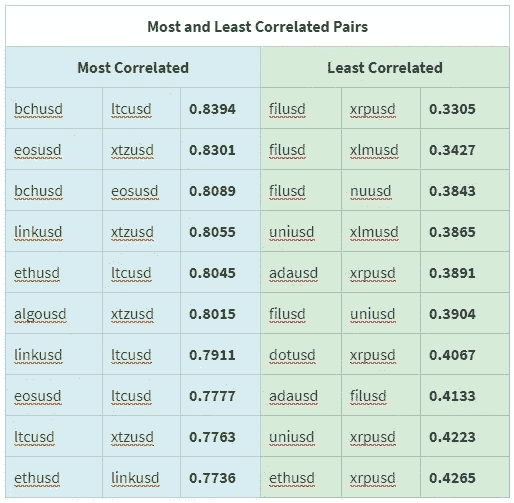
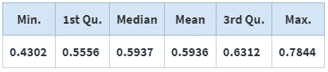

# 加密货币“多样”吗？

> 原文：<https://medium.com/coinmonks/are-cryptocurrencies-diverse-e12ca6bc5f0e?source=collection_archive---------9----------------------->

## *霍德尔的投资组合构建*

## **简介**

Bridgewater Associates 的创始人雷伊·达里奥最近对加密货币发表了以下评论:

> **“…你想要一个适当多元化的投资组合…问题是…**
> 
> 这些替代货币的多样性足够吗？”

这是一个大问题，值得进行大量的研究。在这篇短文中，我的篇幅有限，但我们可以迈出第一步。如果你时间紧迫，你可以浏览到 TL；文末博士。

## **四大巨头**

首先，让我们看看比特币(BTC)、以太(ETH)、莱特币(LTC)和瑞波(XRP)，也就是“四大”的日回报率。如果你以前没听过他们被这样称呼，没关系，因为这是我瞎编的。

从 2016 年 2 月到 2021 年 5 月，这四种硬币的日收益率的平均相关性约为 0.38。这相当低，表明投资这四种硬币提供了一些多样化的好处。

不幸的是，长期平均相关性并不能说明全部情况。从 2016 年初到 2019 年底，平均相关性为 0.185，从 2019 年到 2021 年 5 月，这一数字上升到 0.744。

我们可以通过查看滚动的 30 天平均相关性来了解这一点(对于传统资产，我会使用更长的窗口，但对于加密货币，30 天似乎是有益的，因为 a .它们的高波动性和 b .该领域创新的快速步伐)。

## **Coindesk 20 (-2)**

任何四种货币都不太可能提供很大的多样化潜力，所以让我们看看更广泛的一组货币。 [**CoinDesk 20**](https://www.coindesk.com/coindesk20) 指数寻求成为加密货币机会集的代表。在接下来的几个分析中，我将使用当前成分的每日收益，减去两个稳定成分(USDT 和 USDC)。

从 2020 年 12 月底到 2021 年 5 月底，18 种货币的平均相关性为 0.594，因为 cryptos 每周 7 天交易约 150 次。

***让我们再深入一点:***

下面的柱状图显示了样本中每枚硬币与所有其他硬币的平均相关性。Filecoin、Ripple 和 Uniswap 与我们样本的其余部分的平均相关性最低，而 Tezos、Chainlink 和 Litecoin 与样本的平均相关性最高。比特币处于中游，这让我觉得有点意外。

在成对的基础上，我们可以看到 Filecoin、Ripple 和 Uniswap 出现在 10 个最不相关的对中的大多数对中，Chainlink、Tezos 和 Litecoin 出现在 10 个最相关的对中的大多数对中。如果我们希望将核心配置分散到特定货币或集中的行业，这类信息可能会有所帮助。

## **投资组合模拟**

我喜欢认为自己是一个“好”的投资者，但我不想欺骗自己，认为自己比实际情况好得多。我用来防止欺骗自己的一个工具是查看我可以改变的参数的潜在结果的分布，例如，选择投资或它们的投资组合权重。它能让我们更好地了解什么是现实，以及市场的变迁会把我们带向何方。

这是一个非常简单的模拟，我们从一顶帽子里挑出五个硬币(没有替换)，存储平均相关性，并重复数千次。

下表显示了从我们的样本中随机选择的 5 种货币的 10，000 个投资组合的平均相关性的汇总数据。该图表是相同数据的直方图。从帽子里挑出 5 枚硬币，得到的平均相关性在 0.43 到 0.78 之间，平均值略低于 0.60(直方图上的深蓝色线)。

## **雷的金罐子**

那么，雷伊·达里奥认为什么是足够的多样化呢？雷经常谈到“投资的圣杯”，他将其描述为找到 15 个左右不相关的回报流。如果它们真的不相关，它们不一定要很好，也不一定要很好，它们只需要还行，就能在组合中产生巨大的风险调整回报。这听起来容易，但实际上很难。

假设波动率和相关性是稳定的；相互关联度为 0.60(上述模拟的平均值)的 5 种资产的投资组合只能降低约 15%的波动性。在相关性为 0.40 时(以上分布的左尾)，波动率将降低约 25%。对于这两种情况，大部分好处来自前五项资产，增加更多资产不会有太大的改善。

## **最后的想法**

基于这个小样本，如果我们小心(或幸运)选择成分，似乎我们可以希望加密货币的集中投资组合的风险适度降低。

虽然我们的“四大”样本的相关性近年来有所增加，但不同用途的加密货币的激增似乎正在推动投资者多元化机会的增加。目前创建多元化投资组合的机会并不多，但我相信，随着资产类别的不断发展和成熟，我们将看到多元化的更大潜力。

应该注意的是，在本文中，我使用简单的平均相关性作为分散投资的启发。还有许多其他的方法来思考和衡量资产之间的依赖，我可能会在未来探索这些方法。

## 感谢您的阅读。

## ***TL；*博士:**

*   最古老、最大的加密货币之间的相关性显著增加。
*   对 Coindesk 20 指数当前成份股的快速分析表明了 ***某种*** 多样化的潜力。
*   随着市场的成熟，我预计多样化的机会会增加。

## **参考资料&资源**

*   示例 R 代码:[https://github . com/rufusrankin/jff-are-cryptos-diverse/blob/main/Code](https://github.com/rufusrankin/jff-are-cryptos-diverse/blob/main/code)
*   雷伊·达里奥行情来源:*[*https://www . zero hedge . com/markets/I-have-some-bit coin-dalio-preferences-bit coin-bonds-thinks-ether eum-more-efficient*](https://www.zerohedge.com/markets/i-have-some-bitcoin-dalio-prefers-bitcoin-bonds-thinks-ethereum-more-efficient)*
*   *https://www.youtube.com/watch?v=Nu4lHaSh7D4:雷伊·达里奥分解他的“圣杯”*

## ***数据***

*   *来自 [riingo/Tiingo](https://cran.r-project.org/web/packages/riingo/index.html) 的加密货币价格数据*

## ***免责声明***

****本文仅供参考，不构成投资建议。任何观点都是作者的观点，不代表 Ampersand、Drexel University 或其任何附属机构的观点。****

> *加入 [Coinmonks Telegram group](https://t.me/joinchat/uiLERCQL1fQ5ZjA1) ，了解加密交易和投资*

## *另外，阅读*

*   *[网格交易机器人](https://blog.coincodecap.com/grid-trading) | [加密交易机器人](/coinmonks/cryptohopper-review-a388ff5bae88) | [加密交易机器人](https://blog.coincodecap.com/best-crypto-trading-bots)*
*   *[加密复制交易平台](/coinmonks/top-10-crypto-copy-trading-platforms-for-beginners-d0c37c7d698c) | [如何在 WazirX 上购买比特币](/coinmonks/buy-bitcoin-on-wazirx-2d12b7989af1)*
*   *[CoinLoan 点评](/coinmonks/coinloan-review-18128b9badc4)|【Crypto.com】点评 | [火币保证金交易](/coinmonks/huobi-margin-trading-b3b06cdc1519)*
*   *[尤霍德勒 vs 科恩洛 vs 霍德诺特](/coinmonks/youhodler-vs-coinloan-vs-hodlnaut-b1050acde55a) | [Cryptohopper vs 哈斯博特](https://blog.coincodecap.com/cryptohopper-vs-haasbot)*