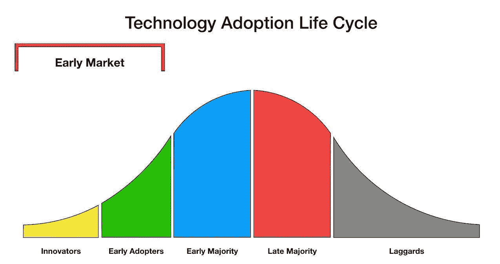
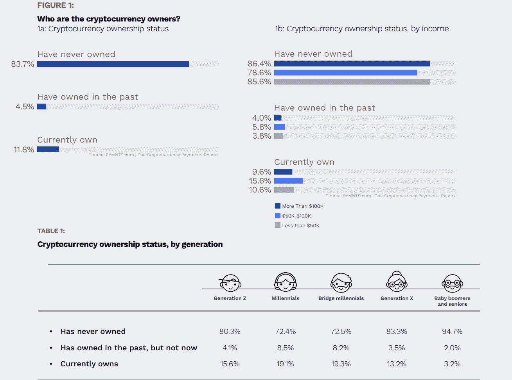
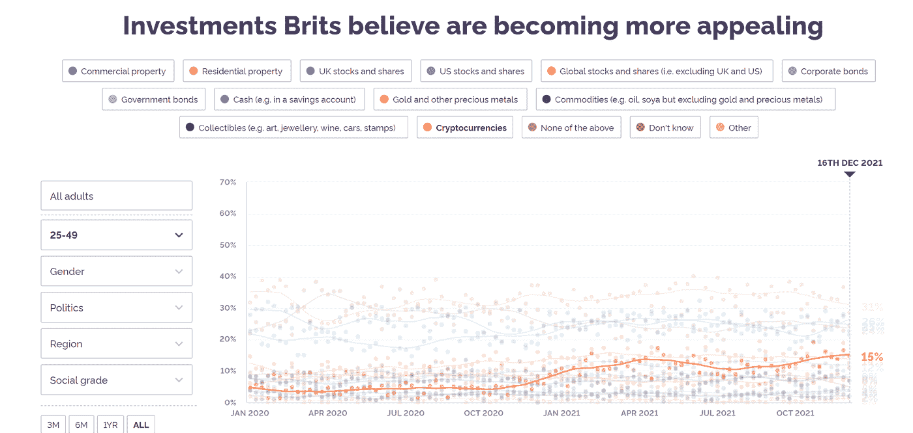
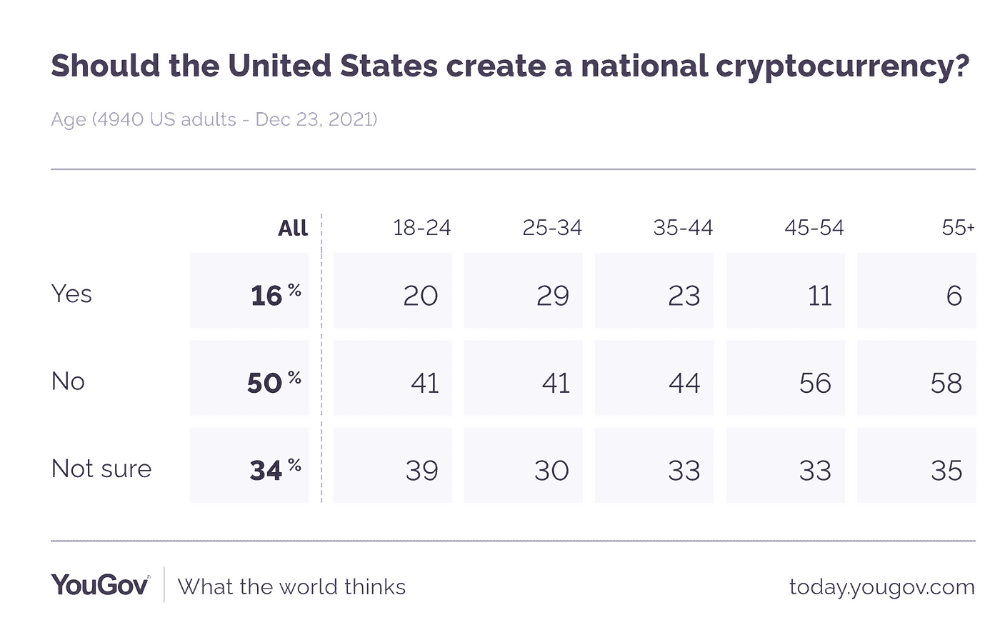
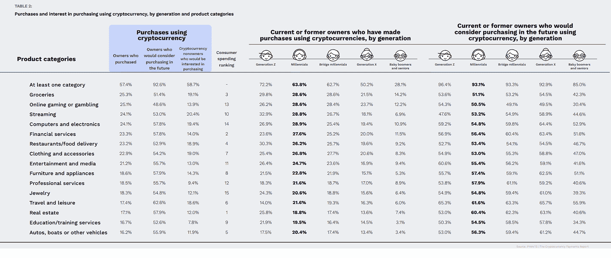
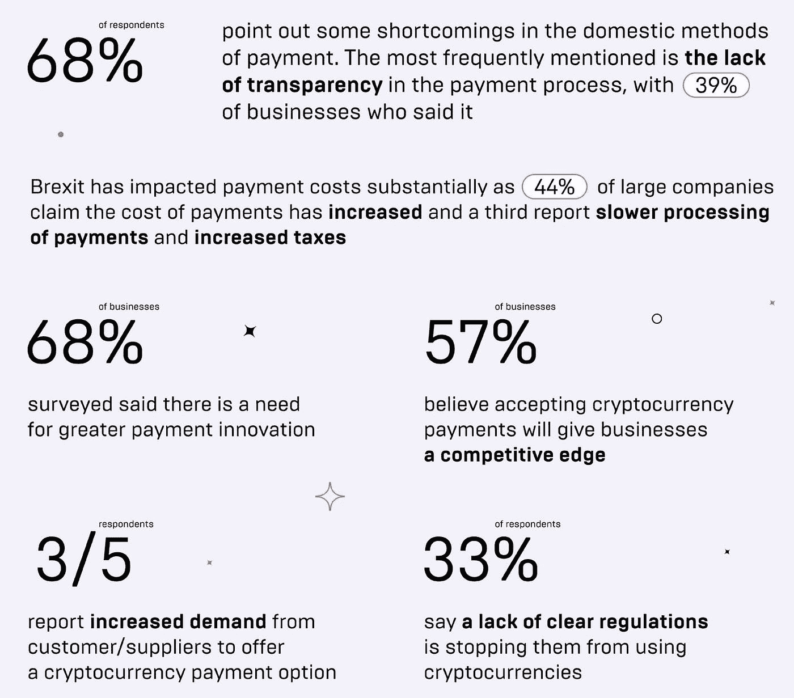

# 加密货币作为一种支付手段正在增长吗？数据证实

> 原文：<https://medium.com/coinmonks/are-cryptocurrencies-growing-as-a-means-of-payment-data-confirms-d99e9a372e16?source=collection_archive---------6----------------------->

Source: pixelplex.io

## 介绍

消费者对购买和消费加密货币的兴趣正在增长，这是因为他们担心失去一个可能的投资机会和一种利用数字货币作为自己法定货币的替代货币来支付零售交易的方法。

我们将讨论和分析加密货币如何吸引零售商的注意力并被视为一种支付和电子商务方法的最新趋势和数据。

## 加密货币——受到后代的信任

目前，大多数人不拥有加密货币。这是意料之中，因为从历史上看，技术采用是分周期，这就是著名 Everett Rogers 技术采用曲线，个人以不同速度接受新技术，根本区别是人们对新想法心理接受度。

Source: Prof C — YouTube

对新技术的信任随着时间而增长。例如，互联网花了几十年才被广泛接受。

根据 PYMNTS 在 2021 年 5 月发布的报告，该报告调查了美国消费者对拥有加密货币的当前兴趣和未来计划，调查了 8000 多名消费者，其中 75%目前没有拥有加密货币网站的人“缺乏知识”是主要原因。

考虑以下数据:

Source: pymnts

根据 PYMNTS 的数据，美国的加密货币所有者更有可能是年轻、中等收入和男性。超过 19%的千禧一代和 15%的中等收入客户(年收入 5 万至 10 万美元)目前拥有加密货币。千禧一代和桥千禧一代最有可能拥有或之前拥有加密货币。根据研究，超过 27%的千禧一代和桥千禧一代拥有或曾经拥有至少一种加密货币，而 X 一代消费者只有 16%，婴儿潮一代和老年人只有 5%。

根据 YouGov 的数据，在英国，超过 15%的英国人(25-49 岁)认为加密货币是更具吸引力的投资，超过了其他主流投资形式，如黄金、债券、商品、商业地产以及全球和美国股票。

Source: yougov

根据 YouGov 在 2021 年 12 月进行的另一项调查，当被问及“美国是否应该创建一种国家加密货币？”在 4940 名美国成年人中，超过 20%的千禧一代回答是。

Source: yougov

数据允许我们分析，截至目前，虽然大多数人没有拥有加密货币(这很可能会随着时间的推移而改变)，但拥有加密货币的人相对年轻，代表着未来的几代人。今天的青少年是在网上成长起来的第一代人，数字货币的概念对他们中的许多人来说似乎是第二天性。

## 加密——支付方式？

数据显示，消费者越来越接受加密货币作为一种安全的支付选择。千禧一代对利用加密货币进行日常交易有着特别强烈的需求和兴趣。

根据 PYMNTS 的调查，美国三分之二的现任和前任加密货币所有者收购加密货币进行交易，93%的加密货币所有者未来会考虑这样做。根据研究，12%的客户(约 3000 万)已经持有一种或多种加密货币，4.5%(1150 万)以前拥有它们，1700 万非所有者可能在不久的将来收购加密货币。

考虑以下数据:

Source: pymnts

近四分之一的现任或前任加密货币所有者使用加密货币购买杂货和零售产品，以及进行在线游戏或赌博相关的购买。

旅行和休闲(62%)、房地产(60%)、专业服务(58%)、家具和电器(57%)以及金融服务是当前和之前的千禧一代加密货币所有者会考虑为使用加密货币付费的五大事物。

根据 FCA 消费者研究报告(2021 年 6 月)，在英国，拥有加密货币的人数约为 230 万，占人口的 4.4%(去年为 3.9%)，其中近 20%的人购买加密货币是为了购买商品或服务。

## 作为支付手段的加密货币——商家怎么看？

Source: mercuryo

根据总部位于伦敦的 Mercuryo 公司进行的一项调查，该调查涉及英国 500 多名高级财务决策者，其中 40%的调查对象是董事会或董事级别的管理人员，其余是合作伙伴或企业所有者，58%的受访者认为 crypto 可以显著改善支付体验并降低成本。超过 45%的企业认为加密货币代表着支付的未来，五分之三的企业表示客户/供应商对加密支付选项的需求增加。

尽管英国企业现在可以获得并使用多种支付技术，但 68%的受访者报告称其国内支付方式存在缺陷。在跨境资金转移方面，我们调查的 74%的组织发现了特殊问题。

当被问及是什么阻碍了企业采用加密货币时，最常见的回答是缺乏监管透明度，33%的受访者给出了这一答案。

## 零售采用

许多人的行为是由他们的社区形成的，要么是通过鼓励，要么是来自同龄人的压力。因此，关于秘密购物的社会态度和顾客的个人信念一样重要。

## ***双子付出***

美国监管的加密货币交易所 Gemini 由文克莱沃斯·双胞胎创立，它与另一家美国初创公司 Flexa 合作，利用现有的销售点(POS)硬件和软件支持数字资产(加密)接受，推出了 Gemini Pay。使用 Gemini Pay 应用程序，客户现在可以在美国超过 30，000 个零售点使用他们的密码。简而言之，当购物时，app 会生成一个名为“flexcode”的独特条形码，参与的零售商可以扫描该条形码，以立即授权和保证交易。然后，Flexa 以可兑换虚拟货币或他们选择的法定货币支付给商家。与此同时，Flexa 的 Spend SDK 从应用程序内的数字钱包中扣除等量的加密(比特币或 USDC)。

其中一些零售商包括全食超市、贝德柏士比昂公司、GameStop、Office Depot、Petco、Ulta Beauty 以及咖啡豆和茶叶。

## ***AMC &富豪影院***

Source: commons.wikimedia.org — eden, janine and jim

AMC 首席执行官亚当·阿隆(Adam Aron)证实，影院将接受比特币、以太坊、莱特币和比特币现金作为有效的支付选项。

Regal Cinemas 在全国各地的多家影院拥有 7000 多块屏幕，将允许顾客使用数字货币，包括比特币、Dogecoin、以太币和莱特币。密码既可用于售票，也可用于特许购买。

## **T5【星巴克】T6**

尽管星巴克不直接接受比特币或其他加密货币，但 Bakkt 应用程序允许用户将加密货币——以及“支持的忠诚度和奖励积分”和常旅客里程——转换为美元，然后将该值存入星巴克应用程序中保存的星巴克卡。

## ***AT & T***

美国电话电报公司在 2019 年宣布，它是第一家接受加密货币支付的移动运营商。它通过第三方支付处理器 BitPay 实现这一点。顾客可以在使用比特币和其他加密货币结账时选择 BitPay。

## ***菲利普·普莱因***

德国时装设计师 Philipp Plein 成为世界上第一家接受 15 种不同加密货币支付的时装公司。

## ***Shopify***

电子商务巨头 Shopify 报告称，截至 2021 年 5 月，约 175 个国家有超过 170 万家企业使用其平台，在其网站上接受加密货币作为支付形式，这意味着任何通过 Shopify 商店运营的商家都可以接受比特币、以太币、莱特币等 300 多种数字货币。

## ***郁郁葱葱***

英国化妆品零售商 Lush 通过与 Bitpay.com 的合作，开始允许比特币支付其网站上的订单。它现在在其网站上直接接受加密货币作为支付形式。

## ***微软***

作为世界上最大的软件公司之一，微软接受比特币支付具有重要意义，这在一定程度上树立了使用加密技术的信心。比特币被兑换成信用点数，可以用来支付一系列服务，包括 Xbox Live 和 Skype。

## ***亭酒店&度假村***

总部位于香港的 Pavilion Hotels & Resorts group 也成为第一家接受虚拟货币支付的国际连锁酒店。

该集团在阿姆斯特丹、马德里、里斯本、罗马以及巴厘岛和普吉岛拥有房产，将通过与支付平台 Coindirect 的合作，从 7 月开始接受使用 40 种不同密码的预订，包括比特币和以太坊。

## ***安盛保险***

这家保险经纪巨头将允许瑞士客户使用比特币作为账单支付选项。客户现在可以在非寿险保单的账单上打印一个参考代码，以便通过加密交易所瑞士比特币支付保费，该交易所随后会将这些代码转换成瑞士法郎。

## ***LOT 航空***

Source: commons.wikimedia.org- lord of the wings

LOT 波兰航空公司现在接受加密支付，这意味着数字货币可以用于飞往全球 60 多个目的地的航班。

## ***Expedia***

旅游巨头 Expedia 是通过与加密友好的旅游预订平台 Travala 合作接受比特币的最著名的旅行社之一。你现在可以用包括比特币在内的 30 多种不同的密码从网站的列表中预订 70 万家酒店。

以上所列并非详尽无遗，从大型科技公司到小型独立公司，各行各业都有越来越多的公司开始采用加密货币，允许客户将加密货币作为商品和服务的官方支付方式。考虑到加密货币从 2009 年才出现，这绝对是一项惊人的成就。

*免责声明:本文包含的信息仅用于教育目的，不构成 Wheatstones 的任何形式的建议或推荐，也不打算供用户在做出(或避免做出)任何投资决定时依赖。*

> 加入 Coinmonks [电报频道](https://t.me/coincodecap)和 [Youtube 频道](https://www.youtube.com/c/coinmonks/videos)了解加密交易和投资

## 也阅读

 [## 杠杆代币[多头代币]终极指南

### 杠杆化令牌是具有杠杆化风险敞口的 ERC20 令牌，不考虑保证金、要求、管理…

medium.com](/coinmonks/leveraged-token-3f5257808b22)  [## 最佳加密交易所| 2021 年十大加密货币交易所

### 编辑描述

blog.coincodecap.com](https://blog.coincodecap.com/crypto-exchange)  [## 2021 年最佳加密交换平台| CoinCodeCap

### 编辑描述

blog.coincodecap.com](https://blog.coincodecap.com/best-swap-platforms)  [## 2021 年最佳加密借贷平台| 6 大比特币借贷平台

### 获得比特币和其他加密货币的最佳贷款利率

medium.com](/coinmonks/top-5-crypto-lending-platforms-in-2020-that-you-need-to-know-a1b675cec3fa)  [## 2021 年 6 大最佳硬件钱包|顶级加密硬件钱包[更新]

### 最好的加密货币硬件钱包是绝对必要的。我们将在 NGRAVE、Ledger Nano X 和…

medium.com](/coinmonks/the-best-cryptocurrency-hardware-wallets-of-2020-e28b1c124069)  [## 2021 年最佳免费加密交易机器人

### 2021 年币安、比特币基地、库币和其他密码交易所的最佳密码交易机器人。四进制，位间隙…

medium.com](/coinmonks/crypto-trading-bot-c2ffce8acb2a)  [## 最佳 4 个加密交易信号电报通道

### 这是乏味的找到正确的加密交易信号提供商。因此，在本文中，我们将讨论最好的…

medium.com](/coinmonks/best-crypto-signals-telegram-5785cdbc4b2b)  [## 获取信号、交易机器人和套利

### 编辑描述

blog.coincodecap.com](https://blog.coincodecap.com/bitsgap-review)