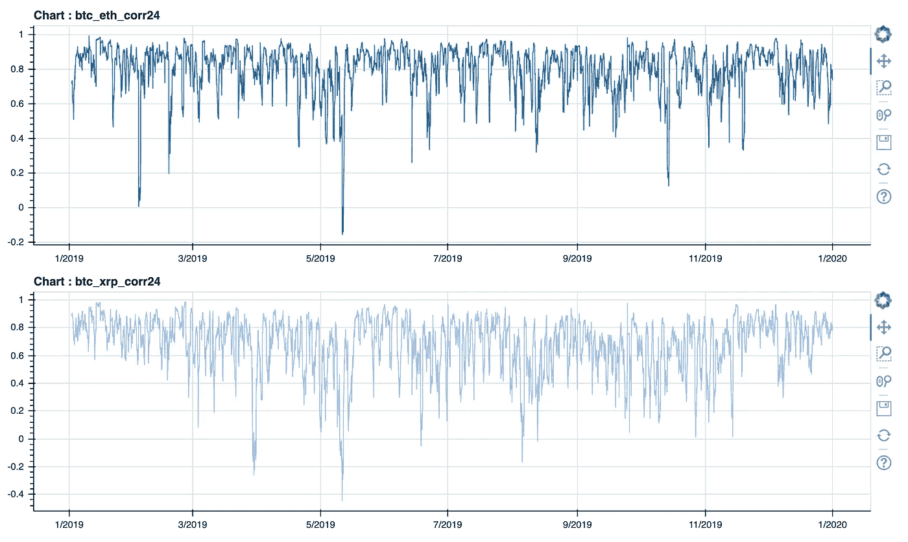

# ETH 或 XRP 适合对冲 BTC 吗？

> 原文：<https://medium.com/coinmonks/are-eth-or-xrp-good-for-hedging-btc-d15b0a2d00fb?source=collection_archive---------0----------------------->

作为一名 [crypto](https://blog.coincodecap.com/tag/crypto/) 资产持有人，我一直在想，在如此动荡的市场中，管理投资组合的最佳方式是什么。BTC 显然已经赢得了数字黄金的地位。它得到了全世界的认可，巨大的日交易量，以及如此多的支持加密的交易所。但是，只是拿着它等待时机到来，这合理吗？我怎样才能使风险最小化，利润最大化？不幸的是，我们都不知道未来会怎样。因此，渴望更好的[投资组合管理](https://coincodecap.com/category/portfolio-management)方法是成为加密资产持有者的自然结果。

我想邀请我们一起思考以下场景:假设我同时投资于硬币 A 和硬币 B，如果硬币 A 和硬币 B 的价格走势呈现反比关系，那么我可以在硬币 B 的价格下跌时，通过将硬币 B 切换到 A 来进行战略转移，反之亦然。为了检验这个计划的可行性，我探索了三种著名硬币之间的相关性:BTC、瑞士联邦理工学院和 XRP。如果这些硬币之间没有强烈的正相关性，我可以构建一个多元化的投资组合，以最小化风险，最大化利润。

# 数据准备

为了进行分析，我从币安下载了 2019 年适当硬币的 1 小时 OHCLV 数据。“接近”数据用于分析。注:我对这 3 枚硬币的价格进行了标准化处理，以便进行图表比较，因为它们的数据比例不同。我应用最小-最大缩放技术进行标准化。所以所有的价格值都有相同的范围，从 0 到 1。

# 收盘价格图表

让我们来看看收盘价的原始值。正如你所看到的，我们可以感觉到每枚硬币的价格趋势，但由于不同的规模，比较是困难的。

Graph 01\. BTC, ETH, and XRP closing prices in 2019

这是价格图表的缩小版。现在我们可以比较每枚硬币的价格。

Graph 02\. Scaled for comparison for BTC, ETH, and XRP closing prices in 2019

注:红线是标准化的 BTC 价格。乍一看，这似乎是一种相关性，但我需要具体的证据。

# 交叉相关系数

虽然有多种方法进行相关性分析，但我将使用[皮尔逊相关系数](https://www.statisticshowto.datasciencecentral.com/probability-and-statistics/correlation-coefficient-formula/)，因为这是一种简单且众所周知的方法。该系数表明两个时间序列是否相关。该值的范围从-1 到 1。接近 1 的值意味着两个数据集有正的关系，而接近-1 的值意味着负的关系。

由于价格数据具有趋势，因此使用一阶差分来计算系数。

该系数如下所示:

Table 01\. The coefficients between BTC, ETH, and XRP

根据系数，BTC 和 ETH 有很强的正相关关系，0.76。根据经验，当两个变量的系数为 0.6 或更大时，我们说这两个变量有很强的正相关关系。这种强正相关关系表明，当 BTC 的价格上涨时，ETH 的价格很可能也会上涨。BTC 和 XRP 之间的系数为 0.55，小于 0.76，但仍然相对较高。我们可以得出结论，这三种硬币彼此之间有很强的正相关关系。

# 滚动相关

之前的关联是针对整个 2019 年的数据进行的。但是，如果我们能够在更短的时间尺度上确定相关性，并跟踪这种相关性，这将提供对这种相关性的更多了解。

让我们用滚动窗口再次计算相关性。滚动窗口意味着使用整个数据集的子数据集。

在时间序列分析中，最近的滞后往往比旧的滞后具有更高的预测能力。因此，应用于整个系列(或“训练”子集)的模型可能会隐藏整个系列的几个特征。

*因此，滚动窗口包括选择给定的窗口大小(通过分析均方根误差)。例如，如果最佳窗口大小是 24，我们将对包含前 24 个观察值的样本应用模型；然后在第二个窗口，由观察值 2-25 组成；然后观察 3–26；诸如此类。*

*滚动窗口帮助您评估通过线性方法(截距和斜率)估计的参数是否是时不变的(模型的一个重要假设)。*

Figure 01\. Demonstration of 24 hour rolling window

来源—[https://www . mathworks . com/help/econ/rolling-window-estimation-of-state-space-models . html](https://www.mathworks.com/help/econ/rolling-window-estimation-of-state-space-models.html)

# 24 小时滚动相关图

Graph 03\. 24 hours rolling correlation chart between BTC-ETH, and BTC-XRP

让我们进一步挖掘直方图

下图是通过 24 小时滚动窗口从 BTC-联邦理工学院皮尔逊系数生成的。

Graph 04\. Histogram of BTC-ETH Coefficient

如您所见，平均皮尔逊系数为“0.82”，这是一个非常强的正相关关系。

下图是 BTC-XRP:

Graph 05\. Histogram of BTC-XRP Coefficient

平均皮尔逊系数为“0.68”。这是一个很高的数字。因此，我们可以说，BTC 和 XRP 有着密切的积极关系。与前一个相比，这是相同的结果。

这里有一个小结论。在 24 小时滚动窗口中，瑞士联邦理工学院和 XRP 大学都有很强的正相关关系。这意味着，如果 BTC 价格上涨，瑞士联邦理工学院和 XRP 的价格可能会在一天内上涨。在继续之前，让我明确一件事:相关性不能告诉我们顺序。换句话说，它没有告诉我们哪一个会先移动。

# 一阶差分数据

知道相关性是好的，但这还不够。想想你带着 GPS 开车的时候。如果你的 GPS 只告诉你转弯列表(左转或右转)，而不告诉你何时转弯，那就没用了。相关数据也是如此。为了使数据实用并与投资和投资组合管理相关，我们需要添加时间维度。

我们可以用不同的时间序列数据来补充这条信息。差分时间序列数据可以告诉我们时间序列数据之间的确切关系，从而帮助我们从数据集中推断出时间序列信息。通俗地说，这个可以告诉我们更多关于哪个先动的信息。让我们看看手头三种硬币(BTC、瑞士联邦理工学院和 XRP)的时间序列数据差异。为了这项研究，我创建了两组不同的数据集:BTC-ETH 和 BTC-XRP。

这两个数据集具有来自其他角度的相关性信息。

让我们看看下面的图表。

Graph 06\. Differenced data set of BTC-ETH, and BTC-XRP

我们可以在下面解释这个价值。

0 =两个价格之间没有差异

*0 或< 0，两者价格之差*

值大，就是差别大。

BTC-ETH 差分图显示，从 2019–01 到 2019–05，BTC 和 ETH 的移动相似，因为值接近 0。但自 2019-07 年以来，情况发生了变化。

假设差异数据显示了一种模式，那么我们可以从该模式中导出一个数学函数，并将其用作管理投资组合的工具。让我们检查一下。

# 拟合数据

我们可以建立一个函数模型来理解两个硬币之间的关系。如果模型解释了差异数据的移动，我们可以用它来决定什么时候卖或买，卖或买什么。

Graph 07\. Fitted model for BTC-ETH differenced chart

红线是拟合的模型函数。好像挺合适的。为了知道拟合的函数能在多大程度上解释残差数据集，我计算出 r2 得分为“0.61”。

r 平方(R2)分数是一种统计度量，它告诉您模型与数据的拟合程度。得分范围从 0 到 1，1 表示模型解释了数据的所有可变性。(r2 评分:[https://blog . minitab . com/blog/adventures-in-statistics-2/regression-analysis-how-do-I-interpret-r-squared-and-assessment-of-good-of-fit](https://blog.minitab.com/blog/adventures-in-statistics-2/regression-analysis-how-do-i-interpret-r-squared-and-assess-the-goodness-of-fit))

由于 R2 分数为 0.61，我们可以得出结论，该模型很好地解释了 BTC-ETH 残差。

Graph 08\. Fitted model for BTC-XRP differenced chart

BTC-XRP 有一个更大的 r2 值“0.78”。所以当我看到 r2 的分数时。BTC-XRP 配对似乎是比 BTC-ETH 配对更好的选择，因为他们的拟合模型比 BTC-ETH 配对更可靠，因为他们的 r2 值更高。

# 结论

检验结果表明，ETH 和 XRP 与 BTC 相关。这一结果意味着三者可能会表现出相似的价格变动。因此，我们可以得出结论，同时持有瑞士联邦理工学院和 XRP，试图抵消 BTC 的损失，并不是最好的主意。我们并不认为 XRP 与 BTC 之间存在正相关关系，因为 XRP 的价格走势在去年的一个短暂时期与 BTC 不同。

下图显示了 BTC 和 XRP 最不相关的点上的绿色三角形(系数<0.2). “2019–05” was the month with the least correlation with BTC. However, most of the time, it correlates with BTC.

Graph 09\. The price movement of BTC and XRP in 2019

In portfolio management, diversification is heavily emphasized as a key principle to minimize risks. In this volatile and unpredictable market, minimizing potential risks is highly recommended. As the crypto market is highly correlated and dominated by BTC, very careful design and study are required to construct a stable portfolio that can weather a high level of risk.

If you would like to check the performance vs. risk of your crypto portfolio for free, visit [https://moa.network](https://moa.network) 并尝试我们的免费分析器。

> [在您的收件箱中直接获得最佳软件交易](https://coincodecap.com/?utm_source=coinmonks)

