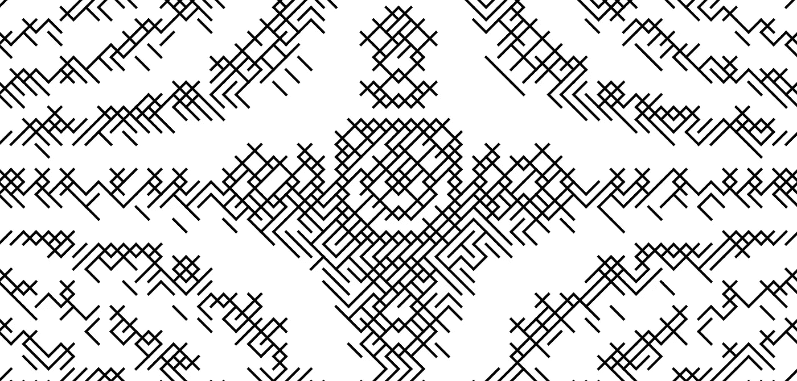
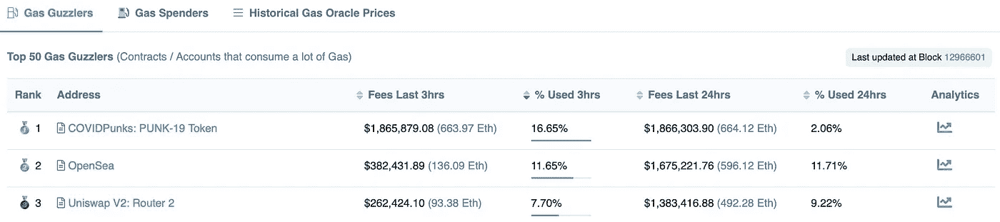
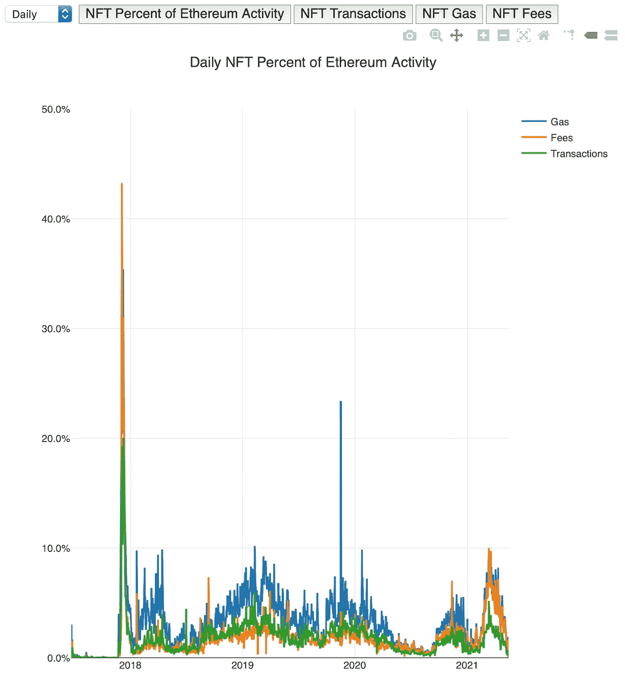
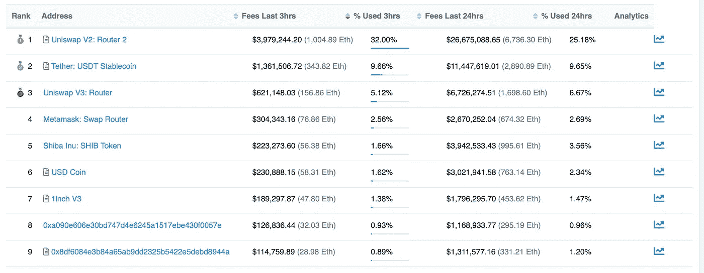
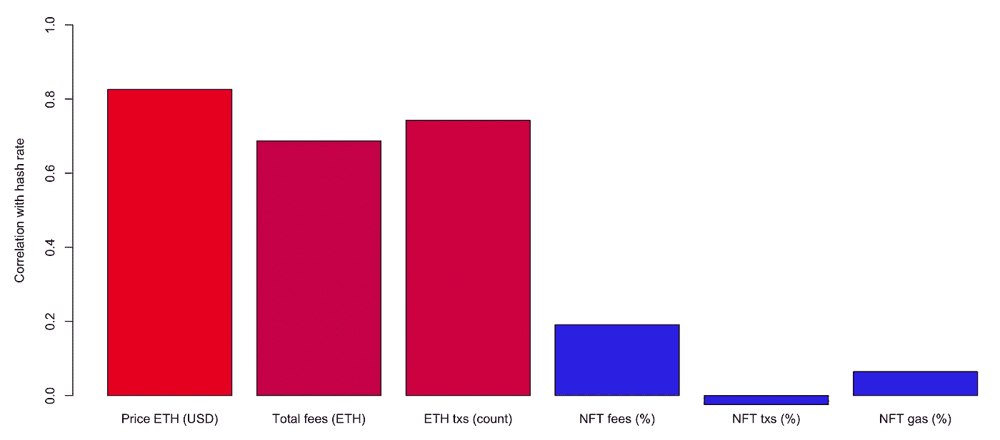
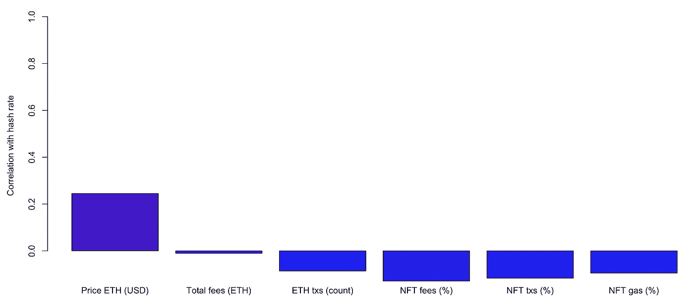
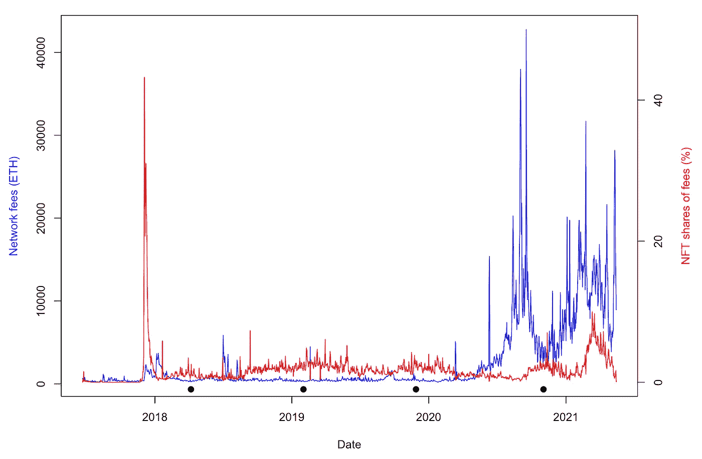
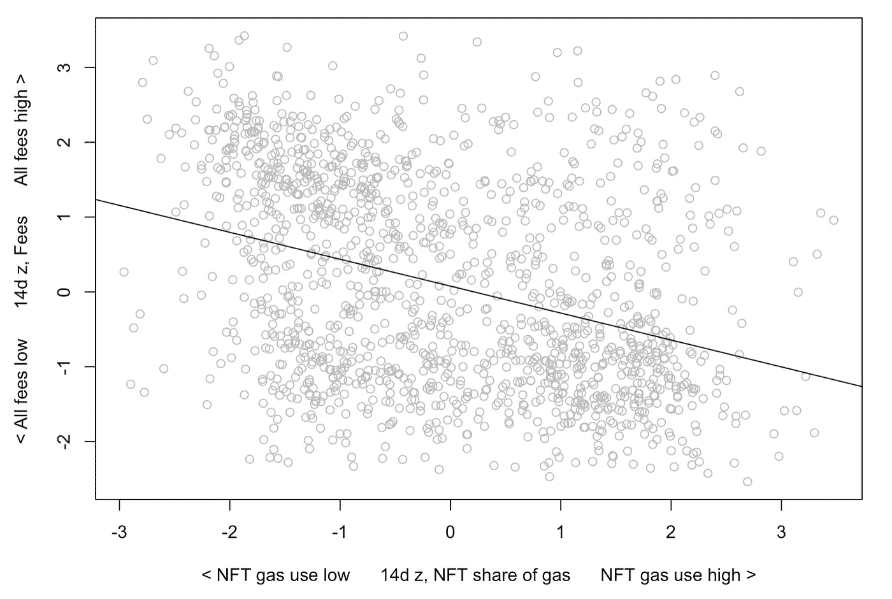
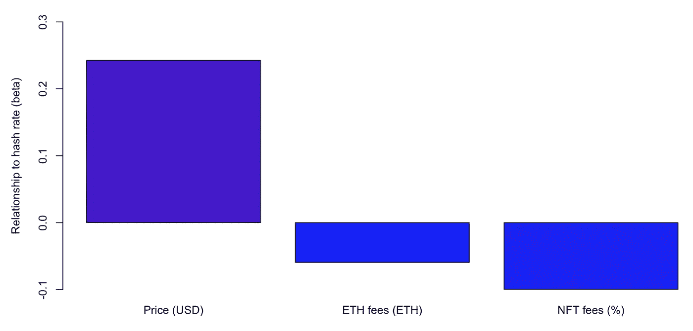

# NFTs 和排放相关吗？

> 原文：<https://medium.com/coinmonks/are-nfts-and-emissions-correlated-c0a2562e5778?source=collection_archive---------4----------------------->

[Autoglyph NFT](https://opensea.io/assets/0xd4e4078ca3495de5b1d4db434bebc5a986197782/317), generative on-chain art.

## 非功能性肥胖可能与以太坊能量消耗的增加没有太大的关联

***更新 2021 年 8 月*** *:重要的是为 2021 年夏天给这个帖子添加一个更新。NFT 的兴奋，尤其是 PFPs，从根本上改变了以太坊网络上消耗气体的分布。在夏季，OpenSea 和 PFPs 有时消耗 20%或更多。这在历史上是非常不寻常的，如下文所述。下面的历史分析不会因为这些信息而改变，但是随着对 NFTs 兴趣的增长，未来可能会有很大的不同。*

An example during summer, 2021.

*TL；dr:一天的分析得出了一个小的，如果有的话，在 NFTs 和以太坊的能量使用的变化之间的联系。需要进一步分析才能确定。对于即将推出的基于 PoS 的解决方案，这可能没有实际意义。然而，这里的初步结果表明，以太坊上针对 NFT 的特殊 ire 与能量消耗的弱关联不一致。*

关于[NFT](https://opensea.io/blog/guides/non-fungible-tokens/)的[碳足迹](https://memoakten.medium.com/the-unreasonable-ecological-cost-of-cryptoart-2221d3eb2053)产生了很多热量。这一讨论的展开并不清楚 NFT 实际上对以太坊的能量消耗有多大贡献。多亏了艺术家兼程序员 Kyle McDonald (灵感来自于 [Nic Carter challenge](https://twitter.com/nic__carter/status/1385231988358098944) )制作的惊人的[数据仪表板，我们现在有了与 NFT 交易相关的网络活动百分比的可靠估计。这个奇妙的仪表板显示了 75 个主要项目的网络天然气、费用和交易的总百分比。太棒了:](https://kylemcdonald.github.io/ethereum-nft-activity/)

Screenshot of Kyle’s dashboard.

从 Kyle 的图中，我们已经看到 NFTs 的网络影响普遍较低，低于 10%。一个明显的主要例外是 2017 年末的 [CryptoKitties 拥堵](https://en.wikipedia.org/wiki/CryptoKitties#Reception)。尽管如此，这段时间 NFT 天然气使用量的中值百分比是 3%。这些日期中有 95%的 NFT 天然气使用量低于 7%。将此与 [Uniswap](http://uniswap.org) 进行比较。2021 年 5 月初，Uniswap (v2 + v3) *本身*就可以占到[用气量](https://www.nansen.ai/research/through-the-looking-gas-a-history-of-ethereum-protocols)的 20%或以上。

Etherscan’s [gas guzzler list](https://etherscan.io/gastracker) on 5/11/21.

这揭示了 NFTs 的一个小网络足迹，那么我们如何将排放责任分配给他们呢？典型的方法是采用估算的能源支出(或排放量)并简单地除以交易次数或交易的用气量。这种基于交易的能源责任模型[及其变体](https://github.com/kylemcdonald/ethereum-nft-activity/blob/main/Per-Transaction%20Models.ipynb)假设以太坊网络的所有使用都是平等的。这意味着能量消耗的涨落同样可以归因于以太坊生态系统不同部分的各种交易。

这篇简短的帖子总结了解决这个问题的另一种方法，它是由 Nic Carter 的统计建议[在这里](https://twitter.com/nic__carter/status/1382546653354283010)激发的。他的提议旨在超越每笔交易的能源责任估算。Nic 的想法是，我们应该测量 NFT 交易如何改变以太坊网络作为一个整体的能源相关指标。这就建议进行细分分析——通过测量市场细分与能耗增加的关系来推断能源责任。

想想 cryptoart 社区，也许是 NFT 能源争论的主要目标。在 ERC-721 于 2017/2018 年被编纂后不久，一群艺术家和其他创意人员正在为数字艺术所有权、策展和社区的新概念奠定基础。当他们的作品被铸造并首次出售时，杂凑率远低于写这篇文章时的水平——不到一半。但是以太的快速升值，交换平台的不断增加，以及随后 DeFi(如 Uniswap)的冲击，很可能带来了散列率上升的绝大部分。现在，曾经在一个花费更少的网络上运作的艺术家们被分配了与每一笔 DeFi 交易成比例的责任。这似乎很奇怪，这是经典的[公地悲剧](https://en.wikipedia.org/wiki/Tragedy_of_the_commons)的一个例子。

Josie’s “Tune In.” [See here](https://opensea.io/assets/0xecf7ef42b57ee37a959bf507183c5dd6bf182081/11).

Nic 的想法是，看看 NFTs 和能量消耗的主要代理:散列率之间的相关(甚至更好，因果)关系将是有用的。应该根据能量消耗和以太坊生态系统之间的潜在关系来分配责任。艺术家们像往常一样造币，他们的大量使用天然气的交易被分配到与其他细分市场成精确比例的排放责任，这些细分市场实际上可能正在进行哈希率的大部分变动和动摇。

这篇文章描述了 Nic 提案的最简单的初始方法。让我们评估一下 NFT 天然气使用量和哈希比率之间的关联强度。下面的结果实际上是相互关联的，但是对于如何对散列率和其他变量进行因果分析，有[的建议](https://www.mdpi.com/1911-8074/13/11/263)。我在下面重温这些微妙的统计问题。首先，让我们进行最简单的分析。

# 初步调查结果

让我们将凯尔的大量数据与来自 Coin Metrics 的令人惊叹的[社区 API 的数据结合起来。可能影响散列率的变量包括总费用、采矿奖励的价格增值(ETH 的美元价格)以及与 NFTs 相关的百分比(Kyle 的数据:天然气、费用、交易)。](https://docs.coinmetrics.io/api)

我们可以先计算一下这些变量的 7 天移动平均值与散列率之间的简单相关性。与 NFTs 相关联的活动百分比与散列率的关系最弱。最强的就是单纯的价格:ETH 价格和 hash 率 0.80 左右的相关性。

Pearson correlation from late 2017 — early 2021 (7d moving average)

这些相关性不是基于对数转换数据。这种转换并没有改变一般的观察结果，即 NFT 相关性是最低的，尽管原始的双变量相关性确实上升到 0.50 左右。但同样，这些结果是微不足道的:这些变量中的许多从 2017 年到 2021 年都在上升。我们希望将这些变量中的*变化*关联起来—当散列率从一天上升到下一天*，*时，这些指标中的哪一个与能源支出的上升最相关？如果以天然气为主的 NFT 交易有最近言论暗示的影响(通过矿商费用)，我们预计当 NFT 交易上升时，杂凑率也会上升(反之亦然)。对*日变化*运行这些相关性，我们得到以下结果:

Correlation from late 2017 — early 2021 (7d moving average of daily changes)

同样，价格在 0.20 以上的相关性最高。这种相关性很小，但具有统计学意义(*p*<). 00001；注意:记录分数的每日变化产生类似的结果)。你可能会注意到 NFT 相关性是负的。通过可视化一些原始数据，比较总费用与 NFT 百分比，我们可以看出这可能是为什么。在不同的时间点，NFT 费用份额下降，而所有费用上升(反之亦然)。类似的微妙模式在数据集中似乎很常见:

Daily fees all (ETH) by share of fees (NFT). Dots illustrate where NFT activity seems to rise relative to cost in fees. This tendency is statistical, imperfect. To confirm a trend, a follow-up 14-day window analysis is shown in the next figure.

如果 NFT 细分市场对费用的高低做出反应，那么这种反应可能与最近一段时间有关:NFT 用户可能会等待油价从最近的高点回落。让我们取 2 周的时间跨度(它不依赖于这个确切的时间窗口)。当两周时间内费用高时，NFT 的天然气份额往往会低。当两周时间内费用*低*时，NFT 天然气用量往往*高*:

Relative gas usage by NFTs and fees in 14-day window (z-score). Correlation = –0.35.

这是一种适度的相关性，但它表明，NFT 市场对最近的收费有明显的反应。在 ERC-721 合同上铸造和交易的个人可能在天然气价格的基础上做出经济决策。当然，这是一个直观的结果，但这些数据从数量上揭示了这一趋势。例如，一个艺术家可能会在几天或几周内监控网络的费用，以确定何时铸造 NFT 更具成本效益。最近就发生了这样一个明显的例子。随着最近的加密更正(2021 年 5 月 18 日)，总部位于以太坊的 NFT 在 OpenSea [上的销售几乎停顿了几个小时](https://twitter.com/AndrewSteinwold/status/1395026144974491648)，而天然气价格超过了 1,000 gwei。

所有这些配对的相关性仍然不够。为了将排放责任分配给某个细分市场，我们需要在一个更大的模型中输入这些变量。我们可以运行一个多元回归模型，其中价格、所有费用和 NFT 费用*竞争*来预测哈希速率中的能源支出。这样做时，我们可以将责任分配给 NFT 细分市场。这里只包括一个 NFT 变量，费用，因为这三个 NFT 变量已经相互关联，接近 0.90，这表明它们都指向同一个潜在的东西:网络上的 NFT 集中度。将每日变化值输入回归模型，我们得到以下结果。y 轴越高，在与其他变量的竞争中，与散列率*的关系越大:*

R² = .07 (7d moving average of daily changes).

价格是最主要的关系，也是唯一与杂凑率每日变化呈正相关的关系(*p*. 000001)。我们再次发现与 NFT 天然气使用量的关联可以忽略不计，甚至可能与*负相关*。因此，从一个重要的意义上来说，*NFT 与能源支出的增加并没有太大的关联。如果有什么不同的话，散列率的疯狂增长与以太坊生态系统的其他部分有关，尤其是采矿奖励(美元/以太网)的价格上涨。那些与 ERC-721 合同交易的人可能会等待更有利的网络条件。有人可能会说，如果在费用较低的时候没有 NFTs，我们会有更低的散列率和能量消耗。这似乎是可能的。尽管如此，最近有一个建议[说，密码艺术家应该尽量减少费用，以避免排放。上面的初步结果表明，一般来说，密码艺术家和 NFT 用户一直在这样做(至少有一点)。](https://github.com/lucadonnoh/GreenNFT/blob/main/Green%20NFTs%20-%20A%20Study%20on%20the%20Environmental%20Impact%20of%20Cryptoart%20Technologies.pdf)*

这些分析是最简单的第一步。它们是相关的，不是因果的。它们基于数据的最小转换。他们没有开发更复杂的自回归控制，甚至没有多重共线性测试。更详细的分析将引入复杂的时间序列建模和其他技巧。尽管如此，作为第一步，对 NFTs 对能耗的影响(作为散列率)的最简单的搜索产生了相当弱的、有时是相反的关系。这与围绕 NFT 的言论不一致。

## 结论

这些结果并不意味着 NFT 对排放没有任何影响。这并不意味着密码艺术家应该忽视环境问题。任何使用区块链的人都参与了这种整体的集体能源消耗。然而，结果确实表明，NFTs *作为一个片段*不太可能对过去几年散列率的快速上升做出实质性贡献。他们认为，如果 NFT 交易从未在 chain 上发生，散列率可能会以类似的方式发展，这是由本地资产增值和 DeFi 等其他细分市场的更主导力量驱动的。

工作验证(PoW)链需要大量能量。这个[是](https://www.digitaltrends.com/computing/bitcoin-ethereum-mining-use-significant-electrical-power/) [观察到的](https://www.vice.com/en/article/d3zn9a/ethereum-mining-transaction-electricity-consumption-bitcoin)，远在以太坊上的 NFT 存在之前。我们可以讨论 PoW 的好处，以及它提供的价值，比如在安全性和[令人沮丧的](https://www.coindesk.com/how-blockchains-become-great-big-garbage-patches-for-data) [数据](https://takenstheorem.medium.com/weird-wednesdays-another-case-study-in-how-on-chain-applications-can-skew-coin-metrics-152494c17db2) [膨胀](https://takenstheorem.medium.com/new-case-study-in-how-on-chain-applications-can-skew-important-coin-metrics-72b51589a314)。对一些人来说，收益可能超过成本。这是我们对所有能源使用的计算。对于另一些人来说，以太坊(Eth1)所耗费的能量可能不值得；但是这种考虑适用于整个网络，而不是特别适用于 NFT 交易。还有其他[NFT 平台](https://github.com/memo/eco-nft)使用更多[节能](https://www.artnome.com/greennfts)共识机制。Tezos 上的社区发展迅速。 [OpenSea 的](http://opensea.io) Matic(基于多边形)集成现在已经完成，而《被解放的神》正在[不可变 X](https://www.immutable.com) 上播放。我们等待完全展开的 Eth2。

奇怪的是，对 NFT 能源支出的主要担忧发生在天然气价格(和费用)在 2020 年达到创纪录高位的时候。考虑到能源讨论的漫长历史和之前的战力链，人们可能会想知道为什么，并且很容易对突然关注 cryptoart 持更愤世嫉俗的态度。(重要的是，艺术家发布作品的费用不是一件小事。)

无论如何，前述分析表明，市场活动的*部分*与能源支出的关系并不明显。这是因为事务与哈希速率没有直接关系。尽管围绕每笔交易模型有各种说辞，但这并不是散列率的工作方式。当矿商为费用和采矿奖励而竞争时，哈希就会上升，即使在那里，哈希也可能主要是以太本身价值的函数。NFT 的交易单个来说肯定是气体密集型的，但它们在网络上的总体分布可能与排放量的增加没有太大的关联。在上述初步分析中甚至有证据表明，事实正好相反——相对于当地条件而言，NFT 可能与*较低的*费用和能源有关，确切地说是与*有关，因为*的天然气含量高。

塔肯斯定理在[推特](https://twitter.com/takenstheorem)上。

感谢 [Nic Carter](http://twitter.com/nic__carter) 的反馈。

## 笔记

*更正等。*欢迎反馈。我会更新任何更正或问题，并在这里注明。

*披露*。我铸造和交换了 NFT。这项活动的大部分参与了一个关于[可视化以太坊历史](https://ethstory.eth.link)的慈善项目，所有铸造和销售的收益都捐给了慈善机构(减去…费用)。见[此处](https://ethstory.eth.link)了解慈善机构和其他细节。我还有一些较小的 PoS 链开发项目，包括一个关于 Polygon/Matic 的新项目。我从 2018 年开始参与 NFT 景观，包括 2019 年进行 [ENS 市场分析，2020 年初](https://opensea.io/blog/domains/ens/predicting-ens-domain-value/)创建[一个 NFT 推荐人系统。我在 Eth1 上有几十个 NFT。](https://opensea.io/blog/analysis/predict-and-recommend-nfts/)

*统计备注*。我正在探索基于格兰杰因果分析的这些数据，并最终将共享一个完整的代码和数据快照库。对于那些希望重复这些初步分析的人，这里有一些注释。[上面这个链接](https://kylemcdonald.github.io/ethereum-nft-activity/)到凯尔的数据包括一个原始数据下载。这个[硬币度量链接](https://docs.coinmetrics.io/api)指向他们的社区 API。首先把两个来源都拉下来，按日期排列。在获得转换后的变量之后，主要使用 rollmean(x，k =窗口大小)，我在 R 中使用 cor()函数，默认情况下它获得 Pearson 相关系数:

Pearson between *x* and *y* of length *k + 1*.

对于多元回归，使用数据列转换下的 lm()和 diff()来获得每日变化时间序列。R 中的代码指定了这种简单的线性公式:

Predicted hash rate (h-hat) estimated by price ($), fees (all) and NFT fee density (in percentage) estimates three beta coefficients (plus an intercept). ε represents error in estimation (residual).

针对所有*变量，通过整个时间序列的日期一阶差分计算每日变化模型(包括相关性)。*

## 另请参阅:

*   [创造并出售你的第一辆 NFT](https://blog.coincodecap.com/create-nft)
*   [加密保证金交易交易所](/coinmonks/crypto-margin-trading-exchanges-428b1f7ad108)
*   [加密套利](/coinmonks/crypto-arbitrage-guide-how-to-make-money-as-a-beginner-62bfe5c868f6)指南