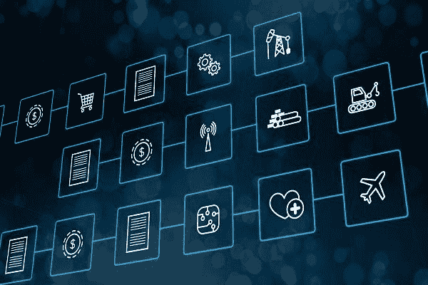

# 一些好项目的区块链是不是在忽悠我们？

> 原文：<https://medium.com/coinmonks/are-some-blockchain-for-good-projects-fooling-us-7576932d0093?source=collection_archive---------6----------------------->

[Source](https://www.cnbc.com/2018/01/10/in-the-world-of-cryptocurrency-buzz-blockchain-is-the-real-winner.html)

区块链是十年来最大的炒作周期之一的中心，似乎技术和全球发展研究人员和从业者开始被期待有一些与之相关的观点。这些观点倾向于从“这是个人赋权、自主和自由的最终关键”到“我们又来了，又一项被夸大的技术在穷人身上进行实验”。

一些组织已经开始在他们的试点项目中加入区块链。国际金融公司和世界银行[启动了一项区块链研究计划](/@IFC_org/blockchain-a-new-mechanism-of-trust-with-potential-for-emerging-markets-462584ca8582)，各种联合国机构[正在将一些项目推出](https://www.ictworks.org/united-nations-agencies-using-blockchain-technology/)，T4 已经有数百个类似“永远离开区块链”的项目。随着越来越多具有崇高目标的项目的出现和试行，我已经看到越来越多被高度宣传的区块链实现，对于那些可能对人们称为区块链的一些关键组件没有基本架构理解的人来说，它们可能并不像乍看上去那样。

# 区块链……但是为什么呢？

比特币、以太坊(mainnet)、莱特币和许多其他你可能熟悉的基于区块链的技术被认为是公共区块链上的东西。公共区块链非常强大，因为从本质上讲，它们允许任何人验证区块链，使其分散化且更加安全。这是允许像比特币这样的系统被认为具有“无信任共识”的基石原则之一，这意味着你不必信任任何特定的个人或公司来安全使用。这个属性是许多人对区块链感到兴奋的主要原因之一。如果有人跟你谈论他们为什么喜欢区块链，他们会提到它抵制审查的特性、允许公共审计的更高透明度、区块链带来的民主化等等，他们可能指的是公共的区块链。

当人们听到“公共区块链”时，他们有一个误解，那就是所有发布到该网站的数据都是公开可读的。不一定是这样。这只是意味着任何人都可以验证区块链，通过不同的加密方法，可以在不读取内容的情况下验证区块链。这可以以多种方式实施，并且可以从区块链实施到区块链实施而变化。

## 私人连锁店

然而，在全球发展空间中有许多更引人注目的项目正在将私人区块链纳入其解决方案。在公共区块链中，理论上任何人都可以成为验证者，而在私有区块链实现中，只有特定的实体才有这种能力。这意味着在区块链的所有用户中不存在“不可信”系统，所有用户都必须信任被选为验证者的组织或个人。为什么这很重要？假设理论上的政府是腐败的。(很难相信吧？发挥你的想象力。)他们实现了一个私人的区块链解决方案来收集选票，他们有一堆分布在全国各地的机器作为验证器来确保一切都是正确的。现在让我们假设在这次选举中出现了政府不希望看到的结果。说政府然后可以改变他们拥有的机器上的数据。此时，您可能会问“这个解决方案与标准的通用数据库实现相比有什么不同？”。在这种情况下，它的好处没有什么不同，只是承担了区块链的所有低效和负担。

那么二等兵区块链没用吗？也许在某些情况下不会。也许有许多合作组织，比如保险公司、医院和当地的诊所都决定为他们的患者使用同一个区块链。所有这三个实体都希望相互信任它们拥有相同的数据，并且仍然在本地保存数据的副本。区块链可能会有所帮助。所有这三个组织都可以在它们之间验证数据是否正确，因此这三个组织在它们之间建立了某种程度的信任。患者无法验证任何数据，也许只能在他们之间添加数据。他们必须相信区块链所有者(三个验证者)他们的数据是正确和安全的。然而，这是一个关键的区别，并为区块链提供了一组不同的优势和用例，需要在公共文档中进行概述。

## 全球开发领域的许多组织都在使用私有区块链来炒作，而集中式解决方案可以做同样的事情，而且做得更好。

从最简单的角度来看，区块链基本上是一种特殊的数据库。与传统数据库相比，它们天生效率低下，但这被视为是为了获得安全性、透明度、审查阻力，甚至是让用户能够拥有自己的数据等令人兴奋的事情而做出的牺牲。**私立区块链不提供这些好处，或者至少不像公立连锁店那样明显。它们基本上执行与标准数据库相同的功能，只是在掌权的实体之间共享所有权。**

例如，当我听说世界粮食计划署试行积木式建筑时，我真的很兴奋。在一天结束的时候，他们会说:

> 区块链是一种数字账本技术，被用作一种不需要中央机构就能追踪资产所有权的可信方式，这可以加快交易速度，同时降低欺诈或数据管理不善的可能性。世界粮食计划署(来自 http://innovation.wfp.org/project/building-blocks)

在研究了这个项目并了解到它是一个利用[权威证明](https://wiki.parity.io/Proof-of-Authority-Chains)的私有链之后，我不禁要问，为什么不直接使用亚马逊 Web 服务的标准工具呢，这些工具会更便宜、更容易、更高效。这里没有魔法尘埃，如果权威纸币将由 WFP 控制或影响的人组成，在功能上与安全似乎没有什么区别。权力本身是集中的，欺诈或数据管理并没有真正减少，除非 WFP 将权力授予他们无权控制的其他实体，即使这样，这真的值得吗？当组织描述公共区块链的好处来描述他们私有的解决方案时，我非常怀疑。

他们继续说这样的话:

> 截至 2018 年 1 月，超过 10 万居住在难民营的人通过设在区块链的系统兑换 WFP 提供的援助。由于这项技术，WFP 对该零售商的每笔交易都有完整的内部记录，确保了叙利亚难民的更大安全和隐私。
> -世界粮食计划署(来自[http://innovation.wfp.org/project/building-blocks](http://innovation.wfp.org/project/building-blocks)

WFP 对每笔交易都有完整的内部记录？听起来非常熟悉…非常像传统的数据库。公平地说，如果 WFP 增加伙伴组织以在 WFP 和所述组织之间形成数字信任，这种实现将具有一些价值是可行的，但是即使如此，信任是伙伴组织之间的主要问题吗？

明确地说，我喜欢 WFP 以积极的方式研究这项技术。我很高兴他们与一些行业领先的公司合作，比如 ParityTech。我对像 WFP 积木这样的项目有两方面的担心:1)公共和私人区块链的好处之间存在可以理解的混淆，缺乏明确性加剧了这种混淆，2)这是否会继续导致批判性的全球发展研究人员和实践者在任何时候听到“区块链”这个词时都翻白眼，因为它实际上没有提供任何新的东西，并且使一些东西变得不必要的复杂？

似乎有数不清的基于私有链的项目伪装成拥有公共链的利益，甚至更令人担忧的是，这些项目根本不发布关于其影响弱势人群的技术实现的信息。“援助:技术”( Aid:Tech)是一个赢得了大量奖项和赠款的组织，被数十家主要媒体报道，并且正在与爱尔兰红十字会和联合国开发计划署(UNDP)等组织合作。他们正在运行的程序似乎非常令人兴奋，这些程序将“区块链”与数字身份和金融支付实施结合使用，这似乎是最先进的，同时促进了他们对区块链的实施，因为它提供了更多的安全性和透明度。作为数字发展原则的倡导者，当像 Aid:Tech 这样的组织不公开他们的系统设计，或者至少不使这些信息易于获取时，我感到不舒服。例如，在撰写本文时，他们有一个名为“案例研究”的部分，其中有一个链接指向他们网站的一个区域，该区域由两个简短的段落组成，其中包含有关该项目的非常基本的信息、一些照片和一个用 8 个要点展示该计划好处的图形。我也曾向 Aid:Tech 寻求更多关于其实施的信息，但没有得到任何回应。我们需要培养一种直接和透明的文化，这种文化是关于一种被宣传为透明和安全的技术。

公平地说，公共链对组织来说可能看起来很可怕。它们可供任何人验证，隐私和安全保护需要彻底考虑，但老实说，我们来这里是为了公共链的好处，而不是伪装成创新的过于复杂、低效的数据库。