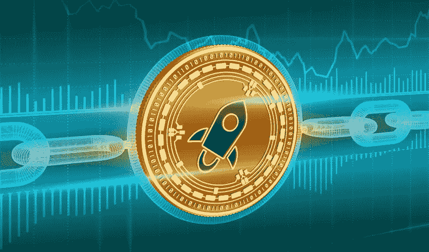

# 未来几个月 XLM 会看涨吗？

> 原文：<https://medium.com/coinmonks/are-the-next-months-bullish-for-xlm-2d0f2a2f9a4b?source=collection_archive---------7----------------------->

今天 [**胖子信号**](https://www.fatpigsignals.com/) 和我来看看 XLM 令牌可能很快表现如何。

由于投资者等待下一个催化剂，Stellar 的价格一直在窄幅波动。XLM 交易价为 0.3187 美元，比 10 月份的最低水平上涨了约 24%。这枚硬币的市值超过 74.5 亿美元。这使它成为世界上第 25 大加密货币。

# 什么是恒星 XLM？