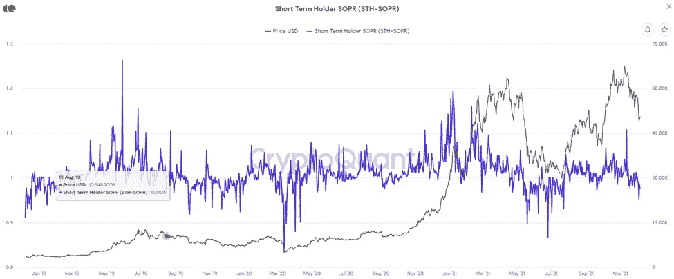

# 我们正在进入比特币周期变长的时代吗？

> 原文：<https://medium.com/coinmonks/are-we-entering-lengthening-bitcoin-cycles-312a18b6e65e?source=collection_archive---------7----------------------->

## 每日加密更新和投资报告 12.7

调查闪电崩盘|市场更新|新手每日一课:延长周期

Photo by [Giordano Rossoni](https://unsplash.com/@reddgio?utm_source=medium&utm_medium=referral) on [Unsplash](https://unsplash.com?utm_source=medium&utm_medium=referral)

# 概观

*   市场洞察:调查闪电崩盘
*   加密市场更新
*   主要秘密新闻
*   值得注意的事件
*   **新手们的每日一课:比特币延长周期 vs 股票-流量模型**

# **市场洞察:调查闪电崩盘**

## 比特币链上指标

昨晚市场强劲反弹，但在美国市场早盘有所降温。

厌倦大抛售后的任何大幅上涨，因为这通常是从过于乐观的交易者那里攫取流动性的陷阱。可能的结果是，在价格开始上行之前，对 48k-50k 阻力进行各种重新测试。

尽管上周五出现闪电暴跌，但环比基本面几乎没有变化。基本面是比价格行为更好的长期趋势可持续性指标。下面我们探讨几个。

**在闪电崩盘期间，谁卖出了股票？**

Short Term Holders SOPR

上图显示，短期持有者(少于 155 天)受到了闪电崩盘的严重影响。从历史上看，短线持有人不擅长把握市场时机。这是自 7 月份以来最严重的平仓。

Long Term Holders SOPR

长期持有人没有卖出闪电崩盘。

另一方面。自 9 月下旬市场大幅下跌以来，期货融资利率首次为负。在基本层面上，这意味着空头头寸现在支付多头头寸以保持敞口。这张图表来自 Glassnode 周报。

Funding Rates Perpetuals/Futures

我昨天报告中包含的信息向我们表明，闪电崩盘有助于清除市场中的杠杆。一贯的球员没有惊慌失措，坚守阵地。一些因素，如较低的杠杆率和负融资利率，有利于看涨的结果。

# 加密市场更新

Photo by [Yiorgos Ntrahas](https://unsplash.com/@yiorgosntrahas?utm_source=medium&utm_medium=referral) on [Unsplash](https://unsplash.com?utm_source=medium&utm_medium=referral)

**比特币(BTC)** 上涨 **1.43%**

**比特币的统治地位(BTC。D)** 目前处于 **42.19%** 上升**42%**

**总市值(TOTAL)** 上涨。 **59%到 1.3 万亿**

总市值——BTC ETH(Total . 3)上涨 1.08%，达到 8660 亿英镑，显示交易者更喜欢替代币，而不是以太坊和比特币

Polkadot (DOT) 表现强劲，上涨 **8.82%** 至 **30.63** 。过去几周，DOT 的表现一直低于预期。在我看来，随着 Parachains 在 12 月 18 日上线，DOT 在这个价格上被严重低估了

> “DOT 在这个价位被严重低估”

BitTorrent (BTT) 一个分散的文件共享协议在过去的 24 小时内增长了 35%。成交量达到令人难以置信的高水平，交易量达到 29 亿英镑

> 比特币恐惧和贪婪指数 25 极度恐惧
> 
> 比特币谷歌趋势 37

> [如何使用恐惧和贪婪指数进行投资](/@TraderGabi/when-can-we-start-buying-again-c3ffc2a1cd3b)

# **重大加密新闻**

*   DraftKings Marketplace 计划在下一个 NFL 赛季推出游戏化的 NFT 系列。NFT 正在成为主流。
*   [谷歌前首席执行官加入 Chainlink Labs，担任战略顾问](https://www.theblockcrypto.com/linked/126545/googles-former-ceo-joins-chainlink-labs-as-a-strategic-advisor?utm_source=rss&utm_medium=rss)。这增加了越来越多的公司人员进入加密领域。
*   [Nexo 和富达合作向机构投资者提供加密保管服务和贷款](https://cointelegraph.com/news/fidelity-and-nexo-are-entering-institutional-lending-market)。

# **重大事件**

*   [灰度发布了年度比特币投资者研究](https://grayscale.com/learn/2021-bitcoin-investor-study/)

# **新手每日一课**

**比特币修辞变化:S2F 要拉长周期**

Photo by [Brian Wangenheim](https://unsplash.com/@brianwangenheim?utm_source=medium&utm_medium=referral) on [Unsplash](https://unsplash.com?utm_source=medium&utm_medium=referral)

[*要理解这一课，你必须先了解昨天报告*](/coinmonks/the-positive-side-of-the-selloff-34345dc3883c) *中提到的 B 计划的库存到流量模型。*

12 月的比特币价格一直在挣扎，它正在改变社区的言论。多年来，该社区一直信任 Plan B 的 S2F 模型，该模型自 2019 年以来一直准确预测比特币价格。由于最近的抛售，许多人开始质疑这一模型，一些人开始转向延长周期的信念体系。

在下面的推文中，Plan B 的模型被用来预测地板价格。

这些预测一直是正确的，直到 11 月模式被打破，12 月的抛售给棺材钉上了一颗钉子。

延长周期模型更多的是一种观察，而不是价格预测模型。庄严地说，比特币的 4 年周期在持续时间上变长，在强度上变短。 [*这份报告涵盖了比特币*](/@TraderGabi/daily-crypto-update-and-investing-report-11-17-e90097315d63) 的四年周期。这与[收益递减定律](https://www.vedantu.com/commerce/the-law-of-diminishing-returns)有关。随着比特币市值的增长，比特币的价格变得更难波动。我们目前处于第四个周期，如下图中红色部分所示:

BTC lengthening cycles

延长周期并不预示着周期的最高价格，甚至也不预示着时间。它只是表示，周期正在延长，并带来了牛市将持续到 2022 年的预测。

比特币持有者希望价格在 12 月份达到 98k，并出现上一轮周期中出现的井喷，但比特币已经成熟。期望所有的周期都相似变得不太可能。比特币正显示出演变成一种更稳定资产的迹象。随着稳定而来的是更慢和更稳定的增长，这有助于维持更有弹性的价格模式。

你有什么想法？短期内我们会经历一个更长的周期还是另一个井喷的顶部？

此时不要急于回到市场，未来一两周会有更好的机会。闪电崩盘有助于多头趋势的长期地位，基本面仍然强劲。交易开始形成，所以期待在未来的报告中有一些设置。

感谢阅读！

TraderGabi

> 加入 Coinmonks [电报频道](https://t.me/coincodecap)和 [Youtube 频道](https://www.youtube.com/c/coinmonks/videos)了解加密交易和投资

## 也阅读

 [## 杠杆代币[多头代币]终极指南

### 杠杆化令牌是具有杠杆化风险敞口的 ERC20 令牌，不考虑保证金、要求、管理…

medium.com](/coinmonks/leveraged-token-3f5257808b22)  [## 最佳加密交易所| 2021 年十大加密货币交易所

### 加密货币交易所的加密交易需要了解市场，这可以帮助你获得利润。之前…

blog.coincodecap.com](https://blog.coincodecap.com/crypto-exchange)  [## 2021 年最佳加密交换平台| CoinCodeCap

### 如果我们看看今天的场景，许多加密货币交换平台提供了广泛的功能和深度…

blog.coincodecap.com](https://blog.coincodecap.com/best-swap-platforms)  [## 2021 年最佳加密借贷平台| 6 大比特币借贷平台

### 获得比特币和其他加密货币的最佳贷款利率

medium.com](/coinmonks/top-5-crypto-lending-platforms-in-2020-that-you-need-to-know-a1b675cec3fa)  [## 2021 年最佳免费加密交易机器人

### 2021 年币安、比特币基地、库币和其他密码交易所的最佳密码交易机器人。四进制，位间隙…

medium.com](/coinmonks/crypto-trading-bot-c2ffce8acb2a)  [## 最佳 4 个加密交易信号电报通道

### 这是乏味的找到正确的加密交易信号提供商。因此，在本文中，我们将讨论最好的…

medium.com](/coinmonks/best-crypto-signals-telegram-5785cdbc4b2b)  [## 获取信号、交易机器人和套利

### 在本文中，我们将回顾 Bitsgap，这是一个满足您所有交易需求的一站式加密交易平台。它…

blog.coincodecap.com](https://blog.coincodecap.com/bitsgap-review)  [## 5 个最佳社交交易平台[2021] | CoinCodeCap

### 困惑于社交交易和副本交易哪个平台最好？本文将带您了解各种…

blog.coincodecap.com](https://blog.coincodecap.com/best-social-trading-platforms)  [## BlockFi 评论 2021:利弊和利率| CoinCodeCap

### 今天，我们提出了一个全面的 BlockFi 评论，这是一个成立于 2017 年的加密贷款平台，拥有其…

blog.coincodecap.com](https://blog.coincodecap.com/blockfi-review)  [## 如何在印度购买比特币？2021 年购买比特币的 7 款最佳应用[手机版]

### 如何使用移动应用程序购买比特币印度

medium.com](/coinmonks/buy-bitcoin-in-india-feb50ddfef94)  [## 加密税务软件——五大最佳比特币税务计算器[2021]

### 不管你是刚接触加密还是已经在这个领域呆了一段时间，你都需要交税。

medium.com](/coinmonks/best-crypto-tax-tool-for-my-money-72d4b430816b)  [## 存储比特币的最佳加密硬件钱包[2021] | CoinCodeCap

### 保管您的数字资产很容易，但找到正确的存储方式却是一项繁琐的任务。在线钱包有一个风险…

blog.coincodecap.com](https://blog.coincodecap.com/best-hardware-wallet-bitcoin)  [## Pionex 评论 2021 |免费加密交易机器人和交换

### Pionex 是为交易自动化提供工具的后起之秀。Pionex 上提供了 9 个加密交易机器人…

medium.com](/coinmonks/pionex-review-exchange-with-crypto-trading-bot-1e459d0191ea)