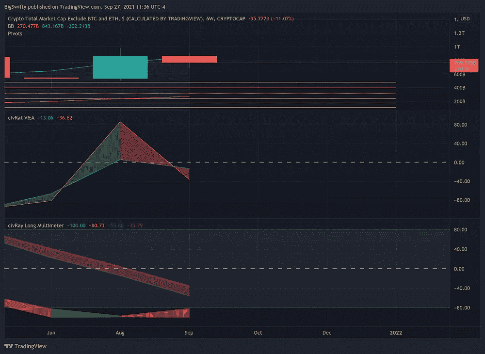

# 我们正在走向“下一次加密崩溃”吗？

> 原文：<https://medium.com/coinmonks/are-we-headed-for-the-next-crypto-crash-df839742c252?source=collection_archive---------6----------------------->

本文是对在[上看到的](https://medium.com/coinmonks?source=post_page-----cc03e7e5f364--------------------------------)[查尔斯·布朗森](https://medium.com/u/87726c182dfe?source=post_page-----df839742c252--------------------------------)的文章的回应。

布朗森的文章《T4:下一次加密崩溃》是对你如何交易的精彩总结。低买高卖。不是关于那个的*，但确实是。真诚地说，这是一篇精彩的文章。*

他对引发崩盘的因素的心理分析非常准确，他对监管或全球政治导致市场崩盘的担忧并非空穴来风。我对这些观点的重要性的一个回应是:上次崩盘后，市场反弹了，不是在几年内，而是在几周内。第二，最近像中国比特币挖矿和沃尔玛*不接受莱特币支付的新闻是牛市中的暂时现象。*

为什么我不认为崩盘迫在眉睫(除非复苏法案*确实*打击了市场)。让我们看看这些数字:

首先我们将回顾一下下个月的课程。蜡烛线是供参考的，但是我们现在关注的是秘密市值移动指标。当黄色(加速度测量)穿过绿色(稳定硬币的运动，或多或少总是零)时，通常会有一个尖峰，或者将在下一根蜡烛上出现。尽管出现了四根负增长蜡烛线，但该指标表明存在资金流入——值得注意的是，该图代表 alt-coin marketcap(减去 BTC 和 ETH ),该指标基于整个加密市场。

我们在 2W 看到了同样的增长迹象，表明我们可能正在进入一个非常牛市的月份。3W 和 4W 看起来不太乐观，但 3W 显示出上行加速，4W 很可能受到中国追加保证金通知和房地产债务消息后大幅下跌的影响。很明显，你不能仅仅抛出那些暗示与你的假设相反的数据；但话虽如此，我并不确定它完全代表了市场。话虽如此，让我们看看非常长期的情况。

Charts over the next year

很难预测 crypto 一个月后或一年后会怎样。图表从 1 年缩短到 1 个月(因为改变它们非常讨厌)。就像大家说的，大势严重看涨。仅有的两个看跌的框架是 1M 和 2M。同样，几周前的严重崩盘可能会影响预测。

在过去的一年中，crypto 似乎摆脱了它的崩溃，并且远远超过了它的最高抵抗水平。或许这确实预示着一场衰退。

除非出现某种监管上的惨败或其它市场变动事件，否则我认为未来 4 至 6 周内会有赢家。只有时间能证明一切。

> 这不是投资建议。这纯粹是信息性的。我与本文中提到的任何证券、硬币或其他金融工具无关，也不认可它们。这些文章是一种记录变化和保存预测密码市场成功或失败的公开证据的手段。我不对损失负责。声明:我在我概述的资产中持有少量股份，因为我相信它们有增长潜力。我不是霍德勒，我是一个没有证书的业余交易者，我也不是一个财务顾问；我在 iPhone 4 的垃圾箱里交易……不要相信我说的话，自己做研究吧。

—

编辑:这些数据和分析是原始文章的一部分，但我觉得这些指标太模糊，太不可预测。

—

*这些数据可能表明布朗森有所发现。*

civRat indicators over the next 5 months

*这些指标需要大量的数据来进行预测，但图表中的红色很难看到。Stoch RSI 在 6W 和 2M 向下移动，3M 看起来像是进入超卖区域。查看第二个窗格 V & A，似乎每一帧中的加速度都是正的，这通常表示增长，尽管红色表示下一帧中的下降趋势。*

> 加入 Coinmonks [电报频道](https://t.me/coincodecap)和 [Youtube 频道](https://www.youtube.com/c/coinmonks/videos)了解加密交易和投资

## 也阅读

 [## 最佳加密交易所| 2021 年十大加密货币交易所

### ICON _ PLACEHOLDEREstimated 预计阅读时间:28 分钟加密货币交易所的加密交易需要知识…

blog.coincodecap.com](https://blog.coincodecap.com/crypto-exchange)  [## 2021 年 10 大最佳加密贷款平台| CoinCodeCap

### 当谈到加密货币贷款时，大量因素等同于良好的收入状况。此外，借款的一部分…

blog.coincodecap.com](https://blog.coincodecap.com/crypto-lending)  [## 2021 年最佳免费加密交易机器人

### 2021 年币安、比特币基地、库币和其他密码交易所的最佳密码交易机器人。四进制，位间隙…

medium.com](/coinmonks/crypto-trading-bot-c2ffce8acb2a)  [## 最佳 4 个加密交易信号电报通道

### 这是乏味的找到正确的加密交易信号提供商。因此，在本文中，我们将讨论最好的…

medium.com](/coinmonks/best-crypto-signals-telegram-5785cdbc4b2b)  [## BlockFi 评论 2021:利弊和利率| CoinCodeCap

### 今天，我们提出了一个全面的 BlockFi 评论，这是一个成立于 2017 年的加密贷款平台，拥有其…

blog.coincodecap.com](https://blog.coincodecap.com/blockfi-review)  [## 如何在印度购买比特币？2021 年购买比特币的 7 款最佳应用[手机版]

### 如何使用移动应用程序购买比特币印度

medium.com](/coinmonks/buy-bitcoin-in-india-feb50ddfef94)  [## 加密税务软件——五大最佳比特币税务计算器[2021]

### 不管你是刚接触加密还是已经在这个领域呆了一段时间，你都需要交税。

medium.com](/coinmonks/best-crypto-tax-tool-for-my-money-72d4b430816b)  [## 存储比特币的最佳加密硬件钱包[2021] | CoinCodeCap

### 保管您的数字资产很容易，但找到正确的存储方式却是一项繁琐的任务。在线钱包有一个风险…

blog.coincodecap.com](https://blog.coincodecap.com/best-hardware-wallet-bitcoin)