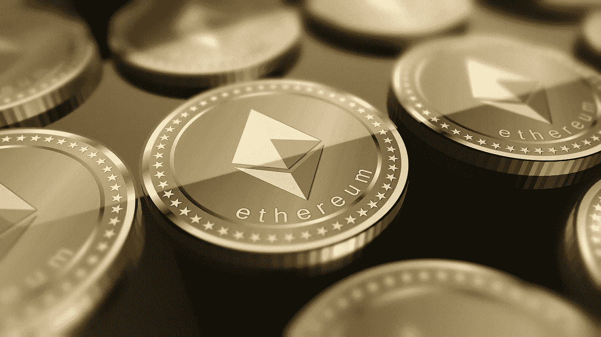

# 我们正处于以太坊超级周期之中吗？

> 原文：<https://medium.com/coinmonks/are-we-in-the-midst-of-an-ethereum-supercycle-be0b7eb75cf4?source=collection_archive---------1----------------------->

## 或者这只是一个典型的第三次循环？

Image by [Peter Patel](https://pixabay.com/users/elifxlite-10045576/?utm_source=link-attribution&utm_medium=referral&utm_campaign=image&utm_content=3660218) from [Pixabay](https://pixabay.com/?utm_source=link-attribution&utm_medium=referral&utm_campaign=image&utm_content=3660218)

当我们“庆祝”比特币第三个减半周期(发生在 2021 年 5 月 11 日)一周年时，我开始想知道以太坊是否有自己的周期。

我每天看的两个加密 YouTubers 都叫本(对着[比特男孩加密](https://www.youtube.com/channel/UCjemQfjaXAzA-95RKoy9n_g)大声喊出来)和[本杰明·考恩(进入加密宇宙](https://www.youtube.com/channel/UCRvqjQPSeaWn-uEx-w0XOIg) )…