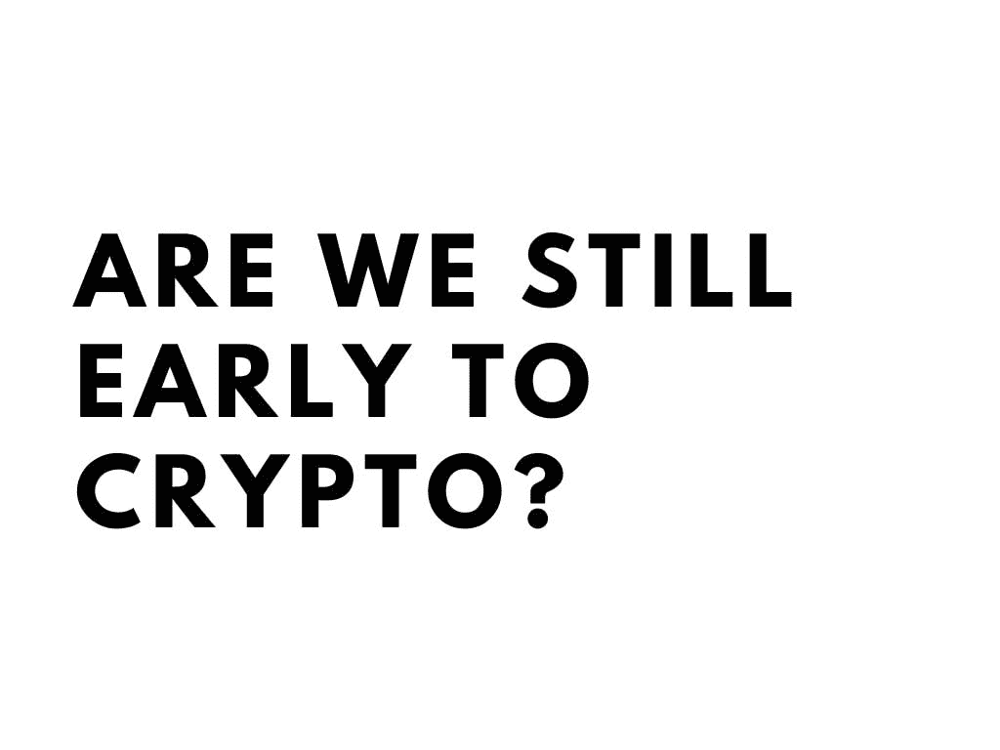
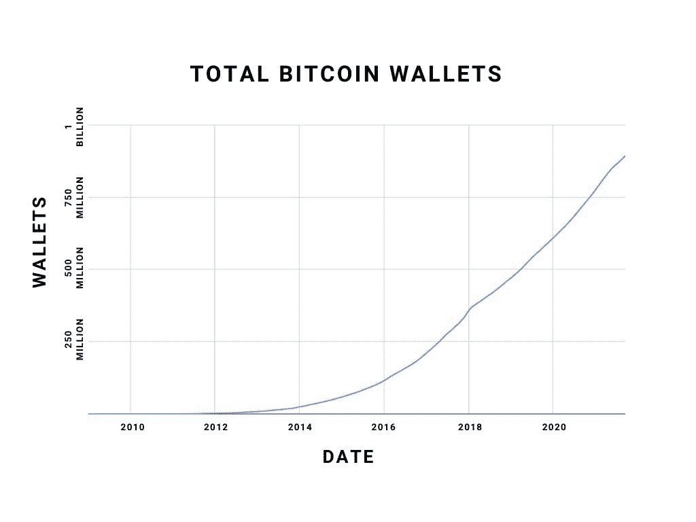
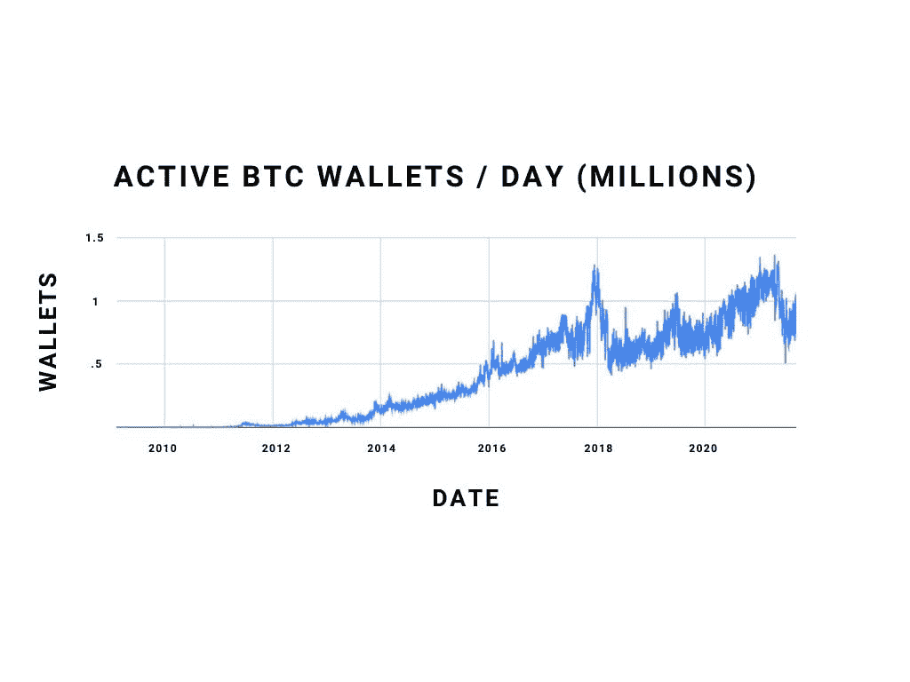
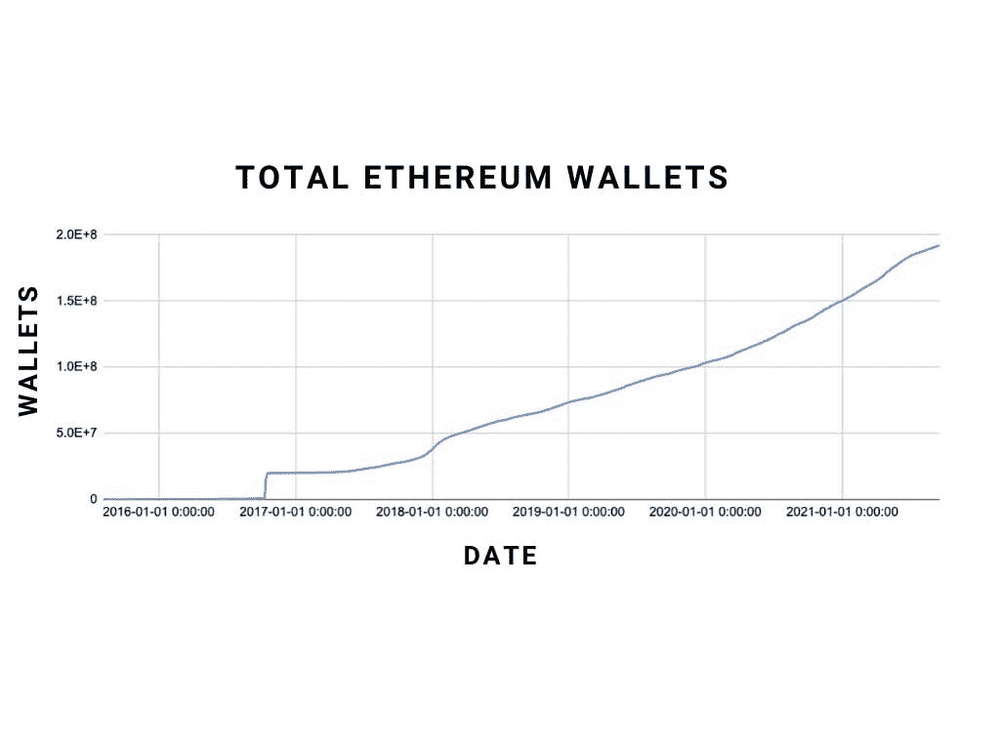
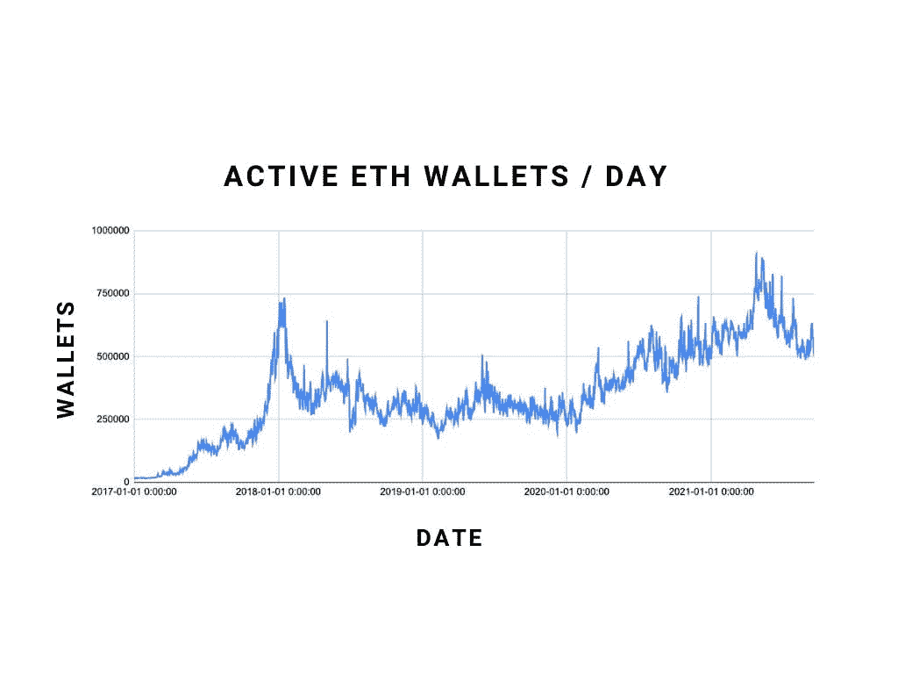
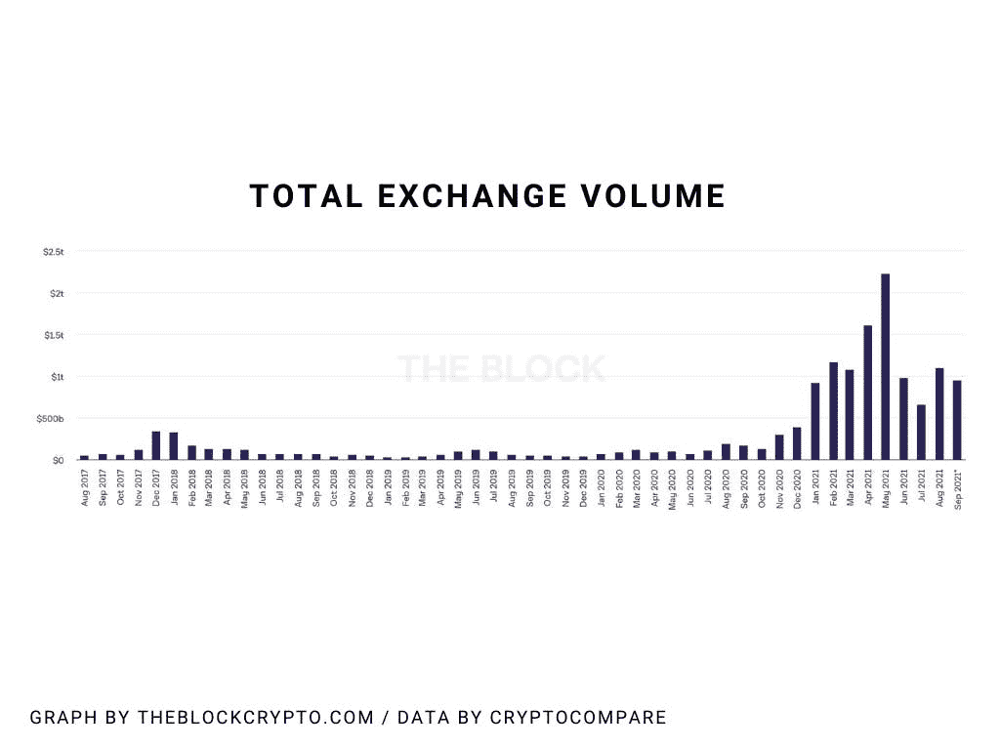
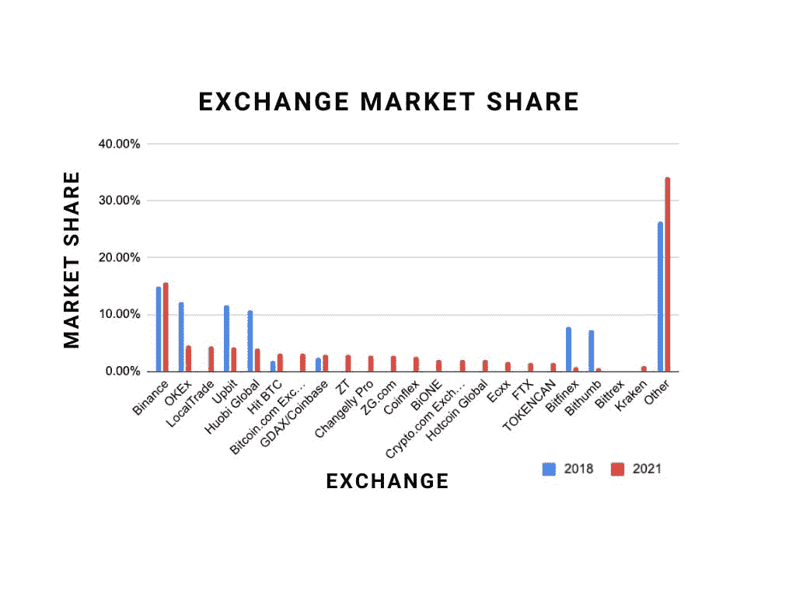
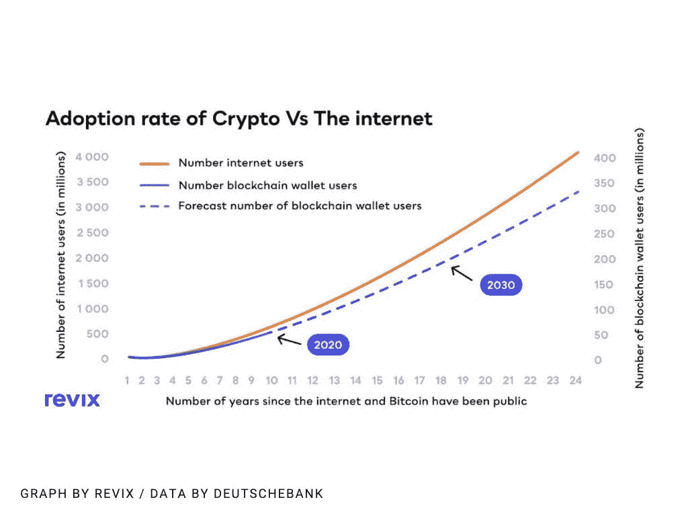
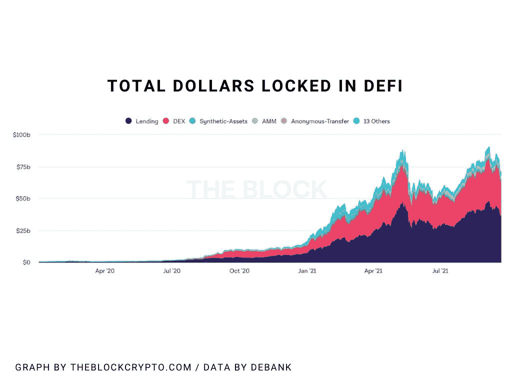
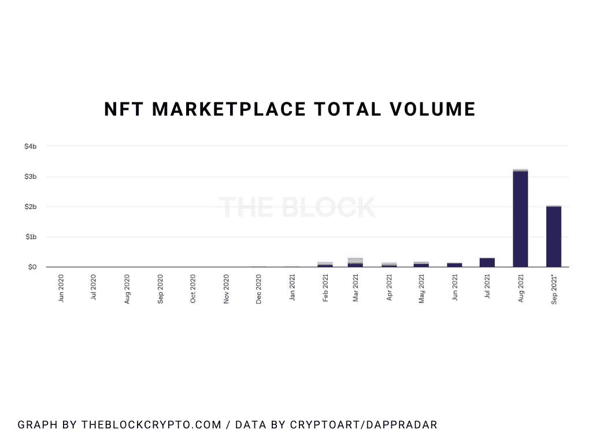

# 我们现在使用加密货币还早吗？

> 原文：<https://medium.com/coinmonks/are-we-still-early-to-cryptocurrency-815d056946df?source=collection_archive---------3----------------------->

我只把一小部分内容放在媒体上。如果你想获得所有加密实用主义的新闻更新、投资公告和 altcoin 报告，请在这里 **免费注册新闻简报** [**。**](http://cryptopragmatist.com/sign-up/)

我有时会纠结一个问题:我们现在加密还早吗？从很多方面来说，这是 crypto 面临的最大问题之一。对于 altcoin 的投资者来说，他们的命运取决于整个行业的扩张，这可能是最大的一次。如果我们逐渐走下坡路，我们的持有量归零只是时间问题。但如果我们来得太早，那么我们仍然可以在我们的投资组合中看到疯狂的、改变人生的表现。

上周，我偶然发现了风险投资家克里斯·麦肯的一篇 [Medium 帖子。这位索拉纳和 FTX 的种子投资者通过 12 张易于理解的图表假设，我们在 2018 年 5 月仍处于该领域的早期，几乎正好是 40 个月前。](/@mccannatron/12-graphs-that-show-just-how-early-the-cryptocurrency-market-is-653a4b8b2720)

他将加密的采用与互联网的采用相比较，提出了一个令人信服的案例:2018 年还为时过早。通过他的图表，在那个时间点，他显示了加密的采用与互联网在同一轨道上，并以类似的速度扩展。

但是我们还在那里吗？我们还在遵循同样的指数增长趋势吗？

我重新查看并更新了图表。

## **一个注释**

由于 crypto 在许多方面与互联网不同，我将做一些与 Chris 相同的假设，以便我们可以进行直接比较。以下是与该方法相关的困难:

*   人们有多个加密钱包，所以一个钱包并不意味着一个用户
*   交易所经常为新的交易创造新的钱包
*   一些购买场外加密货币产品或在某些交易所拥有 crypto 的用户无法直接访问钱包(Robinhood、eToro、gray)

尽管如此，我们仍然可以通过使用组合和评估度量来获得一个很好的视图。

​

## **比特币钱包地址增长**

第一个指标:唯一的比特币钱包地址。如今，比特币钱包的总量接近 9 亿。2018 年 5 月，这个数字约为 3.98 亿，而在四十个月前，这个数字约为 6000 万。

因此，增长有所放缓，尽管如果我们将其与整体互联网采用情况进行比较，它是密切跟踪的，因为互联网用户增长率也随着时间的推移而趋于平稳。

在公开使用的第 12 年，互联网超过了 10 亿用户，而比特币在第 13 年接近 10 亿个地址。话又说回来，一个地址并不等同于一个用户，所以有点难猜。尽管如此，三年内翻一番也没什么可嘲笑的。

​

## **活跃比特币地址:**

那么这些地址中有多少是实际活跃的(也就是说，在某一天发送或接收了任意数量的比特币)？看一看:

对于比特币来说，2021 年 1 月和 5 月达到了两个新的峰值，每天约有 125 万个活跃钱包。此前的局部峰值约为 2017 年末的 110 万。2017 年底的事情看起来像抛物线一样，直到 2018 年初交易量下降到 50 万/天。

对我来说，这张图表反映了与比特币相关的一些交易限制。虽然围绕比特币的一些与交易量相关的问题肯定有解决方案，但增长放缓也有可能是相关的。

虽然不可能收集所有加密货币的数据，但我认为加密货币的整体增长率要高得多。然而，由于存在 12，000 种不同的加密货币，几乎不可能进行计算。

​

我们还可以查看以太坊上的活跃钱包:该图的稳定增长和更高的 2021 年高点为我们的假设提供了可信度，即整体网络能力导致更多的活动增长。虽然比特币在活跃钱包中的比例缓慢下降(2018 年约为 0.3%)，但以太坊在活跃钱包中的比例保持更加一致。

2016 年末的骚乱是由于一次攻击试图通过创建大量地址来淹没以太坊的系统。

以太坊上的钱包总数和活跃钱包数量看起来都在追赶比特币，这对整个以太坊生态系统来说是一个很好的信号。L2s(建立在以太坊之上的由代用币驱动的区块链生态系统)的加入实际上可能低估了这些指标作为存在多少总网络活动的代理。​

## **交流活动:**

我找不到关于一段时间内交易所总用户增长的大量汇编数据，但我们可以用交易量来了解有多少资金通过加密市场流动。上图是由[theblockcrypto.com](https://app.convertkit.com/campaigns/7113902/theblockcrypto.com)编制的月度交易活动图，显示了自 2021 年 1 月以来的爆炸式增长。
为了证明这一点，请查看 2018 年 1 月与 2021 年 6 月的对比。

​

## **交易所市场份额:**

克里斯·麦肯(Chris McCann)研究了 crypto exchange 的增长情况，以估计用户总数，但由于我们已经获得了更好的总体用户增长统计数据，我们可以看看市场份额，以了解整体情况。

除去 Uniswap 和 PancakeSwap 等分散的加密货币交易所，我们看到了交易所格局的大幅拓宽。只有少数交易所(尤其是比特币基地和币安)能够增加市场份额的百分比。包括来自 dex 的数据会进一步混淆视听。

我认为这是一个令人难以置信的加密增长的信号，也是去中心化概念的真实例子。如果我们看看 21 世纪初的搜索引擎大战，在这个时间点上(相对于上市以来的几年)，谷歌拥有超过一半的市场份额。币安勉强达到 15%。

有两种方式来看待这个问题，但对加密投资者来说都是好迹象:

1.  如果加密在交易量方面永远保持分散，没有任何一个玩家获得太大的优势，这对加密来说是一件好事。
2.  如果加密交易量有朝一日整合，那将是很久以后的事了，这意味着我们还为时过早。

国际化、去中心化和交易所的不同价值主张都是好的迹象，表明我们仍处于加密的早期。

​

## **用户总采用率:**

Chris McCann 的分析中最吸引人的部分之一是他对加密增长和互联网增长的比较。德意志银行已经对区块链和互联网做了自己的研究，如下。

首先要注意的是，这两个图形存在于不同的轴上，并且已经发散。现在几乎可以肯定的是，加密技术的发展速度将慢于互联网，而在 2018 年，谁会发展得更快仍然是个未知数。

但是，尽管 crypto 的增长速度比互联网慢，但这种增长的系数可能正在加速。

在他们的预测中，德意志银行猜测，到 2030 年，加密货币用户总数将超过 2 亿。但是今天，9 月份，在疯狂牛市的推动下，根据许多估计，我们拥有超过 2.2 亿的用户。

数学显示，crypto 的整体用户群在相同的时间点上很难超过互联网的用户群。然而，看起来很有可能 crypto 比预期的更快达到 10 亿用户，这对于 crypto 价格来说是个好消息。

##  **那么……我们来早了吗？**

2018 年，许多图表指向 crypto 走与互联网相同的道路来完成世界统治。然而，今天，这种程度的乐观情绪更难保持了。

虽然在这一点上，我们知道加密不会比互联网更快地在全球范围内被采用，但在这一点上，它最终会实现的。

我们可以确定的是:

1.  加密领域的增长已经放缓。
2.  现在有超过 2 亿的加密货币用户。
3.  事情从来没有像现在这样看好 crypto。

虽然麦肯在 2018 年可以公平地将 crypto 的增长与整个互联网的增长进行比较，但也许在今天，进行这种比较有点过于乐观。一些加密货币希望成为全球近 20 亿没有银行账户的成年人的解决方案，但对于无法使用在线货币(银行账户、PayPal、CashApp 等)的人来说，目前的加密入门并不普遍

在我居住的地方(墨西哥)，要想上网，你需要一部 50 美元的智能手机或大约 50 美分才能进入一家网吧(尽管这些东西越来越少了)。准入门槛很小，这也是互联网用户攀升到 60 多亿的原因。

加密货币，至少目前来看，都是和金融、商业绑定的。很少有人在没有通过购买、出售、交换或出借加密货币进行金融参与的情况下使用区块链。

想想这个事实，要进入世界上最富有的 50%的人，你只需要 4210 美元。虽然很容易理解如此富有的人如何获得互联网接入，但很难想象他们想要参与当今价格波动剧烈的密码世界。

所以，不，加密市场不再以互联网曾经的速度增长，但也许这是一件好事，因为它表明我们仍然处于早期。一旦波动性降低，也许会有更多的人参与，但巨大的收益将更难实现。

​

## **密码的新前沿**

克里斯·麦肯的文章有点像 2018 年加密货币的时间胶囊，没有提到 DeFi 或 NFTs:这些概念甚至还不存在。

我对 DApp 未来最大的批评是，我们还没有看到 DApp 的使用量跟上 dapp 的创建数量。加密货币目前的核心用例是投机、价值存储、资产、支付等。”

今天，虽然有许多加密的用例！DeFi，产量农业，贷款，分散交易所，像 Theta 和 Audius 这样的平台保存着区块链的数据。因此，至于加密货币的下一个机会在哪里，很可能你甚至还没有听说过它们:这是天生的。有大创意的小项目有更大的发展空间。

为了说明我的观点，我想展示几幅三年前甚至无法想象的图表。这是一张 TheBlockCrypto.com 的图表，显示了 DeFi 中锁定资产的总价值:

克里斯甚至没有触及的一个行业现在已经接近 1000 亿美元了！三年前不可想象。

下图是 NFT 市场的交易量。一年前，Opensea 的日交易量不到 5 万美元。今天，它将做大约 9000 万美元。仅仅一年就翻了 1800 倍。

如果你正在投资加密，那么很明显，比特币和以太坊的增长都已经放缓:这是有道理的:随着资产规模的增长，改变资产价格变得更加困难。

但如果你想知道在哪里可以找到爆炸性的 10 倍、100 倍、1000 倍投资，这是加密货币的新趋势**，这是最前沿、最新的创新，有可能爆发。**

对我来说，这意味着投资替代硬币和协议，它们将为这个创造在线财富的新世界提供便利。

杰克·尼沃尔德

**加密实用主义者**

[**点击这里**](http://cryptopragmatist.com/sign-up/) **每周从 Crypto Pragmatist 获取内容，绝对免费。**

> 加入 Coinmonks [电报频道](https://t.me/coincodecap)和 [Youtube 频道](https://www.youtube.com/c/coinmonks/videos)了解加密交易和投资

## 另外，阅读

*   [尤霍德勒 vs 考尼洛 vs 霍德诺特](/coinmonks/youhodler-vs-coinloan-vs-hodlnaut-b1050acde55a) | [Cryptohopper vs 哈斯博特](https://blog.coincodecap.com/cryptohopper-vs-haasbot)
*   [币安 vs 北海巨妖](https://blog.coincodecap.com/binance-vs-kraken) | [美元成本平均交易机器人](https://blog.coincodecap.com/pionex-dca-bot)
*   [新加坡十大最佳加密交易所](https://blog.coincodecap.com/crypto-exchange-in-singapore) | [购买 AXS](https://blog.coincodecap.com/buy-axs-token)
*   [投资印度的最佳加密软件](https://blog.coincodecap.com/best-crypto-to-invest-in-india-in-2021) | [HitBTC 评论](/coinmonks/hitbtc-review-c5143c5d53c2)
*   [加拿大最好的加密交易机器人](https://blog.coincodecap.com/5-best-crypto-trading-bots-in-canada) | [赌注加密](https://blog.coincodecap.com/staking-crypto)
*   [如何在印度购买比特币？](/coinmonks/buy-bitcoin-in-india-feb50ddfef94) | [瓦济克斯评论](/coinmonks/wazirx-review-5c811b074f5b)
*   [比特币主根](https://blog.coincodecap.com/bitcoin-taproot) | [Bitso 回顾](https://blog.coincodecap.com/bitso-review) | [排名前 6 的比特币信用卡](/coinmonks/bitcoin-credit-card-bc8ab6f377c6)
*   [最佳免费加密信号](https://blog.coincodecap.com/free-crypto-signals) | [YoBit 评论](/coinmonks/yobit-review-175464162c62) | [Bitbns 评论](/coinmonks/bitbns-review-38256a07e161)
*   [OKEx 回顾](/coinmonks/okex-review-6b369304110f) | [Kucoin 交易机器人](/coinmonks/kucoin-trading-bot-automate-your-trades-8cf0ca2138e0) | [期货交易机器人](/coinmonks/futures-trading-bots-5a282ccee3f5)
*   [AscendEx Staking](https://blog.coincodecap.com/ascendex-staking)|[Bot Ocean Review](https://blog.coincodecap.com/bot-ocean-review)|[最佳比特币钱包](https://blog.coincodecap.com/bitcoin-wallets-india)
*   [霍比评论](https://blog.coincodecap.com/huobi-review) | [OKEx 保证金交易](https://blog.coincodecap.com/okex-margin-trading) | [期货交易](https://blog.coincodecap.com/futures-trading)
*   [Godex.io 审核](/coinmonks/godex-io-review-7366086519fb) | [邀请审核](/coinmonks/invity-review-70f3030c0502) | [BitForex 审核](https://blog.coincodecap.com/bitforex-review)
*   [Crypto.com 费用](/coinmonks/binance-fees-8588ec17965) | [僵尸加密审查](/coinmonks/botcrypto-review-2021-build-your-own-trading-bot-coincodecap-6b8332d736c7) | [替代品](https://blog.coincodecap.com/crypto-com-alternatives)
*   [交易信号是什么？](https://blog.coincodecap.com/trading-signal) | [Bitstamp vs 比特币基地](https://blog.coincodecap.com/bitstamp-coinbase) | [买索拉纳](https://blog.coincodecap.com/buy-solana)
*   [ProfitFarmers 回顾](https://blog.coincodecap.com/profitfarmers-review) | [如何使用 Cornix 交易机器人](https://blog.coincodecap.com/cornix-trading-bot)
*   [MXC 交易所评论](/coinmonks/mxc-exchange-review-3af0ec1cba8c) | [Pionex vs 币安](https://blog.coincodecap.com/pionex-vs-binance) | [Pionex 套利机器人](https://blog.coincodecap.com/pionex-arbitrage-bot)
*   [我的加密副本交易经历](/coinmonks/my-experience-with-crypto-copy-trading-d6feb2ce3ac5) | [比特币基地评论](/coinmonks/coinbase-review-6ef4e0f56064)
*   [CoinFLEX 评论](https://blog.coincodecap.com/coinflex-review) | [AEX 交易所评论](https://blog.coincodecap.com/aex-exchange-review) | [UPbit 评论](https://blog.coincodecap.com/upbit-review)
*   [AscendEx 保证金交易](https://blog.coincodecap.com/ascendex-margin-trading) | [Bitfinex 赌注](https://blog.coincodecap.com/bitfinex-staking) | [bitFlyer 点评](https://blog.coincodecap.com/bitflyer-review)
*   [麻雀交换评论](https://blog.coincodecap.com/sparrow-exchange-review) | [纳什交换评论](https://blog.coincodecap.com/nash-exchange-review)
*   [加密货币储蓄账户](/coinmonks/cryptocurrency-savings-accounts-be3bc0feffbf) | [加密交易机器人](https://blog.coincodecap.com/best-crypto-trading-bots)
*   [BigONE 交易所评论](/coinmonks/bigone-exchange-review-64705d85a1d4) | [CEX。IO 审查](https://blog.coincodecap.com/cex-io-review) | [交换区审查](/coinmonks/swapzone-review-crypto-exchange-data-aggregator-e0ad78e55ed7)
*   [最佳比特币保证金交易](/coinmonks/bitcoin-margin-trading-exchange-bcbfcbf7b8e3) | [比特币保证金交易](https://blog.coincodecap.com/bityard-margin-trading)
*   [加密保证金交易交易所](/coinmonks/crypto-margin-trading-exchanges-428b1f7ad108) | [赚取比特币](/coinmonks/earn-bitcoin-6e8bd3c592d9) | [Mudrex 投资](https://blog.coincodecap.com/mudrex-invest-review-the-best-way-to-invest-in-crypto)