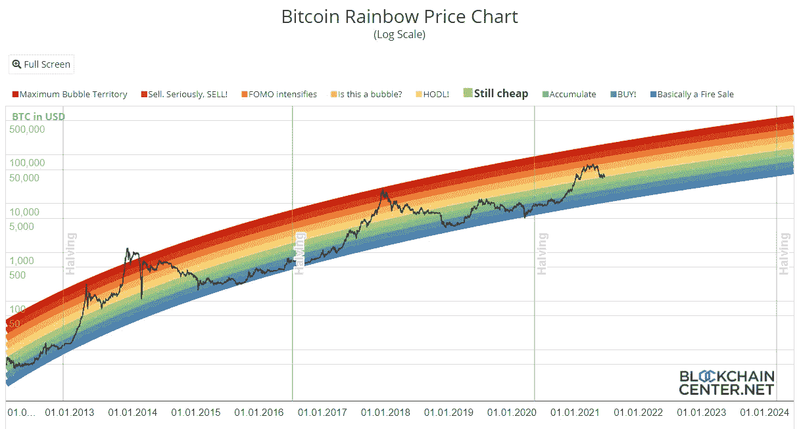

# 我们还在牛市中吗？？

> 原文：<https://medium.com/coinmonks/are-we-still-in-a-bull-run-f2a4bab9007d?source=collection_archive---------3----------------------->

这篇文章将涵盖 10 个不同的指标，这些指标被证明是正确的，显示了大部分以前的牛市峰值。

我们还将比较过去和现在的数据，这可以进一步帮助我们深入研究。

## **指示灯**

1.  谷歌搜索比特币
2.  库存到流程图
3.  51%对 49 %的黄金比例
4.  两年移动平均线
5.  比特币 Trolololo 趋势线
6.  卢比/ NUPL 图表
7.  普尔倍数
8.  MVRV — Z 分数
9.  罗德比率
10.  储备风险

## **1。谷歌搜索比特币**

从历史上来看，在牛市爆发时，互联网用户对“比特币”一词的搜索量高得离谱，与之前的牛市相比，它总是呈指数级增长。

当前的周期没有出现任何类似的情况，事实上“比特币”一词的搜索点击率没有超过之前牛市的最高水平。

## **2。库存到流程图**

库存流量被定义为 ***产量*** 和 ***当前库存*** 之间的关系。

最初的 BTC S2F 模型是基于每月 S2F 和价格数据的公式。

***公式:*** SF =存量/流量

## **我的分析**

*红色箭头* =之前牛市巅峰的一击

*绿色箭头* =次峰

白盒盘旋在我们现在盘旋的地方

## 案例 1:我们可以认为目前的 64804 点是本轮牛市的一个高峰吗？

看看 STF 图表，这离牛市顶部还很远

*原因是*

1.  这不是一次井喷，而是一次平坦的顶部(顶部之后是盘整)，不像我们看到的任何其他运行
2.  流量不像以前的牛市那样脱离图表。远低于 463 天的库存/流量线

***因此，我假设我们在 2021 年 4 月 14 日触及的当前 ATH(64804)不是本轮牛市的顶部。***

## **案例二:这能是次峰吗？**

我们在 2013 年周期中看到的次峰与 463 天的 S/F 相比有显著的上升。超级抛物线，在这次运行中，我还没有看到任何如此显著或相当接近的次峰。相反，我认为这可能是潜在的冷却/巩固阶段。虽然我可能是错的，但是根据图表和历史牛市的相似性，我坚持认为这可能不是一个次高峰。

如果当前的周期与 STF 保持一致，比特币可能达到的目标是潜在的 10 万至 25 万美元，用*和粉色线条表示

## **3。黄金 51% — 49 %比例**

这项研究的重点是牛市。从底部到减半的阶段占整个牛市周期的 51%,而其余阶段(减半到顶部)占 49%。实际上，我们可以宣称减半似乎是每个牛市周期的中间点。

熊市低点减半被认为是 **51 %**

减半到牛市顶部被认为是 **49 %**

来源:[点击这里](https://www.tradingview.com/chart/BTCUSD/QBeNL8jt-BITCOIN-The-Golden-51-49-Ratio-600-days-of-Bull-Market-left/)

2013 年，减半后的跑步非常激烈。超抛物线。接下来买一个迷你熊市，然后买一个最终顶部

2017 年，剩下的 49%显示了运行和抛物线在本质上的传播，有 4 到 5 个主要修正。注意 2018 年的图案，第三个正确..一次下跌，一次整固，跌幅更大，仅次于天空火箭。

除此之外，我们还有几个月的时间，这可以在 2021 年的 49 %剩余区域中看到。

考虑到这些观察，牛市仍在继续。

## **4。2 年移动平均线**

指示器概述

2 年 MA 乘数旨在用作长期投资工具。

它强调了在那些时期买卖比特币会产生巨大回报的时期。

最好的指标之一。

这个 KPI 准确地指出了顶部和底部。它精确地标记了 2013 年的次高峰和牛市的高峰。

标志着 2018 年牛市达到顶点

如果考虑这个特定的 KPI，当前运行没有显示任何次峰或峰的迹象。

一个重要的观察结果是，与 2013 年和 2017 年不同，绿色趋势线非常接近价格走势。如果价格上涨，很有可能是抛物线。

## **5。比特币 Trolololo 趋势线**

彩虹图是一种有趣的观察长期价格变动的方式，忽略了每日波动的“噪音”。色带遵循对数回归。

预计:10000 美元/ BTC 将于 2017 年 11 月 22 日上市

发生时间:2017 年 11 月 27 日

预测:10 万美元/ BTC 将于 2021 年 7 月 16 日登陆

这还有待证实，还有待发生。

KPI 建议何时出售和积累比特币。这些卖点可能是这轮上涨的顶点。我注意到 2013 年和 2017 年的跑步记录也是如此。

目前的价格走势并不意味着价格已经触顶。

## **以太坊彩虹图快速检查**

## **6。卢比/ NUPL 图表**

这个工具的关键原理是市值和比特币投资者获利之间的比率。

当市值上升速度远远超过获利回吐速度时，我们看到市场过热，有人可能会说这是由于投资者的贪婪(红色区域)。对于战略投资者来说，这种时候历来有利于获利。

我们确实触及了贪婪，但没有触及兴奋。通过这个 KPI，我们可以说比特币在这个周期还没有达到顶峰。

## 7 .**。** **普埃尔倍数**

这一指标着眼于比特币经济的供应方——比特币矿工及其收入。

它从矿业收入的角度探索市场周期。比特币矿工有时被称为强制卖家，因为他们需要在价格极其波动的市场中支付采矿硬件的固定成本。因此，随着时间的推移，它们产生的收入会影响价格。

Puell 倍数的计算方法是将比特币的每日发行价值(以美元计)除以每日发行价值的 365 天移动平均值。

指标离上限太远了。从这张图表来看，我们还没有达到顶峰。

## **8。MVRV — Z 得分**

MVRV Z-Score 使用区块链分析来确定比特币相对于其“公允价值”极度高估或低估的时期。

## **分析:**

2013 年、2018 年 KPI 精准触及上限。

当我们看 Z 得分线的进展时，它看起来像一个类似于 2013 年的下降，然而，在 2013 年它是一个次峰，它很容易达到上限，Z 得分的当前进展并不意味着它是这次运行的次峰或顶部。

说白了，我们还没到顶。

## **9。罗德比率**

该指标能够非常准确地识别比特币之前每个宏观周期的价格高点。

它能在几天内准确识别市场顶部。

罗德比率进入红色波段表明市场正在接近其周期的顶部。从历史上看，这是投资者在每个周期获利的好时机。

请注意，这一指标并没有给出 2013 年 4 月周期高点的错误信号

看看 KPI，我们远低于上限水平。

## **10。储备风险**

储备风险让我们可以直观地看到长期比特币持有者对特定时刻比特币价格的信心。

当信心很高，价格很低时，投资比特币的风险/回报就很诱人(绿色区域)。当信心低而价格高时，风险/回报就没有吸引力(红色区域)。随着时间的推移，在储备风险处于绿色区域的时期投资比特币已经产生了巨大的回报。

我们不在储备风险区称之为顶部。

## **结论**

他们越是说不一样，事情就越是一成不变。我们还没有看到本轮牛市的顶部。考虑到我们拥有的可靠 KPI，我怀疑我们是否已经见证了次高峰。

保持乐观。

**作者: Eth！c@l Aka Kumar**

***邮箱:***[**【IfWorldGoneCrypto@gmail.com】**](mailto:IfWorldGoneCrypto@gmail.com)

***电报:*t.me/IfWorldGoneCrypto**

***同行评议:*臭 Linky**

**PS** :这既不是付费文章，也不是理财建议。记录下来的是我自己的研究发现，这是出于对这个隐秘领域的热情

如果你想表达一些爱，请捐赠并帮助我们继续做我们正在做的事情

**ERC 20:0x 867 ca 4 af 0 EB 86d 48014 D8 ce 344d 096 c 01348 a163**

来源:谷歌、[lookinto 比特币](https://www.lookintobitcoin.com/)、[区块链中心](https://www.blockchaincenter.net/bitcoin-rainbow-chart/)