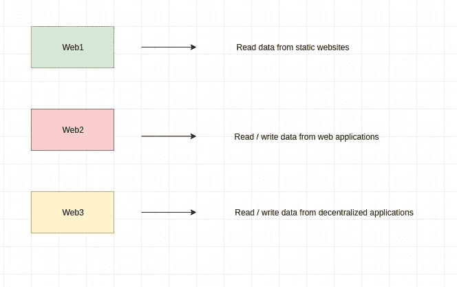

# 你是开发商吗？你必须知道这一点！两分钟后的 WEB3

> 原文：<https://medium.com/coinmonks/are-you-developer-you-have-to-know-this-web3-in-2-min-232950fd099?source=collection_archive---------8----------------------->

如果你是一个开发者，你可能听说过 web3。随着大量资本和人才涌向生态系统，web3 出现了大规模的淘金热。不管你是支持还是反对加密，对这个新的 web3 东西做一些研究可能是个好主意。

在这个故事中，我将解释什么是 **web3** ，我们可以用它做什么，以及你如何开始在它的基础上进行构建。

有了 web1，我们可以使用静态网站读取数据。有了 web2，我们可以使用具有集中式后端的 web 应用程序来读写数据。有了 **web3** ，我们可以**在**去中心化的应用中**读**和**写数据**，这些应用在像以太坊这样的区块链上有一个去中心化的后端。

与 web 2 和 web 3 相比，我们有以下优势**用户能够返回更多价值**，因为没有中介。它对每个人都开放。它是抗审查的。它是**无权限**的，这意味着任何人都可以执行智能合同，无需请求 api 访问。这是可组合的，这意味着我们可以在彼此的基础上构建智能契约。因为没有集中的故障点，所以更加安全。

web3 的第一个用例是构建**加密货币**，但是 web3 可以做更多。有了 T2 DeFi T3 协议，我们可以以一种去中心化的方式重塑金融。对任何人开放，没有银行监管挡路。有了 **NFTs** ，我们可以创建独特的数字资产，这些资产有许多使用案例，如游戏内资产或数字艺术。有了 DAOs，我们可以创建一个去中心化的组织，能够投票和使用国库，没有传统公司的繁文缛节和限制。要构建 web3 应用程序，你需要了解 web 3 开发，包括:html、css、javascript 和 react。之后，你可以专注于以太坊区块链，它拥有最大的生态系统和最好的开发工具。你首先要学习一个分散式应用程序的架构，它的 web 前端连接到一个智能合约——这些运行在区块链上的小程序。你必须学习撰写智能合同的语言。你还必须学习两种流行的智能合约框架，要么是松露，要么是安全帽。要与以太坊互动，你必须学习 **web3.js** 或 **ethers** 两个流行的 javascript 库。你还必须学会如何将你的 dapp 前端与最常用的以太坊钱包 **metamask** 集成。

这是对 web3 开发的一个非常简短的介绍。如果你想了解更多关于 blokchain 技术的信息，你必须查看我关于它的不同故事！

> 加入 Coinmonks [电报频道](https://t.me/coincodecap)和 [Youtube 频道](https://www.youtube.com/c/coinmonks/videos)了解加密交易和投资

## 也阅读

 [## 杠杆代币[多头代币]终极指南

### 杠杆化令牌是具有杠杆化风险敞口的 ERC20 令牌，不考虑保证金、要求、管理…

medium.com](/coinmonks/leveraged-token-3f5257808b22)  [## 最佳加密交易所| 2021 年十大加密货币交易所

### 编辑描述

blog.coincodecap.com](https://blog.coincodecap.com/crypto-exchange)  [## 2021 年最佳加密借贷平台| 6 大比特币借贷平台

### 获得比特币和其他加密货币的最佳贷款利率

medium.com](/coinmonks/top-5-crypto-lending-platforms-in-2020-that-you-need-to-know-a1b675cec3fa)  [## 2021 年最佳免费加密交易机器人

### 2021 年币安、比特币基地、库币和其他密码交易所的最佳密码交易机器人。四进制，位间隙…

medium.com](/coinmonks/crypto-trading-bot-c2ffce8acb2a)  [## 最佳 4 个加密交易信号电报通道

### 这是乏味的找到正确的加密交易信号提供商。因此，在本文中，我们将讨论最好的…

medium.com](/coinmonks/best-crypto-signals-telegram-5785cdbc4b2b)  [## 5 个最佳社交交易平台[2021] | CoinCodeCap

### 编辑描述

blog.coincodecap.com](https://blog.coincodecap.com/best-social-trading-platforms)  [## BlockFi 评论 2021:利弊和利率| CoinCodeCap

### 编辑描述

blog.coincodecap.com](https://blog.coincodecap.com/blockfi-review)  [## 如何在印度购买比特币？2021 年购买比特币的 7 款最佳应用[手机版]

### 如何使用移动应用程序购买比特币印度

medium.com](/coinmonks/buy-bitcoin-in-india-feb50ddfef94)  [## 加密税务软件——五大最佳比特币税务计算器[2021]

### 不管你是刚接触加密还是已经在这个领域呆了一段时间，你都需要交税。

medium.com](/coinmonks/best-crypto-tax-tool-for-my-money-72d4b430816b)  [## 存储比特币的最佳加密硬件钱包[2021] | CoinCodeCap

### 编辑描述

blog.coincodecap.com](https://blog.coincodecap.com/best-hardware-wallet-bitcoin)  [## Pionex 评论 2021 |免费加密交易机器人和交换

### Pionex 是为交易自动化提供工具的后起之秀。Pionex 上提供了 9 个加密交易机器人…

medium.com](/coinmonks/pionex-review-exchange-with-crypto-trading-bot-1e459d0191ea)