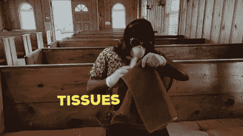

# 你要申报加密货币税吗？

> 原文：<https://medium.com/coinmonks/are-you-filing-your-cryptocurrency-taxes-5321a1d08504?source=collection_archive---------2----------------------->

## **量化宽松**来了——买比特币

嘿伙计们，

在这些艰难的时刻，遵循[冠状病毒咨询](https://www.who.int/news-room/q-a-detail/q-a-coronaviruses)照顾好自己和他人🙏

现在是美国的征税时间，所以请阅读我们关于 [***常见加密货币税务问题***](https://blog.coincodecap.com/five-questions-about-cryptocurrency-tax-and-bitcoin-tax/) 的最新文章。💰

## CoinCodeCap 更新

*   我们从 CoinCodeCap 上的这个开始跟踪 [**隐名项目**](https://coincodecap.com/project/PRV) 。使用隐姓埋名，你把任何加密货币变成一个隐私硬币。在这里 **阅读更多微服私访项目 [**。**](https://incognito.org/t/network-incentive-privacy-prv-mining-distribution/172?utm_source=coincodecap.com)**
*   我们在[***QuikNode***](https://quiknode.io?utm_source=coincodecap)的朋友推出了他们的新网站和一些很酷的新功能。我们写了一篇 QuikNode 的评论，这里读****。*** 🧐*
*   *现在 CoinCodeCap 上有 371 个产品，让我们看看上周一些很酷的新加密项目。*
*   *CoinCodeCap 上列出的 [**40 多个加密钱包**](https://coincodecap.com/category/wallets) 。您可以查看您最喜欢的加密钱包。*
*   *查看新的加密文章 [CoinCodeCap 博客](https://blog.coincodecap.com)。*

## *最新加密新闻*

*   *[霍尼韦尔在区块链上追踪 10 亿美元的零件/晨星与 Fatburger / A16z 一起评估第一个以太坊证券&比特币基地风险投资公司建立在凯尔·埃利科特的 Celo](/coinmonks/honeywell-tracking-1bn-parts-on-blockchain-morningstar-rates-first-ethereum-security-with-f4d5f3c72cd7) 上*

## *最新故事*

*   *[比特币的生产成本——比特币估值模型](/coinmonks/bitcoins-cost-of-production-a-valuation-approach-for-bitcoin-dcd76951040a?source=friends_link&sk=cdf4ba225bda3fdceb10170668860778)作者[数据日期](https://medium.com/u/a39070ad4440?source=post_page-----5321a1d08504--------------------------------)【推荐】*
*   *[比特币在 COVID 疯狂期间下跌，给出了什么？](/coinmonks/bitcoin-drops-in-covid-madness-what-gives-1f93eb7eb0f5)由[格里芬骑士](https://medium.com/u/551e00564806?source=post_page-----5321a1d08504--------------------------------)*
*   *[阿尔贝托·单面山·卡尼亚达](/coinmonks/a-linked-list-implementation-for-ethereum-a2915bf8122f)[为以太坊](https://medium.com/u/8206cbb70805?source=post_page-----5321a1d08504--------------------------------)实现的链表*
*   *[比特币是真理](/coinmonks/bitcoin-is-truth-799cea7a1d6a)由 [Kenetic 交易](https://medium.com/u/f02b18275814?source=post_page-----5321a1d08504--------------------------------)*
*   *[比特币历史上的关键事件精选](/coinmonks/a-selection-of-key-events-in-bitcoins-history-65a982c76ebf) [Cos](https://medium.com/u/e55a710acb5a?source=post_page-----5321a1d08504--------------------------------)*
*   *[比特币的道德哲学](/coinmonks/the-moral-philosophy-of-bitcoin-eac9df43ea69?source=friends_link&sk=ab63c07a937deec5159a756c6b345b9b)*
*   *[如何在私有以太网上建立 dapp](/coinmonks/dapp-on-a-private-ethereum-network-1-c8b80695e049)[叶达鑫 Shitole](https://medium.com/u/2331e88f783?source=post_page-----5321a1d08504--------------------------------)*
*   *[给 Vyper 初学者的提示](/coinmonks/for-those-who-is-going-to-learn-vyper-8bac3cc0e01c)作者 [Hoang Quan Tran](https://medium.com/u/1b7a8bb6ec97?source=post_page-----5321a1d08504--------------------------------)*
*   *【EOSIO 软件和 EOS 区块链的区别作者[杰克·坦纳](https://medium.com/u/d8f296833e37?source=post_page-----5321a1d08504--------------------------------)*

> *[在您的收件箱中直接获得最佳软件交易](https://coincodecap.com/?utm_source=coinmonks)*

**

*加入我们的 [***电报频道***](https://t.me/joinchat/FyuZERD5oyp6LWbwLASOKQ)*来谈论新的加密产品和区块链生态系统。**

## **在 Coinmonks 上发布**

**如果你喜欢在 crypto/区块链空间上写教育文章，并且想在 Coinmonks 出版物上发表。只需在***【gaurav@coincodecap.com】****或者 DM 我**[***推特***](https://twitter.com/coinmonks)***

> ***“我们是一份非宣传性、非营利性的教育刊物，如果你喜欢读*[*【coin monks】*](https://medium.com/coinmonks)*[*你也可以把我们*](/coinmonks/monks-need-your-help-7440418d67ec) *捐出来。****

******暂时就这样，送我❤️，下次再说。******