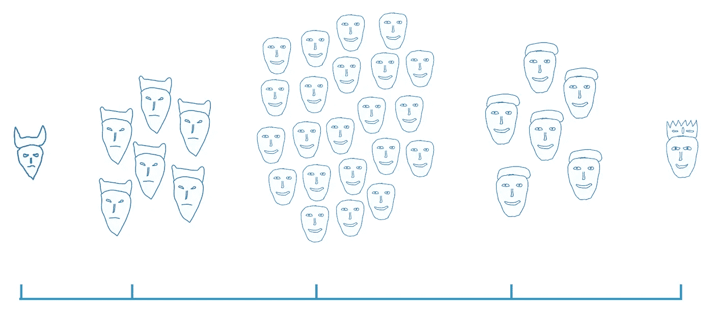

# 贵族与民主:加密货币何去何从？

> 原文：<https://medium.com/coinmonks/aristocracy-vs-democracy-where-are-cryptocurrencies-heading-483bf573c454?source=collection_archive---------11----------------------->

SundaeSwap 宣布，Cardano 社区必须投票选出 30 个池来运行 L2 代码，作为他们正在推出的 DEX 平台的挖掘者角色。想要参与的每个人都必须向自己发送少量(例如，2.580408ADA)，这将表明两件事情:

*   选择的第一个和第二个池选项(580 是我的池 ASKP 的 id，408 是 GRC1 的 ID)
*   钱包的投票权:地址越多，选票就越有价值

一方面，这可以理解为某种程度上的公平:你消除了人们对投票程序的游戏，否则他们会创建许多钱包并按每个钱包的过程投票。但另一方面，它把权力给了少数富人；换句话说，这是精英管理。

柏拉图在《政治家》一书中说，有五种政府:

Tyranny — Oligarchy — Democracy — Aristocracy — Kingdom

在中间我们有民主，几乎每个人都参与决策。你不能用民主做非常好或非常坏的事情，因为决策过程需要时间，人民的身体不能对外部输入做出快速反应。好人和坏人相互作用，结果是一个稳定的平庸的系统。

当更少的人执政时，决策可以更快地做出，系统可以更快地做出反应，但现在我们有腐败渗入政府。有些人控制着更多。如果这几个人很好，做出好的决定来改善大多数人的生活，柏拉图(或苏格拉底，在对话中说话的人)称他们为贵族，来自希腊单词 aristos + kratos，由最好的，完美的统治。另一方面，如果统治的少数人是邪恶的，试图减少人民的自由并使自己富裕，柏拉图称之为寡头政治，即少数人掌权。

最后，在光谱的边缘，柏拉图把一个完美的统治者放在一边，一个有能力并关心他/她的人民的人，一个国王。他(或她)可以对各种情况做出快速反应，如果他非常优秀，会做出正确的决定，并领导国家取得巨大成就。但另一方面，如果统治者是邪恶的，因为他积聚了巨大的权力，他可以对人民造成极大的伤害。柏拉图称那个国家为暴政。

在加密货币的世界里，我们喜欢去中心化。几个世纪以来，人们已经意识到把所有的权力交给一个或几个人是不好的。有时他们可能是好的，人们繁荣，但有时他们可能是坏的，人们受苦。因此，大多数国家开始向民主迁移，改变的能力缓慢，向善或恶。政府的每个方面都有安全网，我们不再喜欢绝对的权力。权力下放是自由世界的关键部分。

我不认为加密货币生态系统更喜欢通过选择投票的贵族方法，但由于技术上的缺点。一旦我们可以在区块链上放置一个数字身份，与一些生物特征或其他密钥联系起来，我们就可以迁移到真正的民主。通过扫描你的面部，你可以将钱包与你的身份和投票联系起来，只有一次，只有你。那么你有多富有，受教育程度有多高，什么种族，什么宗教或者其他什么都无所谓了。你的投票和其他人的投票一样重要。

如果你觉得这篇文章有用，请考虑委派一些 ADA 到我们的池中。我们将利润的 10%捐给一名对卡尔达诺协议研究最好的 NTUA 学生:
阿达·斯克普斯—ASKP
www.skepsispool.com

【https://www.youtube.com/watch?v=Hga6HLDtj94 

> 加入 Coinmonks [电报频道](https://t.me/coincodecap)和 [Youtube 频道](https://www.youtube.com/c/coinmonks/videos)了解加密交易和投资

## 另外，阅读

*   [CoinFLEX 评论](https://blog.coincodecap.com/coinflex-review) | [AEX 交易所评论](https://blog.coincodecap.com/aex-exchange-review) | [UPbit 评论](https://blog.coincodecap.com/upbit-review)
*   [AscendEx 保证金交易](https://blog.coincodecap.com/ascendex-margin-trading) | [Bitfinex 赌注](https://blog.coincodecap.com/bitfinex-staking) | [bitFlyer 点评](https://blog.coincodecap.com/bitflyer-review)
*   [Bitget 回顾](https://blog.coincodecap.com/bitget-review)|[Gemini vs block fi](https://blog.coincodecap.com/gemini-vs-blockfi)|[OKEx 期货交易](https://blog.coincodecap.com/okex-futures-trading)
*   [AscendEx Staking](https://blog.coincodecap.com/ascendex-staking)|[Bot Ocean Review](https://blog.coincodecap.com/bot-ocean-review)|[最佳比特币钱包](https://blog.coincodecap.com/bitcoin-wallets-india)
*   [霍比评论](https://blog.coincodecap.com/huobi-review) | [OKEx 保证金交易](https://blog.coincodecap.com/okex-margin-trading) | [期货交易](https://blog.coincodecap.com/futures-trading)
*   [麻雀交换评论](https://blog.coincodecap.com/sparrow-exchange-review) | [纳什交换评论](https://blog.coincodecap.com/nash-exchange-review)
*   [美国最佳加密交易机器人](https://blog.coincodecap.com/crypto-trading-bots-in-the-us) | [经常性回顾](https://blog.coincodecap.com/changelly-review)
*   [在印度利用加密套利赚取被动收入](https://blog.coincodecap.com/crypto-arbitrage-in-india)
*   [Godex.io 审核](/coinmonks/godex-io-review-7366086519fb) | [邀请审核](/coinmonks/invity-review-70f3030c0502) | [BitForex 审核](https://blog.coincodecap.com/bitforex-review)