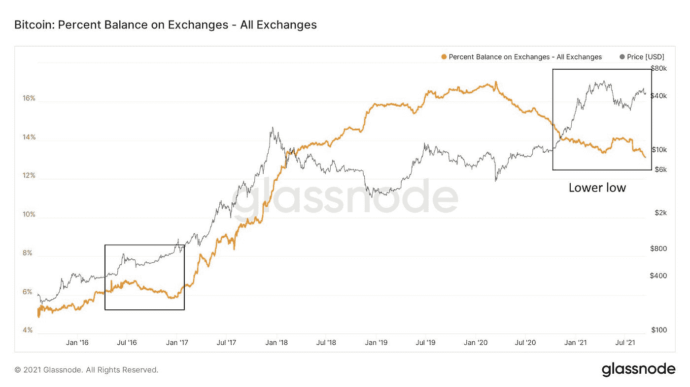
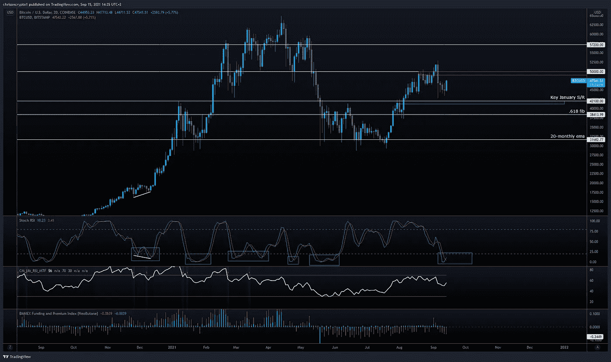

# 方舟投资公司首席执行官凯西·伍德预测比特币价值 50 万美元

> 原文：<https://medium.com/coinmonks/ark-invest-chief-executive-cathie-wood-predicts-500-000-bitcoin-dda78e0e15a7?source=collection_archive---------12----------------------->

Ark Invest 首席执行长凯西伍德(Cathie Wood)预计，比特币将在五年内达到 50 万美元。这个数字已经在其他地方提到过，但是时间线可能低估了指数时代的现状。与此同时，比特币似乎已经找到了底部，并再次敲响了 5 万美元的大门。问题是:这种抵抗能持续多久？

咱们挖吧。

## 凯西·伍德预测比特币将在 5 年内达到 50 万美元

Ark Invest 首席执行官 Cathie Wood 预计,[比特币](https://chrisoncrypto.com/blog/f/bitcoin-attracted-59-million-worth-of-inflows-last-week)将在五年内达到 50 万美元。该公司在以太坊的信念也加强了，在周一的 SALT 会议上接受美国消费者新闻与商业频道采访时评论道。

**查看完整的** [文章点击这里](https://chrisoncrypto.com/blog/f/cathie-wood-predicts-bitcoin-will-hit-500000-in-5-years) **！**

# 技术上来说

## 比特币的优势显现

比特币在价格和用户行为方面都显示出强劲的迹象。如果历史是一个指南，当前的市场结构可能会滚雪球式地进入另一个宏观上升趋势。

事实上，Glassnode 的环比数据与之前的牛市周期有着惊人的相似之处，这支持了今年最后一个季度宏观经济继续发展的观点，并可能延续到 2022 年。

事实上，交易所的比特币余额本周刚刚创下新低，表明霍德林行为不仅强劲，而且还在上升。当硬币被移出交易所时，这是比特币所有者不愿以当前价格出售的迹象。因此，硬币被从交易所转移到冷库，流动性枯竭，不可避免地导致比特币流动性危机。

没有足够的比特币来流通。

## 分歧在上演

从技术角度来看，4 小时 RSI [背离](https://www.tradingview.com/x/qF3CJ7Y8/)一直持续到开球，导致从周一的低点上涨了 8%。

尽管如此，尽管比特币的交易价格为 47，600 美元，但它正在迅速接近卖家可能介入的下一个阻力集群。如果之前的支撑变成了阻力，那么 48，000 美元到 50，000 美元可能会提供相当大的抛售压力，可能会在第一次尝试时将比特币击倒。

正如在 Twitter 上所提到的，假设牛市还在继续，我期待的两种情况要么是“W 形态”，要么是直接突破 57，000 美元。

值得注意的是,“W 形态”会给多头另一个机会去买一个支撑的测试——尽管这是不确定的，特别是因为期货融资利率在中等(4 小时)和高时间框架上都处于负值区域。

尽管如此，在这种情况下，使用随机 RSI 更仔细地观察以前的高时间框架行为是值得的。该指标是通过将随机振荡器公式应用于一组 RSI 值而不是标准价格数据来计算的。换句话说，Stoch RSI 是 RSI 的衍生物，用于更精确地预测动量循环。

在另一次抛售的情况下，Stoch RSI 背离可能在 2 天的时间框架内发展，就像在 BTC/美元攀升 240%至 64，000 美元之前的 2020 年 12 月一样。12 月，价格回落，形成更高的高点，同时 Stoch RSI 向下发散。尽管卖方活动更加激进，但多头承受了压力，开始了抛物线运行。

如果根据其历史意义来看待当前的链上数据，那么比特币可能会表现得非常好——远远超过常见的 10 万美元预测。毕竟，交易所里的硬币正在减少，在这些价格下，只剩下这么多比特币可挖。

时间会证明一切。

回头见。

**加入** [电报](https://t.me/chrisoncryptochannel) **频道，实时更新&设置！
关注我** [推特](https://twitter.com/ChrisOnCrypto1) **&** [多嘴多舌](https://gab.com/chrisoncrypto) **下面还有我的社交门户。**

# 阅读更多内容:[美国 10 月份将出现国债违约](https://chrisoncrypto.com/blog/f/yellen-the-us-is-on-track-to-default-on-national-debt-in-october)

你也可以用比特币支持我！
**BTC** 地址:**3 eydseypjhn 68 axkncuqbb 7 ebqcxrejamr**

最诚挚的问候，
**克里斯托弗·阿塔尔德**
克里斯对加密的创始人
贡献者[www.cityam.com](https://www.cityam.com)
直接接通:[电报](https://t.me/chrisoncrypto)

*最初发布于*[*https://mailchi . MP*](https://mailchi.mp/9205dce970a0/ark-invest-chief-executive-cathie-wood-predicts-500000-bitcoin?e=[UNIQID])*。*