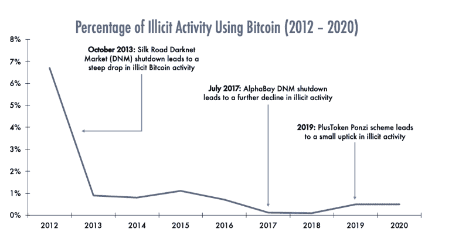
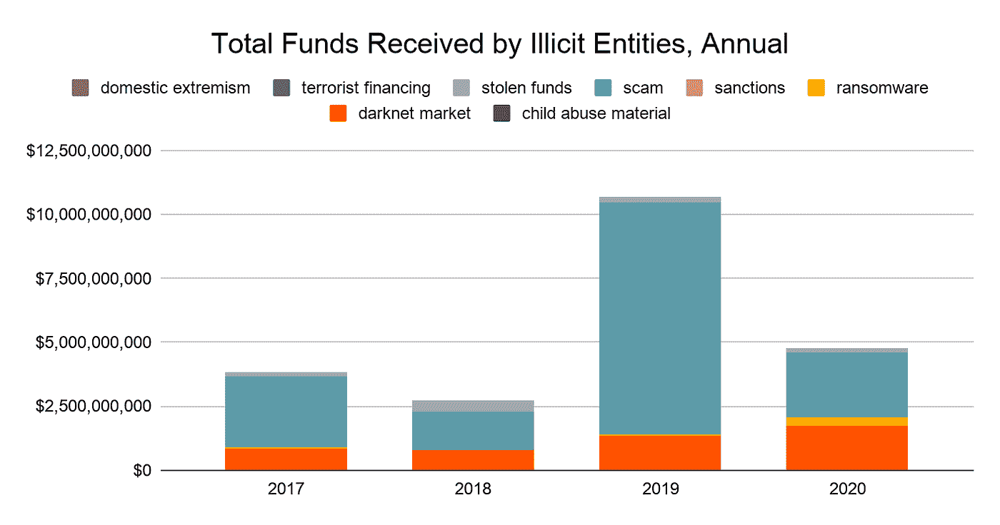
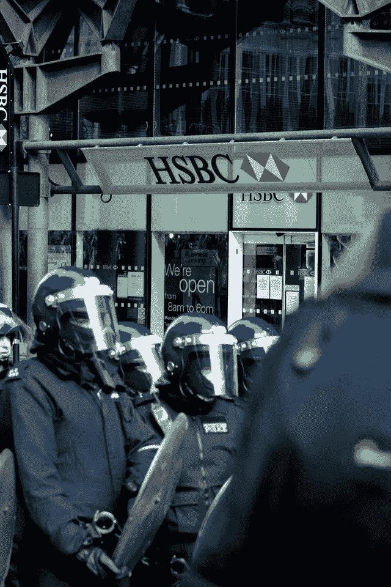

# 武器、毒品和比特币:有多少非法活动得到了资助？

> 原文：<https://medium.com/coinmonks/arms-drugs-and-bitcoin-how-much-illegal-activity-is-financed-637202b25b87?source=collection_archive---------3----------------------->

## 事实，全部事实，只有事实。

unsplash

## 摘要

关于加密货币的一个最常见但不正确的误解是，它主要被犯罪分子用于非法目的。我们已经从财政部长、《纽约时报》、欧洲中央银行行长以及像伯克希尔·哈撒韦公司的查理·芒格这样的大公司领导人那里听到了类似的故事。我们将通过事实和数据来发现这其中有多少是准确的。

## 比特币& Crypto 主要用于非法活动？

是的，人们普遍认为比特币市场受到非法活动的困扰，许多人引用了许多高调的事件作为证据。其中一个事件发生在 2013 年，当时非法的丝绸之路暗网市场(DNM)被关闭，联邦调查局收回了超过 26000 个比特币。对于那些不熟悉的人来说，丝绸之路是一个在线黑市，有 10，000 种产品出售，其中 70%是毒品。然而，基于真实证据，关于比特币在犯罪融资中的作用的笼统概括被大大夸大了。

Sources: Chainanalysis 2018 Crypto Crime Report; ChipherTrace Cryptocurrency and Anti-Money Laundering Report, February 2021

根据区块链分析公司 Chainalysis 最近的一项研究，从 2017 年到 2020 年，所有加密货币的非法活动占加密货币总活动的比例不到 1%。具体到比特币，区块链分析公司 CipherTrace 估计，非法活动占总交易量的比例不到 0.5%。

此外，诈骗占了加密货币相关犯罪的绝大多数，而不是洗钱、恐怖主义、贩运或其他非法活动。

Source: www.cnbc.com

分析公司 Chainalysis 的上图显示了从 2017 年到 2020 年，哪些犯罪类型收到了最多的加密货币。此外，Chainalysis 发现，随着加密货币市场的崛起，与加密货币相关的犯罪正在减少，并且仍然只是整个加密货币经济的一小部分。

## 加密和比特币与当前的金融体系

因为一切都被记录下来，而且是伪匿名的，所以区块链并不是进行大规模严重犯罪活动(如资助恐怖分子或非法武器交易)的最佳地点。前中央情报局局长迈克尔·莫雷尔是该组织的一名 33 岁的老兵，他就此事进行了一项独立研究，支持这一说法，他说:

> “记录比特币交易的区块链账本是一个未被充分利用的取证工具，可以被执法部门和情报部门更广泛地用于识别和破坏非法活动。简而言之，区块链分析是一种非常有效的打击犯罪和收集情报的工具。”

现实是，如果加密对手要“跟踪金钱”，他们将面临一个令人不安的事实:勒索、武器交易和恐怖分子融资等重大非法活动都是通过传统金融系统进行的。

在 2020 年 9 月发布的一份报告中，联合国表示，每年通过全球金融系统清洗的现金超过 1.6 万亿美元，占全球 GDP 的 2.7%，2 万亿美元的交易揭示了一些世界上最大的银行是如何允许犯罪分子在世界各地转移脏钱的。

Source: Wikimedia.commons.org — bayerberg

突出的例子包括，西太平洋银行同意支付 9.2 亿美元的罚款，这是澳大利亚公司历史上最大的一笔罚款，以解决一起揭露超过 2300 万起违反该国恐怖主义融资规则的诉讼；或者汇丰支付 19 亿美元，并在被发现违反美国制裁并承认其账户被用于为犯罪网络洗钱后，与美国司法部签署了延期起诉协议，其中包括为墨西哥贩毒集团洗钱 8.81 亿美元。

## 加密货币让金融犯罪执法变得更容易

根据美国司法部《联邦法律与实践杂志》第 67 卷，2019 年 9 月发表在“追踪加密货币”上:

> 尽管加密货币据称赋予了犯罪分子匿名性，但它为执法部门提供了一个特殊的追踪工具:区块链。虽然区块链的历史账本不会列出交易各方的名称，但它为调查人员提供了关于加密货币转移方式、时间和数量的充足信息。此外，这一信息是公开的；不需要传票或授权令就可以获得。”

由于记录在区块链中的数据不可追溯更改，它为执法部门提供了比现金交易更加准确的即时信息，如交易的日期、时间和金额，以及所使用的加密货币类型、涉及的钱包地址和唯一的交易标识符。与货币交易相比，这类信息可能需要几个月甚至几年才能获得，因此需要传票和法院命令。

## Mehmet Akti 案件

实际上，执法部门已经从与私人分析机构合作监测区块链交易中获益，从而识别出参与犯罪融资的人。一个著名的例子是 Mehmet Akti，他被法律当局认定与恐怖主义资助计划有关联。

这份摘要来自美国哥伦比亚特区地方法院，涉及 Mehmet Akti 一案:

> 一旦哈马斯的账户和地址通过筹款活动聚集了 BTC，执法部门通过区块链分析确定，这些账户通常会将虚拟货币转换成传统的法定货币，或将其兑换成有价值的东西，如礼品卡，以便卡萨姆旅可以将资金用于其恐怖活动。通过区块链分析，执法部门还追踪到至少有一笔交易是从哈马斯 2 号账户转入 Akti 在 VC A 的账户(“VC 1 号账户”)。

由于区块链技术，美国已经能够迅速没收数百万美元用于资助恐怖组织的比特币。这个例子，加上最近的 Colonial Pipeline 勒索软件事件(司法部宣布已从赎金支付中追回 63.7 个比特币(约 230 万美元)，以及其他许多例子，表明加密不是犯罪活动或非法金融交易的天堂，而是广泛安全、可追踪交易的媒介。

最终，数据和事实必须优先于情绪和头条。无论你对加密货币、比特币或区块链的感觉如何，说得委婉一点，声称它充斥着非法活动并帮助犯罪分子和恐怖分子实现其邪恶目标是无知的。

*免责声明:本文包含的信息仅用于教育目的，并不构成 Wheatstones 的任何形式的建议或推荐，用户在做出(或避免做出)任何投资决定时也不打算依赖这些信息。*

> 加入 Coinmonks [电报频道](https://t.me/coincodecap)和 [Youtube 频道](https://www.youtube.com/c/coinmonks/videos)了解加密交易和投资

## 也阅读

 [## 杠杆代币[多头代币]终极指南

### 杠杆化令牌是具有杠杆化风险敞口的 ERC20 令牌，不考虑保证金、要求、管理…

medium.com](/coinmonks/leveraged-token-3f5257808b22)  [## 最佳加密交易所| 2021 年十大加密货币交易所

### 加密货币交易所的加密交易需要了解市场，这可以帮助你获得利润。之前…

blog.coincodecap.com](https://blog.coincodecap.com/crypto-exchange)  [## 2021 年最佳加密借贷平台| 6 大比特币借贷平台

### 获得比特币和其他加密货币的最佳贷款利率

medium.com](/coinmonks/top-5-crypto-lending-platforms-in-2020-that-you-need-to-know-a1b675cec3fa)  [## 2021 年最佳免费加密交易机器人

### 2021 年币安、比特币基地、库币和其他密码交易所的最佳密码交易机器人。四进制，位间隙…

medium.com](/coinmonks/crypto-trading-bot-c2ffce8acb2a)  [## 最佳 4 个加密交易信号电报通道

### 这是乏味的找到正确的加密交易信号提供商。因此，在本文中，我们将讨论最好的…

medium.com](/coinmonks/best-crypto-signals-telegram-5785cdbc4b2b)