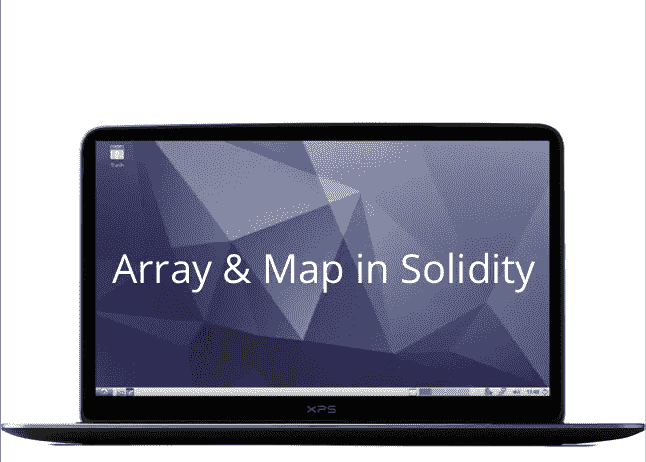

# 实体中的数组和映射

> 原文：<https://medium.com/coinmonks/array-and-map-in-solidity-a579b311d74b?source=collection_archive---------0----------------------->



> 数组允许我们表示一个数据集合，但是更有用的是将数组看作一个相同类型的变量的集合，这些变量的键具有基于它们被添加的顺序的顺序。

不是声明单独的变量，比如数字 1，数字 2，数字 3，…..，和 number99，你可以声明一个数组变量如 *numbers* 并用 numbers[0]，numbers[1]，…，numbers[99]来表示单个变量。

理解了数组在 JAVASCRIPT 和 PHP 中的工作原理后，我打算在 solidity 中快速浏览一遍，但令我最惊讶的是，在 solidity 区块链世界中，情况完全不同:)。我决定写一下*数组*和*贴图*，因为它们看起来都很相似，可以一起使用。

与 javascript 不同，在 JavaScript 中，我们可以有一个整数数组以及字符串或任何其他数据类型，我们的数组必须有相同数据类型的变量，这可以在如下声明它时强制执行:

```
uint[] myArray; //declaring an array of integer variables
```

在我全面深入 solidity 中的数组之前，我想澄清 solidity 中有两种类型的数组，它们是*存储数组*和*内存数组。*

> 想在 Coinmonks 上发表文章，请点击这里。

## **存储阵列**:

这些是在执行函数后存储在区块链中的数组，你可以像普通变量一样声明它们，而不需要像下面这样的契约:

其中*单元/布尔/地址*是变量类型，后面是 *[]* ，然后是数组的名称，可以是任意名称。

**存储阵列的操作:**

要向数组中添加新元素，我们需要引用数组并使用。push(value)，我们也可以通过引用像`myArray[0] = ‘new value’;`这样的元素键来更新数组位置，我们也可以通过简单地使用`myArray[0]`来获得特定的数组元素位置，其中`0`是数组元素的索引或键

我们还可以使用 for 循环来访问数组的元素，就像在 javascript 中访问数组一样(也在上面的代码片段中)。要删除数组中的一个元素，我们将使用`delete myArray[1]`，其中 1 是数组键，请注意，这不会影响数组长度，只会将数组中第一个或第二个元素的索引处的数组值重置为数据类型的默认值。即如果是 uint 类型则为 0，如果是 bool 类型则为 false。当我们试图访问一个不存在的数组键时，我们会遇到一个错误。

## 内存阵列:

调用函数后，这些数组不会存储到区块链中，您只能在如下所示的函数中声明它们:

其中`unit[]`是变量的类型，`memory`关键字声明它有一个内存数组，后跟一个可接受的名字，它必须等同于`new unit[](10)`类型，其中`unit[]`必须再次是变量类型，数组中的元素数在括号`()`中。

**存储器阵列的操作:**

为了增加内存数组的值，我们不能使用`.push()`方法，因为我们需要使用索引符号，比如`newArray[0] = 1`、`newArray[1] = 1`等。我们可以从内存阵列中读取值、更新值、删除值，就像存储阵列一样。

**将数组作为函数参数传递:**

我们可以在 solidity 中传递一个数组作为函数参数，函数的可视性决定了数组名前的关键字应该是`calldata`还是`memory`。如果函数可见性是`external`，我们使用`calldata`，如果函数可见性是公共和内部的，我们使用`memory`。请参见下面的示例:

似乎我们已经在一个数组中涵盖了我们需要做的所有事情，那么`mapping`怎么样？

> Map 类似于一个数组，其中包含一些相似的变量，使用键查找，这意味着您引用的是一个对象的值，而不是一个整数。

基本上，映射相当于其他编程语言中的字典或地图。这是从关键到价值的存储。标准数组是一个索引查找表，例如，如果数组中有 10 个元素，则索引为 0-9，它看起来像下面的整数数组:

```
[0] 555
[1] 123
...
[8] 22
[9] 5
```

`map`的工作方式略有不同，最简单的描述方式是它使用键查找。因此，如果这是一个地址到整数的映射，那么它看起来会像这样:

```
[0x000000000000000A] 555
[0x0000000000000004] 123
....
[0x0000000000000006] 22
[0x0000000000000003] 6
```

所以基本上，你引用的是一个对象的值，而不是一个整数。这些键也不必按顺序排列。它由两个主要部分组成:一个`_KeyType`和一个`_ValueType`；它们以下面的语法出现:

`mapping (_KeyType => _ValueType) mapName`。

把`_KeyType`想象成你将通过一个函数返回所需值的键，或`_ValueType`。默认情况下，一个映射最初是空的，所以一个新的`_KeyType`首先需要被映射到一个`_ValueType`。

可能是

```
mapping(string => string) mapName;
```

或者

```
mapping(int => bool) mapName;
```

**地图操作:**

我们可以在如下函数中操作地图:

我们在这里给地图`balances[msg.sender] = 100`赋值，把它等同于一个值。我们也通过`balances[msg.sender]`读取该值，而不分配任何值。当我们使用一个不存在的键从 map 中读取一个值时，它将返回默认的数据值，用于在声明值类型时初始化值类型，这与 javascript 中的`undefined`不同。

**分配一个数组作为贴图值:**

我们可以将一个数组作为值类型分配给一个映射，并且可以像访问下面这样的数组一样访问它们:

**指定另一个地图作为地图值:**

我们还可以将另一个地图指定为地图值，并像访问地图一样访问它们，如下所示:

我们也可以将一个 Struct 赋值为 map 值类型，有时当您想要迭代一个 map 并在 map 上做其他事情时，我建议您在需要时查看下面的参考资料:

[](https://ethereum.stackexchange.com/questions/12145/how-to-loop-through-mapping-in-solidity) [## 如何在 solidity 中循环通过贴图？

### 感谢为以太坊栈交换贡献一个答案！请务必回答问题。提供详细信息…

ethereum.stackexchange.com](https://ethereum.stackexchange.com/questions/12145/how-to-loop-through-mapping-in-solidity) [](https://stackoverflow.com/questions/48898355/soldity-iterate-through-address-mapping) [## Soldity:遍历地址映射

### 如果你想要更一般的东西，你可以使用一个库。我在下面附上了我正在使用的一个。它可能会使用…

stackoverflow.com](https://stackoverflow.com/questions/48898355/soldity-iterate-through-address-mapping) [](https://stackoverflow.com/questions/46466792/how-mapping-works-in-solidity-and-is-mapping-analogous-to-another-concept-in-ot) [## 映射是如何在实体中工作的，映射是否类似于其他流行的…

### 感谢贡献一个堆栈溢出的答案！请务必回答问题。提供详细信息并分享…

stackoverflow.com](https://stackoverflow.com/questions/46466792/how-mapping-works-in-solidity-and-is-mapping-analogous-to-another-concept-in-ot) 

如果你走到这一步，你是可爱的，谢谢你的阅读。

> 加入 Coinmonks [电报频道](https://t.me/coincodecap)和 [Youtube 频道](https://www.youtube.com/c/coinmonks/videos)获取每日[加密新闻](http://coincodecap.com/)

## 另外，阅读

*   [复制交易](/coinmonks/top-10-crypto-copy-trading-platforms-for-beginners-d0c37c7d698c) | [加密税务软件](/coinmonks/crypto-tax-software-ed4b4810e338)
*   [电网交易](https://coincodecap.com/grid-trading) | [加密硬件钱包](/coinmonks/the-best-cryptocurrency-hardware-wallets-of-2020-e28b1c124069)
*   [最佳加密交易所](/coinmonks/crypto-exchange-dd2f9d6f3769) | [印度最佳加密交易所](/coinmonks/bitcoin-exchange-in-india-7f1fe79715c9)
*   [面向开发人员的最佳加密 API](/coinmonks/best-crypto-apis-for-developers-5efe3a597a9f)
*   [密码电报信号](http://Top 4 Telegram Channels for Crypto Traders) | [密码交易机器人](/coinmonks/crypto-trading-bot-c2ffce8acb2a)
*   最佳[密码借贷平台](/coinmonks/top-5-crypto-lending-platforms-in-2020-that-you-need-to-know-a1b675cec3fa)
*   杠杆代币的终极指南
*   [加密交易的最佳 VPN](https://coincodecap.com/best-vpns-for-crypto-trading)
*   [火币的加密交易信号](https://coincodecap.com/huobi-crypto-trading-signals) | [HitBTC 审查](/coinmonks/hitbtc-review-c5143c5d53c2)
*   [TraderWagon 回顾](https://coincodecap.com/traderwagon-review) | [北海巨妖 vs 双子座 vs BitYard](https://coincodecap.com/kraken-vs-gemini-vs-bityard)
*   [如何在 FTX 交易所交易期货](https://coincodecap.com/ftx-futures-trading)
*   [OKEx vs KuCoin](https://coincodecap.com/okex-kucoin) | [摄氏替代品](https://coincodecap.com/celsius-alternatives) | [如何购买 VeChain](https://coincodecap.com/buy-vechain)
*   [3 commas vs . Pionex vs . crypto hopper](https://coincodecap.com/3commas-vs-pionex-vs-cryptohopper)
*   [如何使用 Cornix 交易机器人](https://coincodecap.com/cornix-trading-bot)
*   [Bitget 回顾](https://coincodecap.com/bitget-review) | [双子座 vs BlockFi](https://coincodecap.com/gemini-vs-blockfi) cmd| [OKEx 期货交易](https://coincodecap.com/okex-futures-trading)
*   [用信用卡购买密码的 10 个最佳地点](https://coincodecap.com/buy-crypto-with-credit-card)