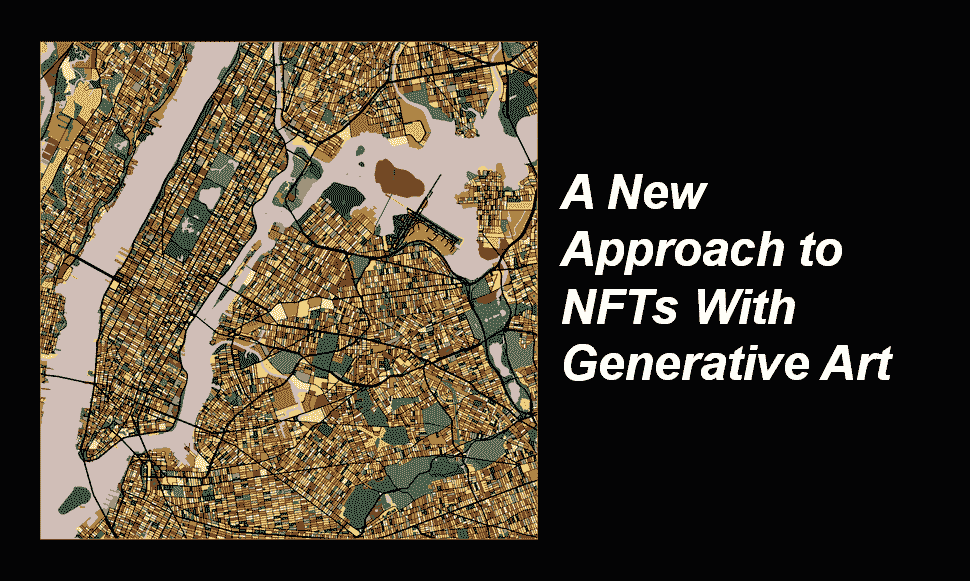

# 崛起的艺术形式:用生成艺术探索非功能翻译的新途径

> 原文：<https://medium.com/coinmonks/art-form-on-the-rise-a-new-approach-to-nfts-with-generative-art-75eb08be5015?source=collection_archive---------7----------------------->

不可替代代币(NFT)在 2021 年前几个月进入公众视野。佳士得和苏富比等艺术品拍卖行能够为数字艺术家 Beeple、幼虫实验室团队以及其他许多人的作品拍出高价。

那么，为什么收藏家会为一张 JPEG 图片支付 6900 万美元以上的价格呢？

好吧，当你买 NFT 的时候，你不只是在买 JPEG，你是在买代币。不管您在加密方面的经验如何，您都会熟悉稀缺资产和资源往往具有价值的想法。可证明的稀缺性、不变性和可编程性只是 NFT 产生价值的几个方面。

从艺术家的角度来看，NFT 为一个新的数字黄金时代提供了潜力。例如，艺术家可以以 NFT 的身份出售他们的艺术，不再需要依赖画廊或拍卖行来出售他们的艺术。相反，艺术家可以以 NFT 的身份直接出售给消费者，这也让他们获得更多的利润。

此外，艺术家可以在版税上编程，这样每当他们的作品卖给新主人时，他们就会收到一定比例的销售额。这是一个有吸引力的特征，因为艺术家通常在他们的作品首次售出后不会收到未来的收益。

## 展示生殖艺术之间的密切关系:

CryptoKitties 于 2017 年发布，是 NFT 的最早实验之一，不仅仅是数字交易卡。它们是使卡通形象随机化的代码的输出，也是未来小猫的潜在输入。

CryptoKitties 的创始人想要证明以太币市场的可行性。为此，他们用可爱的视觉效果和游戏性吸引人们。但另一个或许是不经意的结果是，展示了生成艺术——即融合了计算机自动化系统的艺术品——与区块链之间的密切关系。

今天，艺术家们将[的想法和方法](https://www.artnews.com/list/art-in-america/features/generative-art-and-nfts-1234586572/itzel-yard-afro-netrunner/)从创造性编码的悠久传统中带到了 NFTs 领域，这看起来非常合适。

虽然画廊可能会担心如何出售生成性作品——如软件、印刷品或其他东西——但 NFTs 的词汇提供了一个简单的解决方案:收藏家不购买系统，而是购买一个代表它的令牌。

## **什么是生成艺术？**

自 20 世纪 60 年代以来，生成艺术就已经存在[，但是新的在线生成艺术平台正在将媒体推向一个令人兴奋的新方向。](https://tylerxhobbs.com/essays/2021/the-rise-of-long-form-generative-art)

生成艺术是通过创造性编码发展起来的。本质上，作品的元素是由艺术家创造的，它们的代码允许它们产生完全独特的特征。铸造后，每个收藏家都会根据艺术家的创作代码获得他们所选项目的唯一版本。

虽然有些人对这些独特的项目进行了疯狂的投资，但其他人仍然无法理解它们的真正价值。

> 8 月 24 日，一位名叫泰勒·霍布斯(Tyler Hobbs)的艺术家的名为“Fidenza #313”的艺术品以[*1000 ETH*](https://www.indiatimes.com/technology/news/nft-artwork-by-tyler-hobbs-547891.html)*的价格售出，约合 330 万美元。这幅画最初的定价约为 0.17 埃特，6 月 11 日，所有者很快以 0.58 埃特(约合 1400 美元)的价格出售了这幅画。*

## **奥拓城是对这种“数字艺术形式”的押注:**

奥拓城是以太坊区块链上 [15 900 个生成艺术 NFT](https://altocity.io/gallery)的集合。每一个 NFT 都以艺术的形式代表了世界上一个城市的地图。这个项目的艺术部分花了整整两年多一点的时间。

这是第一个 NFT 项目，附带一套将向 NFT 所有者出售并支付版税的实物产品。

*这一独特的概念围绕着这样一个理念，即 NFT 收藏家可以感受到与品牌更深层次的联系，这将转化为更高的客户忠诚度。*

收藏家 NFT 的将用于生产终端产品，如销售给客户的手机外壳。假设您将法国凡尔赛铸造成红宝石色，并且该物品自创建以来已经在前端获得了 200 欧元的版税，您将在下一批付款中(月底)收到这些版税。
每个月底，基金会将根据所有权日期和相关前端产品订单向 NFT 所有者的 ETH 钱包支付版税。

> 加入 [Coinmonks 电报频道](https://t.me/coincodecap)，了解加密交易和投资

## 另外，阅读

*   [电网交易机器人](https://blog.coincodecap.com/grid-trading) | [Cryptohopper 审查](/coinmonks/cryptohopper-review-a388ff5bae88) | [Bexplus 审查](https://blog.coincodecap.com/bexplus-review)
*   [加密复制交易平台](/coinmonks/top-10-crypto-copy-trading-platforms-for-beginners-d0c37c7d698c) | [如何在 WazirX 上购买比特币](/coinmonks/buy-bitcoin-on-wazirx-2d12b7989af1)
*   [CoinLoan 点评](https://blog.coincodecap.com/coinloan-review)|【Crypto.com】点评 | [火币保证金交易](/coinmonks/huobi-margin-trading-b3b06cdc1519)
*   [Bookmap 评论](https://blog.coincodecap.com/bookmap-review-2021-best-trading-software) | [美国 5 大最佳加密交易所](https://blog.coincodecap.com/crypto-exchange-usa)
*   [如何在 FTX 交易所交易期货](https://blog.coincodecap.com/ftx-futures-trading) | [OKEx vs 币安](https://blog.coincodecap.com/okex-vs-binance)
*   [OKEx vs KuCoin](https://blog.coincodecap.com/okex-kucoin) | [摄氏替代品](https://blog.coincodecap.com/celsius-alternatives) | [如何购买 VeChain](https://blog.coincodecap.com/buy-vechain)
*   [加密货币储蓄账户](/coinmonks/cryptocurrency-savings-accounts-be3bc0feffbf) | [YoBit 审查](/coinmonks/yobit-review-175464162c62) | [Bitbns 审查](/coinmonks/bitbns-review-38256a07e161)
*   [Botsfolio vs nap bots vs Mudrex](/coinmonks/botsfolio-vs-napbots-vs-mudrex-c81344970c02)|[gate . io 交流回顾](/coinmonks/gate-io-exchange-review-61bf87b7078f)
*   [CoinFLEX 评论](https://blog.coincodecap.com/coinflex-review) | [AEX 交易所评论](https://blog.coincodecap.com/aex-exchange-review) | [UPbit 评论](https://blog.coincodecap.com/upbit-review)
*   [AscendEx 保证金交易](https://blog.coincodecap.com/ascendex-margin-trading) | [Bitfinex 赌注](https://blog.coincodecap.com/bitfinex-staking) | [bitFlyer 审核](https://blog.coincodecap.com/bitflyer-review)