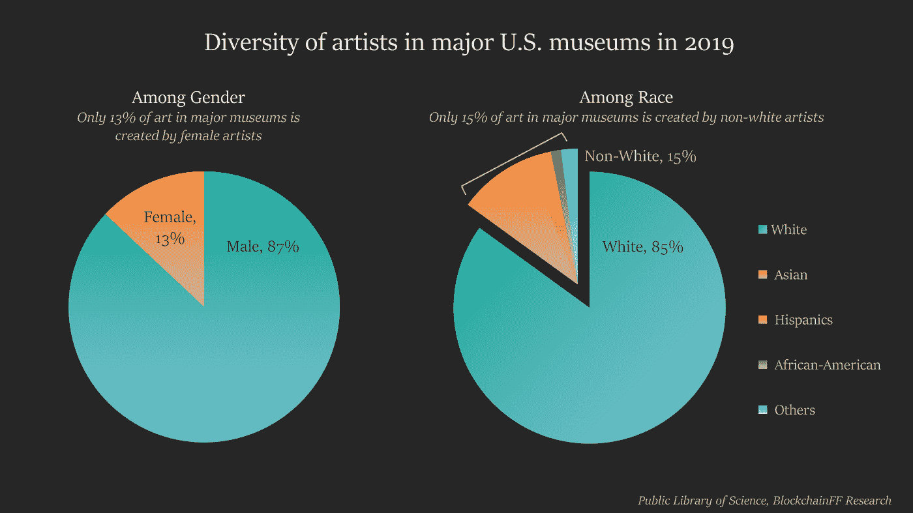

# 数字时代的艺术

> 原文：<https://medium.com/coinmonks/art-in-the-digital-age-e12f62998f94?source=collection_archive---------2----------------------->

在 21 世纪的第二个十年，我们见证了艺术领域的几个新趋势，这是一个人类努力的领域，在内容上是进步的，但在制度上是保守的。尽管艺术家倾向于探索和打破不同表现形式的内容和使用新工具的界限，但艺术机构在将数字媒体纳入其展览计划以及多样性和包容性计划方面仍然落后。数字艺术基金会最初是由 Harold Cohen 在 20 世纪 80 年代发起的，当时他使用绘画程序来制作艺术品。从那以后，这门艺术受到了强大的技术影响。这种新的艺术形式为新技术提供了各种新的趋势和联系。

如下图所示，一项[研究](https://www.ncbi.nlm.nih.gov/pmc/articles/PMC6426178/)显示，就在 2019 年，美国所有主要博物馆的藏品中，85%归属于白人艺术家，87%由男性创作。非裔美国艺术家的比例最低，仅为 1.2%，而亚裔艺术家占 9%，西班牙裔艺术家占艺术家总数的 2.8%。显然，艺术界需要发展。

当它赶上来的时候，这里有一些最令人兴奋的艺术趋势:

**区块链**

得益于区块链技术，艺术等数字内容可以成为一种独特的资产，这意味着人们现在可以拥有自己的数字内容。数字艺术可以被独特地买卖和收藏。艺术家受益于[与消费者更直接的关系](https://techcrunch.com/2016/10/08/how-blockchain-can-change-the-music-industry/)，使得像金融经纪人这样的中间人——他们通常会拿走很大一块蛋糕——变得多余。除了直接(小额)支付到他们的数字钱包，区块链还让艺术家们从他们作品的有保证的归属和认证中获利。代币附带的[智能合约](https://blog.coincodecap.com/tag/smart-contact/)可以确保艺人在二级市场获得版税。

物理艺术品也可以[令牌化](/@theog__/how-to-blockchain-physical-artwork-4162ecf7f061)和“区块链化”。然而，必须考虑几个因素:验证器的使用，发布艺术品的平台的使用，公开声明某个代币属于特定艺术品，以及开放一角硬币(可以保存[比特币](https://blog.coincodecap.com/a-candid-explanation-of-bitcoin/)或基于比特币的代币的设备，如果不准确地移除，会破坏艺术品)的使用，以保护艺术品免受代币欺诈。关于令牌化的物理艺术品的最大问题是在分散的交易所买卖的伪造/欺诈令牌的产生。上述措施可以帮助这种情况发生。

这意味着区块链正在引入一种新的激励模式，让艺术家和利益相关者从长期成功中受益。[区块链](https://blog.coincodecap.com/what-is-bitcoin-and-how-it-works/)也被用于为现有的数字和实物艺术品建立认证和出处，这是全球艺术专业人士关注的两个问题，如下图所示:

一旦作品在经认证的区块链平台上注册，只要第一个注册是由值得信赖的实体进行的，该记录就是不可变的、经过认证的和透明的。这个实体可以是艺术家本人，或者在艺术家去世的情况下，它可以是鉴定人、收藏家或艺术家的遗产。

一些公司还提出出售价值数百万美元的艺术品的细分所有权。根据 his Cox 2019 年的一份报告，51%接受调查的 30 岁以下的艺术品买家表示，他们会将艺术品的部分所有权视为一种投资。

我们可以看到拥有一小部分艺术品的投机吸引力，但这对我来说就像在佛罗里达拥有分时度假房产一样令人兴奋。实际上更少，因为至少我可以一年使用一次公寓，而拥有一部分艺术品并不能带来多少审美愉悦。我们不认为利用区块链来延续已经存在的问题有什么意义，比如版权问题和艺术品盗版。对我来说，区块链在艺术领域的真正价值是想象新的经济和组织模式，这种模式将把艺术世界转变为一个更广阔、更具包容性的空间，并帮助艺术家以他们的艺术可持续地生活

例如，智能合同中的[不可替换令牌](https://blog.coincodecap.com/non-fungible-tokens-explained/)可以分层，允许协作作品，其中艺术作品的各种元素(如动画、图像或音乐)可以被令牌化，并且当作品被出售或获得许可时，所有不同的创作者都可以获得他们的版税份额。这些将被登记在分布式分类账中。

Gemini 首席执行官泰勒·文克莱沃斯表示，“不可替代的代币和它们支持的数字商品(和收藏品)将在下一个数字经济时代发挥重要作用，它们是加密收藏品、加密艺术品等的完美形式，为全新的数十亿美元产业的出现奠定了基础。”

## **机器人能创造艺术吗？**

这是一个复杂的问题，但简单的答案是他们已经在做了。生成艺术；也就是以电脑为工具创作的艺术，从 20 世纪 60 年代就有了。今天，通过机器学习，艺术家和创意程序员正在教计算机如何创作艺术，或者至少如何尽可能准确地模仿艺术。

像[罗比·巴拉特](https://www.instagram.com/robbie.exe/)和[大卫·杨](http://www.triplecode.com/)这样的艺术家正在创造生殖艺术，但他们都坚持认为他们使用机器及其神经网络作为工具来策划和创造他们想要的结果。最终，是艺术家创造代码，然后将经过策划的数据输入机器，并策划机器的输出，因此他们对最终的艺术作品负责。由 The appeal collection 创作的埃德蒙·贝拉米的肖像是佳士得拍卖的第一件生成艺术作品，拍得 43.25 万美元。它立即引起了轰动，而且不仅仅是因为价格。明显使用的一些代码是开源的，并从 Barrat 那里借来的，所以这引发了一场关于谁真正拥有这些代码，这些代码是否可以被视为艺术以及 Barrat 是否应该得到收益的一部分的辩论。无许可技术和生殖技术提出了许多有趣的法律问题，如著作权、知识产权、版权等。随着这些领域的发展，标准将会出现。与此同时，即使是大玩家也在追赶:谷歌的[深度梦生成器](https://deepdreamgenerator.com/)让人们通过上传图像和选择机器应用的某些美学参数来玩生成艺术。结果是丰富多彩的，而且在商业艺术方面也是可以预见的。

我们还没有达到机器可以自发地自己创造艺术的阶段。如果我们真的做到了，这将意味着机器可以自己思考和感觉，我们可能已经到达了完全的反乌托邦。但是正如策展人杰森·贝利解释的那样:“是人类的创造力主导了(生殖)作品的创作，而人类的创造力提供了作品的目的和意义”。技术带来的乌托邦和反乌托邦的可能性既让人惊奇又让人担忧，这无疑是艺术家和技术专家思考的成熟话题。

**交替现实**

增强现实和虚拟现实已经被用于训练和游戏目的。谷歌的倾斜画笔允许艺术家在三维虚拟空间中创作艺术。[虚拟现实画廊 Acute Art](https://acuteart.com/about/) 汇集了玛丽娜·阿布拉莫维奇、奥拉维尔·埃利亚松、安尼施·卡普尔等国际知名艺术家，制作并展示虚拟现实(VR)、增强现实(AR)和混合现实艺术，可以通过应用程序观看。 [Khora Contemporary](https://khoracontemporary.com/) 作为知名艺术家和虚拟现实开发者之间的桥梁，为艺术家开发和探索这种新媒体以及在虚拟现实中创作作品提供帮助。

观众参与是 VR 和 AR 的一个明显的用例，艺术形式的局限性与驱动它的技术有关:为了创作艺术，需要笨重而昂贵的 VR 设备，然后为观众二维投影，除非他们都戴着兼容的耳机。与所有技术一样，设备将变得更小，更便宜，我期待更多的艺术家尝试这些工具。

总的来说，有许多令人兴奋的技术进步可以彻底改变我们购买、创作、许可和感知艺术的方式。随着现代技术进一步进入艺术领域，我们一定会看到一些非凡的变化，这些变化可能会重新定义我们对艺术的传统理解。

**参考文献:**

*这是区块链创始人基金* [*管理合伙人 Aly Madhavji 和区块链新闻报道*联合创始人](http://blockchainff.com/)[*dada . art*](http://dada.art/)*Yehudit Mam 的文章转贴*

*另外，参见我们的《区块链技术如何让艺术品购买民主化》* [*文章*](https://www.linkedin.com/pulse/how-blockchain-technology-can-democratize-purchase-art-madhavji-%E7%A9%86%E4%BA%9A%E9%9C%96/)

> [直接在您的收件箱中获得最佳软件交易](https://coincodecap.com/?utm_source=coinmonks)

