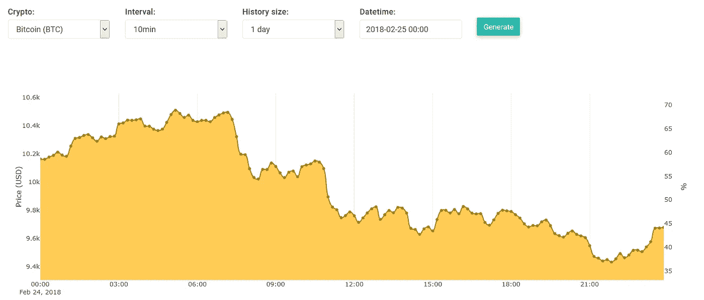
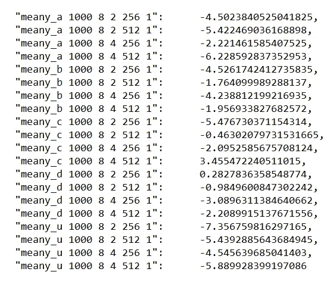
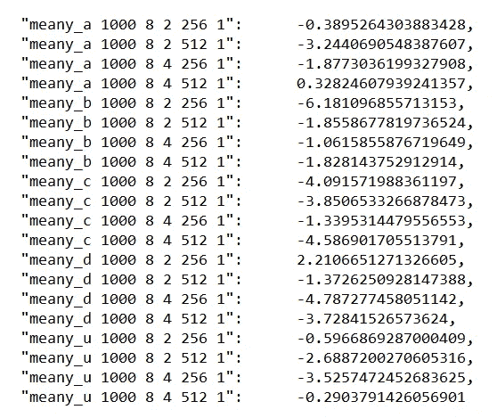
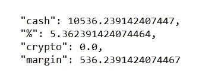
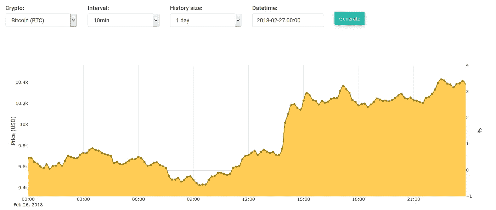
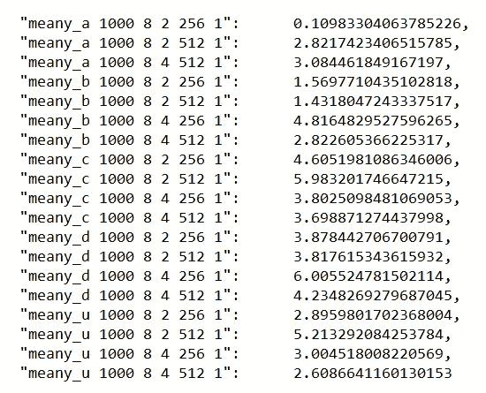
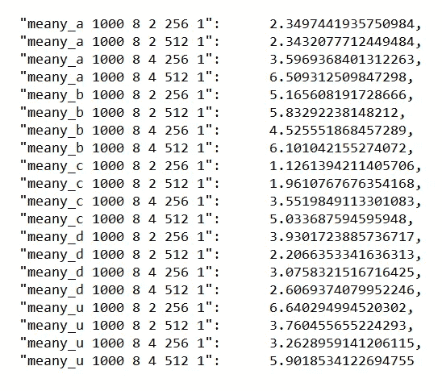
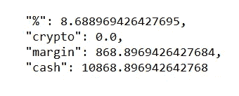

# 研究两种不同的加密货币预测技术

> 原文：<https://medium.com/coinmonks/artificial-intelligence-vs-anomaly-detection-and-reflecting-on-our-progress-9eae2815920a?source=collection_archive---------3----------------------->

今天是阅读和学习人工智能的一天。但我也花了一两个小时清理代码、优化脚本和运行一些回溯测试。在这篇文章中，我想讨论和说明我们到目前为止所取得的成就，以及我们可以用我们所拥有的做些什么。如果您从一开始就关注我们的进展，您可以直接跳到文章的第 2 部分。

# **第 1 部分——概述**

## **收集数据和人工分析**

所以到目前为止，我们一直在收集与加密货币相关的数据。我们收集的数据主要是价格、交易量、社交提及(如推文、提及和帖子)和新闻文章(来自主要新闻渠道)的汇总。在我们的“通用图表”(和 3D 图表)上，您可以查看近 20 种不同加密硬币的数据。在我开始这个项目的前几周，我们专门使用图表来得出结论和回答一些问题，比如为什么比特币的价格会在某段时间内上涨或下跌。我们的想法是在这些图表中找到趋势，指出为什么会发生这样的事件。通过这样做，我们可以通过查看新闻文章和社会提及的当前状态，在很大程度上预测在不久的将来(例如，在接下来的 1 小时内)会发生什么。

> [在您的收件箱中直接获得最佳软件交易](https://coincodecap.com/?utm_source=coinmonks)

由于我们大多数人(包括我)都试图拥有社交生活，我们不应该用手来手动完成这一工作，而是利用系统和算法来做分析和趋势检测部分。这就是“大数据”和“机器学习”的意义所在。

## **从数据到机器学习**

对于那些密切关注我的进展的人来说——在某个时候，我开始构建神经网络模型。神经网络就像人工创造的大脑，可以学习东西。他们学到的东西就是我们提供给他们的东西，所以如果我们给他们数据，教他们 x=2 时 Y=4，x=3 时 Y=6，x=8 时 Y=16，……这样做几百/几千次，那么系统将能够重现我们例子中的函数:Y(x) = 2*x。这意味着给定一些输入数“x”，它将能够预测/计算输出“Y”，在我们的例子中，它只是“x”和 2 的乘积。神经网络并不新鲜，它们已经存在了半个世纪——但由于更便宜的内存和更便宜的处理能力，它们的使用只是在最近几年才变得非常流行。

在我们的案例中，我们使用特殊类型的神经网络来使用我们的数据进行训练。我们训练它来预测加密硬币的价格(例如比特币——BTC)。我已经花了相当多的时间(现在仍然如此)，来计算哪种数据组合能产生最好的结果。另一个挑战是调整神经网络及其学习组件的参数。然而，我真的很着迷于人工智能的世界，就像许多人一样，因为这些系统是“训练有素的”——它们不像普通的软件一样被编程。它们就像人工大脑，可以接受输入并产生有意义的输出——但我们并不总是完全理解黑匣子里发生了什么。然而，它们也非常有限和狭窄，这意味着它们只被训练做特定类型的工作(例如，在非常狭窄的空间内进行预测；或者下棋或者下围棋)。虽然这不是我的研究/项目的一部分，但研究人员现在正在做的是教这样一个系统如何驾驶汽车，就像普通人一样——所以这很容易成为一项非常复杂的任务，但值得追求。

回到我们的项目——自从我第一次开始使用神经网络进行价格预测，已经过去了一个多月。结果确实很好，但不是很好。我已经发了很多关于这个的帖子，包括结果，所以如果你想了解更多(读完这篇帖子)，浏览一下我以前的帖子。

## **检测异常情况**

当我在我最喜欢的交易所交易时，我注意到如果我有一个系统可以在很短的时间内通知我价格快速上涨(或下跌)，那将会非常有用。因为大多数日内交易者喜欢根据他们交易的货币在几分钟(或几小时)内进出交易。但是我们不想整天坐在交易所的窗口前等待这个黄金机会。

通过这样做，交易者可以在单笔(或多笔)交易中获得 0.5%到 3%的投资回报率，一天做几次(如果市场允许的话)，我们可以赚很多钱。长话短说，我只花了几个小时就构建、测试并发布了一个异常检测(AD)系统。在我最近的一篇文章中，我发布了一些非常棒的投资回报率结果。但是知道我拥有的仍然是一个非常基本的系统，让我更加高兴，因为通过调整和改进它，它只会变得更好。

## **手机 App**

在开始我的旅程几周后，我发布了我们网站的测试版。该网站主要是为笔记本/台式机设计的，而不是为移动设备(如平板电脑和智能手机)设计的。但我意识到，如果我有一个可以查阅我的数据并查看预测的应用程序，那就更好了——所以几天后我就完成了。现在它支持超过 70%的安卓设备，如果你想玩它，你可以在谷歌 Play 商店上搜索“CryptoPredicted”。

## **回溯测试**

在我们的上下文中，回溯测试来自交易领域。这是一个系统/方法，我们使用历史数据来运行交易模拟。这些模拟让我们能够评估由一些指标做出的交易决策，如简单移动平均线(SMA)和许多其他指标。在我们的场景中，我们一直在使用我们的预测结果进行模拟，最近还使用了异常检测(AD)系统。因此，如果你想了解回溯测试的结果，请随时重新访问我的一些旧帖子。

# **第二部分——人工智能与人工智能**

回到回溯测试——正如我在介绍中提到的，我今天花了一些时间做了更多的模拟。如果你还记得，过去我曾提到过回溯测试的结果高度依赖于市场的状态。因此，如果市场崩盘，结果很可能是盈亏平衡或负数。而在一个不断增长的市场中，很难不盈利。

如果你读过我以前的回测实验，只使用 ad，那么你会发现我们从中获得了很大的回报(比如 7 天 17%)。而在我们人工智能产生的预测中，结果高度依赖于市场的状态。所以我在想，在一个衰退的市场中，A.D .的系统将如何工作？

因此，在这个例子中，我们将模拟交易，完全基于我们的一个指标。首先，让我们从市场在某个时候开始崩溃/下跌的情况开始。让我们看下图 2 月 25 日(2018 年)；在世界标准时间上午 6:30，BTC 的价格从 10.4 美元跌至 22:00(晚上 10 点)的 9.4 美元多一点:

让我们回测/模拟这一天(24 小时)的交易，看看我们会赚多少/亏多少。

## **人工智能生成的预测**

我用过两种交易策略“FirstPredic”和“MinMax”:

1.  **FirstPredic:** 第一个只使用下一个时间间隔(在我们的例子中是 10 分钟)的第一个预测，并将其与当前/实际价格进行比较。如果价格预测(未来 10 分钟)低于实际价格，我们让它产生一个“卖出信号”，在另一种情况下，如果价格将要上涨，我们应该产生一个“买入信号”。通过这样做，我们将总是低买高卖，从而获得利润。我们能否盈利取决于预测的质量。
2.  **MinMax:** 第二种策略使用所有的预测——我们的系统实际上生成未来的 8 个价格预测(因此 8x10 = 80 分钟前)。然后，我们使用这些来找到这 80 分钟间隔内的最低(最小)预测和最高(最大)预测(这就是为什么我称之为最小最大)。然后，我们对最低点发出“买入”信号，对最高点发出“卖出”信号。同样，如果实际价格与预测值一致，这将产生利润。

下面是**最小最大**的交易(投资回报率%)结果:

总体结果是负面的，系统平均亏损(在-0.5%到 8%之间)。请注意，有多条线，每条线代表一种类型的预测，这是因为我们有多个不同的神经网络生成不同的输出。这使我们能够评估和评分哪个更好。

这是给**第一预测**的:

同样，大多数值是负值，因此系统平均亏损(介于-0.5%和-4%之间)。

## **交流产生的信号**

在我以前的一篇文章中，我讨论了如何使用 A.D .作为交易信号，所以一定要检查一下，因为我不会在这里详细讨论。但基本概念是等待广告系统生成价格“上涨”的通知，然后等到价格稳定下来(当市场达到平台期)。一旦它到达那个点，我们就产生一个“卖出”信号，因为这是一个价格已经达到一个新的局部最高值的点。反过来也是如此，当收到价格正在快速下跌的通知时，我们会等到价格达到一个新的稳定位置，此时价格相当低，这时我们会发出“买入”信号。

最终结果是低买高卖。结果也不言自明。如下图所示，这个系统在一个下跌的市场中取得了 5.36%的投资回报率(那是纯利润)。所以 ad 似乎轻而易举地击败了我们的人工智能系统。

现在让我们来看看市场开始增长的时期。我选择了 2 月 26 日(如下图所示的整个 24 小时范围)，这是一个有趣的范围，因为在最初的 14 小时内没有什么特别的事情发生，但是在下午 2 点左右，价格迅速飙升，并达到一个新的平台。

让我们看看人工智能的预测给了我们什么。最小最大策略为我们带来了这些投资回报率:

总的来说，他们相当积极，平均在 1%到 6%之间——一点也不差。最后是**第一预测**策略:

同样，ROI 在 1%和 6%之间的结果非常相似。

现在，我们不应该对人工智能系统再次击败人工智能系统感到惊讶，回报率为 8%:

## **讨论我们的发现**

这是否意味着 A.I .无关紧要，因为它产生的结果比 A.D .更糟？一点也不。在我看来，我们从人工智能中取得的成就已经非常显著，如果我们继续投资并学习如何优化它，它可能会在人工智能系统中收支平衡。假设人工智能可以表现得甚至比 AD 更好，如果它可以被训练检测和预测峰/谷相当准确。

我也认为我们目前的两种回溯测试策略不是最佳的(MinMax 和 FirstPredic)。可能是人工智能生成的预测试图以某种方式告诉我们一些有意义的事情，但我在解释其输出时使用了错误的系统。

我对人工智能系统以及如何改进它有很多想法，其中一个我非常兴奋并愿意公开分享的想法是，这个系统能够学会交易并做出尽可能最好的决定。这将是一个比仅仅进行价格预测更好的系统。

但在短期内，将我们的注意力转移到数字助理系统上更为现实——因为密码市场波动性很大，任何事情都可能在几秒钟内发生。我们永远无法预测某条鲸鱼是否/何时会使用大量的硬币来推动市场向某个方向发展。因此，实际上我们需要使用 d 来预测这些场景，因为它们是不可预测的。

希望您度过愉快的一天！:)
-伊利亚·内沃林