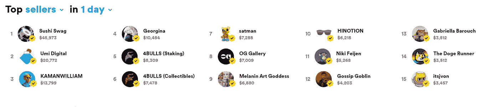
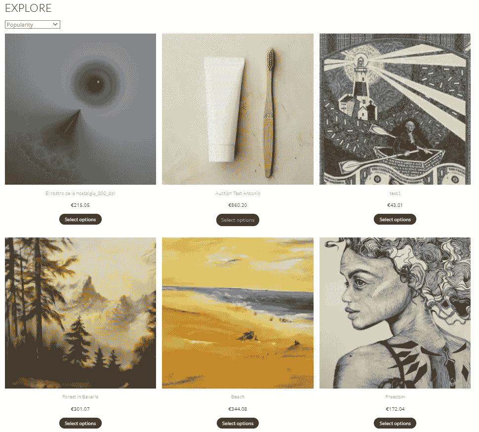
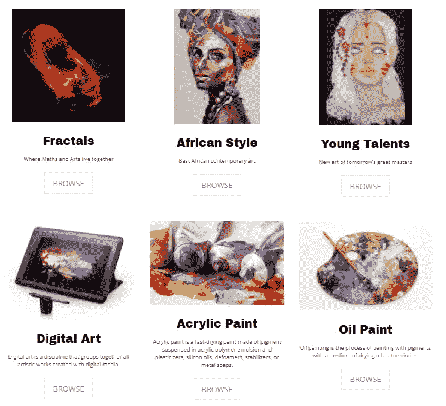
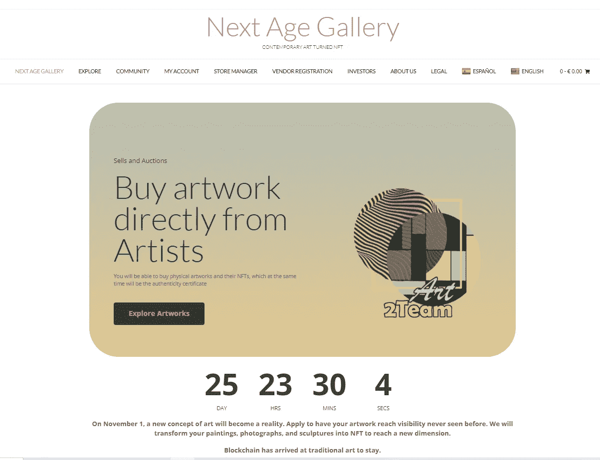
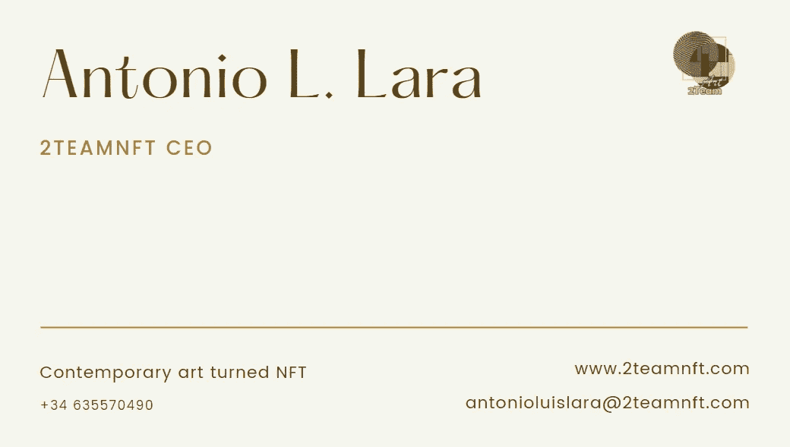

# 艺术家，你在错误的市场出售你的 NFT

> 原文：<https://medium.com/coinmonks/artist-you-are-selling-your-nft-in-the-wrong-marketplace-77985b0719f9?source=collection_archive---------17----------------------->

是的，是真的。一切都与数字有关。我敢肯定，大多数阅读这篇文章的人都在关心为什么他们令人惊叹的艺术作品还没有卖出去。

这篇文章关注的是所有这些感觉自己在同一条船上(OpenSea)的人，因为成千上万的人试图出售一种波普艺术，成为 NFT，或争取每周前 50 名，有资格出售他们的基金会艺术品，或试图出售一件真正的艺术品。

Top sellers in 1 day on Rarible

请不要见怪。每一种艺术/秘密艺术都必须受到尊重，但是，有些艺术类别就像油和水一样。它们不能在同一个市场上混合使用

如果你认为卖 NFT 很难，那你就错了。比艰难更糟糕。你知道证据就在布丁里。我们吃吧。

> 订阅 [**Coinmonks Youtube 频道**](https://www.youtube.com/c/coinmonks/videos) 获取每日加密新闻。

## **让我们做一些数字。**

慷慨地说，我可以说，根据不同的周，只有 20%的新造非功能性测试在 Foundation.app 上出售。

你会发现过去七天(2021 年 10 月 6 日)在不同平台上售出的 NFT 数量如下，其中大部分是在 Opensea 上售出的:

*   艺术块:6.222 卖给 NFT 超过 170 个项目和 123.963 调用。
*   基金会:1.458 在超过 90，000 次拍卖中出售了 NFT(更多的拍卖没有考虑在内)。
*   密码猫:上周有 782 只卖了 NFT。我甚至不想谈论这个。你真的想在一个密码小猫旁边展示你的作品吗？我不会。
*   超级稀有 268 卖了 26.200 多 NFT。

是的，我知道这看起来令人沮丧。但是…怎么了？你会在网上找到很多解释一些技巧的帖子，以获得更多的输入和可视化。所有这些都向你展示了实现目标的简单方法。不幸的是，这并不容易，我告诉你为什么。

大多数市场在同一个网站上混合了不同的、不可调和的风格。拜托，不要把你惊人的孟买黑社会照片和 Cryptokittie 一起卖了。这对你，对你的艺术，对孟买都是可耻的。在没有准确定位目标的情况下进行销售是一个大错误。

你去过很多次画廊和博物馆。我记得我在巴黎的第一天。我试图在一个早上游览整个卢浮宫。有几个月我讨厌艺术。如果你在同一天欣赏 10，000 幅作品，你将无法区分莫奈的作品和我表弟的画。是真的。不要浪费你的时间在那些你必须杀死某人或某事以获得能见度的地方。一个收藏家最多能欣赏 20 件作品。

有些人会告诉你，你需要营销技巧来销售你的作品，我会问:为什么？不是每个人都像萨瓦尔多·达利或安迪沃霍尔。他们既是优秀的艺术家，也是优秀的公关人员。但他们是天才。我认为艺术家必须只考虑他想要传达的感情。让我们为专家营销。

## 有专门的替代品。

所以，在这一点上，我想给你们展示一个新的项目，这个项目聚焦于那些不做公关却想出售他们作品的了不起的艺术家。

请参观 www.NextAgeGallery.com 的[。由 www.2TeamNFT.com](http://www.NextAgeGallery.com.)[开发的基于以太坊和的新项目](http://www.2TeamNFT.com)将于 11 月发布。你会发现艺术家和画廊的终极工具，他们喜欢老式的销售方式，但具有区块链、互联网和基于人工智能的新营销技术的优势。

这是一个[市场](https://nextagegallery.com/explore),它只会从真正由有良好背景和扎实技术的艺术家组成的艺术作品中挑选最有价值的作品。它也将允许那些来自艺术学校的新人才，拥有自己的空间来研究和实践他们的创作。

Exploring artworks on [www.NextAgeGallery.com](http://www.NextAgeGallery.com)

艺术品的数量将被限制在同一时间最多 100 件，分为几个[类别](https://nextagegallery.com/galleries)。他们都将入选数字艺术先锋[卡莱斯·萨佩纳](https://nextagegallery.com/carles-sapena-i-grau)。

Categories exposed on www.NextAgeGallery.com

此外，将有一个致力于社会和环境意识的艺术作品的特色部分。

**但是，** [**市集**](https://nextagegallery.com/) **是怎么运作的呢？**

正如我之前所说，它将数字和物理艺术世界的精华结合在一起。

*   如果你打算出售一件艺术品，比如一幅油画或一幅版画，多亏了[www.NextAgeGallery.com](http://www.NextAgeGallery.com.)，你将设定你的价格(Eth 或美元，由你决定),你将提供出售原始作品和一个由它创作的 NFT (ERC721 token)。此外，你可以出售作品的使用权。
*   如果你打算出售一幅 NFT 的作品，NFT 和它的 Glicèe 版将自动出售。最后的印刷艺术将不是强制性的，但提供的价格是如此令人愉快，没有人会抗拒诱惑。你也可以出售版权。

此外，客户可以用 Eth 或 fiat 支付。如果顾客没有存放 NFT 的钱包，他们会提供存款服务，这样在出售后，收到的钱会直接交给 NFT 的持有者。

## **难道只有精英主义者** [**市井**](https://nextagegallery.com/) **？**

一点也不。首先，这不是一个精英市场。每个人都知道经验、风格和趋势很重要，所以在这个[市场](http://www.NextAgeGallery.com)中，每一件单品都占据了它应有的位置。除此之外，还有更多的东西需要解释。

艺术家和画廊将能够在他们自己的 OVR 画廊展示他们的作品，参加在线交易会和展览，并聘请职业道路咨询公司。

由于最先进的人工智能技术，艺术家们将享受到内部和外部的出色定位，如谷歌搜索。

有了所有这些特征，你作为一个著名艺术家的机会，以最好的价格将你的作品卖给合适的收藏家的机会，会成倍增加。

还有更多优点需要说明。你可以在下一篇文章中读到，这篇文章将关注顾客和收藏家，以及他们如何购买 NFT/艺术品

倒计时开始了

致敬

在 [Linkedin](https://www.linkedin.com/in/2teamnft-art-tokenization/) 、[脸书](https://www.facebook.com/2team.nft)、 [Discord](https://discord.com/channels/860818327135846400/860818327135846402) 和 [Twitter](https://twitter.com/nft_2) 上关注我们。

> 加入 Coinmonks [电报频道](https://t.me/coincodecap)和 [Youtube 频道](https://www.youtube.com/c/coinmonks/videos)了解加密交易和投资

## 另外，阅读

*   [尤霍德勒 vs 考尼洛 vs 霍德诺特](/coinmonks/youhodler-vs-coinloan-vs-hodlnaut-b1050acde55a) | [Cryptohopper vs 哈斯博特](https://blog.coincodecap.com/cryptohopper-vs-haasbot)
*   [如何匿名购买比特币](https://blog.coincodecap.com/buy-bitcoin-anonymously) | [比特币现金钱包](https://blog.coincodecap.com/bitcoin-cash-wallets)
*   [币安 vs FTX](https://blog.coincodecap.com/binance-vs-ftx) | [最佳(SOL)索拉纳钱包](https://blog.coincodecap.com/solana-wallets)
*   [如何在 Uniswap 上交换加密？](https://blog.coincodecap.com/swap-crypto-on-uniswap)
*   [币安 vs 北海巨妖](https://blog.coincodecap.com/binance-vs-kraken) | [美元成本平均交易机器人](https://blog.coincodecap.com/pionex-dca-bot)
*   [新加坡十大最佳加密交易所](https://blog.coincodecap.com/crypto-exchange-in-singapore) | [购买 AXS](https://blog.coincodecap.com/buy-axs-token)
*   [投资印度的最佳加密软件](https://blog.coincodecap.com/best-crypto-to-invest-in-india-in-2021) | [HitBTC 评论](/coinmonks/hitbtc-review-c5143c5d53c2)
*   [加拿大最好的加密交易机器人](https://blog.coincodecap.com/5-best-crypto-trading-bots-in-canada) | [赌注加密](https://blog.coincodecap.com/staking-crypto)
*   [如何在印度购买比特币？](/coinmonks/buy-bitcoin-in-india-feb50ddfef94) | [瓦济克斯审查](/coinmonks/wazirx-review-5c811b074f5b)
*   [比特币主根](https://blog.coincodecap.com/bitcoin-taproot) | [Bitso 点评](https://blog.coincodecap.com/bitso-review) | [排名前 6 的比特币信用卡](/coinmonks/bitcoin-credit-card-bc8ab6f377c6)
*   [最佳免费加密信号](https://blog.coincodecap.com/free-crypto-signals) | [YoBit 评论](/coinmonks/yobit-review-175464162c62) | [Bitbns 评论](/coinmonks/bitbns-review-38256a07e161)
*   [huo bi 的加密交易信号](https://blog.coincodecap.com/huobi-crypto-trading-signals) | [BitMEX 评论](https://blog.coincodecap.com/bitmex-review)
*   [7 个最佳零费用加密交换平台](https://blog.coincodecap.com/zero-fee-crypto-exchanges) | [硬件钱包](/coinmonks/hardware-wallets-dfa1211730c6)
*   [分散交易所](https://blog.coincodecap.com/what-are-decentralized-exchanges) | [比特 FIP](https://blog.coincodecap.com/bitbns-fip) | [Pionex 评论](https://blog.coincodecap.com/pionex-review-exchange-with-crypto-trading-bot)
*   [用信用卡购买密码的 10 个最佳地点](https://blog.coincodecap.com/buy-crypto-with-credit-card)
*   [OKEx 回顾](/coinmonks/okex-review-6b369304110f) | [Kucoin 交易机器人](/coinmonks/kucoin-trading-bot-automate-your-trades-8cf0ca2138e0) | [期货交易机器人](/coinmonks/futures-trading-bots-5a282ccee3f5)
*   [AscendEx Staking](https://blog.coincodecap.com/ascendex-staking)|[Bot Ocean Review](https://blog.coincodecap.com/bot-ocean-review)|[最佳比特币钱包](https://blog.coincodecap.com/bitcoin-wallets-india)