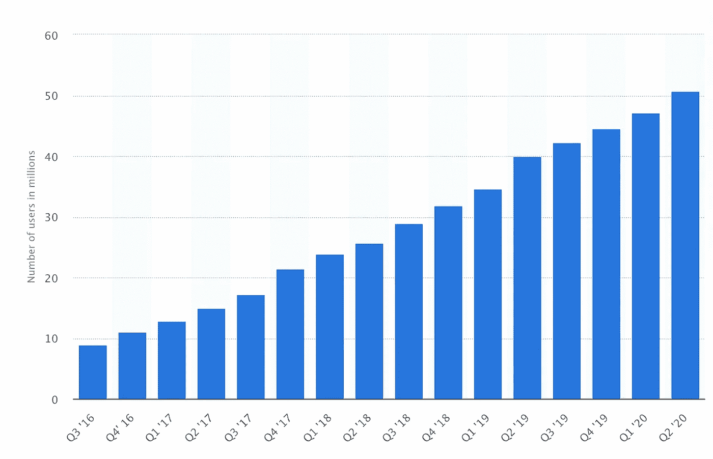

# 随着秋天的临近，神秘的土地上发生了什么

> 原文：<https://medium.com/coinmonks/as-summer-draws-nigh-what-has-been-happening-in-crypto-land-56bb18d93a10?source=collection_archive---------4----------------------->

## [2 分钟视频](https://youtu.be/o5eKMW5DsWs)回顾加密领域的一些发展

Source: Statista.com

拥有加密钱包的人数持续增加，Statista 现在声称全球有超过[5000 万](https://www.statista.com/statistics/647374/worldwide-blockchain-wallet-users/)

去中心化的金融(DeFi)部门继续增长，一些估计表明…