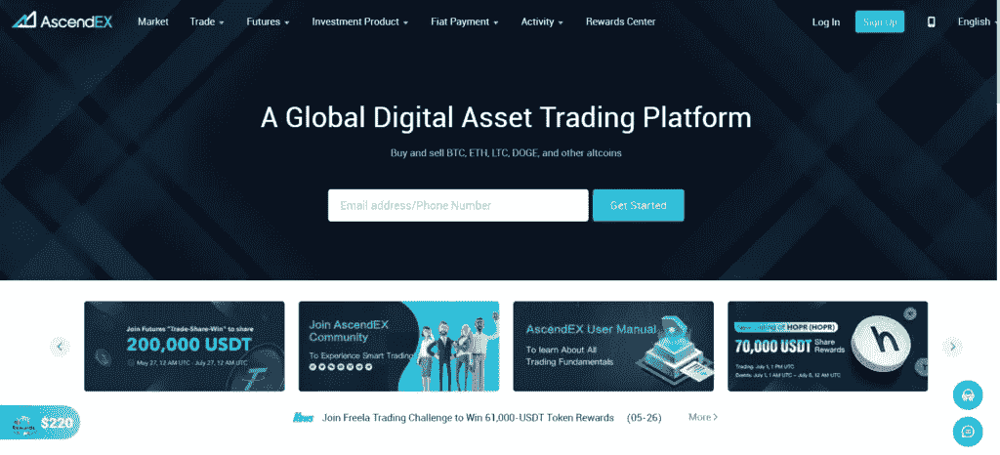

# AscendEX 评论:安全吗？

> 原文：<https://medium.com/coinmonks/ascendex-review-53e829cf75fa?source=collection_archive---------4----------------------->

AscendEX Review

[**AscendEX**](https://ascendex.com/register?inviteCode=B7N5N8TRJ) 是一家总部位于[新加坡的加密货币交易所](https://coincodecap.com/crypto-exchange-in-singapore)，原名 BitMax Exchange。现货交易，保证金交易，赌注，DeFi 收益农业和期货交易属于 AscendEX 产品的范围。在今天的回顾中，我们将探讨所有这些服务及其功能、客户支持、安全性、费用和利弊。

# 总结(TL；博士)

*   [**AscendEX**](https://ascendex.com/register?inviteCode=B7N5N8TRJ) (BitMax)是一个基于新加坡的加密平台，支持超过 150 种加密资产、交易对和国家。
*   它提供各种各样的服务。例如，它允许现货交易、[保证金交易](https://coincodecap.com/margin-trading)和基于 USDT 的期货永久交易。除此之外，它还支持赌注、 [DeFi yield farming](https://coincodecap.com/defi-yield-farming-and-liquidity-mining) 、native utility token、OTC Desk、移动应用程序和许多其他被动收入选项。
*   此外，它还有一个[复制交易](/coinmonks/top-10-crypto-copy-trading-platforms-for-beginners-d0c37c7d698c)的选项，交易者可以使用所需交易者的自动交易执行。
*   该平台易于使用，具有标准和专业的交易视图。此外，它允许通过信用卡/借记卡进行加密购买。
*   平台是安全的。AscendEX 采用资金冷藏、2-FA、验证等安全措施确保安全。
*   AscendEX(BitMax)通过 24*7 支持代理扩展了强大的客户支持，尤其是电报社区。

# AscendEX 交易所是什么？

**AscendEX** 是一个综合性的加密交易所，拥有 150 多种加密资产和交易对。它支持 200 多个国家，并为交易者提供了几个法定支付机会。此外，它有许多服务来吸引高交易流动性。

[AscendEX](https://blog.coincodecap.com/go/ascendex) exchange

# AscendEX 评论:服务

该平台扩展了许多服务，但不会让初学者感到困惑。这些服务分为交易平台、投资产品和固定支付。

1.  交易平台支持现货交易、保证金交易、期货交易、副本交易，具有专用的标准和专业接口。
2.  投资产品包括 ASD 生态系统、[打桩](https://coincodecap.com/staking-crypto)和 DeFi yield farming。
3.  Fiat payments 提供信用卡/借记卡购买服务，并为交易者提供场外交易平台。

# 交易平台

**AscendEX** 提供全面的交易平台。交易终端包括交易对(在左手边)、由[绘制的图表、交易视图](https://www.tradingview.com/?offer_id=10&aff_id=24152)、买/卖框、订单簿(在右手边)、交易历史、未结订单和资产摘要(在底部)。此外，它还支持现货交易、保证金交易和期货交易。交易者可以执行四种不同的订单类型-限价单、市价单、限价止损单和市价止损单。

AscendEX Review: trading terminal

在现货交易中，限价单分为贴水和 TIF。该帖子指出，订单被添加到订单簿，而没有立即执行预先存在的订单。TIF 进一步扩展到 GTC、国际奥委会和 FOK。

1.  GTC(取消前有效)表示未结订单，直到完成或取消。
2.  IOC(立即或取消)意味着订单的全部或部分执行，订单中未完成的部分被取消。
3.  FOK(成交或取消)表示立即绝对执行或取消订单。

保证金交易的杠杆高达 25 倍，而期货高达 100 倍。此外，期货交易包括基于 USDT 的永久合约。相反，保证金和现货交易订单是基于 USDT，瑞士联邦理工学院和 BTC。

此外，它允许复制交易，交易者可以复制他们最喜欢的交易者，一键自动执行交易者。交易者可以从网站上的交易者列表中选择复制他们的交易订单并自动执行。

 [## 最佳免费加密交易机器人——前 16 名比特币交易机器人[2021]

### 2021 年币安、比特币基地、库币和其他密码交易所的最佳密码交易机器人。四进制，位间隙…

medium.com](/coinmonks/crypto-trading-bot-c2ffce8acb2a) 

# AscendEX 评论:ASD 生态系统

AscendEX 为用户提供了一个功能性的本地令牌——ASD(BTMX)令牌。持有此令牌的交易者有资格获得更高的 VIP 级别和更低的交易费用。ASD(BTMX)可以产生每日奖励

1.  50%折扣保证金利息的积分卡。
2.  AscendEX 拍卖

此外，如果您下注，您将获得额外的奖金。此外，您可以使用 ASD(BTMX)购买投资多卡，一张卡可将投资利润乘以 5。

# AscendEX 的标桩

像任何其他平台一样，AscendEX 为交易者提供交易服务。这使他们能够在数字资产中下注并获得回报。然而，AscendEX 的与众不同之处在于，它为数字资产提供了灵活性。你可以将资金从股份中取出，或者几乎立即转移。AscendEX 维持着一个加密资产的流动性池，用于即时访问数字资产。

Staking at AscendEX

此外， **AscendEX** 允许交易者使用已押资产作为保证金抵押品。交易者可以交易和赚取选定加密资产的赌注奖励。用户还可以选择复合他们的赌注奖金。AscendEX 再投资赌注奖励，以提高收益率。用户可以选择激活或停用复合模式。

**注:**质押资产不可直接交易；然而，它们有资格作为保证金交易的抵押品。

# AscendEX 评论:DeFi 产量农业

AscendEX 为交易者提供了一个 DeFi 产量农场，通过 DeFi 协议杠杆获得最大的资本回报。这些协议包括:

*   贷款协议，
*   分散的流动性池，以及
*   衍生协议。

交易者从相关的 [DeFi](https://coincodecap.com/the-ultimate-guide-to-defi-decentralized-finance) 协议中以多种代币的形式获得对其流动性贡献的奖励，作为费用、利息或奖励发放。此外，贸易商不必支付天然气费，从而最大限度地提高了他们的收益。由于 AscendEX 管理所有与 DeFi 协议的后端集成，交易者可以在其中获得奖励。你可以通过采用收益率驱动的杠杆策略来增加农业风险敞口，从而提高收益。

AscendEX Review: DeFi Yield Farming

# AscendEX 的附加服务

除此之外， **AscendEX** 还提供其他工具和产品来获得更高的加密收入。

1.  **场外交易柜台** : AscendEX 与美国监管的独立信托/托管机构 [Prime Trust](https://www.primetrust.com/) 合作，提供有限数字资产的场外交易解决方案:BTC、瑞士联邦理工学院和 USDT。交易员可以使用最小交易规模为 100，000 美元的场外交易解决方案，并连接到 otcadmin@ascendex.com 的团队。但是，有强制性的 KYC/ CIP/ AML 协议。
2.  **bit treasure:**bit treasure 允许交易者赚取基础数字资产的利息，回报率基于所选的代币和投资期限。它在期限结束后(从 30/90/180 天不等)将本金和利息分配到账户。因此，它允许灵活的投资期限和各种投资令牌的利息。
3.  **AscendEX 移动应用**:许多交易者希望通过移动应用进行交易，以实现移动性和实时互动。AscendEX 为 [iOS](https://apps.apple.com/us/app/ascendex-bitmax/id1463917147) 和 [Android](https://play.google.com/store/apps/details?id=com.ascendex.exchange&hl=en_IN&gl=US) 设备扩展了全功能移动应用。它拥有一个常规的交易视图和许多保持效用不变的服务。

AscendEX Mobile App

# AscendEX 交易所怎么用？

AscendEX 是一个相当易于使用的平台，为交易者提供基本服务。此外，AscendEX 侧重于多样性而不是先进性。因此，交易平台易于使用和导航。

# 如何在 AscendEX 交易所创建账户？

1.  通过手机号码或电子邮件 ID 在 AscendEX(BitMax)上创建一个帐户。
2.  向你的账户注入资金开始交易。
3.  完成验证(可选)以提高交易限额。

## 如何在 AscendEX 上完成身份验证？

AscendEX(BitMax)有一个可选的验证过程。交易者可以完成验证成为认证会员，并享受额外的好处。验证是一种基于 VIP 级别的分层结构。

*   政府颁发的身份证和住址证明。
*   拿着身份证件的自拍。
*   联系客户支持的复杂程序。

Identity verification on AscendEX

## 如何在 AscendEX 上存放比特币？

1.  点击 AscendEX 上的“balance ”,显示总资产值。
2.  点击“存款”并从列表中选择所需的加密资产。
3.  选择链类型。要存款，要么扫描二维码，要么复制地址。

## 如何在 AscendEX 提取 crypto？

1.  点击交易平台上的“余额”,显示总资产值。
2.  点击“撤销”并从 **AscendEX** 的列表中选择所需的加密资产。
3.  选择链类型并输入提款金额。这里，网络费用显示在屏幕底部。
4.  添加钱包地址。经过适当的验证和区块链确认后，转让完成。

# AscendEX 评论:支持的国家/加密货币

AscendEX 在 200 多个国家运营，支持超过 8 种语言。然而，它禁止平台上的一些国家，如美国。更多信息请访问 [AscendEX 帮助中心](https://ascendex.com/en/help-center/articles/360056452714-Countries-Regions-Available-for-Registration)。

除此之外，AscendEX 支持信用卡/借记卡进行加密购买。此外，AscendEX 支持超过 150 种加密货币和交易对，包括 BTC、USDT、瑞士联邦理工学院、XRP 等等。此外，它还扩展了一个额外的本机实用程序令牌——ASD(BTMX)。这种代币有许多好处，如费用较低，并产生许多奖励。

# AscendEX 评论:费用

**AscendEX 对交易者实行分级 VIP 收费结构。**

**VIP 等级享受基本交易费折扣。它基于 30 天的交易量(在 USDT)和平均解锁 ASD(BTMX)持有量。以下是根据 VIP 等级的要求和费用。**

## **交易费用**

**AscendEX 对现货交易和保证金交易收取相同的费用。费用结构基于 VIP 等级结构。除此之外，UAT/USDT 的交易费为 0.2%，ASDP(BTMXP)/USDT 为 0.5%。**

****

**Trading Fees**

## **AscendEX 评论:利率**

**AscendEX 对保证金交易实行每日利率，如有变更，恕不另行通知。他们根据市场情况进行各种调整。因此，建议以 [AscendEX 费率](https://ascendex.com/en/feerate/margin-rate-interest-rate)定期检查。**

****

**Interest Rates**

## **最大借款限额**

**最大借款限额如有变更，恕不另行通知。因此，建议定期检查以下内容:**

****

**Maximum Borrowable Limit**

## **AscendEX 审查:提款费**

**[**AscendEX**](https://ascendex.com/register?inviteCode=B7N5N8TRJ) 收取提现费用，可能会根据区块链网络情况而有所变化。**

****

**Withdrawal fees**

# **AscendEX 评论:安全性**

**AscendEX 通过几项安全措施为交易所创造了一个安全的环境。此外，它通过采用一些策略来确保客户资金和数据的保护，这些策略是:**

1.  ****资金冷藏:**[**AscendEX**](https://ascendex.com/register?inviteCode=B7N5N8TRJ)遵循安全协议，在冷藏中储存最大交易者资金。热钱包里只有部分资金提供流动性。**
2.  ****双因素认证:** AscendEX 用 Google Authenticator 扩展了 2-FA，用户每次登录都需要一个 6 位数的代码。**
3.  ****提现邮件确认:** AscendEX 确保客户资金安全。从今以后，在撤销任何加密之前，交易者需要确认一个电子邮件确认链接。**

**此外，它需要一个由数字和字符组合而成的唯一的帐户密码。除此之外，AscendEX 还有一个验证程序，特别是针对 OTC 交易台。**

# **AscendEX 评论:消费者支持**

**客户支持对密码交换至关重要。是平台和用户的接触点之一。AscendEX 拥有良好的客户支持基础。**

1.  **AscendEX 有一个现场表格，交易者可以提交投诉和附件。在这里，交易者可以通过图像或 pdf 附件通知问题。**
2.  ****AscendEX 在 Telegram 上有一个强大的团队和交易员社区。该小组全天候工作，代理用 8-10 种语言解答客户的疑问。支持的语言有韩语、土耳其语、越南语、意大利语、英语、日语、阿拉伯语和西班牙语。****
3.  ****该平台始终通过 support@ascendex.com 提供电子邮件支持。****

****除此之外，AscendEX 定期在[媒体](https://medium.com/ascendex)上传博客。****

# ****AscendEX 评论:利弊****

## ****赞成的意见****

1.  ****[**AscendEX**](https://ascendex.com/register?inviteCode=B7N5N8TRJ) 提供了适合初学者的简化界面。此外，它扩展了两种不同的交易观点——标准的和专业的。****
2.  ****验证不是强制性的。****
3.  ****AscendEX(BitMax)为交易者提供了一个本地实用令牌 ASD(BTMX)。****
4.  ****该交易所提供各种各样的加密资产和交易对，超过 150+。****
5.  ****它允许交易者现货，保证金交易，复制交易，赌注，Defi 收益农业和期货交易。****
6.  ****AscendEX(BitMax)为用户提供了一个功能性的移动应用程序。****

## ****骗局****

1.  ****AscendEX(BitMax)在全球 200 多个国家运营。然而，它禁止包括美国在内的一些国家的用户使用(由于监管问题)。****
2.  ****AscendEX 支持信用卡/借记卡加密购买。但是，它不接受任何直接的法定付款。****

# ****AscendEX 审查:结论****

****[**AscendEX**](https://ascendex.com/register?inviteCode=B7N5N8TRJ)**(前身为 BitMax)是一家位于新加坡的加密交易所，为交易者提供各种服务。该平台是安全的，并且扩展了响应迅速的客户支持基础。此外，该平台是初学者友好的，但缺乏先进的工具。它支持 200 多个国家和 150 多个加密资产和交易对。AscendEX 通过可选验证邀请匿名交易者在门户网站上进行交易。此外，AscendEX 为交易和客户支持社区支持十种不同的语言。******

******总的来说，该平台适合希望探索加密市场的初级服务和产品的初学者。然而，它不会让有经验的匿名交易者感到兴奋。******

# ******常见问题******

********AscendEX(bit max)支持菲亚特存款/取款吗？********

****AscendEX 不接受任何法定付款，无论是存款还是取款。唯一的法定支持是通过**信用卡/借记卡**。交易者可以通过平台上的信用卡/借记卡进行加密购买。****

******AscendEX(bit max)接受美国公民吗？******

****AscendEX 在全球 200 多个国家运作。此外，它在平台和社区基础上支持九种不同的语言。然而，它禁止美国交易商进入交易所。然而，美国交易商可以修改 VPN 设置来访问该平台。****

******AscendEx(bit max)是否有 KYC/反洗钱/验证流程？******

******AscendEX** 扩展了自主验证程序。交易者可以自愿验证他们的帐户，成为认证会员，并获得额外的好处。这并不是强制性的。但是，在 OTC 交易台上，验证过程是强制性的。无论是机构还是个人，他们都需要完成 KYC/反洗钱流程才能购买。****

******Ascendex(bit max)是去中心化的吗？******

****AscendEX 是一个分散的平台，因为它运行在遍布全球的计算机管理的代码上。****

******披露:包含附属链接******

**** [## 最佳 6 个加密交易信号电报通道

### 这是乏味的找到正确的加密交易信号提供商。因此，在本文中，我们将讨论最好的…

medium.com](/coinmonks/best-crypto-signals-telegram-5785cdbc4b2b)  [## BlockFi 评论 2021 —通过您的加密获得 8.6%的利率

### 让你的密码发挥作用，获得比特币和其他加密货币的最佳利率

medium.com](/coinmonks/blockfi-review-53096053c097)  [## 加密税务软件——五大最佳比特币税务计算器[2021]

### 不管你是刚接触加密还是已经在这个领域呆了一段时间，你都需要交税。

medium.com](/coinmonks/best-crypto-tax-tool-for-my-money-72d4b430816b) 

> 加入 [Coinmonks 电报频道](https://t.me/coincodecap)，了解加密交易和投资

## 另外，阅读

*   购买 Dogecoin 的 7 种最佳方式
*   [如何在 Bitbns 上购买柴犬(SHIB)币？](https://coincodecap.com/buy-shiba-bitbns)
*   [最佳加密分析或链上数据](https://coincodecap.com/blockchain-analytics) | [Bexplus 评论](https://coincodecap.com/bexplus-review)
*   [NFT 十大市场造币集锦](https://coincodecap.com/nft-marketplaces)
*   [iTop VPN 审查](https://coincodecap.com/itop-vpn-review) | [曼陀罗交易所审查](https://coincodecap.com/mandala-exchange-review)
*   [最佳期货交易信号](https://coincodecap.com/futures-trading-signals) | [流动性交易回顾](https://coincodecap.com/liquid-exchange-review)
*   [最佳加密交易信号电报](/coinmonks/best-crypto-signals-telegram-5785cdbc4b2b) | [MoonXBT 评论](/coinmonks/moonxbt-review-6e4ab26d037)
*   [OKEx 评论](/coinmonks/okex-review-6b369304110f) | [Coinswitch 俱吠罗评论](/coinmonks/coinswitch-kuber-review-1a8dc5c7a739) | [比特币基地收费](/coinmonks/coinbase-fees-831e77d4f2c5)****