# AscendEx 打桩指南

> 原文：<https://medium.com/coinmonks/ascendex-staking-c8877de2dc1f?source=collection_archive---------8----------------------->

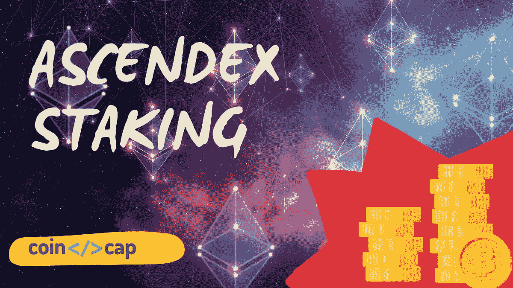

AscendEx Staking

[**AscendEx**](https://blog.coincodecap.com/go/ascendex) ，原名 Bitmax，是全球[加密交易所](https://blog.coincodecap.com/crypto-exchange)平台，支持超过 100 种加密货币，包括 BTC、ETH、LTC、DOGE 等。本文将重点介绍打桩服务— [AscendEx](https://blog.coincodecap.com/go/ascendex) 打桩(Bitmax 打桩)、Defi 产量耕作以及曲线(多边形)产量耕作等其他功能。

# 总结(TL；博士)

*   [赌注](https://blog.coincodecap.com/staking-crypto)是一种赚取数字资产开采回报的方式，无需投资拥有高处理能力的昂贵硬件。
*   [AscendEx](https://blog.coincodecap.com/go/ascendex) Staking 支持**即时解绑，**允许用户解绑资产下单或即时提取。
*   [AscendEx](https://blog.coincodecap.com/go/ascendex) 提供约 50 个 staking 项目，如 DOT (Polkadot)、ASD (AscendEx 原生令牌)、ATOM (Cosmos)、CUDOS (Cudos)、BOND(债券融资)、SWINGBY (Swingby)等。
*   对于每个赌注项目，将有一个最小委托金额值。因此，您的下注金额应大于或等于最低委托金额。
*   点 S 表示堆叠的点标记。
*   AscendEx staking 支持两种取消删除:常规取消删除和即时取消绑定。
*   [DeFi Yield Farming](https://blog.coincodecap.com/defi-yield-farming-and-liquidity-mining) 允许用户通过在 DeFi 协议中投资数字资产来赚取固定或可变利息。
*   跑马圈地的目的是帮助区块链网络保持安全，并让农业专注于获得尽可能高的产量。
*   在 DeFi 产量农业，稳定的硬币，如，，戴，和系绳是首选。
*   [**AscendEx**](https://blog.coincodecap.com/go/ascendex) 本周(2020 年 7 月第二周)新推出曲线(多边形)产量农业。

# AscendEx 打桩

赌注是一种赚取数字资产开采回报的方式，无需投资于具有高处理能力的昂贵硬件。在 [**AscendEx 交易所**](https://blog.coincodecap.com/go/ascendex) 持有数字资产，这是一种非常便捷的获取被动收入的方式。

当您下注合格代币时，您将代币锁定在您选择的[下注证明](https://blog.coincodecap.com/proof-of-stake-explained) (PoS)区块链中。标记令牌用于达成共识，这是在验证区块链上的每个新交易时保持网络安全所必需的。

作为奖励，用户将从网络获得新的代币。这些奖励将与下注的代币数量成比例；标记的令牌数量越多，验证能力就越强。

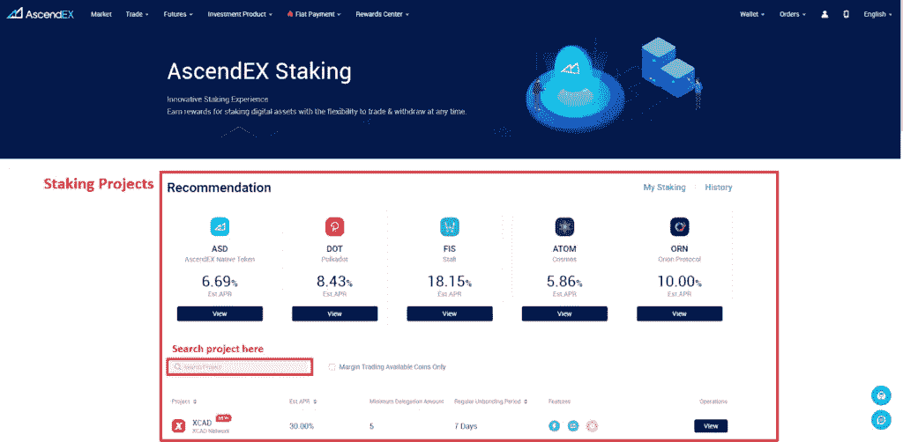

Staking on AscendEx

如果我们谈论传统的赌注机制，当你选择赌注时，你锁定你的赌注资产一段特定的时间。在解除绑定期间，您既不能使用您的赌注资产，也没有资格获得赌注奖励。正因为如此，你不能下单卖出已押资产。此外，你甚至不能提取或转移你的资产到另一个交易所或钱包。

AscendEx Staking 的概念是**即时解绑，**用户可以解绑资产以下订单或立即提取。此外，AscendEX 允许将押记资产用作保证金抵押品。这只适用于[融资融券平台](https://blog.coincodecap.com/go/margin-trading)支持的资产。

> *此外，请阅读* [*加密赌注——加密赌注终极指南【2021】*](https://blog.coincodecap.com/staking-crypto)

# 从 AscendEx 铆接开始的步骤

## 使用桌面

在您继续参与 AscendEx 赌注之前，请先登录您的 [AscendEx 账户](https://blog.coincodecap.com/go/ascendex)。如果您没有帐户，请在 AscendEx 上创建一个帐户，然后登录。

1.  前往 AscendEx Staking 页面。
2.  AscendEx 提供大约 50 个项目，如 DOT (Polkadot)、ASD (AscendEx 本地令牌)、BOND(债券融资)等。
3.  打开任何项目。例如，在这里，我通过点击它来打开 DOT staking 项目。

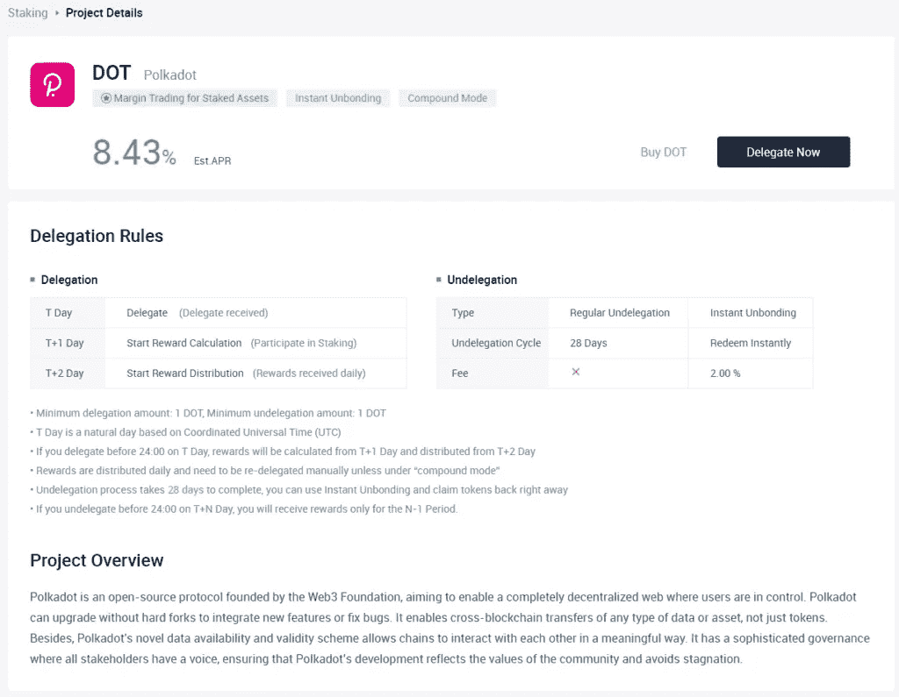

DOT staking page

1.  在 DOT staking 页面上，您可以找到所选项目的项目概述和委托规则。将有两个按钮继续操作，**购买点**和**委托现在**。点击“立即授权”按钮，赢取点状代币。如果你的钱包里没有 DOT 代币，就选择“购买 DOT”选项。
2.  它将带你到点/ USDT 交易页面，在这里你可以通过下单购买点令牌。
3.  一旦你有足够的资金，点击现在委托。
4.  这将打开一个弹出窗口来设置点委托。

## 使用移动应用程序

1.  打开 AscendEx App。
2.  如果你没有 AscendEx 应用程序，请从这里下载[和](https://play.google.com/store/apps/details?id=com.ascendex.exchange&hl=en)iOS 和 [iOS。(使用此推荐代码 **B7N5N8TRJ** ，享受费用折扣)](https://apps.apple.com/us/app/bitmax-token-margin-exchange/id1463917147)
3.  点击“标桩”。
4.  在“所有标桩”页面，您将找到由 [**AscendEx**](https://blog.coincodecap.com/go/ascendex) 提供的标桩项目列表。搜索任何项目并选择一个选项。
5.  这将带您到所选项目的赌注页面。如果您没有足够的选定资产进行委托，请到 DOT/ USDT 配对购买一些，然后再次执行步骤 1、2 和 3。

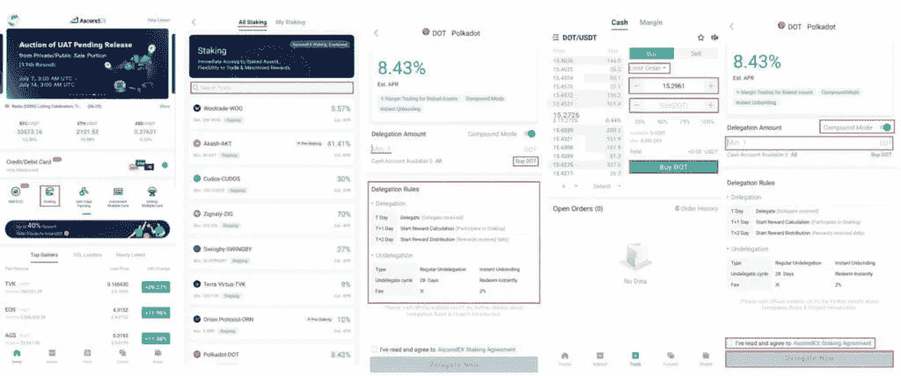

AscendEx Staking [Mobile App]

## 继续授权

1.  启用“复合模式”,以实现赌注奖励的自动再授权和复合回报。
2.  输入“委托金额”。对于每个项目，将有一个最小委托金额值。请确保您输入的委托金额大于或等于最小要求值。如果您没有足够的资产来委托，您可以单击购买选项，我们已经讨论过了。
3.  阅读 AscendEx Staking Agreement 并勾选复选框(我已经阅读并同意 AscendEx Staking Agreement)。
4.  点击“立即委托”。
5.  您可以在“我的赌注”下找到赌注详情。

# 解除 AscendEx 股权的步骤

## AscendEx 打桩:使用桌面取消打桩

1.  在 [**AscendEx**](https://blog.coincodecap.com/go/ascendex) 打开我的跑马圈地页面。
2.  你会发现一个项目列表，其中你已经押资产。点击**取消授权**取消特定项目的资产。
3.  它将打开一个弹出窗口。
4.  选择**账户类型:**现金账户或保证金账户
5.  选择**取消删除类型:**定期取消删除或即时取消绑定。

*   在常规授权中，资产将在七天后免费赎回。
*   在即时解绑中，资产会以 2.5%的手续费即时赎回。

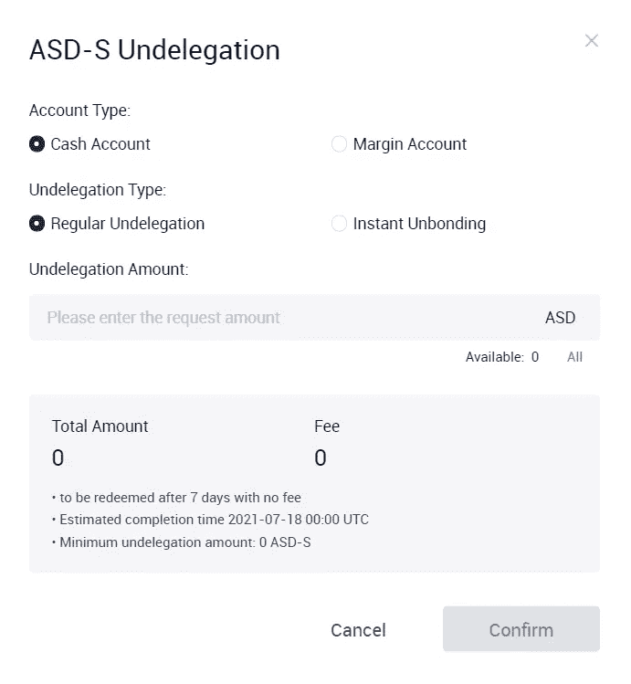

Undelegation pop-up

## AscendEx Staking:使用移动应用程序取消赌注

1.  打开 [AscendEx](https://blog.coincodecap.com/go/ascendex) App。
2.  点击“标桩”。
3.  点击“我的赌注”。
4.  选择要从中取消删除令牌的项目。
5.  点击“取消删除”按钮。
6.  它将打开一个名为“项目名称-取消删除”的弹出窗口。
7.  点击**确认。**

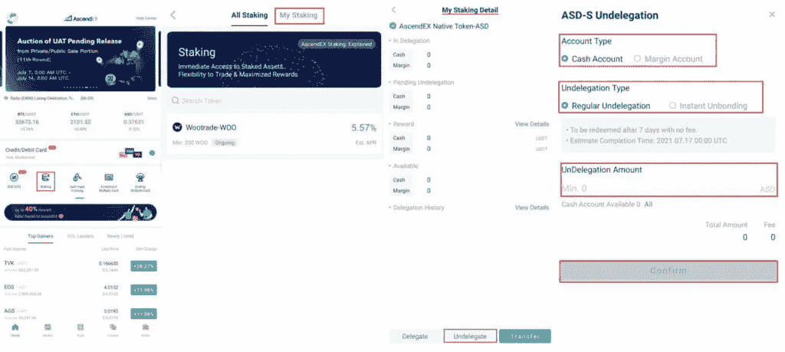

Un-stake in AscendEx

# 什么是产量农业？

Yield Farming 允许用户暂时锁定他们的持有量并获得奖励。它将使用户能够通过在 DeFi 协议中投资数字资产来赚取固定或可变的利息。

产量农业类似于赌注，因为在这两种情况下，你都可以赚取被动收入。然而，田间耕作将锁定的数字资产借给 DeFi 协议，而不是贡献给股份证明网络。它将资金锁定在流动性池中。流动性池为交易者可以交换、借入或借出代币的市场提供动力。一旦你将资金加入资金池，你就正式成为了流动性提供者。 [DeFi lending](https://blog.coincodecap.com/top-5-crypto-lending-platforms) 协议允许贷款人获得资产利息，同时让借款人获得更多交易资金。在 DeFi 产量农业，稳定的硬币，如，，戴，和系绳是首选。

> *亦作，读* [*德菲产量耕作与流动性开采*](https://blog.coincodecap.com/defi-yield-farming-and-liquidity-mining)

## AscendEx 打桩:高产农业的好处

*   “一键式”农业功能，
*   没有汽油费，而且
*   能够在不同的协议之间轮换，以最大限度地提高产量。

# AscendEx 上的 DeFi 产量农业项目

截至目前， [**AscendEX**](https://blog.coincodecap.com/go/ascendex) 提供收益农业产品，如借贷协议和流动性池。在流动性池中，你将充当流动性提供者，向池中贡献资产，并从中赚取交易费。在贷款协议中，您需要将资产借给资金池，以换取贷款利息和额外的代币奖励。

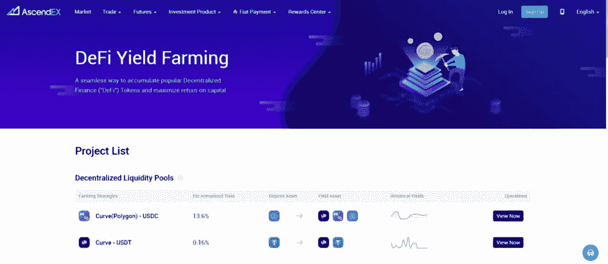

DeFi Yield Farming projects on AscendEx

有两个分散的流动性池——

1.  曲线(多边形)Curve
2.  曲线— USDT

还有 1 个借贷项目——HARC——USDX

本周(2020 年 7 月的第二周)在 [AscendEx](https://blog.coincodecap.com/go/ascendex) 启动曲线(多边形)产量农业。因此，我们将深入讨论这个项目。

# AscendEx 打桩:曲线(多边形)产量农业

Polygon 向成为流动性提供者的用户提供自动奖励。此外， [Polygon](https://polygon.technology/) 是第一个结构良好、易于使用的以太坊扩展和基础设施开发平台。

*   存款资产:USDC(最低 500 USDC，最高 250，000 USDC)
*   收益率资产:USDC +马蒂奇+ CRV
*   最低兑换金额:500 USDC
*   t 日是基于协调世界时(UTC)的自然日。因此，如果您在 T 日 24:00 之前存款，奖励将从 T+1 日开始计算，从 T+2 日开始发放。
*   兑换过程需要一天时间来完成；即时兑换功能目前不可用。

# 如何在曲线(多边形)产量养殖中存款？

## AscendEx 定位:使用桌面

*   打开 AscendEx 的 DeFi 产量养殖页面。
*   点击“立即查看”查看曲线(多边形)Curve。

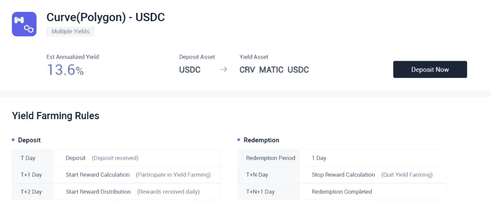

Curve (Polygon) — USDC Deposit

*   这将打开面产量耕作页面。
*   你会发现项目介绍和产量耕作规则。然后，要投资这个项目，请单击“立即存款”按钮。
*   此后，输入“存款金额”。它应该大于或等于 500 USDC。在弹出的窗口中可以看到，预计年收益率为 13.6%。
*   阅读 AscendEx DeFi Yield Farming Agreement 并勾选复选框。
*   最后，点击“确认”按钮。

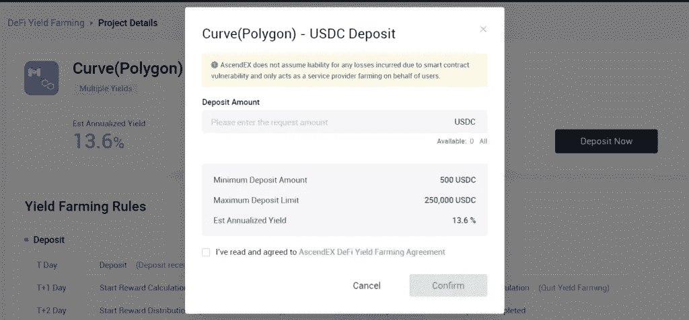

Curve (Polygon) Yield Farming

## AscendEx Staking:使用移动应用程序

1.  打开 [**AscendEx**](https://blog.coincodecap.com/go/ascendex) App。
2.  点击“DeFi 产量农业”。
3.  在“项目列表”页面上，您可以找到 AscendEx 提供的高产农业项目列表。例如，选择“曲线(多边形)— USDC”。
4.  这将带您到“曲线(多边形)-USDC”项目页面，在这里您将找到项目介绍和产量耕作规则。然后，点击“立即存款”。
5.  此后，在下一页输入“存款金额”。
6.  点击“确认”按钮。

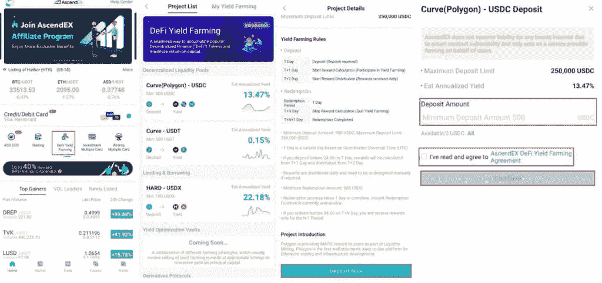

Curve (Polygon) Yield Farming

# 去哪里看我的产量耕作？

## 在网站上

1.  请访问 AscendEx 的 DeFi Yield Farming 页面。
2.  点击“我的高产养殖”。这将带您进入我的高产农业页面。

## 在移动应用程序上

1.  打开 [AscendEx](https://blog.coincodecap.com/go/ascendex) App。
2.  点击“DeFi 产量农业”。
3.  转到“我的产量农业”。在“我的高产农业”页面上，您可以找到所有高产农业项目的投资详情。

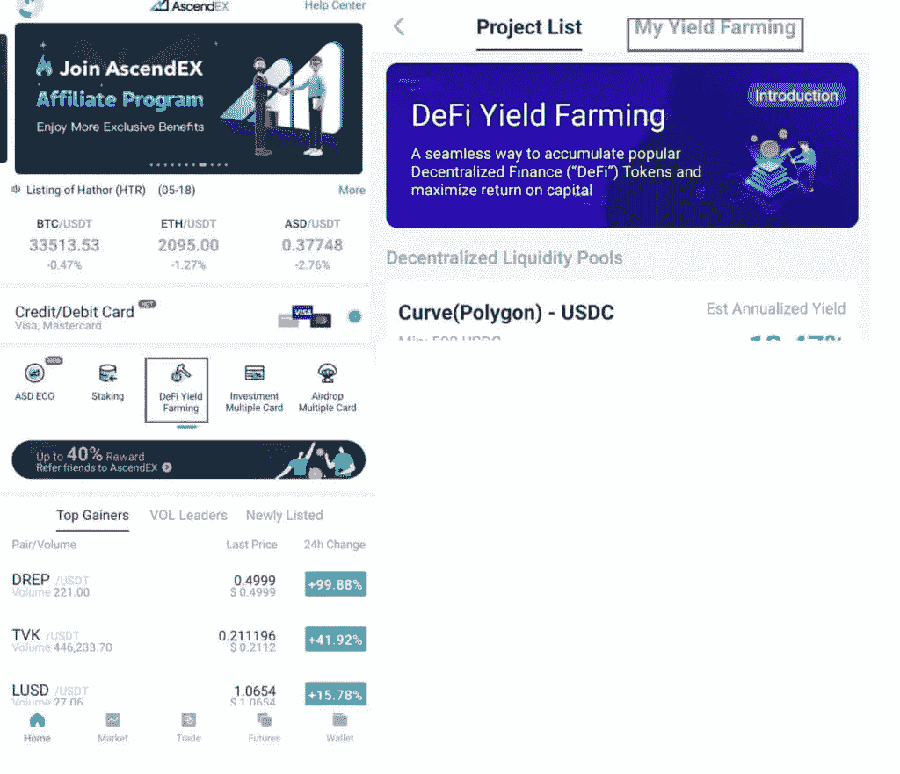

Yield farming on Mobile app

# AscendEx 打桩:打桩与产量农业

赌注和产量农业在回报方面是相似的。但两者的目的不同。赌注旨在帮助区块链网络保持安全，而[产量农业](https://blog.coincodecap.com/defi-yield-farming-and-liquidity-mining)专注于获得尽可能高的产量。

产量农业可以被认为是赚取被动收入的最有利可图的选择，但风险很高。例如，APY(年百分比收益率)可能会受到以太坊燃气费的很大影响。因此，如果市场突然看跌或看涨，利润率就会下降。

在产量农业中，还存在开发商创建骗局项目的可能性。例如，在列出新令牌并允许用户将资金存入流动性池后，项目的创建者将关闭项目并带着资金消失。

赌注可能需要你锁定你的资产(在一些项目中)一年。在此期间，你甚至不能撤回或出售你的资产。如果市场转为熊市，你的损失将超过你下注的收益。

# AscendEx 定位:结论

赌注和收益农业都允许用户暂时锁定他们的资产并获得奖励。赌注的目的是帮助区块链网络保持安全，产量农业的重点是获得尽可能高的产量。

[**AscendEx**](https://blog.coincodecap.com/go/ascendex) 提供约 50 种打桩产品和 3 种 DeFi Yield 农业产品。但是请记住，AscendEx 并不保证你会随着时间的推移获得任何特定的回报。这取决于项目所有者或令牌网络。因此，找到一个发展良好的项目进行投资是你的责任。

# 常见问题

**KYC 验证是否需要参与标桩？**

号码

我可以在我的资产被下注时进行交易吗？

押资产不能直接交易。相反，它们可以用作[融资融券交易](https://blog.coincodecap.com/bitcoin-margin-trading-exchange)的抵押品。如果你想卖掉你的资产，你必须先把它们拆下来。

**我可以随时在 AscendEx 上取消已押资产吗？**

是的，您可以随时在 [**AscendEx**](https://blog.coincodecap.com/go/ascendex) 取消您的已押资产。要拆分您的资产，您有两种选择:即时解除绑定和定期取消授权。选择即时解绑，可以即时解绑，但是会收取 2.5%的费用。

**如何计算** [**赌注**](https://blog.coincodecap.com/staking-crypto) **奖励？**

在大多数情况下，如果您在 T 日下注，下注奖励将从 T+1 日开始计算，并在 T+2 日开始发放。但是，假设您在 T+M 日的 0:00 到 24:00 之间停止下注或取消授权。在这种情况下，您的总下注期将为 M-1 天，您将仅获得 M-1 天的奖励。

**复合模式是如何工作的？**

复合模式是一种功能，每当用户收到任何分期奖励时，该功能会自动重新获取或重新授权用户的分期奖励。

预计奖励和实际奖励一样吗？

实际回报取决于项目的网络条件。网络条件的任何变化都会影响实际奖励。

**“DOT”和“DOT-S”有什么区别？**

以“-S”结尾的股票代码代表赌注余额。因此，举例来说，点 S 意味着押点，因为我们押了或委托了[点](https://polkadot.network/)记号。您不能直接交易或提取赌注代币。

*   [AscendEX Review 2021:这是骗局吗？【2021】](https://blog.coincodecap.com/ascendex-review)
*   [AscendEx 融资融券交易指南【2021】](https://blog.coincodecap.com/ascendex-margin-trading)
*   [低产农业和流动性采矿](https://blog.coincodecap.com/defi-yield-farming-and-liquidity-mining)
*   [加密赌注——加密赌注终极指南【2021】](https://blog.coincodecap.com/staking-crypto)
*   [投资币安:投资币安安全吗？【2021】](https://blog.coincodecap.com/staking-at-binance)

 [## 最佳免费加密交易机器人——前 16 名比特币交易机器人[2021]

### 2021 年币安、比特币基地、库币和其他密码交易所的最佳密码交易机器人。四进制，位间隙…

medium.com](/coinmonks/crypto-trading-bot-c2ffce8acb2a) 

*原载于 2021 年 7 月 12 日 https://blog.coincodecap.com***。**