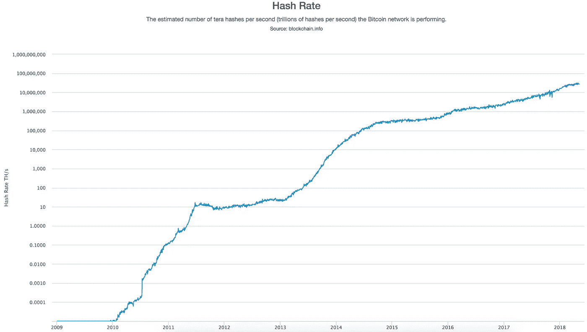

# ASICs 和 GPU 的过山车

> 原文：<https://medium.com/coinmonks/asics-and-the-roller-coaster-for-gpus-41e501f6d4bd?source=collection_archive---------10----------------------->

4 月初，总部位于中国的矿业实体比特大陆宣布发布一款专用于以太坊采矿的新 ASIC 采矿钻机(专用集成电路)。正如人们所料，这样的大新闻深深震撼了以太坊社区的某些部分。但 ASICs mining 真的会改变游戏规则吗？我们有理由担心吗？

当 ASICs 在 2013 年首次被引入比特币采矿时，哈希速率增加了一个数量级，GPU 变得非常过时。

到目前为止，以太开采主要是用 GPU 的力量完成的。这个事实让游戏玩家非常沮丧，因为这是市场上 GPU 大量短缺的原因。

虽然比特币使用不同的哈希算法(SHA256)，但以太坊使用的是内存硬挖掘算法(Ethash)，这种算法要求硬件具有最小的内存量。尽管在理论上是可能的，但在实践中，比特大陆的 ASIC 似乎不太可能立即对网络的哈希速率产生重大影响——至少不会像 2013 年 ASICs 对比特币的影响那样。不去探究“摩尔定律”和[处理器-内存性能差距](https://pdfs.semanticscholar.org/6ebe/c8701893a6770eb0e19a0d4a732852c86256.pdf)的细节，所需的内存读取仍然是以太开采过程中的一个限制因素，无论是 GPU 还是 ASIC。Vitalik Buterin 分享了以太坊社区内的一个很大的[情绪](https://www.youtube.com/watch?v=SoPfoNpqG0k),即 ASICs 目前对以太坊并不是真正的威胁。考虑到这些对内存读取的限制，ASICs 到底有多强还有待观察。

但是，当我们看看其他加密网络，如 Monero，似乎确实有更强大的硬件(潜在的 ASICs)已经在采矿过程中使用的强烈迹象。Monero(也使用内存硬哈希算法)最近硬分叉为抗 ASIC 代码。在反 ASIC 硬分叉的第二天，Monero 的散列率[下降了](https://bitinfocharts.com/de/comparison/monero-hashrate.html#3m)大约 80%，这导致人们猜测 ASICs 已经开采 Monero 有一段时间了。

这是不是真的，你可能要花上几个小时来辩论和推测。但眼下真正的问题应该是为什么或为什么不从总体上拥抱 ASIC/更专业的硬件实际上可能是健康和有益的，甚至可能找到一种让 ASIC 和 GPU 在生态系统中共存的方法。

社区中大多数开发人员提出的反对 ASICs 的明显理由是硬件生产集中化的威胁。ASIC 硬件生产目前主要掌握在一家大公司——比特大陆手中。比特大陆不仅是一家采矿硬件制造商，该公司还运营着大量大型采矿设施以及两个最大的比特币矿池(Antpool 和 BTC.com)。当谈到比特币网络的散列能力时，这三个领域的总足迹显然使比特大陆成为最重要的玩家。

据估计，比特大陆的蚂蚁矿工占比特币网络中所有矿工的 70-80 %,这种集中化程度可能会对该协议构成潜在威胁。这使比特大陆明显处于一个强大的位置，给他们潜在的足够的(直接和间接)权力来拒绝某些协议升级，这也使整个网络容易受到 Antminer 软件(如 Antbleed)的漏洞的影响，这是一个大约一年前发现的恶意后门程序。

虽然从长远来看，一家公司在这样的措施下运营是否健康和可持续还有待观察(Jimmy Song 提出了一个很好的[反对观点](/@jimmysong/mining-centralization-scenarios-b74102adbd36))，但现在显然有更多的参与者进入[竞技场](https://twitter.com/jwangARK/status/987432809127120896)。不过，芯片制造是一场艰难的游戏，严重受制于规模经济。公司越大，硬件越好，发展越快，等等。—这将使新公司很难立即获得可观的市场份额。但尽管如此，三星最近证实，它正在为硬件制造商 Halong Mining 提供开采比特币、以太和其他货币的 ASIC 芯片。因此，随着越来越多的大型科技制造商进入加密领域，这可能只是 ASIC 硬件军备竞赛的开始。

除了硬件制造的当前形势和各自的集中化威胁之外，没有什么可以反对 ASICs 的——利用更专业的硬件进行采矿本身从来都不是坏事，可以公平地假设这种硬件永远比通用硬件更高效、更具成本效益。

所以，对抗它还是拥抱它？唯一有效(尽管目光短浅)的对抗方式是硬分叉以太坊，作为一种策略，这似乎不太可持续。这将导致一场“猫捉老鼠”的游戏，在这种游戏中，每当新的硬件出现时，社区都必须改变协议。再说一次，除了 Monero，你不需要再寻找更多的证据。当他们将 ASIC 阻力添加到他们的主协议中时，这导致了四个新项目的混乱的硬分叉，每个项目都向 ASIC 矿工开放了预分叉软件。

最重要的是，开发人员推动协议的这种变化，以使某个硬件过时，实际上在某种程度上产生了相反的效果——更加集中化。

但对 ASICs 来说，最重要的论点是，它们使网络更加安全，因为它们自然地调整了激励措施。

矿工和经营采矿业务的公司在游戏中有实际的利益关系:ASICs 可以开采一枚硬币，而且只能开采一枚硬币。在对专用硬件进行了大量投资后，矿业公司有充分的动机不去伤害/破坏网络(甚至是它的声誉),只是为了保护他们宝贵的专用集成电路的价值/效用。如果硬币的价值下降，硬件的价值也会随之下降。

与 GPU 不同，你可以今天破坏一个网络，明天挖掘一个不同的硬币(或者更好，只是[在易贝](https://www.ebay.com/sch/i.html?_odkw=GPU&_osacat=0&_from=R40&_trksid=p2045573.m570.l1313.TR12.TRC2.A0.H0.Xminer+GPU.TRS0&_nkw=miner+GPU&_sacat=0)出售你的硬件)，与 ASICs 相比，这些策略都不起作用。

在基于 GPU 的大型采矿作业中，会有很多硬币之间的跳跃，挖掘当前最有利可图的硬币是一种策略，可能会显著提高整体采矿产量。但特别是对于较小的网络，散列率的高波动性(由大规模矿工通过在硬币之间“跳跃”引起)确实构成了威胁，因为它导致稳定性和安全性降低，增加了脆弱性。这可能是去年决定 [Sia](https://blog.sia.tech/choosing-asics-for-sia-b318505b5b51) 积极向 ASICs 开放的一个因素。

因此，没有什么可以反对 ASIC 本身的，似乎很明显，理想的场景将是一个多样化的景观，矿工从不同的制造商购买他们的 ASIC 硬件，从而创建一个生态系统，其中他们各自硬件的长期实用价值与他们正在开采的特定网络/硬币的价值紧密相连。显然，更加专业化的硬件将使采矿更加远离私人家庭地下室的小规模作业，而转向更大规模和专业化的采矿作业。然而，这是生态系统多年来在 GPU 方面已经看到的趋势，最终可能只是加密网络为提高网络安全级别而必须付出的代价:硬件层的集中化程度更高，但其结果仍然是健康的，基础协议层的财务激励措施也很好，如果从博弈论的角度来看，这显然会鼓励正确的行为。因此，在这种情况下，恶意不当行为的财务后果是保护网络免受此类行为影响的天然保障。

最终，这可能只会向我们表明，即使是为去中心化和缺乏中央权力/权威而设计的生态系统，一旦变得足够大，足以吸引大规模的金融利益，也可能容易受到其硬件、基础协议或应用层的某种程度的集中化的影响。我们只能希望，正是后者将鼓励更多的硬件玩家开始推出竞争性的采矿硬件。

在此之前，开发人员将不得不问自己，这是一场值得打的仗，还是要拥抱更专业的硬件，甚至可能找到与现有硬件共存的方法，并从那里专注于更重要的挑战。

但最终，所有这些都可能变得无关紧要，至少对以太坊社区来说是这样，如果当它过渡到股权证明，这将使 ASICs 和 GPU 采矿过时。即将到来的 [Casper](https://github.com/ethereum/research/blob/master/papers/casper-basics/casper_basics.pdf) 更新可能会为这个方向铺平道路。