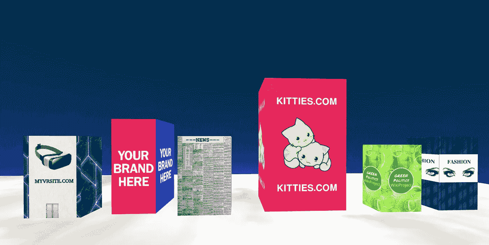
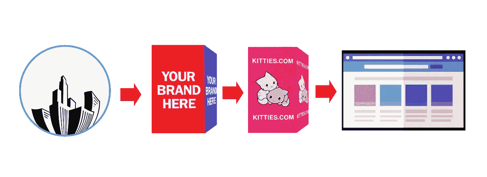
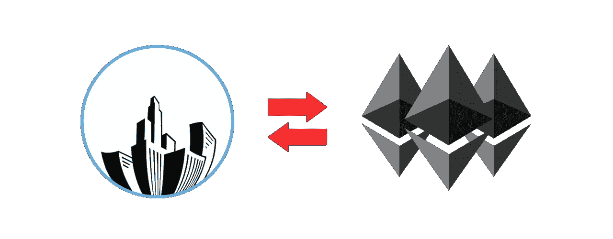

# asquare721 - ERC721 虚拟不动产令牌

> 原文：<https://medium.com/coinmonks/asquare721-erc721-virtual-real-estate-token-d5493b5eaa78?source=collection_archive---------1----------------------->

[**asquare721**](https://asquare721.com) 是一个去中心化的虚拟不动产令牌。

***An***[***as quare***](https://asquare721.com)***token 是一个唯一的 ERC721 token，对应一个唯一的虚拟建筑。*** 你可以拥有一栋建筑来粉刷它或者以更高的价格转售它，事实上你可以在建筑上使用任何纹理(见下面的例子，目前该功能处于预览模式)并且可以连接到一个虚拟链接。你为什么要画一栋建筑？因为不同的动机:

也许有一个特殊的事件，如生日或节日，你想把一个漂亮的纹理放在建筑物上，然后送给你的朋友或你的女朋友，或者也许你有一个品牌，你想把你公司的形象放在上面。建筑是一张空白的画布，极限在于你的想象力

目前，令牌功能是有限的。您可以以自己喜欢的价格购买和转售它，但有一组丰富的功能正在实施中:

1.  可以绘制并链接到您喜欢的站点的建筑(现在仅在预览模式下)。

2.免费安全传输给其他人。

3.可出租的建筑。

4.被拆除的建筑物，以便能够在同一自有区域内重建更多或更少的建筑物。

什么赋予了一个方令牌价值？ ，除了它独有的特点之外，还在于它是一个非常有限的令牌，这是因为每个令牌对应一座建筑，而 325 座建筑已经是一座小城了。

> 作为启动优惠，为了居住在这个城市，每个代币只卖 0.016 以太坊。会买还没入住的楼的幸运儿，可以用和小楼一样的价格买到大楼！

令牌->建筑->品牌->网站

## 令牌换令牌还是令牌换令牌

目前正在为这些建筑添加油漆功能。了解更多 [**本**](https://www.youtube.com/watch?v=jmWrFmzZ0Nc) **视频。**

**网址:**[**https://asquare721.com**](https://asquare721.com)

**推特:**[**https://twitter.com/asquare721**](https://twitter.com/asquare721)

> [在您的收件箱中直接获得最佳软件交易](https://coincodecap.com/?utm_source=coinmonks)

# ❤️喜欢，分享，留下你的评论

如果你喜欢这篇文章，不要忘记喜欢，与你的朋友和同事分享，并在下面留下你对这篇文章的评论。
跟我来……