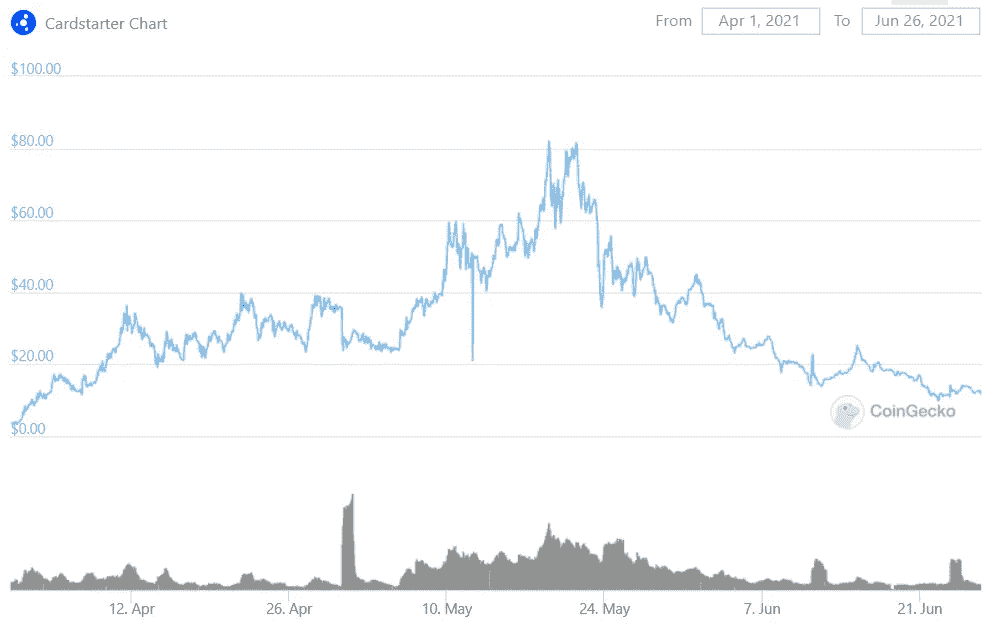

# 以 Cardstarter 为例评估加密发射台

> 原文：<https://medium.com/coinmonks/assessing-crypto-launchpads-using-cardstarter-as-an-example-1b1257b1d47a?source=collection_archive---------2----------------------->

下面，我概述了对加密发射台商业模式的一些观察，我的投资标准，并建议如何在决定如何投资时获得优势。我使用 Cardstarter 作为最近的一个例子。

声明:不是投资建议。我对探索加密货币充满热情，我发现它们的技术令人着迷。我也喜欢做研究，观察这个实验领域的市场行为。

有什么想法吗？在 [twitter](https://twitter.com/the_peach_tree) 上联系。

# Launchpad 商业模式提案

crypto 中的发射台是为投资者提供早期访问其他新加密项目的平台。

## **新项目有什么好处？**

比方说，我正在启动一个名为 Project X 的新加密项目，与其花费时间和金钱来营销 Project X，我可以简单地接近一个已经积累了大量追随者的发射台。通过 launchpad 发行我的令牌，我可以以经济高效和省时的方式访问大量不同的令牌持有者。考虑到 1)加密市场发展的速度 2)成本 3)加密项目试图避免令牌高度集中在一小群“鲸鱼”手中，考虑到这可能导致的价格流动性和风险，这是一件大事。鉴于 launchpad 所有者可能有更多的经验，他们可能会给新的 crypto 项目提供一些“建议”,但我对此持保留意见。

## **这对投资者有什么好处？**

获得早期投资的投资者有机会买入低得多的估值，并在代币上市交易后卖出高得多的估值。这类似于风险投资，成为公司或项目的早期支持者意味着你会获得较低的估值。一旦代币发行，你可以以更高的价格出售你的投资。有时，只要其中一笔交易就能赚到改变人生的钱，因为它们能给你 100 倍的初始投资回报。

## **launch pad 有什么好处？**

投资者需要购买并持有 launchpad 的令牌，才有资格参与新项目的启动。随着对 launchpad 代币的需求增加，价格也会上涨，从而奖励可能持有大量代币的 launchpad 的创建者/管理团队。此外，管理层将从新项目的代币中抽取一部分作为补偿。例如，如果一个新项目为 launchpad 分配了价值 10，000 美元的令牌，供其投资者分配，launchpad 的管理层可能会为自己保留 2000 美元，而只在其余人之间分配 8000 美元。

# Launchpad 商业模式问题

从上面对典型的 launchpad 商业模式生态的概述中，你能找出不同参与者的激励措施的任何偏差吗？我将概述对我来说重要的几个:

1.  **短期激励导致不可避免的管理层“一劳永逸”的心态** 管理层的成功很少与 launchpad 的长期成功挂钩。如上所述，一些通过 launchpad 启动的早期投资可以获得超过 100 倍的回报。在通过 launchpad 平台成功推出几个令牌后，管理层可以赚取数百万美元，因为大多数令牌都允许在公开交易后立即出售。这意味着，即使 launchpad 的代币变为零，管理层也会带着从代币发行中获得的数百万利润离开。因此，代币发行越成功，管理层口袋里的钱就越多，他们因代币归零而降低的风险就越大。
    想象一下，你是一名管理人员，在几次成功上市后，你在几个月内赚了 500 万美元。是什么激励你在这个目标实现后继续寻找伟大的项目？我并不是说他们的驱动力为零，因为他们当然仍将持有 launchpad 令牌，但肯定有一个缺口被取消了。
    与传统风险投资不同，在传统风险投资中，投资是在 3-10 年内实现的，风险投资基金经理不能在投资过程中清算他们的股权，而风险投资基金的业绩会延续到基金经理的职业生涯中，但在 crypto launchpads 中，情况并非如此。
2.  **缺乏差异化，因为新项目使用多个发射台**
    如果一个新项目可以通过多个发射台获得更多不同的令牌持有者，发射台如何保持差异化？如果没有差异化，那么就不是一个长期可行的业务。
3.  **活死由反馈循环** 这是零售产品。而散户的耐心为零。如果项目不能获得巨大的投资回报，或者甚至获得负回报，投资者会立即逃离发射台。launchpad 的声誉受到攻击，降低了其市值和多样化的持有人基础，导致负反馈循环，反馈到采购项目，新项目可能不想注册使用该 launchpad，等等。当然，这也会对成功投资产生相反的影响。“买 launchpad X，最近的 IDO 还了 100X！”。这种反馈循环意味着很少有人能长期经营下去。
4.  **回报对更广阔的加密市场非常敏感** 在一个新兴的加密市场中，早期投资会获得巨额的初始投资回报。在下跌的市场中，对新代币发行的需求很少，导致早期代币持有者可能获得负回报。最重要的是，在熊市中，新项目的渠道会枯竭。因此，在熊市中，launchpads 的内在价值接近于零。根据设计，发射台是加密领域最高的“测试版”投资。

# 投资准则

综上所述，以下是我的投资方法:

1.  **作为一项非常高的 beta 投资，launchpads 在我的投资组合中处于非常次要的地位。**这是我在即将到来的熊市中卖出的第一笔投资，也是我在牛市中买入的第一笔投资。考虑到我和其他人一样擅长预测宏观背景(一点也不擅长)，避免在这方面做出重大预测的安全对冲是将投资组合对 launchpads 的敞口保持在健康的最低水平
2.  只有在生命周期的早期 **当管理层的激励最大** **和最一致**(在他们赚到改变生活的钱之前)时，发射台才是有吸引力的，并且之后会非常疲惫
3.  **launch pad 越分化越好。**“差异化”的门槛非常高。本质上，它必须将独特的项目带到桌面上，而不是与其他发射台共享/分割它们，否则这是轻管道上的一个红旗，并提高了竞争力，导致其投资者的分配疲软
4.  **评估最近的跟踪记录**
5.  对投资者任何潜在的失望迹象保持高度警惕。这是一个关键的退出提示，给出了如上所述将开始的负反馈循环。我将在下面概述我是如何用 Cardstarter 做到这一点的，以及如何使用令牌组学在这一点上获得简单的“优势”
6.  **根据差异化和最近的业绩记录，它是否处于不合理的有吸引力或无吸引力的位置？**使用 [Coingecko 的扇形视图](https://www.coingecko.com/en/categories/launchpad)进行检查。
7.  **监控 Etherscan 上的持有人数量，因为这对固有价值主张**很重要——与竞争对手相比，数量越多越好

现在，让我们以 Cardstarter 上最近的交易作为应用上述投资标准的例子。

# 卡达诺承诺

**什么是 Cardstarter？Cardstarter 的推出有一个清晰的差异化定位:它是基于卡尔达诺区块链的新项目的首批启动平台之一。**

**让我们用我在四月初发现的上述六个标准来评估一下它是什么样子的:**

1.  高 beta:是；所有发射台的标准
2.  生命周期早期:是；没有启动任何项目
3.  差异化:有；鉴于卡达诺角的第一个市场
4.  评估最近的跟踪记录:还没有跟踪记录，所以没什么可失望的，所以这不适用
5.  潜在的零售失望:没有新的项目尚未出现，所以这是不适用的
6.  就市值而言，相对于竞争对手而言，它更具吸引力:是的；Cardstarter 为 500 万美元，DDIM 为 9500 万美元
7.  以太扫描持有者:低号；但是这是一个非常新的项目，所以暂时不予考虑

**结论？**巨大的风险/回报，项目具有巨大的潜力，业主在确定市场缺口方面做得很好。

**5 月 21 日发生了什么？**

1.  高测试版:是的，所有发射台的标准
2.  生命周期早期:没有。
3.  差异化:没有。主要竞争对手 Occam Fi 出现了，Cardstarter 与 Occam 分享新项目发布，这是一个红色信号，表明管道在短期内正在枯竭
4.  评估最近的记录:是；稳定的回报，有些项目达到 100 倍
5.  潜在的零售失望:是的，我在下面的单独章节中对此进行了阐述
6.  就市值而言，相对于竞争对手而言，Cardstarter 颇具吸引力:不，Cardstarter 的市值接近 2.5 亿美元，在 launchpad 类别中遥遥领先，而主要竞争对手 Occam Fi 的市值为 8000 万美元，DDIM 降至 3000 万美元，类别明星 Polkastarter 的市值达到 2.5 亿美元，因为该类别开始萎缩
7.  以太扫描持有者:高数字，问题是它已经达到顶峰了吗？

**结论？**风险/回报变为负值，通过评估负反馈循环何时开始发挥作用来寻找峰值，通过寻找任何零售失望，我将在下面详述

**结果:** Cardstarter 从 4 月初的 3 美元涨到 5 月份的 80 美元，今天又回落到 12 美元左右

# 对 edge 潜在的零售失望的评估来自于对新项目的令牌组学的评估

**回顾我们正在关注的反馈循环:** 令人失望的新项目回报→投资者对 launchpad 寻找好项目的能力失去信心→没有动力持有 launchpad 代币→ launchpad 市值缩水→持有人数量减少→新的不认为 launchpad 是有吸引力的发布平台→渠道枯竭→新项目回报减少→等等

如何评估“令人失望的新项目回报”？
这里的重点是，新项目需要以 launchpad 的象征性价格为投资者赚取可观的收益率，否则，投资者将看不到快速盈利的途径，并失去耐心。我们需要了解的主要变量是**每个投资者的新项目美元分配。，这可以归结为新项目的令牌经济学，以及 launchpad 如何适应。**

虚构示例 A:
Cardstarter 通过其平台 Project X 推出新项目，持有 10 个 Cardstarter 代币的每个人都有机会购买价值 10 美元的 Project X，假设 1 个 Cardstarter 代币价值 100 美元。这意味着投资者需要支付 1000 美元来访问这个新项目。如果新项目回报 100x，投资者可以从新项目中获得(10 * 100 x)——10 美元初始投资= 900 美元。仅在一次交易中，他们的 Cardstarter 投资就有 90%的收益率(900 美元/1000 美元的 Cardstarter 代币投资)。他们基本上通过一个项目收回了全部投资，或者说降低了投资风险。从这里开始的任何其他项目都是增量利润。

虚构的例子 B:
让我们重新运行上面的例子，但是假设 Cardstarter 只给每个合格的参与者价值 1 美元的项目 X。现在，投资回报为 90 美元，即 Cardstarter 投资的 9%。简而言之，投资者需要 11 个新项目才能收回对 Cardstarter 令牌的初始投资。如果每个月有 2 个新项目，这是 5 个月的时间和风险，这在秘密公开市场是一生的。

理解什么是“足够好”的底线是一门艺术，你可以通过阅读电报组来评估。根据我的经验，至少 20%以上的收益率才能让投资者保持兴趣。

# 实际发生了什么:当然是我

Cardstarter 在五月底推出了 Definity 的 IDO。在此之前，Telegram group 继续被询问分配情况的人淹没，这强化了一个观点，即不管其他事情如何，从投资的角度来看，这才是真正重要的。

奇怪的是，在 14500 名成员中，没有一个人在他们的网站上查看过公开发表的明确的词汇学，以了解分配情况。在 Definity 上，我们看到有 180 万美元的“私人销售”和 30 万美元的“公开销售”。不确定，我问电报组的管理员他们会陷入哪一个。

[https://www.definity.network/tokenomics/](https://www.definity.network/tokenomics/)

我得知 Cardstarter 将与 Occam Fi 一起拆分“公开销售”类别。因此，我假设他们将为投资者获得 30 万美元/2 = 15 万美元的分配。此时，Cardstart 令牌约为每个令牌 70 美元，您至少需要持有 1，500 个令牌才能保证分配。下面是它的运行方式，保持数学非常简单，将 Cardstarter 的分层分配模型放在一边:

70 美元/cardstarter token * 1，500 个 token =最低 105，000 美元。需要投资

持卡人:1500 加元

假设确定分配:15 万美元

简单来说，150，000 美元/1，500 美元=平均每个投资者价值 100 美元的确定性

如果 Definity 在最好的情况下实现了 100 倍的回报，那就是 10，000 美元，是所需初始投资(105，000 美元)的 10%。如果您今天购买，您将需要以 Cardstarter 令牌的当前价格购买 10 个以上这样的令牌来支付您的投资。作为一个新投资者，你对此感兴趣吗？作为一名老投资者，你会继续持有这种已经达到 2.5 亿美元市值的股票吗？这是同类股票中最高的，每个新项目的回报率只有 10%。作为一个整体，人们更有可能对此感到高兴还是失望——他们被激励成为长期投资者了吗？

实际结果:Cardstarter 从 Definity 获得了 144，000 美元的分配，在令牌持有者之间进行分配，或者简单平均每人 96 美元，结果是底层 Cardstarter 持有者每人 117 美元，或者 12%的收益率

下面是反应:

这是象征性价格的图表。在 5 月份达到峰值之前，Cardstarter 位于 launchpad 食物链的顶端，市值接近 2.5 亿美元。然后出现了上述反馈循环，当然，令牌也被更广泛的市场大幅拖累:

尽管市场萎缩，但我们可以看到 Cardstarter 与同行相比仍远远不够成熟:

# 思考商业模式的可能改进

要创建一个可持续发展的发射台，不言而喻的是，管理团队需要不断为投资者带来最好、最独特的项目。这是 1)更广阔的市场的作用，不幸的是管理层无法控制这个市场，以及 2)管理团队的才能和 3)管理团队的努力。

第二点是投资者的研究和判断问题，但第三点可以通过更好的发射台结构来改善。从长远来看，管理层需要得到适当的激励。随着时间的推移，大量削减每个项目分配的管理层应该是一个危险信号，管理层可以获得足够的收入来逐步减少他们的工作，这将导致上述“一劳永逸”的心态，使发射台的寿命受到威胁。

解决这个问题的一个方法是将管理层从每个新项目中获得的分配归零，取而代之的是通过持有代币来激励他们，就像代币持有者一样。例如，如果 Project X 交给 Cardstarter 一笔 10，000 美元的拨款，作为项目启动的一部分进行分配，那么这全部 10，000 美元应该分配给令牌持有者，管理层也在其中，而不是从管理层那里获得 2000 美元的特别分成，然后在投资者之间分配 8000 美元。当然，管理层需要有合理数量的代币来激励/奖励他们的努力，但不能过分。管理层不应该被允许出售任何代币——否则他们为什么会被激励留下来？这使他们更接近传统的风险投资模式。

另一个解决方案是将从分配接收的管理令牌时间锁定到公共保险库中。例如，如果管理层在上面的例子中收到 2，000 美元的分配，他们应该只被允许在多年的时间内进行清算，而不是选择一次全部清算，而零售可以根据自己的意愿在今天进行清算。这使得管理层的皮肤与他们采购的项目保持游戏状态，并且随着时间的推移延缓了“一劳永逸”的心态。

> 加入 [Coinmonks 电报频道](https://t.me/coincodecap)，了解加密交易和投资

## 另外，阅读

*   [尤霍德勒 vs 科恩洛安 vs 霍德诺特](/coinmonks/youhodler-vs-coinloan-vs-hodlnaut-b1050acde55a) | [隐蝠 vs 哈斯博特](https://blog.coincodecap.com/cryptohopper-vs-haasbot)
*   [币安 vs 北海巨妖](https://blog.coincodecap.com/binance-vs-kraken) | [美元成本平均交易机器人](https://blog.coincodecap.com/pionex-dca-bot)
*   [如何在印度购买比特币？](/coinmonks/buy-bitcoin-in-india-feb50ddfef94) | [WazirX 审核](/coinmonks/wazirx-review-5c811b074f5b) | [BitMEX 审核](https://blog.coincodecap.com/bitmex-review)
*   [比特币主根](https://blog.coincodecap.com/bitcoin-taproot) | [Bitso 评论](https://blog.coincodecap.com/bitso-review) | [排名前 6 的比特币信用卡](/coinmonks/bitcoin-credit-card-bc8ab6f377c6)
*   [双子座 vs 比特币基地](https://blog.coincodecap.com/gemini-vs-coinbase) | [比特币基地 vs 北海巨妖](https://blog.coincodecap.com/kraken-vs-coinbase) | [硬币罐 vs 硬币点](https://blog.coincodecap.com/coinspot-vs-coinjar)
*   [印度加密交易所](/coinmonks/bitcoin-exchange-in-india-7f1fe79715c9) | [比特币储蓄账户](/coinmonks/bitcoin-savings-account-e65b13f92451) | [Paxful 审核](/coinmonks/paxful-review-4daf2354ab70)
*   [杠杆令牌](/coinmonks/leveraged-token-3f5257808b22) | [最佳密码交易所](/coinmonks/crypto-exchange-dd2f9d6f3769) | [密码交易机器人](https://blog.coincodecap.com/best-crypto-trading-bots)
*   [Godex.io 审核](/coinmonks/godex-io-review-7366086519fb) | [邀请审核](/coinmonks/invity-review-70f3030c0502) | [BitForex 审核](/coinmonks/bitforex-review-c4bb28d9e271) | [HitBTC 审核](/coinmonks/hitbtc-review-c5143c5d53c2)
*   [Crypto.com 费用](/coinmonks/binance-fees-8588ec17965) | [僵尸密码审查](/coinmonks/botcrypto-review-2021-build-your-own-trading-bot-coincodecap-6b8332d736c7) | [替代品](https://blog.coincodecap.com/crypto-com-alternatives)
*   [MXC 交易所评论](/coinmonks/mxc-exchange-review-3af0ec1cba8c) | [Pionex vs 币安](https://blog.coincodecap.com/pionex-vs-binance) | [Pionex 套利机器人](https://blog.coincodecap.com/pionex-arbitrage-bot)
*   [我的密码交易经验](/coinmonks/my-experience-with-crypto-copy-trading-d6feb2ce3ac5) | [比特币基地评论](/coinmonks/coinbase-review-6ef4e0f56064)
*   [加密货币储蓄账户](/coinmonks/cryptocurrency-savings-accounts-be3bc0feffbf) | [跑马圈地](https://blog.coincodecap.com/staking-crypto) | [盗 x 评论](/coinmonks/stealthex-review-396c67309988)
*   [BigONE 交易所评论](/coinmonks/bigone-exchange-review-64705d85a1d4) | [CEX。IO 审查](https://blog.coincodecap.com/cex-io-review) | [Swapzone 审查](/coinmonks/swapzone-review-crypto-exchange-data-aggregator-e0ad78e55ed7)
*   [最佳比特币保证金交易](/coinmonks/bitcoin-margin-trading-exchange-bcbfcbf7b8e3) | [Bityard 保证金交易](https://blog.coincodecap.com/bityard-margin-trading) | [Prokey 审核](/coinmonks/prokey-review-26611173c13c)
*   [加密保证金交易交易所](/coinmonks/crypto-margin-trading-exchanges-428b1f7ad108) | [赚取比特币](/coinmonks/earn-bitcoin-6e8bd3c592d9) | [Mudrex 投资](https://blog.coincodecap.com/mudrex-invest-review-the-best-way-to-invest-in-crypto)
*   [WazirX vs coin dcx vs bit bns](/coinmonks/wazirx-vs-coindcx-vs-bitbns-149f4f19a2f1)|[block fi vs coin loan vs Nexo](/coinmonks/blockfi-vs-coinloan-vs-nexo-cb624635230d)
*   [BlockFi 信用卡](https://blog.coincodecap.com/blockfi-credit-card) | [如何在币安购买比特币](https://blog.coincodecap.com/buy-bitcoin-binance) | [网格交易机器人](https://blog.coincodecap.com/grid-trading)
*   [加密副本交易平台](/coinmonks/top-10-crypto-copy-trading-platforms-for-beginners-d0c37c7d698c) | [五大 BlockFi 替代方案](https://blog.coincodecap.com/blockfi-alternatives)
*   [信用贷款审核](/coinmonks/coinloan-review-18128b9badc4)|[Crypto.com 审核](/coinmonks/crypto-com-review-f143dca1f74c) | [货币融资融券交易](/coinmonks/huobi-margin-trading-b3b06cdc1519)
*   [顶级付费加密货币和区块链课程](https://blog.coincodecap.com/blockchain-courses) | [币安评论](/coinmonks/binance-review-ee10d3bf3b6e)
*   [在美国如何使用 BitMEX？](https://blog.coincodecap.com/use-bitmex-in-usa) | [BitMEX 点评](https://blog.coincodecap.com/bitmex-review) | [币安 vs Bittrex](https://blog.coincodecap.com/binance-vs-bittrex)
*   [最佳免费加密信号](https://blog.coincodecap.com/free-crypto-signals) | [YoBit 评论](/coinmonks/yobit-review-175464162c62) | [Bitbns 评论](/coinmonks/bitbns-review-38256a07e161) | [OKEx 评论](/coinmonks/okex-review-6b369304110f)
*   [比特币基地跑马圈地](https://blog.coincodecap.com/coinbase-staking) | [Hotbit 点评](/coinmonks/hotbit-review-cd5bec41dafb) | [KuCoin 点评](https://blog.coincodecap.com/kucoin-review) | [期货交易机器人](/coinmonks/futures-trading-bots-5a282ccee3f5)
*   [最佳加密交易信号电报](/coinmonks/best-crypto-signals-telegram-5785cdbc4b2b) | [MoonXBT 评论](/coinmonks/moonxbt-review-6e4ab26d037)