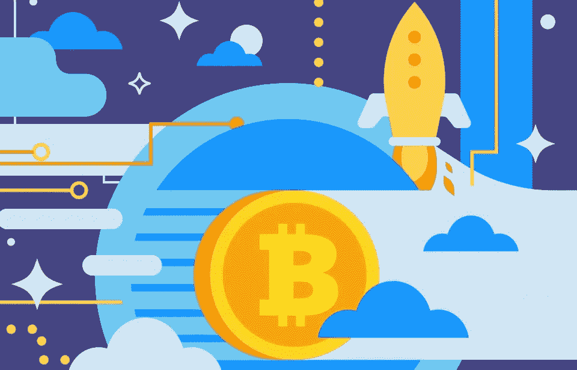

# 用简单的英语解释区块链上的资产令牌化

> 原文：<https://medium.com/coinmonks/asset-tokenization-on-blockchain-explained-in-plain-english-f4e4b5e26a6d?source=collection_archive---------0----------------------->

[区块链](https://blog.coincodecap.com/tag/blockchain/)上的To 化是 2018 年的一个稳定趋势。似乎从绘画、钻石和公司股票到房地产，一切都在区块链上被令牌化。在这篇文章中，我将描述在区块链上对资产进行令牌化意味着什么，以及它如何应用于物理资产。本文是《用简单英语解释》系列的一部分。在上一篇文章中，我用通俗的英语解释了[以太气](https://sharpcode.pro/ethereum-gas-explained-in-plain-english)。

让我们暂时忘记区块链和智能合约。假设你想投资房地产，但你的初始投资很少，比如 5000 美元。也许你想从小处着手，逐步增加投资。例如，你决定每三到四个月投资几千美元。显然，对于传统的房地产市场来说，这是很难做到的。你怎么能在一套公寓里买两三平方米的房子呢？

让我们扭转局势。假设你有一些财产，比如一套公寓。你急需现金。这套公寓价值 15 万美元，但你只需要 1 万美元。你能没有太多摩擦地快速做这件事吗？据我所知，这几乎是不可能的。

输入标记化。令牌化是一种将资产权限转换为数字令牌的方法。假设有一套 20 万美元的公寓。令牌化可以将这个公寓转换为 200，000 个令牌(这个数字完全是任意的，我们本来可以发行 200 万个令牌)。因此，每个代币代表基础资产的 0.0005%份额。最后，我们在某种支持智能合约的平台上发行代币，例如以太坊，这样代币可以在不同的交易所自由买卖。当你购买一个代币时，你实际上购买了该资产 0.0005%的所有权。购买 100，000 个代币，你就拥有了 50%的资产。购买所有 200，000 代币，您就是该资产的 100%所有者。很明显，你不会成为财产的合法所有人。然而，由于区块链是一个不可改变的公共账本，它确保了一旦你购买了代币，即使它没有在政府运营的登记处注册，也没有人可以“抹去”你的所有权。现在应该清楚为什么区块链支持这种类型的服务了。

因此，我们获得了一项资产，将其标记化，并创建了它在区块链上的数字表示。区块链保证所有权信息不可变。

是不是听起来太简单了？你可能会问，你需要做的就是这些吗？

*不幸的是，在我们能够成功地在区块链上标记真实世界的资产之前，需要解决一些问题。*

一个问题源于这样一个事实:到目前为止，没有一个国家对加密货币有一个坚实的监管。例如，如果一家处理标记化的公司出售该资产，会发生什么情况？代币所有者只拥有代币。他们对财产没有合法权利，因此不受法律保护。因此，需要修改法律以适应这些新的商业模式。

另一个问题是，这个系统让我们回到了某种中央集权。区块链，尤其是智能合约的整体理念是创造一个不可信的环境。虽然这在对数字资产进行令牌化时是可能实现的，但对于真实世界的物理资产，情况并非如此。因此，我们必须接受一定程度的中央集权。

其他资产的证券化也以类似的方式运作。如果有一幅毕加索的画价值 5000 万美元，它也可以被令牌化。这同样适用于黄金和钻石。公司股票更复杂，因为在大多数司法管辖区，禁止出售公司股份的零头。同样，要成功实现公司股票的令牌化，法律变革是必要的。

好消息是进展很快。我们几乎每周都会看到新的解决方案。一旦这些问题得到解决，就没有什么能阻止标记化过程。

# 谢谢大家！

你喜欢这个故事吗？访问[**我的博客**](https://sharpcode.pro) 了解更多关于以太坊、[智能合约](https://sharpcode.pro/tag/smart-contracts)、区块链、ico 和加密货币的有趣和独家故事。

> 加入 Coinmonks [电报频道](https://t.me/coincodecap)和 [Youtube 频道](https://www.youtube.com/c/coinmonks/videos)获取每日[加密新闻](http://coincodecap.com/)

## 另外，阅读

*   [密码电报信号](http://Top 4 Telegram Channels for Crypto Traders) | [密码交易机器人](/coinmonks/crypto-trading-bot-c2ffce8acb2a)
*   [复制交易](/coinmonks/top-10-crypto-copy-trading-platforms-for-beginners-d0c37c7d698c) | [加密税务软件](/coinmonks/crypto-tax-software-ed4b4810e338)
*   [网格交易](https://coincodecap.com/grid-trading) | [加密硬件钱包](/coinmonks/the-best-cryptocurrency-hardware-wallets-of-2020-e28b1c124069)
*   [最佳加密交易所](/coinmonks/crypto-exchange-dd2f9d6f3769) | [印度最佳加密交易所](/coinmonks/bitcoin-exchange-in-india-7f1fe79715c9)
*   [开发者最佳加密 API](/coinmonks/best-crypto-apis-for-developers-5efe3a597a9f)
*   最佳[密码借贷平台](/coinmonks/top-5-crypto-lending-platforms-in-2020-that-you-need-to-know-a1b675cec3fa)
*   [杠杆代币](/coinmonks/leveraged-token-3f5257808b22)终极指南
*   [加密交易的最佳 VPN](https://coincodecap.com/best-vpns-for-crypto-trading)
*   [最佳加密分析或链上数据](https://coincodecap.com/blockchain-analytics) | [Bexplus 评论](https://coincodecap.com/bexplus-review)
*   [NFT 十大市场造币集锦](https://coincodecap.com/nft-marketplaces)
*   [AscendEx Staking](https://coincodecap.com/ascendex-staking)|[Bot Ocean Review](https://coincodecap.com/bot-ocean-review)|[最佳比特币钱包](https://coincodecap.com/bitcoin-wallets-india)
*   [Bitget 回顾](https://coincodecap.com/bitget-review)|[Gemini vs block fi](https://coincodecap.com/gemini-vs-blockfi)|[OKEx 期货交易](https://coincodecap.com/okex-futures-trading)