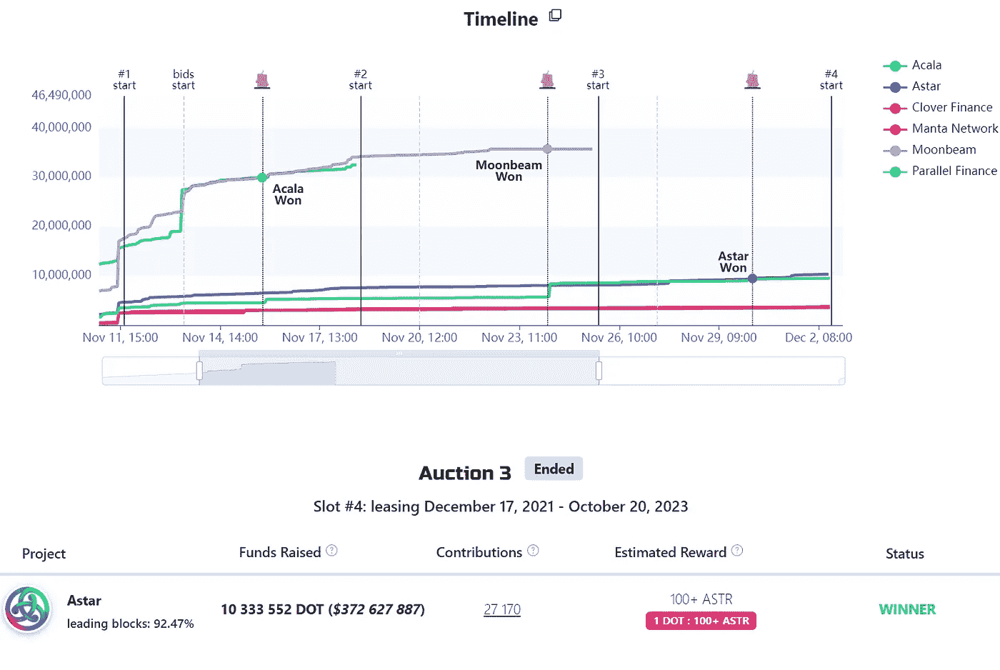
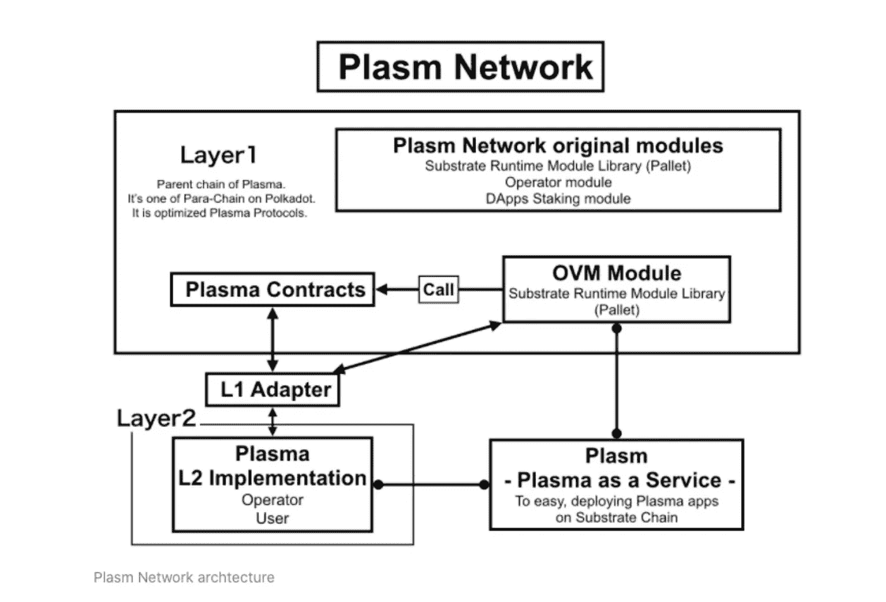

# Astar 赢得第三次大众贷款拍卖

> 原文：<https://medium.com/coinmonks/astar-wins-the-3rd-crowd-loan-auction-a67d608dc448?source=collection_archive---------7----------------------->

~dwulf

我的第二选择赢了，我觉得我完整了。算是吧。

Astar 有很大的潜力，因为他们参与了 EVM 原始以太坊虚拟机以及 WASM 网络大会。这两种动力来自传统的以太坊区块链和波尔卡多特。

> “祝贺 Astar Network 成为第三家赢得 Polkadot 连锁警卫拍卖的企业！
> 
> Astar 将在第一批拍卖中与其他五名获胜者一起在 8179200 号地块(约 12 月 18 日)正式播出。目前，已有超过 27，000 人阻止了. to assistance 拍卖行动"。

## 那现在怎么办？

由于这是 5 场拍卖中的第 3 场，Astar 将于 12 月 18 日左右在 8179200 号地块正式上线。贡献的每个人将开始收到他们的奖励，ASTR 代币。不知道实际价格会是多少，但根据 Astar 的区块链的效用，我想它会与 Cosmos，Pokadot 持平，可能每枚令牌 30-40 美元，随着智能合同的价值主张增加，这个数字可能会增加。

这是一个为期 2 年的租约，所以如果你贡献了你的点被锁定 2 年，并将在租约到期后归还，这比投资 ICO(首次发行硬币)好得多，在那里他们拿着你的钱跑了。这样，投资就有了“固定”的责任。伴随着所有的奖励，以及作为这个优秀项目和 Sota 的支持者的绝对荣誉。

一个人的贡献将决定你的回报。最好的方法是通过你的钱包直接登陆他们的网站。交易所有办法进入市场，但它们会从中分一杯羹。他们也可以选择通过平衡和平行融资。后者在流动性方面有一些优势。

**Astar 是什么？**

Astar 正式名称为 Plasma，是一个 1 层和 2 层区块链系统。

Astar 网络是基于奇偶校验基础的第 1 层公共区块链。在基板之上，Astar 团队正在开发 OVM(托盘)模块、卷装和功能，以制造可扩展的 dApps。Astar 网络将作为 Polkadot Parachain 的首个 Rollups/OVM 区块链第 2 层解决方案。

## **结论**

这让我觉得 Astar 的未来是光明的。我期待着在其中发展。对 EVM 和 WASM 的开放以及这种互操作性的力量使它成为一个伟大的媒介，可以搭建一座通向宇宙区块链和其他许多东西的桥梁。

> 加入 Coinmonks [电报频道](https://t.me/coincodecap)和 [Youtube 频道](https://www.youtube.com/c/coinmonks/videos)了解加密交易和投资

## 也阅读

 [## 杠杆代币[多头代币]终极指南

### 杠杆化令牌是具有杠杆化风险敞口的 ERC20 令牌，不考虑保证金、要求、管理…

medium.com](/coinmonks/leveraged-token-3f5257808b22)  [## 最佳加密交易所| 2021 年十大加密货币交易所

### 加密货币交易所的加密交易需要了解市场，这可以帮助你获得利润。之前…

blog.coincodecap.com](https://blog.coincodecap.com/crypto-exchange)  [## 2021 年最佳加密借贷平台| 6 大比特币借贷平台

### 获得比特币和其他加密货币的最佳贷款利率

medium.com](/coinmonks/top-5-crypto-lending-platforms-in-2020-that-you-need-to-know-a1b675cec3fa)