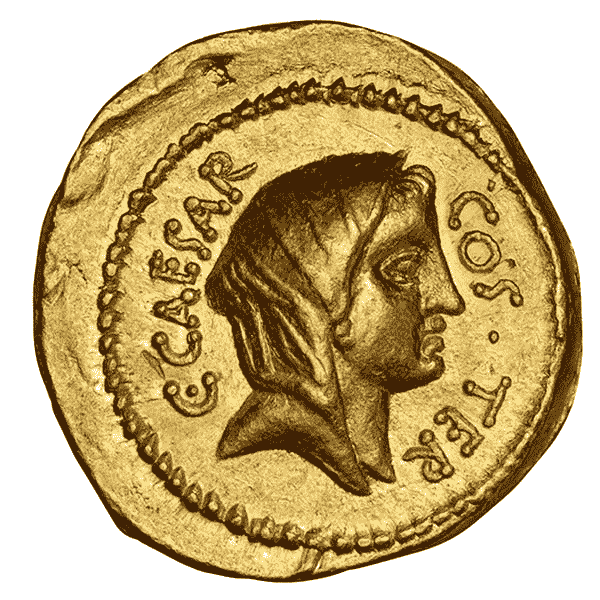
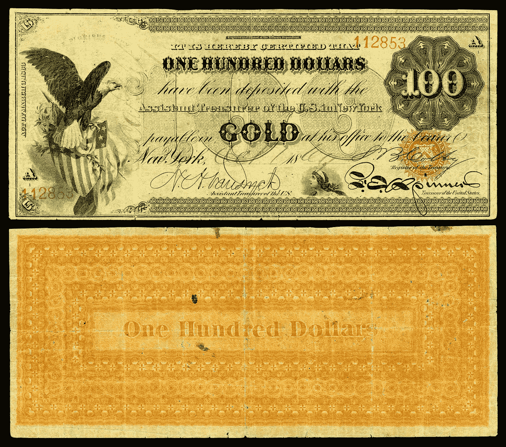
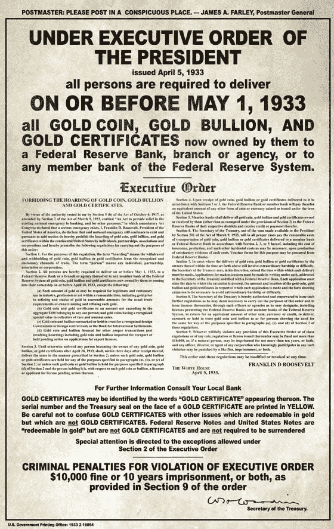
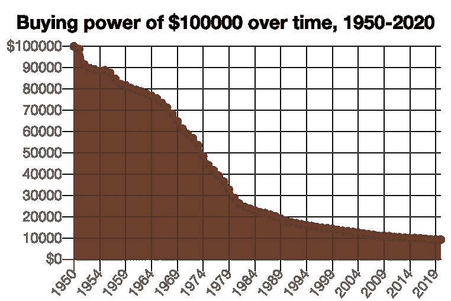
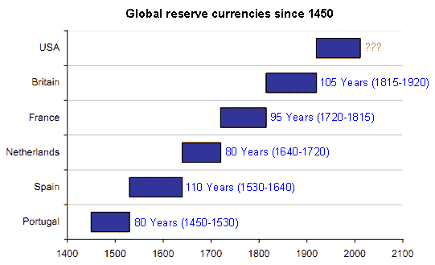
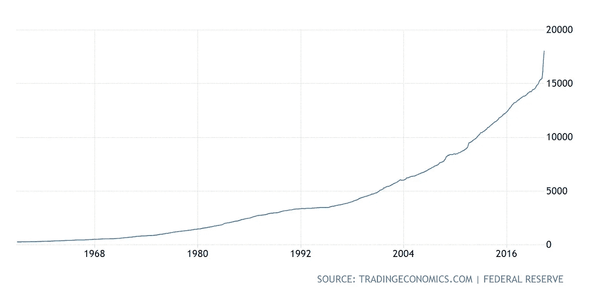
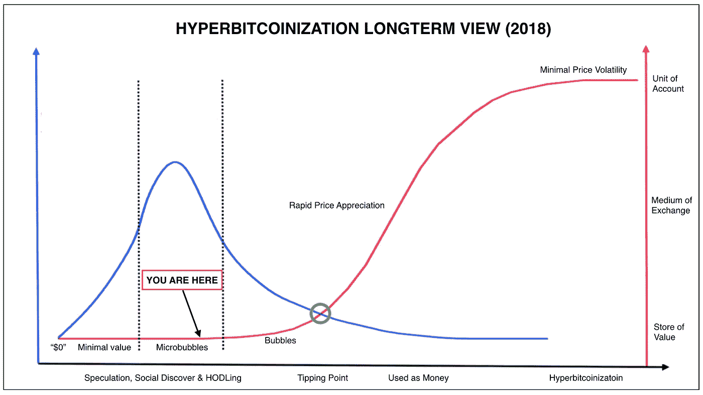

# 在兔子洞的边缘

> 原文：<https://medium.com/coinmonks/at-the-edge-of-the-rabbit-hole-2406aa16127c?source=collection_archive---------2----------------------->

现在是 2017 年 12 月。比特币的价格正在暴涨。

几个月没消息的朋友都在给我打电话——WTF 是比特币？我怎么买？

比特币一直在撕。

$10,000\. $11,000\. $12,000.

在 15000 美元的价格图表是抛物线。

给我朋友的建议？这是网络货币。但它是分散的。没有人控制它。很酷。

回想那些对话，我对比特币了解不多，尽管我在比特币文章和 YouTube 视频上花了几十个小时。“去中心化”(没有人控制)在概念上很容易解释。但是这到底意味着什么呢？这意味着什么？

诚然，了解比特币并不容易。

大多数谈话都以我说的“不要投资超过你愿意失去的”而结束。

也是在这个时候，我偶然发现了一本名为《比特币标准》的书，作者是 Saifedean Ammous。这本书还没有上市，但我从亚马逊上预购了一本。

4 个月后，当它终于到来时，传说中的 2017 年比特币牛市早已结束。在 12 月 17 日达到每枚 20，000 美元的峰值后，[比特币](https://blog.coincodecap.com/a-candid-explanation-of-bitcoin/)开始暴跌，其强度几乎与上涨时一样。

当时是 2018 年 4 月，比特币的交易价格在 9000 美元左右。它上升了吗？还是下来？我不知道。兴奋已经消退。许多人声称比特币正在走向零。

尽管我仍然很感兴趣，但学习比特币已经完全让位于我在一家初创公司的工作和与我女朋友在一起的时间。比特币标准在我的书架上找到了一席之地，我没有再去想它。直到一个月前。

我的冠状病毒封锁分为几个阶段。即失业。其次是电影，桌游，电子游戏，吃饭。最近，我开始阅读。

我不记得是什么促使我拿起我的《比特币标准》——它可能是 [Anthony Pompliano](https://medium.com/u/1d0168ffead9?source=post_page-----2406aa16127c--------------------------------) 的时事通讯之一，或者是互联网上某个地方的一个帖子——但是一旦我拿起它，我就不能放下它。

[比特币标准](https://www.amazon.ca/Bitcoin-Standard-Decentralized-Alternative-Central/dp/1119473861/)无疑是我读过的最好的书之一。它教会了我一些我认为自己了解的经济学知识(我有经济学学位)，并描绘了一幅关于货币的过去、现在和未来的不可思议的画面。对于任何对我们的世界正在如何变化感到好奇的人来说，这是一本必读的书。了解货币对我们社会的基本影响是令人兴奋、疯狂和鼓舞的——如果 Saifedean 是对的——这个星球上没有人的生活不受比特币的影响。

从那以后，我读过(和没读过)的书越来越多。关于比特币的书比较多。还包括关于经济学、货币史、全球银行体系、通货膨胀和通货紧缩的书籍。被*认为*无聊的事情——从新的角度来看——一点也不无聊。在这些书的上面，是越来越多的文章和播客的档案，排队的速度比我听或读的速度快得多。

The Bitcoin rabbit hole.

这篇文章的其余部分是关于我在阅读比特币标准以及随后的许多书籍、文章和播客时学到的东西。

和兔子洞一样，我也不会是第一个使用这个比喻的人:学习比特币就像爬山。就在你接近一个高峰时，另一个高峰出现了。而且可以肯定的说没有顶。令人望而生畏。但它很可能是人类攀登过的最重要的山峰。所以我们开始爬吧。

# 第一部分:钱是什么？

货币可以简单地描述为人们用来作为交换媒介的任何东西。在历史上，贝壳、珠子和石头都曾作为货币使用，并取得了不同程度的成功。某些品质使一些东西比其他东西更值钱。这些品质中最重要的是**稀缺性**。

货币的稀缺性是指货币的数量有限。

想象一下，在一个偏远的小岛上，当地人用珠子交换食物。这些珠子很稀有，岛上没有人能轻易制造它们。直到有一天，有人带着一艘装满珠子的船来到岛上，并开始与当地人进行交易。碰巧的是，这位探险家有如此多的珠子，他们可以用它们来交换岛上几乎所有的食物。由于食物供应不足，许多当地人靠珠子致富。现在仍然有食物的当地人意识到珠子不再像以前那样有价值，他们需要更多的珠子来换取剩余的食物。这种情况一直持续到有一天，每个人都意识到剩余的食物比世界上所有的珠子都要珍贵得多。毕竟人不能吃珠子。在这一点上，珠子已经变得毫无价值，贸易停止，直到当地人找到一种新的货币(希望这种货币更稀缺，更不容易增加供应)。让我们假设他们偶然发现了黄金。

## 货币的属性

黄金是有史以来作为货币存在时间最长的资源。地球上的黄金数量有限，很难开采。锻造黄金也很难，不像珠子。这些属性使得黄金 ***成为可靠的稀缺*** 和可信的货币形式。

黄金的其他优点是:

**耐久性**:大部分已经被开采的黄金现在仍然存在，并且将在未来很长一段时间内存在。随着时间的推移，它是一种可靠的价值储存手段。

可验证性:黄金的真实性很容易验证。

**既定历史**:如前所述，自人类文明存在以来，黄金就一直受到重视。

**可分割性**:纯金可以被处理成少量或大量，以支付不同价值的款项，尽管这给其所有者带来了极大的不便。历史上，这一困难被金币的铸造和流通所克服，有效地使黄金可分割。

Roman Gold Aureus of Julius Caesar circa 29BC — 14AD.

以下品质是黄金作为货币开始显示其弱点的地方。

**便携性**:在数量较大的情况下，黄金不太便于携带。带着你的黄金财富四处走动变成了一项几乎不可能完成的任务。携带证明你拥有黄金的“黄金证书”会方便得多。证书可以由银行签发，你的黄金被安全地保存在那里，银行可以互相呼叫以跟踪交易。事实上，这正是美国银行在 1863 年至 1933 年间所做的。只要你能信任你的银行，这种安排基本上没问题。

Gold certificate in 1865, redeemable for its value in cold, hard gold.

**抵制审查**:这是指任何一方无法没收你的钱或阻止你进行交易。第 6102 号行政命令证明，黄金在这方面表现不佳，该命令规定在美国拥有实物黄金是非法的。为了交换他们的黄金或黄金证书(如上图所示)，人们得到了与黄金等值的纸币。那是 1933 年。

这是货币史上的一个重要转折点。在第 6102 号行政命令之后，人们不再拥有他们的黄金，而是拥有一张代表政府拥有的黄金价值的纸。

# 第二部分:货币简史

自从文明出现以来，钱就一直存在。你可以在这里找到一篇关于货币历史的深度文章。在这篇文章中，我将从 1933 年美国政府颁布第 6102 号行政命令的地方开始。这是我们今天所知的法定货币历史的开端，对于理解比特币的价值非常重要。

Executive Order 6102 made owning gold illegal, punishable by up to 10 years in federal prison.

法定货币被定义为一种货币，这种货币只有在政府宣称有价值时才有价值。它没有内在价值，也没有任何商品(如黄金)的支持。

1971 年，当政府宣布放弃金本位制时，美元正式成为法定货币。美元价值——以前与黄金储备挂钩——当时仅仅由政府的承诺和人民对其价值的集体信念来支撑。这同样适用于当今世界的每一种国家货币。

为什么这很重要？当提到我们赚钱的品质时，法定货币表现得相当好。尤其是考虑到今天围绕它建立的数字基础设施。Fiat 易于移植、可分割、可验证和可替换。

尽管法定货币失败了，它还是失败了。

## 菲亚特失败

在法定货币的历史上，没有一个政府能够抵挡住诱惑，印制更多的法定货币。这使得法定货币在稀缺时尤其糟糕。一点都不稀缺。

情况变得更糟。印更多的钱会伤害任何选择用这种货币储存财富的人，因为每次创造更多的钱，现有的供应就会失去价值(类似于我们之前的岛屿珠例子)。更多的美元可以用来购买相同数量的商品。价格上涨，你的钱买的少。

这个过程被称为**通货膨胀**，随着时间的推移降低了美元的购买力。

事实证明，法定货币是一种糟糕的价值储存手段。

$100,000 in 1950 would buy you the equivalent of $10,000 today. How low can it go?

然而，这仍然只是冰山一角。法定货币的历史是一部失败的历史。曾经存在过的每一种法定货币都经历过贬值(见上图)，而**十种法定货币中有八种**都以崩溃告终，不仅是货币，还有其东道国经济。法定货币的平均寿命是 27 年。

如果以历史为例，我们今天使用的法定货币，包括曾经占主导地位的美元，最终都会失败。

## 全球储备货币

1944 年，来自世界各地的代表聚集在一起，正式同意美元将作为新的世界储备货币。在这个协议下，美元与黄金挂钩，其他货币与美元挂钩。如今，世界经济与美元密不可分。但是，即使是世界储备货币也不能幸免于货币崩溃的风险。

自 15 世纪中叶以来，世界储备货币的平均寿命大约为 100 年。下图中除了两种货币(英镑和美元)外，其他货币都失败了，只有美元还没有遇到导致其失去世界储备货币地位的情况，而这种地位已经保持了 100 年。

The average lifespan of a world reserve currency is about 100 years. The US dollar first unseated the British Pound in 1920, before officially being named the world reserve currency in 1944.

我们不禁要问，这一次会有所不同吗？很难想象像美国这样拥有全球贸易影响力和军事实力的国家会失去这种力量。然而这也是英国、法国以及所有在他们之前的国家的情况。

这里的教训是，不管是不是全球储备货币，法定货币的寿命都是有限的。没有一个国家能免受货币供应扩张的破坏性影响。印钞票导致通货膨胀，通货膨胀导致最终的货币崩溃，因为这种货币的价值下降到零。

下图显示了从 1959 年到今天美国货币供应量的扩张(以十亿美元计)。最近，接近垂直的峰值代表美国正在印刷钞票，以防止冠状病毒期间全球经济关闭引发的经济崩溃。

US money supply expansion from 1959 until today.

正是这种旨在防止经济危机的反动的大规模印刷尤其令人担忧。我们在 2009 年(和 2011 年，以及 2013-2015 年)认为过度的东西与今天发生的印刷相比就相形见绌了。美国政府只是通过向经济注入更多资金来推迟不可避免的事情，但每次都需要更多资金来避免崩溃。

值得注意的是，随着美国货币供应总量接近 20 万亿美元，自 2012 年以来，他们的货币供应量将在短短 8 年内翻一番。那是许多珠子。

许多评论家认为这是一个未知的领域:

> “它在全球范围内发生的速度如此之快，以至于连我这样的市场老手都哑口无言。[……]我们正在目睹巨大的货币通胀——各种形式的货币前所未有的扩张，这是发达世界从未见过的。”——保罗·都铎·琼斯，华尔街传奇投资者，解释他购买比特币的理由。

如果不是美元，下一个世界储备货币会是什么？

# 第三部分:比特币是什么？

不管你可能听说过什么，比特币可以用一个词来解释:钱。比特币就是钱。除此之外，比特币是一种数字货币，由一个化名为中本聪的人于 2009 年推出。自 2011 年以来，这个人(或扮演 Satoshi 的一群人)一直杳无音信。到那时，一个活跃的开发者社区已经接受了这个项目，Satoshi 已经明确表示，他认为这个项目得到了很好的管理。如今，比特币开发者社区比以往任何时候都更加活跃。

## 比特币的钱是怎么来的？

关于比特币，最重要的是要知道它是**稀缺**。比特币协议中硬编码了一条规则，即只有 2100 万个比特币会存在。全世界运行比特币软件并为网络供电的一万多人都同意这一规则。单独来说，它们被称为节点。

正是比特币网络的这种分布式本质确保了比特币的规则永远不会改变。任何不同意或试图改变规则的人都会被网络中的其他人忽视。重要的是，比特币网络是公开、透明、开源的，世界上任何人都可以运行一个节点。

所有这些加在一起，意味着比特币是绝对稀缺的。只有 2100 万个比特币会存在，任何人都可以检查代码来确认这一点。此外，这意味着比特币不仅永远不会遭受通货膨胀，而且事实上它是 ***通货紧缩*** 。随着越来越多的人采用比特币，可供流通的东西越来越少，需求的增加推动了比特币的价格上涨。(稍后将详细介绍这一点。)

作为分布式网络的另一个优势是，你不能关闭比特币。为了有效地做到这一点，你必须关闭整个互联网(这很难)，从而禁用每一个节点。即便如此，只要你重新打开互联网，比特币就会恢复运行(就在它停止的地方)。

如前所述，没有人控制比特币。今天，如果你想向海外汇款，你必须使用银行或第三方支付处理器，如贝宝。如果这些人不喜欢你或认为你有任何可疑之处，他们可以阻止你付款，甚至扣留你的资金。有了比特币，有史以来第一次，两个人可以在不依赖可信中介的情况下远距离转移价值。比特币是第一种抵制审查的货币，它不受任何中介或当局的控制，包括政府。

再回到货币的属性，比特币做得非常好。这既是稀缺的，也是抵制审查的。

接下来我们来看看**整除**。一个比特币可以被分割到小数点后 8 位。任何人都有能力购买、出售、发送或接收小额和大额交易。

比特币**便携**。携带价值数亿美元的比特币在一个小小的 u 盘上旅行是可能的(只有你知道它的密码)。使用比特币网络，同样数额的资金几乎可以瞬间汇往世界各地。

比特币是**可验证的**。不像法定货币和黄金都是可伪造的，比特币实际上是不可能伪造的。

在比特币尚未达到法定水平或黄金已经有了既定历史的地方，尽管比特币的寿命很短，但它经受住了黑客或其他破坏网络的各种尝试，包括被政府禁止。实际上，没有杀死比特币的东西会让它变得更强大。

此外，[林迪效应](https://en.wikipedia.org/wiki/Lindy_effect)表明，比特币存在的时间越长，就越有可能在未来长期存在。

引用上面的原因，比特币对世界上许多人来说已经是一种有吸引力的货币。举个例子，那些需要保护他们的财富免受通货膨胀或恶性通货膨胀影响的人，或者那些逃离压迫性政权的人(见[委内瑞拉](https://www.nytimes.com/2019/02/23/opinion/sunday/venezuela-bitcoin-inflation-cryptocurrencies.html)，[黎巴嫩](https://www.forbes.com/sites/tatianakoffman/2020/07/09/lebanons-currency-crisis-paves-the-way-to-a-new-future/#6089fc646a17))。比特币允许他们这样做。

# 第三部分:比特币为什么有价值？

像法定货币一样，比特币没有黄金或任何其他有价值的资产支持。和菲亚特一样，比特币的价值仅仅来源于人们的集体信仰。这种信念包括相信比特币(或法币)在今天和未来都会作为货币有价值。然而，与菲亚特不同的是，比特币绝对稀缺。甚至有人说，除了时间，它是宇宙中唯一真正稀缺的资源。

我们必须问自己，我们如何对待一种绝对稀缺的资源，这种资源在几乎所有的货币属性中排名都非常好，只是因为它没有既定的历史而完全缺乏？

人们通常分成两个阵营。一个群体认为比特币有价值，购买一些来使用，作为投资持有，储存他们的财富，或者三者兼而有之。他们知道，购买比特币的人越多，比特币就变得越有价值，他们越早买入(当价格较低时)，当比特币价格上涨时，他们的境况就越好。

另一组人认为比特币没有价值——出于各种原因——并选择不购买比特币。

根据我们对货币属性的分析，说比特币是世界上有史以来最难赚的钱并不为过。就像互联网一样，它似乎会一直存在下去。如果这两点成立，随着越来越多的人开始相信比特币是货币，未来几年比特币的采用应该会很有趣。

## 艰难时期的硬通货

在继续之前，我们先来看看硬通货。

要让货币变得坚硬，它需要执行货币的部分或全部基本功能，但最重要的是，它需要稀缺。货币的稀缺性保护了那些选择持有货币财富的人免受导致通货膨胀的供给冲击。

此外，历史表明，当不受政府阻碍时，人们会逐渐倾向于最难获得的钱来保护他们的财富。

回到我们的岛珠例子，很明显，珠不是硬钱。对于某些人来说，他们很容易制造更多的(极大地膨胀了供给)导致经济崩溃。

作为货币的贵金属也有类似的故事。在历史上的大部分时间里，白银一直被用作货币，但从未与黄金等同过。这是因为银比金更容易开采。每当白银价格大幅上涨时，生产白银的人就会开采更多的白银，在市场上出售。供应的增加使价格回落。

开采黄金要困难得多，成本也高得多，尽管同样的情况也适用。当黄金价格上涨时，生产者有更多的动力去开采，但由于黄金开采的难度和在地球上的稀有性，黄金的整体供应量很难增加。

另一方面，我们有法定货币，央行在键盘上敲几下就能创造出来。它的供应是无限的，而且创造更多的它几乎没有成本。

黄金是硬通货。西尔弗就不那么想了。珠子是软钱。

法定货币是世界上有史以来最软的货币。

由于比特币的供应是固定的，尽管我们可以尝试，但我们无法创造更多。没有一个政府能出版它。我们可以在公开市场上买卖比特币，导致价格波动，但这并不会增加整体供应量。只会有 2100 万个比特币。正因为如此，值得重复一遍:

比特币是世界上有史以来最难赚的钱——任何能上网的人都可以使用它。

比特币现在和未来的价值来自越来越多的人相信这是真的。

# 第四部分:接下来会发生什么？

货币有三个明确的采用阶段，我们已经讨论过了。

金钱的第一阶段是随着时间的推移，它成为可靠的价值储存手段。在这个阶段，我们的珠子就是钱(直到它们不再是钱)。随着时间的推移，收藏品和传家宝被认为是更可靠的价值储存手段。

货币的第二个阶段是当它被用作交换媒介的时候(T3)。在这里，珠子或其他类似的物品都有资格成为货币，直到你冒险走出你所在岛国的边界，遇到那些不像你一样重视珠子的人。他们甚至可能根本不想要它们。要成为有效的交易媒介，货币需要像黄金或其他贵金属一样被普遍估价。

货币的第三个阶段是当它成为一个**记账单位**。这是因为全球价格都是以货币单位来计价的。各国法定货币是我们今天交换商品和服务的记账单位，其中美元最为突出。

大多数人认为，比特币仍然处于成为价值储存手段的非常早期的阶段(货币的第一阶段)。比特币已经存在了 11 年，但当在交易所大量买卖时，它仍然容易出现价格波动。比特币的价格在一天之内上下波动 5-10%并不罕见。尽管是硬通货，但这种波动性是今天许多人不愿使用比特币作为价值储存手段的原因。

也就是说，越来越多的人*正在使用比特币*，无论他们是早期采用者，坚持未来收益，还是出于保护自己的财富免受恶性通货膨胀或暴虐政权影响的需要而使用比特币(再次参见[委内瑞拉](https://coin.dance/volume/localbitcoins/VES))。

虽然难以衡量，但最近一项深思熟虑的估计显示，全球使用比特币的人数约为 6000 万。

## 政府呢？

比特币被采用的一个常见障碍是政府将其定为非法。这(理论上)是可能发生的，许多国家已经试图禁止其公民使用比特币，但要想有效地做到这一点，他们必须禁止其公民使用互联网。尽管如此，世界各国政府全面禁止比特币(不管可能性有多大)确实会减缓比特币的普及。

更有可能发生的是政府接受比特币。

[以伊朗为例](https://www.coindesk.com/rouhani-bitcoin-mining-iran)。鉴于美国政府的严厉制裁，伊朗正在迅速成为国际比特币领域的主要参与者。

美国可以无视比特币，希望伊朗是在浪费时间。然而，在比特币价格大幅上涨的情况下，伊朗将在金融上受益，而美国不会。投资比特币很有可能让伊朗变得非常富有。

明白了这一点，美国在比特币上采取“防御立场”(大于或等于伊朗)是合乎逻辑的，以确保伊朗不会因为在美国没有的领域积累财富而获得经济立足点。

这是一个过于简单的例子，只用了两个不和的政府。事实上，这可能会在世界上每一个政府之间上演，就像 20 世纪的太空竞赛一样，推动比特币价格快速上涨。由此对全球经济产生的影响被称为“超级比特币化”。

[超比特币化](/coinmonks/hyperbitcoinization-winner-takes-all-69ab59f9695f)指的是比特币成为全球记账单位(货币的最终阶段)，世界各地的价格以比特币计价，而不是美元或欧元或人民币。在这一点上，世界上的每一种法定货币将集体变得一文不值，因为个人、机构、银行、政府以及最终的央行将把他们的财富从软法定货币转移到比特币。如果这种情况发生，这将是世界上有史以来最大的财富再分配事件。

外卖？考虑到稳定的采用，在某一点上，拒绝比特币将比忽视它付出更大的代价。

An approximation of where we might be in the adoption lifecycle of Bitcoin. Red equals price. Image by [ObiWan Kenobit](https://medium.com/u/a8635bddb8b6?source=post_page-----2406aa16127c--------------------------------)

# 结论

如果还有什么要说的，那就是没有人真正知道这将如何发展。我们只能根据历史的教训来预测今天的动态。世界将如何应对一种绝对稀缺的货币形式？日益控制的政府将如何应对他们无法控制的资金？在我做了所有的阅读和研究之后，这篇文章是对我有意义的事件的一个版本。只有时间能证明一切。

无论如何，我相信越多的人了解货币——它的历史、用途和滥用——我们的世界就会变得越好，不管有没有比特币。我真心希望是和🚀

感谢阅读。

> [*在您的收件箱中直接获得最佳软件优惠*](https://coincodecap.com/?utm_source=coinmonks)

*   在推特上关注我:[https://twitter.com/AubreyJesseau](https://twitter.com/AubreyJesseau)

***

## 要想更深入地了解比特币，可以看看下面的一些书或博客。

**博客**

金钱的主人和奴隶

[看好比特币的理由](/@vijayboyapati/the-bullish-case-for-bitcoin-6ecc8bdecc1) — [Vijay Boyapati](https://medium.com/u/9efdc740067f?source=post_page-----2406aa16127c--------------------------------)

[比特币是常识](https://unchained-capital.com/blog/bitcoin-is-common-sense/)——[帕克·路易斯](https://medium.com/u/4860f822b31a?source=post_page-----2406aa16127c--------------------------------)

[我投资比特币的 3 个理由](https://www.lynalden.com/invest-in-bitcoin/)——[林恩·奥尔登](https://twitter.com/LynAldenContact)

**书籍**

[比特币标准，](https://www.amazon.ca/Bitcoin-Standard-Decentralized-Alternative-Central/dp/1119473861)[Saifedean Ammous](https://medium.com/u/becf6824fd89?source=post_page-----2406aa16127c--------------------------------)(2018)

[明天的价格，](https://www.amazon.ca/Price-Tomorrow-Deflation-Abundant-Future/dp/1999257405/ref=tmm_pap_swatch_0?_encoding=UTF8&qid=1594405869&sr=1-1) [杰夫·布斯](https://medium.com/u/908b3ccc6651?source=post_page-----2406aa16127c--------------------------------) (2019)

[发明比特币，](https://www.amazon.ca/Inventing-Bitcoin-Technology-Decentralized-Explained/dp/1794326316/ref=tmm_pap_swatch_0?_encoding=UTF8&qid=1594405933&sr=1-1) [Yan Pritzker](https://medium.com/u/a8dd4f62f8c8?source=post_page-----2406aa16127c--------------------------------) (2019)

[21 课:我从掉进比特币兔子洞学到的东西，](https://www.amazon.ca/21-Lessons-Learned-Falling-Bitcoin/dp/1697526349/) [吉吉](https://medium.com/u/29f663fdaf68?source=post_page-----2406aa16127c--------------------------------) (2019)

[小小比特币之书(2019)](https://www.amazon.ca/Little-Bitcoin-Book-Matters-Finances/dp/1641990503/)

***