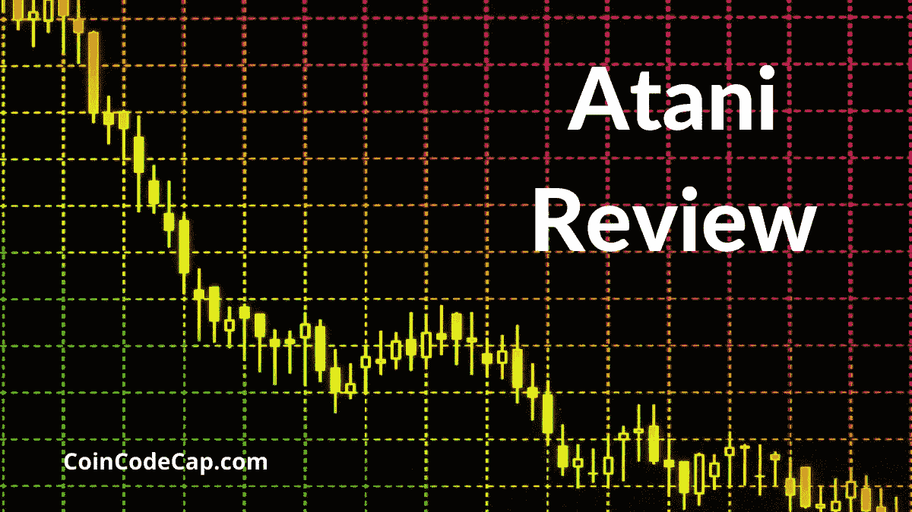
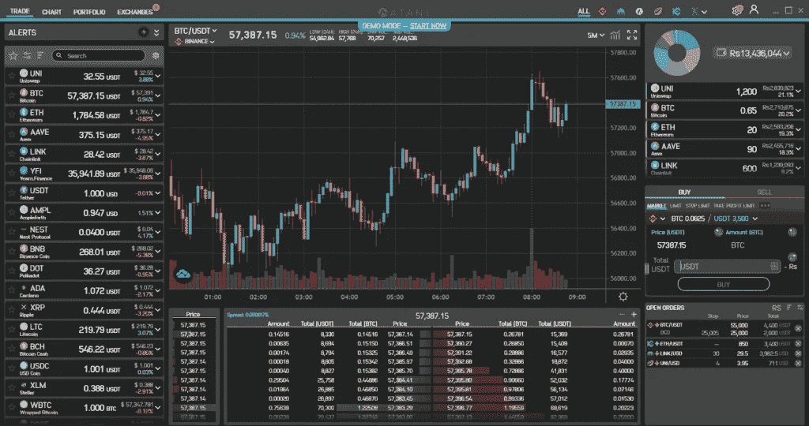
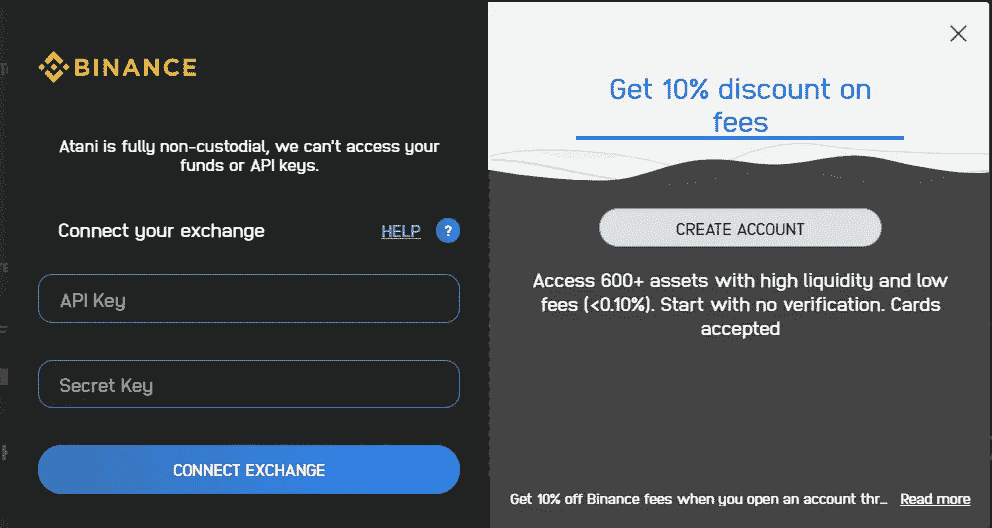
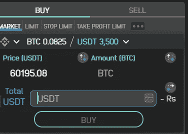
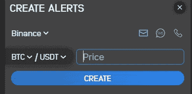
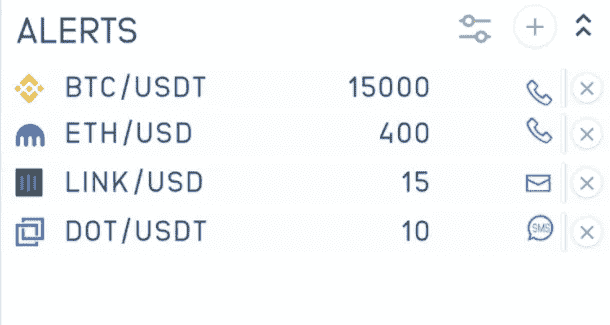
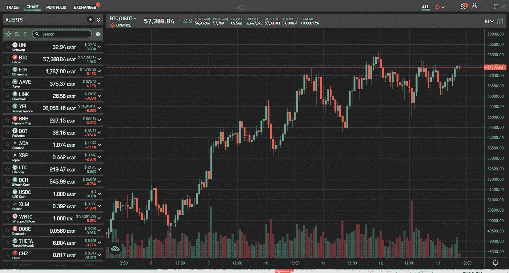
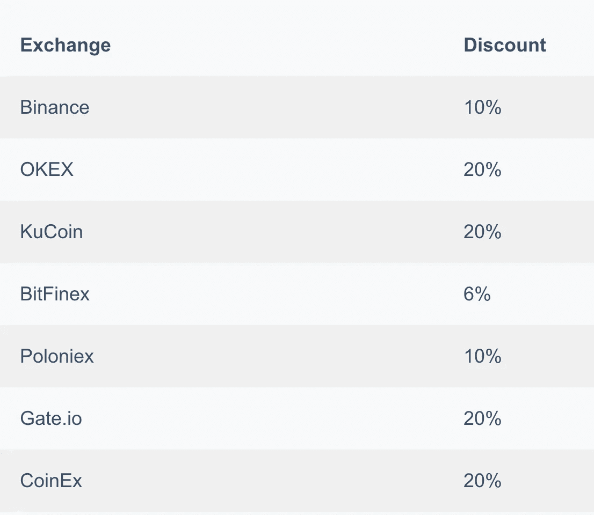

# 阿塔尼评论 2021 |市场上最好的加密交易终端？

> 原文：<https://medium.com/coinmonks/atani-review-8ce2a1c305d8?source=collection_archive---------1----------------------->

在这篇文章中，我们将回顾保罗和海迪·巴罗佐于 2019 年在伦敦、马德里和巴塞罗那之间创立的一体化加密交易平台 [**【阿塔尼**](https://blog.coincodecap.com/go/atani) 。它们提供对 22 个交易所的交易和投资组合的安全访问，以及免费的一键式税务报告系统。

它允许你计划你的资产配置，比较不同交易所的利率，用实时订单簿分析流动性，使用[交易视图](https://blog.coincodecap.com/go/tradingview)图表并查看你所有的历史交易。您可以通过一次点击在交换和配对之间移动。
他们获得了多项奖项和认可，如 2019 年 TechCrunch Disrupt 的顶级区块链奖，2020 年欧洲区块链大会的前 3 名初创企业，2021 年西班牙科学和创新部的卓越创新奖，等等。

# 总结(TL；博士)

*   Atani 提供一个加密交易聚合器，用于交易、设置实时警报、管理投资组合、生成税务报告和技术分析工具。
*   [多交易所交易终端](https://blog.coincodecap.com/multi-exchange-crypto-trading-platforms-features)连接 22 个密码交易所。它们支持超过 1500 种加密货币和 9000+对。
*   交换机可以使用 API 连接到 Atani。您可以完全控制您的 API 密钥，因为 Atani 是非托管的，也就是说，它不存储您的 API 密钥。
*   您将通过短信、电子邮件和电话收到实时提醒。
*   他们为技术分析提供了一系列交易视图工具，如图表、绘图工具、技术指标等等。
*   Atani 自动生成经审计的税务报告，你可以一键下载。
*   提供用户友好的界面
*   你可以从 [**这里**](https://atani.com/download) 下载阿塔尼的桌面应用。

# 阿塔尼评论:交易终端

[**阿塔尼的**](https://blog.coincodecap.com/go/atani) 是一个交易终端，可以让你直接和 22 个交易所进行交易。它有许多功能，例如:

*   延迟 100 毫秒的实时订单
*   跟踪和交易超过 1500 种加密货币和 9000 多对加密货币
*   不涉及任何中间人。
*   没有额外的费用
*   数据基础架构实时处理超过 10 亿个日常事件
*   止损、止盈、OCO 等高级订单。

现在，让我们看看如何开始使用阿塔尼交易终端。

## 将您的加密交换与 Atani 连接

您的交换 API 密钥对您进行身份验证，并将您的加密交换连接到 Atani。

如果您在 crypto exchange 上没有帐户，您也可以直接从 Atani 应用程序创建一个帐户。加盟计划帮助您在选定的[加密交易](https://blog.coincodecap.com/crypto-exchange)中获得一些折扣。

要使用 API 密钥将 exchange 与 [**阿塔尼**](https://blog.coincodecap.com/go/atani) 连接，您必须遵循以下步骤

*   登录到您想要连接 Atani 的 exchange 帐户。
*   您必须创建一个 API 密钥，并将其权限设置为“Trade”。
*   然后，复制 API 密钥和秘密密钥。
*   转到 Atani 桌面应用程序中的“交换”标签。
*   点击同一个交易所。每个交易所都有一个帮助部分。
*   粘贴 API 和密钥，然后单击“连接交换”

## 使用 Atani 在您的加密交易所创建订单

Atani 提供各种类型的订单:

*   停止市场订单
*   限价止蚀订单
*   接受盈利市场订单
*   接受利润限制订单
*   OCO 市场订单
*   OCO 限价单

OCO 的意思是一个抵消另一个。它允许您同时下两个订单，共享相同的余额(限价订单和止损市价订单)。一旦一个订单得到部分或完成，剩下的订单将自动取消。

因此，只执行一个订单。这有助于你保护你的利润(限价单)和减少潜在的损失(止损单)。

# 阿塔尼评论:实时预警

[**Atani**](https://blog.coincodecap.com/go/atani) 让你通过短信、邮件、电话接收实时提醒。您可以为超过 1，500 种加密货币设置警报。他们帮助你永远不会错过你的贸易了。

你必须选择你想要的交易所、加密货币对和警报模式，然后点击“创建”

您还会收到每月免费提醒，包括 1，000 封电子邮件、200 条短信和 30 个电话。

如果您的手机处于勿扰模式或夜间模式，您将连续收到两个电话。

您也可以从 [**Atani**](https://blog.coincodecap.com/go/atani) 应用程序查看和管理这些警报。

# 阿塔尼评论:图表和技术分析

[**阿塔尼**](https://blog.coincodecap.com/go/atani) 提供了一系列用于技术分析的交易工具，如图表、绘图工具、技术指标等。

*   图表——蜡烛线、空心蜡烛线、棒线、Heikin Ashi、面积、线条和基线
*   绘图工具——他们提供了 50 多种绘图工具，如 Fibonacci、Gann rations、Elliot waves 等。
*   技术指标——它们提供 80 多个交易指标，如布林线、均线等等。

此外，您还可以个性化日期范围(分钟、小时、天、周)和时间间隔。

# 投资组合和税务报告

[**【阿塔尼】**](https://blog.coincodecap.com/go/atani) 自动生成已审计的税务报告，点击即可下载。它们还提供以您的货币计算的实时投资组合估值。这可以帮你节省很多时间。

它们位于“投资组合”选项卡下。您可以在“设置”部分配置您的国家和导入您的所有交易。这里有一份纳税申报单的样本[。](https://atani.com/static/044a77b1be5cbc1edae97b684df55232/international.pdf)

欧洲、美洲、亚洲和中东的 30 个国家提供加密税收计算。他们计划很快增加更多的国家。

[根据国家/地区，加密交易应纳税](https://blog.coincodecap.com/five-questions-about-cryptocurrency-tax-and-bitcoin-tax)。如果你有任何额外的税务要求，你可以写信给他们，他们会为你联系他们的合作伙伴，这将涉及额外的费用。

此外，如果您的国家不支持 Atani，您也可以使用外部[加密税务软件](https://blog.coincodecap.com/crypto-tax-software)。

# 阿塔尼支持交流

*   比特币基地
*   位戳
*   北海巨妖
*   币安
*   Binance.us
*   双子星座
*   Bitfinex
*   火币
*   苦味剂
*   库科恩
*   HitBTC
*   CEX。超正析象管(Image Orthicon)
*   波洛涅克斯
*   Okcoin
*   Okex
*   Gate.io
*   UPbit
*   BitFlyer
*   BTC 市场
*   CoinEx
*   Bibox
*   ZB 通讯

如果你需要额外的交流支持，你可以写信给[support@atani.com](mailto:support@atani.com)主题为“请求”

这些合作关系有助于您获得额外的折扣。

Atani 可供全球用户使用。投资组合和市场价格有 40 多种货币可供选择。

# 阿塔尼评论:安全

[**阿塔尼**](https://blog.coincodecap.com/go/atani) 完全不保管；也就是说，它不能使用您的 exchange API 密钥访问您的资金。此外，API 密钥被加密并存储在您的本地设备上，以防万一 Atani 遭到黑客攻击，攻击者将无法访问您的资金。他们提供军用级别的加密。因此，与阿塔尼，你有完全控制你的资金。Atani 还允许你加入白名单，从而限制可信用户的访问。你必须购买一个固定的 IP 地址。

注意，阿塔尼不需要 [KYC](https://en.wikipedia.org/wiki/Know_your_customer) 验证。

# Atani 评论:用户体验

[**阿塔尼**](https://blog.coincodecap.com/go/atani) 提供了一个易于使用的桌面应用程序。它支持 Windows、Mac 和 Linux。而且，它支持一个黑暗的主题。

您可以在多台设备上同步您的帐户。如果你在“设置”部分的“安全”标签下，你会看到一个备份代码。从新设备登录时，您可以使用相同的代码来同步您的设备。

# 阿塔尼客户支持

你可以在 support@atani.com 的[给他们写信。他们还运营着一个 Youtube 频道，提供关于 Atani 提供的功能以及我们如何利用它们的信息。](mailto:support@atani.com)

此外，你也可以成为他们 [Telegram](https://t.me/atani_official) 社区的一员。

# 阿塔尼评论:利弊

# 赞成的意见

1.  由于与密码交易所的合作，交易费用较低。
2.  免费加密交易工具，如税务报告、实时警报、多交易所交易终端、交易视图图表和技术分析。
3.  高效的投资组合跟踪
4.  您可以完全控制您的 API 密钥和资金。
5.  强健、安全且可扩展的基础设施。
6.  低延迟和高可用性

# 骗局

1.  他们提供有限国家的税务报告。
2.  他们不支持期货和保证金交易。

# 阿塔尼评论:结论

[**Atani**](https://blog.coincodecap.com/go/atani) 是一个一体化的加密交易平台，允许您在多个交易所进行交易，免费的技术分析工具，自动生成经审计的税务报告，设置实时警报，管理您的投资组合，等等。该应用程序完全安全，具有低延迟和高可用性。非托管框架让您可以完全控制您的资金和 API 密钥。

这个平台对初学者很友好。他们与各种公司合作，并提供交易费折扣。免费的内置工具和低廉的交易费用吸引了客户。

他们还计划支持加密钱包的集成，并在应用程序中的交易所之间移动资产，以提供更好的体验。

# 常见问题(FAQ)

**阿塔尼是什么？**

Atani 提供单一界面进行交易、设置实时警报、管理投资组合、生成税务报告和技术分析工具。

【Atani 支持多少国家生成税务报告？

在欧洲、美洲、亚洲和中东的 30 个国家中可以进行税收计算。他们计划很快增加更多的国家。

**阿塔尼安全合法吗？**

是的，阿塔尼是完全非监禁的；也就是说，它不能访问您的资金或 API 密钥。API 密钥经过加密并存储在您的本地设备上，让您能够完全控制您的资金。他们提供军用级加密。

【Atani 支持哪种操作系统？

Atani 桌面应用程序支持 Windows、Mac 和 Linux。

**交易所和阿塔尼有什么联系？**

Atani 使用 API 密钥将您与交易所连接起来。您必须在 Atani desktop 应用程序的 exchange 选项卡下提交您想要连接的交易所的 API 密钥和秘密密钥。

> 加入 Coinmonks [电报集团](https://t.me/joinchat/EPmjKpNYwRMsBI4p)，了解加密交易和投资

## 另外，阅读

*   最好的[密码交易机器人](/coinmonks/crypto-trading-bot-c2ffce8acb2a) | [网格交易](https://blog.coincodecap.com/grid-trading)
*   [3 商业评论](/coinmonks/3commas-review-an-excellent-crypto-trading-bot-2020-1313a58bec92) | [Pionex 评论](/coinmonks/pionex-review-exchange-with-crypto-trading-bot-1e459d0191ea) | [Coinrule 评论](/coinmonks/coinrule-review-2021-a-beginner-friendly-crypto-trading-bot-daf0504848ba)
*   [AAX 交易所评论](/coinmonks/aax-exchange-review-2021-67c5ea09330c) | [德里比特评论](/coinmonks/deribit-review-options-fees-apis-and-testnet-2ca16c4bbdb2) | [FTX 交易所评论](/coinmonks/ftx-crypto-exchange-review-53664ac1198f)
*   [n ave 零点回顾](/coinmonks/ngrave-zero-review-c465cf8307fc) | [Phemex 回顾](/coinmonks/phemex-review-4cfba0b49e28) | [PrimeXBT 回顾](/coinmonks/primexbt-review-88e0815be858)
*   [Bybit Exchange 审查](/coinmonks/bybit-exchange-review-dbd570019b71) | [Bityard 审查](/coinmonks/bityard-review-7d104239be35) | [CoinSpot 审查](https://blog.coincodecap.com/coinspot-review)
*   [3 commas vs crypto hopper](/coinmonks/3commas-vs-pionex-vs-cryptohopper-best-crypto-bot-6a98d2baa203)|[赚取加密利息](/coinmonks/earn-crypto-interest-b10b810fdda3)
*   最好的比特币[硬件钱包](/coinmonks/the-best-cryptocurrency-hardware-wallets-of-2020-e28b1c124069?source=friends_link&sk=324dd9ff8556ab578d71e7ad7658ad7c) | [BitBox02 回顾](/coinmonks/bitbox02-review-your-swiss-bitcoin-hardware-wallet-c36c88fff29)
*   [莱杰 vs n rave](/coinmonks/ledger-vs-ngrave-zero-7e40f0c1d694)|[莱杰 nano s vs x](/coinmonks/ledger-nano-s-vs-x-battery-hardware-price-storage-59a6663fe3b0)
*   [加密复制交易平台](/coinmonks/top-10-crypto-copy-trading-platforms-for-beginners-d0c37c7d698c)
*   [Vauld Review](/coinmonks/vauld-review-2021-lend-trade-and-buy-bitcoin-in-india-e37a96374961)|[you hodler Review](/coinmonks/youhodler-4-easy-ways-to-make-money-98969b9689f2)|[BlockFi Review](/coinmonks/blockfi-review-53096053c097)
*   最好的[加密税务软件](/coinmonks/best-crypto-tax-tool-for-my-money-72d4b430816b) | [CoinTracking 评论](/coinmonks/cointracking-review-a-reliable-cryptocurrency-tax-software-5114e3eb5737)
*   最佳[加密借贷平台](/coinmonks/top-5-crypto-lending-platforms-in-2020-that-you-need-to-know-a1b675cec3fa) | [杠杆代币](/coinmonks/leveraged-token-3f5257808b22)
*   [block fi vs Celsius](/coinmonks/blockfi-vs-celsius-vs-hodlnaut-8a1cc8c26630)|[Hodlnaut Review](/coinmonks/hodlnaut-review-best-way-to-hodl-is-to-earn-interest-on-your-bitcoin-6658a8c19edf)
*   [Bitsgap 审查](/coinmonks/bitsgap-review-a-crypto-trading-bot-that-makes-easy-money-a5d88a336df2) | [Quadency 审查](/coinmonks/quadency-review-a-crypto-trading-automation-platform-3068eaa374e1) | [Bitbns 审查](/coinmonks/bitbns-review-38256a07e161)
*   [埃利帕尔泰坦评论](/coinmonks/ellipal-titan-review-85e9071dd029) | [赛克斯斯通评论](/coinmonks/secux-stone-hardware-wallet-review-15-discount-coupon-2020-7577032faa6e)
*   [本地比特币评论](/coinmonks/localbitcoins-review-6cc001c6ed56)
*   最佳[区块链分析](https://bitquery.io/blog/best-blockchain-analysis-tools-and-software)工具| [赚比特币](/coinmonks/earn-bitcoin-6e8bd3c592d9)
*   [加密套利](/coinmonks/crypto-arbitrage-guide-how-to-make-money-as-a-beginner-62bfe5c868f6)指南| [如何做空比特币](/coinmonks/how-to-short-bitcoin-568a2d0b4ae5)
*   最佳[加密制图工具](/coinmonks/what-are-the-best-charting-platforms-for-cryptocurrency-trading-85aade584d80) | [最佳加密交易所](/coinmonks/crypto-exchange-dd2f9d6f3769)
*   [如何在印度购买比特币？](/coinmonks/buy-bitcoin-in-india-feb50ddfef94) | [WazirX 评论](/coinmonks/wazirx-review-5c811b074f5b)
*   [印度比特币交易所](/coinmonks/bitcoin-exchange-in-india-7f1fe79715c9) | [比特币储蓄账户](/coinmonks/bitcoin-savings-account-e65b13f92451)
*   [CoinDCX 审查](/coinmonks/coindcx-review-8444db3621a2)

> [直接在您的收件箱中获得最佳软件交易](/coinmonks/newsletters/coinmonks)

*原载于 2021 年 3 月 16 日 https://blog.coincodecap.com**的* [*。*](https://blog.coincodecap.com/atani-review)