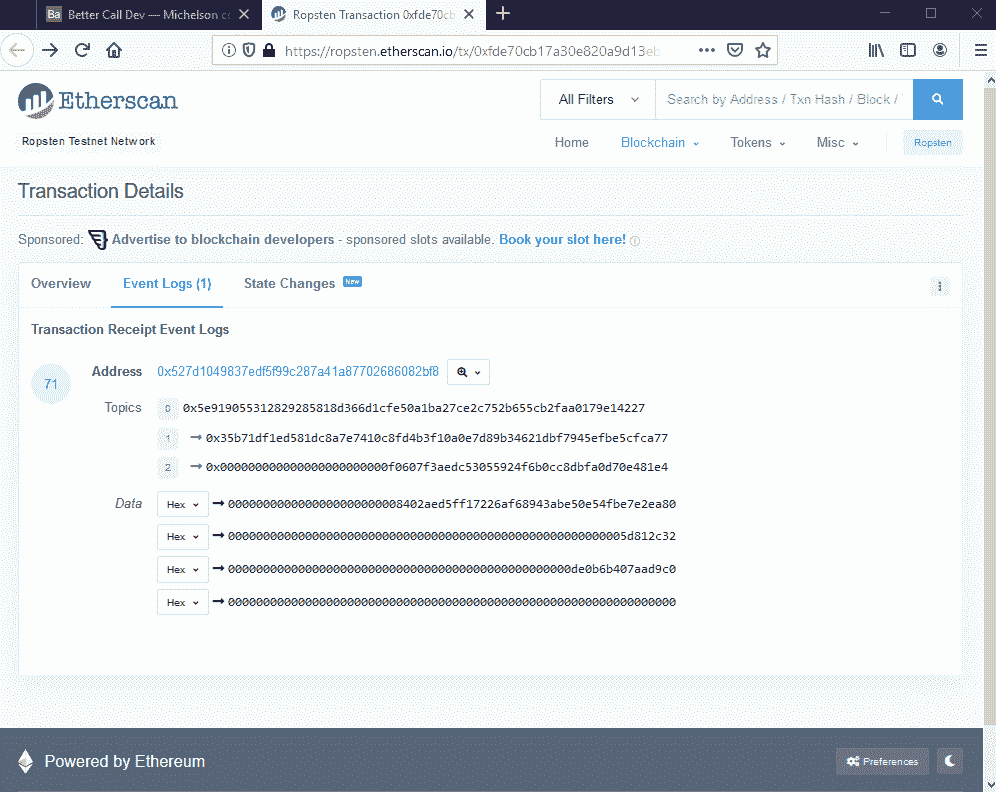

# Atomex:实践中的跨链原子互换

> 原文：<https://medium.com/coinmonks/atomex-cross-chain-atomic-swaps-on-practice-8139571f0ee5?source=collection_archive---------0----------------------->

## 推出内置混合交换的多重加密桌面钱包

一个棘手的开发过程开始结出第一个果实: [Atomex](https://atomex.me/) 终于在 mainnet 中发布了。我们的团队已经完成了从纯原子交换协议到完全成熟的应用程序的激动人心的旅程，现在我们可以说“是的，它工作了！”。
我们要感谢所有早期测试者的反馈，这对我们非常重要！

# 背后的想法

> 我们的目标是为密码爱好者，为那些相信区块链技术背后的想法和偏执的人创造一个产品。

如果 TCP/IP 是一种用于在互联网上传输信息的协议，那么区块链对于电子货币和其他类别的资产也是一样的。然而，仍然存在链间间隙，这导致不方便的值分离。
我们将进一步研究的原子交换协议依靠一个本质上简单的想法，以一种不可信的方式有效地填补了这一空白。银行或另一个受信任的第三方正在被智能合约取代，这是仅有的几个仅使用链上可用数据(没有 oracles 或其他链外数据提供者)就能做到的案例之一。

# 原子交换基础

在我们进入实际部分之前，让我们深入了解一下协议细节。假设爱丽丝想为 XTZ 买一些 ETH，鲍勃同意达成交易。有两种可能的结果，要么交易发生，要么取消。

## 初始阶段

1.  **爱丽丝锁 XTZ** 爱丽丝生成一个随机字节序列——`secret`，计算它的`hash`并将她的 XTZ 连同`hash`、`lock_time_a`值、鲍勃的 XTZ `address_b`
    *这些 XTZ 只有* `*address_b*` *的主人知道* `*secret*` *才能赎回，而且必须在* `*lock_time_a*` *之前完成，之后爱丽丝才能拿回这些资金*
2.  **Bob 锁定 ETH**
    当 Alice 的交易被确认后，Bob 将他的 ETH 连同同样的`hash`、`lock_time_b`和 Alice 的 ETH `addreess_a` 、*一起发送到一个特殊的智能合约中，这些 ETH 只有* `*address_a*`、*的主人知道*才能赎回，而且必须在*、`*lock_time_b*`、*之前完成，事后 Bob 可以取回这些资金。**

> 要求:`lock_time_b < lock_time_a`
> 防止出现爱丽丝先退款再赎回鲍勃资金的情况。

## 成功赎回

Simplified scheme of an XTZ/ETH swap (success case)

1.  爱丽丝赎回 ETH
    爱丽丝将`secret`发送到区块链以太坊的契约，并收到鲍勃的 ETH 作为回报。
    *`*secret*`*现已揭晓，鲍勃·XTZ 可以花了。**
2.  *鲍勃赎回了 XTZ，鲍勃在区块链的泰佐斯寄出了合同，并收到了爱丽丝的 XTZ。*

## *退款案例*

*我们将不考虑在初始化阶段出错的情况(它们相当琐碎),但是将检查 Alice 由于某种原因没有赎回 Bob 的 ETH 的情况，即`secret`没有显示并且`lock_time_b`已经过去。*

**

*Simplified scheme of an XTZ/ETH swap (refund case)*

1.  *鲍勃退还 ETH
    鲍勃将`hash`送到区块链以太坊的智能合约处，取回他的 ETH。
    *他不能把爱丽丝的 XTZ 从* `*secret*` *中揭示出来。**
2.  ***爱丽丝退款给 XTZ**
    爱丽丝一直等到`lock_time_a`，然后把`hash`发送给泰佐斯区块链的合同，拿回她的 XTZ。
    *她不能花鲍勃的 ETH，因为* `*lock_time_b*` *已经过去了。**

# *理论到此为止*

*是时候看看 Atomex 的表现了！我们将从一个多密码设置开始，平衡一些 XTZ 和 ETH。关于上面的方案**我们是鲍勃**，我们的交易对手是爱丽丝。*

## *创建新转换*

*选择“转换”选项卡，并设置我们要兑换 XTZ 的 ETH 金额。检查交易条款，然后按“转换”。*

**

*Step 0\. The user creates a new conversion*

*新的с转换出现在状态为“进行中”的表格中。
实际上，**就这些了**我们需要通过 Atomex wallet 进行原子交换。但是让我们跟随由我们的行为产生的内部过程。*

## *引擎盖下:爱丽丝锁 XTZ*

*首先，查看一下区块链泰佐斯地区 Atomex 智能合同的近期运作情况:*

**

*Step 1\. Alice locks XTZ*

*这是 Alice 发送的交易，这些锁定的资金最终将是我们的。注意通过参数传递的`hash`字段。*

## *引擎盖下:鲍勃(美国)锁 ETH*

*一旦 XTZ 交易被确认，Bob 发送一个 ETH 交易。我们可以看到它包含了相同的`hash`:*

**

*Step 2\. Bob locks ETH*

## *引擎盖下:爱丽丝救赎*

*爱丽丝那边的另一个契约调用。她收到我们的 ETH 作为交换`secret`，鲍勃捡起来:*

**

*Step 3\. Alice redeems ETH*

## *引擎盖下:鲍勃(美国)赎回 XTZ*

*最后，鲍勃使用收集到的`secret`解锁 XTZ:*

**

*Step 4\. Bob redeems XTZ*

*我们的转换状态变为“已完成”，一切正常。*

# *旁注*

*您看到的所有内部操作都是由 Atomex wallet 在后台进程中执行的，因此在交换完成之前，有必要让它保持在线。在我们的 XTZ/ETH 转换的例子中，整个过程只需要 8 分钟，但是，这取决于特定的区块链确认时间。*

*我们目前正致力于提供不同的订单类型。一旦 Atomex 掉期市场足够稳定，就可以通过 Atomex 应用下达限价订单。*

## *如何设置 Atomex 钱包*

*查看我们的[教程](https://github.com/atomex-me/atomex.client.wpf/wiki/Atomex-wallet-tutorial)。*

*非常感谢您的任何反馈，如果您有功能需求或错误报告，欢迎加入我们的[电报](https://t.me/atomex_official)聊天。别忘了在推特上关注我们！*

*干杯！*

**最初发表于 2019 年 9 月 25 日*[*https://baking-bad.org*](https://baking-bad.org/blog/2019/09/25/atomex-decentralized-exchange-cross-chain-atomic-swaps-on-practice/)*，在那里你可以找到文章的完整版本。**

**

> *[在您的收件箱中直接获得最佳软件交易](https://coincodecap.com/?utm_source=coinmonks)*

**