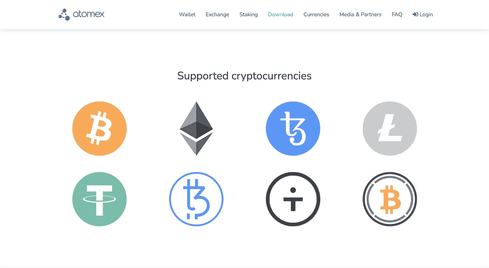

# Atomex 钱包中的 iOS 和 Android 现在可以使用原子交换

> 原文：<https://medium.com/coinmonks/atomic-swap-exchange-is-now-available-for-ios-and-android-within-the-atomex-wallet-816801910a6b?source=collection_archive---------1----------------------->

[Atomex](https://atomex.me/) 通过自己的加密货币钱包在移动平台 iOS 和 Android 上推出了 atomic swap exchange，现在可以通过 [AppStore](https://apps.apple.com/us/app/atomex-wallet-dex/id1534717828) 和 [Google Play](https://play.google.com/store/apps/details?id=com.atomex.android) 免费下载。您可以通过自己的非托管移动钱包进行分散式跨链交换，这也允许您接收、发送和存储加密货币，并通过委托机制轻松参与 Tezos (XTZ)赌注。

# 原子交换

原子交换是一种使用哈希时间锁定合同(HTLC)的无信任跨链资产交换协议。Atomex 将原子互换协议的改进版本与集中式订单匹配引擎相结合，以确保流动性和安全执行。Atomex crypto wallet 支持比特币、以太坊、莱特币和 Tezos，以及(ERC20 token)、(FA1.2 token)、包裹比特币等稳定币。

Atomex supports Bitcoin, Litecoin, Tezos, Ethereum and stablecoins

# 交换执行时推送通知

在移动设备上实现原子交换包括一个重要的特性。应用程序需要在一定的时间内发送付款和赎回交易(有关更多详细信息，请参见[原子互换练习](https://baking-bad.org/blog/2019/09/25/atomex-decentralized-exchange-cross-chain-atomic-swaps-on-practice/))。在移动设备上，应用程序在后台短时间运行，因此 Atomex devs 应用了推送通知，当用户必须打开应用程序来完成原子交换时，就会发送推送通知。在所有未完成的情况下，兑换交易可以由第三方服务发送，其工作方式与用户在空的以太坊或 Tezos 钱包上收到购买的货币相同，例如，交换 BTC - > ETH 或 BTC - > XTZ。

# 对 Tezos 钱包用户来说，这是一个令人愉快的功能

Atomex 应用程序是 [Baking Bad](https://baking-bad.org/) 团队的产品，在 Tezos 社区中以 Baking Bad delegation dashboard 和 [TzKT explorer](https://tzkt.io/) 而闻名。使用 [TzKT 数据](https://api.tzkt.io/) Atomex 在操作列表中显示公共已知的实体。这是非常方便的，除了其他事情之外，还允许您将自己的交易与赌注奖励区分开来。除此之外，Atomex 还会跟踪烘焙不良列表中的面包师的状态，如果你试图将你的技术开发中心委托给过度授权或“不良”的面包师，Atomex 会发出警告。

# 下一步是什么

在不久的将来，将会添加以下功能:

*   原子交换过程的细节化。
*   改进对硬盘地址的管理(发送资产时选择特定地址)。
*   允许用户在钱包中添加任意以太币和 Tezos 代币。
*   Segwit 致力于支持比特币
*   分类帐硬件钱包支持。
*   各种 UX 改进和高级帐户管理。
*   支持原子互换的新货币和代币。

我们总是很高兴收到用户的建议和反馈。请随意评估和查看 Atomex 应用程序，我们一定会在新的更新中考虑到这一点！

-你的，烘焙坏队！

*原载于 2020 年 12 月 17 日*[*https://baking-bad.org*](https://baking-bad.org/blog/2020/12/17/atomic-swap-exchange-is-now-available-for-ios-and-android-within-the-atomex-wallet/)*。*

## 另外，阅读

*   [密码交易机器人](/coinmonks/crypto-trading-bot-c2ffce8acb2a)
*   [3 商业评论](/coinmonks/3commas-review-an-excellent-crypto-trading-bot-2020-1313a58bec92)
*   [AAX 交易所评论](/coinmonks/aax-exchange-review-2021-67c5ea09330c) |推荐代码、交易费用、利弊
*   [德里比特评论](/coinmonks/deribit-review-options-fees-apis-and-testnet-2ca16c4bbdb2) |选项、费用、API 和测试网
*   [FTX 密码交易所评论](/coinmonks/ftx-crypto-exchange-review-53664ac1198f)
*   [n 零审核](/coinmonks/ngrave-zero-review-c465cf8307fc)
*   [Bybit 交换评论](/coinmonks/bybit-exchange-review-dbd570019b71)
*   [3Commas vs Cryptohopper](/coinmonks/cryptohopper-vs-3commas-vs-shrimpy-a2c16095b8fe)
*   最好的比特币[硬件钱包](/coinmonks/the-best-cryptocurrency-hardware-wallets-of-2020-e28b1c124069?source=friends_link&sk=324dd9ff8556ab578d71e7ad7658ad7c)
*   [密码本交易平台](/coinmonks/top-10-crypto-copy-trading-platforms-for-beginners-d0c37c7d698c)
*   最佳 [monero 钱包](https://blog.coincodecap.com/best-monero-wallets)
*   [莱杰 nano s vs x](https://blog.coincodecap.com/ledger-nano-s-vs-x)
*   [bits gap vs 3 commas vs quad ency](https://blog.coincodecap.com/bitsgap-3commas-quadency)
*   最好的[加密税务软件](/coinmonks/best-crypto-tax-tool-for-my-money-72d4b430816b)
*   [最佳加密交易平台](/coinmonks/the-best-crypto-trading-platforms-in-2020-the-definitive-guide-updated-c72f8b874555)
*   最佳[加密贷款平台](/coinmonks/top-5-crypto-lending-platforms-in-2020-that-you-need-to-know-a1b675cec3fa)
*   [莱杰纳米 S vs 特雷佐 one vs 特雷佐 T vs 莱杰纳米 X](https://blog.coincodecap.com/ledger-nano-s-vs-trezor-one-ledger-nano-x-trezor-t)
*   [block fi vs Celsius](/coinmonks/blockfi-vs-celsius-vs-hodlnaut-8a1cc8c26630)vs Hodlnaut
*   Bitsgap 评论——一个轻松赚钱的加密交易机器人
*   为专业人士设计的加密交易机器人
*   [PrimeXBT 审查](/coinmonks/primexbt-review-88e0815be858) |杠杆交易、费用和交易
*   [alt ready 审查](https://blog.coincodecap.com/altrady-reivew)
*   [埃利帕尔泰坦评论](/coinmonks/ellipal-titan-review-85e9071dd029)
*   [SecuX Stone 评论](https://blog.coincodecap.com/secux-stone-hardware-wallet-review)
*   [BlockFi 评论](/coinmonks/blockfi-review-53096053c097) |赚取高达 8.6%的加密利息
*   [面向开发人员的最佳加密 API](/coinmonks/best-crypto-apis-for-developers-5efe3a597a9f)
*   [最佳区块链分析工具](https://bitquery.io/blog/best-blockchain-analysis-tools-and-software)
*   [加密套利](/coinmonks/crypto-arbitrage-guide-how-to-make-money-as-a-beginner-62bfe5c868f6)指南:新手如何赚钱
*   最佳[加密制图工具](/coinmonks/what-are-the-best-charting-platforms-for-cryptocurrency-trading-85aade584d80)
*   了解比特币的[最佳书籍有哪些？](/coinmonks/what-are-the-best-books-to-learn-bitcoin-409aeb9aff4b)

> [直接在您的收件箱中获得最佳软件交易](/coinmonks/newsletters/coinmonks)

