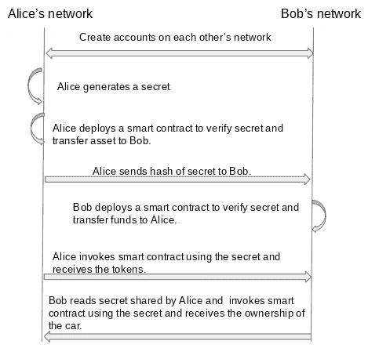

# 原子交换:它们是什么？它们是如何工作的？

> 原文：<https://medium.com/coinmonks/atomic-swaps-what-are-they-and-how-do-they-work-bc7f84e4b7f3?source=collection_archive---------6----------------------->

近年来，我们已经看到了许多分布式分类帐技术的出现，每种分类帐都有自己的优势，并且可能比其他分类帐更适合某些用例，因为需要能够在不同的分类帐之间进行交易。

让我们来看一个例子，Alice 是她想要出售的汽车的所有者，Bob 是想要购买所述汽车的潜在买家。但有一个问题，维护车辆所有权记录的当地政府只在分类账 A 上这样做(用你最喜欢的 DLT 替换 A，这有助于用例)，鲍勃想用运行在分类账 B 上的 CBDC(央行数字货币)支付公寓费用(用你最喜欢的 DLT 替换 B，用于管理 CBDCs)。鲍勃和爱丽丝如何着手做这笔交易？

一种方法是利用双方都信任的并且是两个网络的一部分的中介(让我们称她为 Carrie ), Bob 和 Alice 在彼此的网络上创建帐户。Bob 然后将金额转到 Carrie 的账户(或地址)。在 Alice 从 Carrie 处得到确认，资金已被转移到她的帐户后，Alice 可以继续将汽车的所有权转移给 Bob。然后，Carrie 会将资金从她的帐户转移到 Alice。

在上面的例子中，Alice 和 Bob 都信任 Carrie，因此 Bob 知道如果 Alice 没有将资产转移给他，那么 Carrie 会将资金转移回 Bob 的帐户。同样，Alice 知道，由于资金已经转移到了 Carrie 的帐户，一旦她转移了汽车的所有权，她就可以得到付款。虽然这是一个好的方法，但是有一些问题。

1.爱丽丝和鲍勃都需要找到他们信任的一方。

2.他们信任的一方需要成为双方网络的一部分。

上述问题往往会减缓资产转移的进程。有没有一种方法可以让我们在不需要可信第三方的情况下完成上述交易？

## 原子互换

原子互换中的“原子”一词意味着交易要么完全成功，要么完全失败，这意味着在原子互换完成后，Alice 和 Bob 都进行了成功的交易，要么对双方都进行了失败的交易，不存在一方可以获得另一方的资产的部分交易。

## 它是如何工作的？

实现原子交换的方法之一是使用 HTLC(散列时间锁契约)。双方在各自的网络上部署 HTLC。HTLC 实质上起着中介的作用。HTLC 执行以下操作:

1.  向事务添加时间锁，以便事务必须在指定的时间内完成。
2.  它锁定了双方的资产(是交易的一部分),因此在交易完成或时间用完之前，他们不能花这笔钱。
3.  它验证执行原子交换所需的秘密(稍后会有更多相关内容)。

让我们来看看 Alice 和 Bob 进行交易需要执行的所有步骤。

1.  Alice 在 Bob 的分类账上创建了一个账户。
2.  Bob 在 Alice 的分类账上创建了一个账户。
3.  Alice 生成一个秘密，然后生成该秘密的散列。
4.  Alice 部署了一个智能合同，该智能合同将她的资产(汽车)以及机密的散列值锁定，只有 Bob 能够提供用于生成散列值的机密，智能合同才会将资产转移到 Bob 的帐户。如果 Bob 无法在指定时间内完成，则资产将被转移回 Alice。
5.  爱丽丝把秘密的散列发送给鲍勃。
6.  Bob 部署了一个智能合同，该合同使用时间锁(少于 Alice 合同中使用的时间)锁定他的资产(CBDC 令牌),条件是如果 Alice 在指定的时间段内提供了生成散列的秘密，则该资产将被转移给 Alice，否则令牌将被转移回 Bob。
7.  因为 Alice 和 Bob 都在对方的网络中有帐户(地址)，所以他们也是这些网络的参与者，可以看到交易。
8.  Alice 将秘密透露给 Bob 的智能合同，然后智能合同将令牌转移到 Alice 在 Bob 网络上的帐户。鲍勃现在能够看到这个秘密了。
9.  Bob 将此秘密发送到 Alice 的智能合约，智能合约将资产(汽车)转移到 Bob 在 Alice 网络上的账户。

因此，Alice 和 Bob 都执行了原子交换。

**Sequence diagram**

## 一些需要考虑的事情

虽然上述方法有助于我们在分类账之间转移资产，但它确实存在一些问题。

1.  **未完全自动化:**您可能已经注意到，在 Alice 透露秘密并获得令牌后，由 Bob 发起将汽车转移给自己，这意味着 Bob 需要有一个系统来监听令牌转移给 Alice 的通知，并使用新透露的秘密触发 Alice 网络上的智能合同。这一部分必须在应用层或链外实现，并且必须监听来自一个分类帐的通知并触发另一个分类帐的契约。Bob 有责任建立这个系统，并确保它完全正常运行。
2.  **错误编码的时间锁:**你可能已经注意到的另一个问题是，如果爱丽丝和鲍勃必须在相同的时间限制内进行交易，那么爱丽丝可能是恶意的，在时间限制即将结束时进行交易并接收她的代币，同时拒绝鲍勃的汽车。为了避免这种情况，Bob 将他的代币转让给 Alice 的智能合同的时限应该比 Alice 的合同的时限短，以便他仍然有时间触发 Alice 的智能合同并将资产转让给他。
3.  **可能不适用于一些私有的、许可的网络/DLT:**仍然可能发生的一个问题是，在一方获得资产之后，他们简单地从他们的网络中删除另一方的帐户，这对于具有可以创建帐户的节点的 DLT 尤其如此，该节点也管理这些帐户的密钥。因此，在上面的例子中，如果 Bob 依靠 Alice(她在具有上述规范的 DLT 网络上)使用她的节点在分类帐上为他创建一个帐户，她仍然可以访问控制该帐户的密钥。对此的一个解决方案可能是让双方运行属于另一方网络的节点。但是这将意味着，对于运行私有网络的任何一方来说，要与同样使用私有网络的另一方进行交易，他们将需要在彼此的网络中有一个节点(这将影响到不同资产的可扩展性)或者有一个可信的第三方(这违背了原子交换的目的)来管理账户。像以太坊或比特币这样的公共和未经许可的区块链不会有这个问题，因为他们的账户是由最终用户控制的。
4.  **技术知识:** Bob 或 Alice 仍然可以通过简单地使用不正确的智能合同被诱骗将他们的资产转移给另一方。因此，Bob 和 Alice 需要了解另一方的 DLT，并且能够阅读和验证他们的智能合同。

> 加入 Coinmonks [电报频道](https://t.me/coincodecap)和 [Youtube 频道](https://www.youtube.com/c/coinmonks/videos)了解加密交易和投资

# 另外，阅读

*   [最佳加密交换平台](https://coincodecap.com/best-crypto-swap-platforms) | [最佳加密交易所](https://coincodecap.com/crypto-exchange)
*   [购买比特币印度](/coinmonks/buy-bitcoin-in-india-feb50ddfef94) | [Pionex 评论](/coinmonks/pionex-review-exchange-with-crypto-trading-bot-1e459d0191ea) | [加密交易机器人](/coinmonks/crypto-trading-bot-c2ffce8acb2a)
*   [n ave 零点回顾](/coinmonks/ngrave-zero-review-c465cf8307fc) | [Phemex 回顾](/coinmonks/phemex-review-4cfba0b49e28) | [PrimeXBT 回顾](/coinmonks/primexbt-review-88e0815be858)
*   最佳[区块链分析](https://bitquery.io/blog/best-blockchain-analysis-tools-and-software)工具| [赚比特币](/coinmonks/earn-bitcoin-6e8bd3c592d9)
*   [Cloudbet 赌场评论](https://coincodecap.com/cloudbet-casino-review) | [点火赌场评论](https://coincodecap.com/ignition-casino-review)