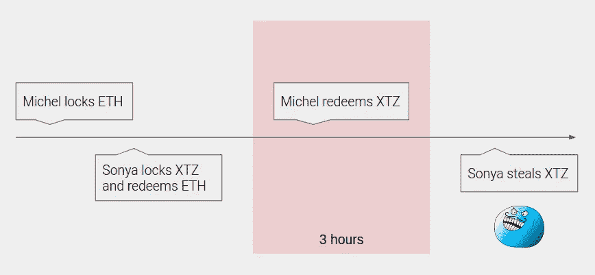
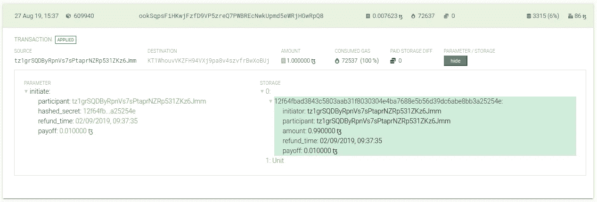
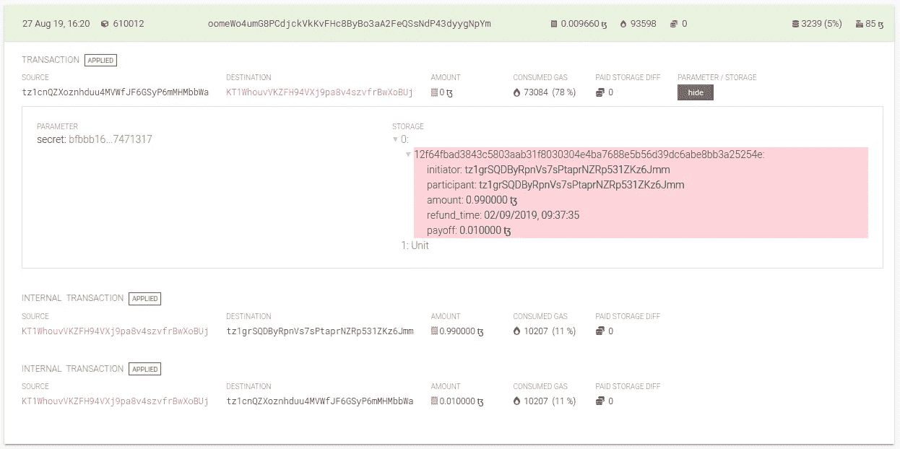

# 原子提示

> 原文：<https://medium.com/coinmonks/atomic-tips-berlin-workshop-materials-c5c8ee3f46aa?source=collection_archive---------0----------------------->

## 使用 Python 工具集编写 Tezos 应用程序

上周，我们在柏林奇妙的 TQuorum 活动上举办了一场研讨会。虽然并非一切都很顺利，但我们希望能够传达主要观点:使用我们的 Python 工具集与 Tezos 交互非常容易。

*   设置环境没必要，用[云 Jupyter 笔记本](https://colab.research.google.com/)即可；
*   需要最低限度的开发技能，交互式文档将支持你直到最后；
*   预填充的凭据和密钥(仅用于演示目的)允许在几秒钟内启动。


PAIR %Python %Tezos ;

在这篇文章中，我们将回顾我们开发的应用程序的概念和范围。我们还附上了一个稍加修改的笔记本，以便您可以随时重现实验。

# 原子交换基础

术语“原子互换”有一个相当一般的定义，在本研讨会中，我们将表示以下含义:双方交换两种不同类型的资产，这些交易必须要么成功，要么不成功。


Atomic swap solves the trust issue

原子交换解决了各方之间的信任问题。在现实世界中，它是通过引入可信任的第三方来实现的，例如银行或政府。在区块链的世界里，我们可以用智能合约取代第三方，结果是，我们有了一种完全不可信的方式来交换资产。

但和往常一样，事情并没有那么简单。交换协议是交互式的，这意味着仅仅正确地初始化和发送事务是不够的，还需要及时地执行一些操作。



Drastically simplified XTZ/ETH swap timeline

您可以在简化的时间线上看到，交换启动器(Michel)必须延迟两次执行操作。他还被限制在一个相对较短的时间间隔内，如果由于某种原因在那个时候无法进入区块链，他有非零的可能性失去他的资金。

好消息是，最后一个任务可以由第三方来完成，而协议仍然是安全的。匿名的英雄会得到一点小小的奖励，所以这是一种保护原子交换的经济激励，也是一种“谁更快”的挑战。

# 实施细节

我们将使用由 [Atomix.me](https://atomix.me/) 实现的原子交换。我们来看看他们在 Tezos alphanet 的[合约](https://better-call.dev/alpha/KT1WhouvVKZFH94VXj9pa8v4szvfrBwXoBUj/operations)。有三个主要的入口点可以改变当前的互换状态和转移资金。

*   *initiate* 添加新的 big_map 条目，包含交换协议所需的所有数据，`sha256(sha256(secret))`用作关键字；
*   *兑换*移除 big_map 条目，并向参与者转账(他需要知道`secret`)；
*   *退款*如果出了问题可以回滚；

为了简单起见，我们将代表两方，不要求其他区块链提供任何数据。这是我们将要做的计划:

1.  生成一个*秘密*，使用`initiate`条目创建一个新的交换(作为*发起者*)；
2.  获取活动交换，即现有 big_map 条目(作为第三方*)*
3.  *使用我们生成的秘密进行*赎回*，就好像我们是从另一个区块链那里提取的一样。*

# *实际工作*

*我们现在准备进入实际部分，首先让我们安装所有必要的包:*

```
***!**apt-get install libsodium-dev libsecp256k1-dev libgmp-dev
**!**pip install pytezos conseil*
```

*然后我们使用 PyTezos 创建一个新的交换。*

*下面是我们在[better-call . dev](https://better-call.dev/alpha/KT1WhouvVKZFH94VXj9pa8v4szvfrBwXoBUj/operations)explorer 中的操作:*

**

*Swap initialization*

*接下来，我们需要获得所有最近的 big_map 条目。我们将使用 ConseilPy 来获取对 *(block_level，operation_group_hash)* ，这样我们就可以随后使用 PyTezos 请求 *big_map_diff* 。*

*最后，我们可以进行兑换，但是我们应该使用另一个身份(密钥)来进行兑换。去[https://faucet.tzalpha.net/](https://faucet.tzalpha.net/)下载一个包含关键数据的 json 文件。*

*有用！请注意，有两个内部交易，其中之一是我们的小费:*

**

*Successful redeem*

# *了解关于我们工具集的更多信息*

## *派特佐斯*

*Python SDK for Tezos，提供查询 RPC 端点、发送操作、与智能契约交互、使用密钥的功能。*

*   *[介绍帖](/coinmonks/high-level-interface-for-michelson-contracts-and-not-only-7264db76d7ae)*
*   *[快速入门指南](https://baking-bad.github.io/pytezos/)*
*   *[GitHub 资源库](https://github.com/baking-bad/pytezos)*

## *顺从*

*由 Cryptonomic 为 [Conseil](https://cryptonomic.github.io/Conseil/#/) 区块链索引器提供的 Python 包装器，提供对索引的 Tezos 区块链数据的访问。*

*   *[演示分析文章](/coinmonks/digging-into-tezos-with-conseilpy-86e0564ffbd5)*
*   *[GitHub 资源库](https://github.com/baking-bad/conseilpy)*

## *最好打电话给戴夫*

*迈克尔逊合同浏览器以一种方便的格式显示交易参数、存储和 big_map 差异。*

*   *[功能概述](/coinmonks/michelson-rocks-but-you-better-call-dev-e23cd32a299a)*
*   *[挑选随机合同](https://better-call.dev/)*

*在 [Twitter](https://twitter.com/tezosbakingbad) 上关注我们，加入我们舒适的 [Telegram](https://t.me/baking_bad_chat) 聊天，在这里你可以问任何关于我们产品和服务的问题。*

*加入第一届[东欧 Tezos 黑客马拉松](https://eeth.one/en)，致力于 Tezos 平台的不可替代令牌标准。这将是基辅 Tezos 社区难以置信的三天(9 月 6 日至 8 日)。*

*那里见！*

**最初发表于 2019 年 8 月 27 日*[*https://baking-bad.org*](https://baking-bad.org/blog/2019/08/27/atomic-swap-tips-berlin-tezos-workshop-materials/)*，在那里你可以找到文章的完整版本。**

> *[直接在您的收件箱中获得最佳软件交易](https://coincodecap.com/?utm_source=coinmonks)*

*[](https://coincodecap.com/?utm_source=coinmonks)*