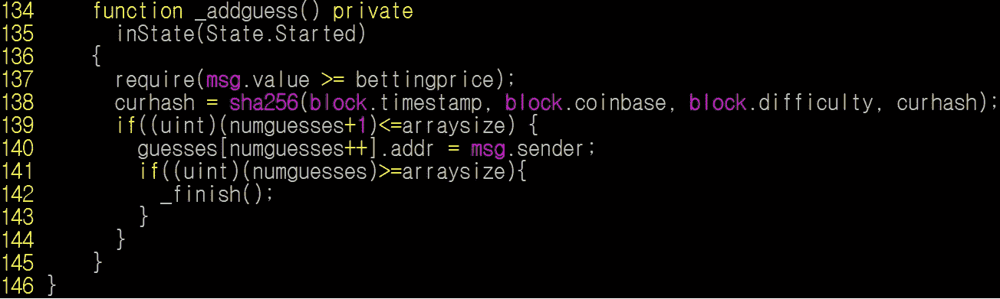
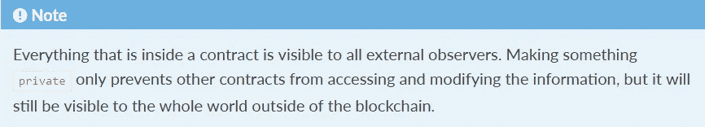
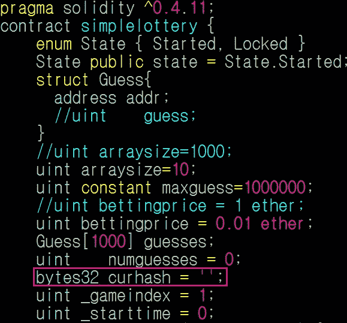
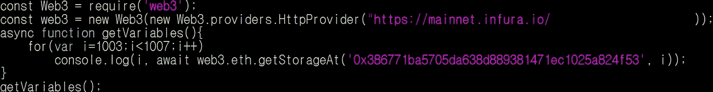
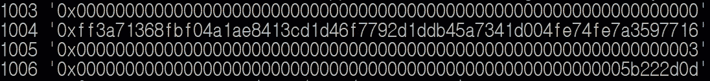
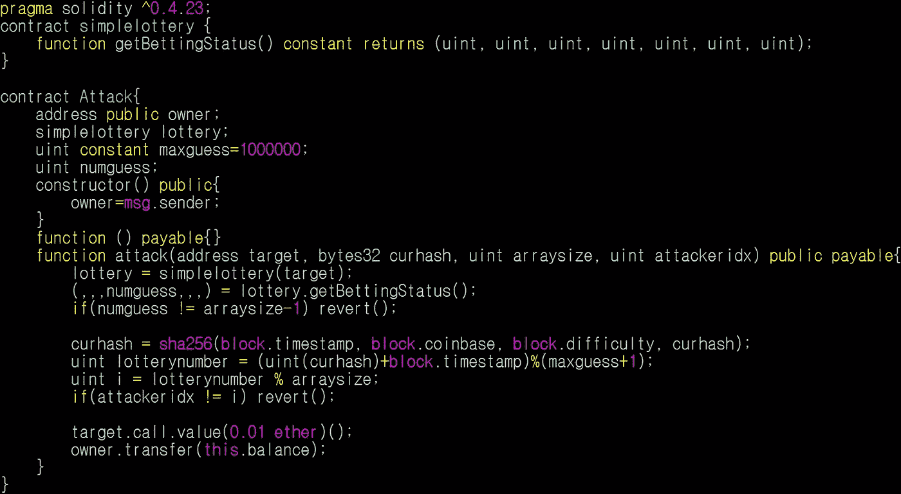
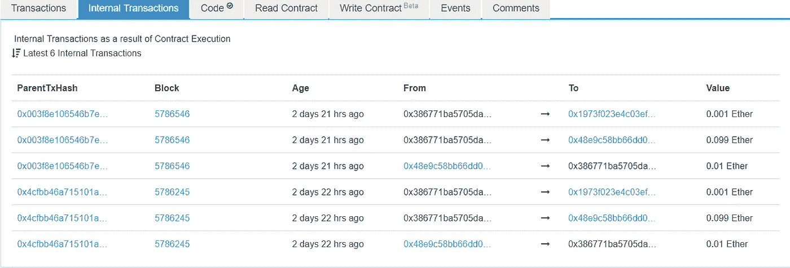
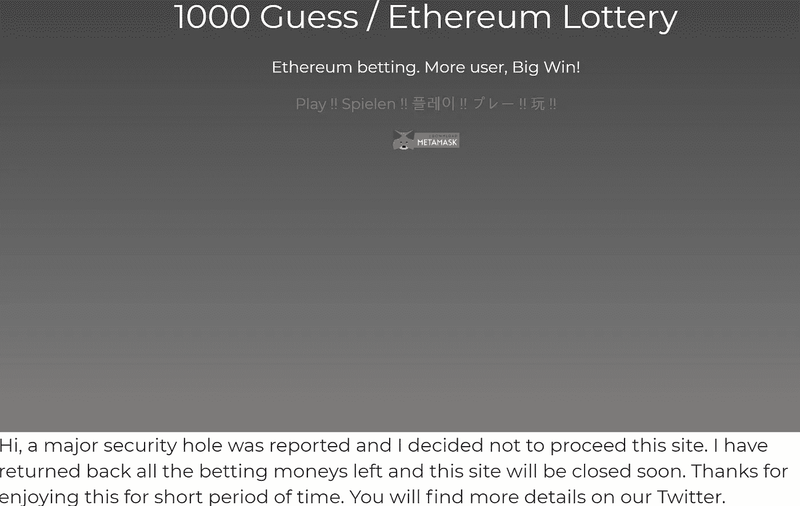

# 攻击以太坊彩票游戏 1000 Guess(CVE-2018–12454)中使用的伪随机数发生器(PRNG)

> 原文：<https://medium.com/coinmonks/attack-on-pseudo-random-number-generator-prng-used-in-1000-guess-an-ethereum-lottery-game-7b76655f953d?source=collection_archive---------1----------------------->

# 摘要

以太坊彩票游戏 1000 Guess 有一个漏洞，它会生成可预测的随机数。当对合同下注的玩家数量达到预定数量时，该游戏通过随机数决定赢家。合同使用带有私有变量和当前块变量的`sha256()`函数生成随机数，如`block.timestamp` *、* `block.coinbase`、*、*、、`block.difficulty`。然而，它们很容易阅读。首先，使用`web3.eth.getStorageAt`可以很容易地访问私有变量。其次，众所周知，块变量很容易被恶意挖掘者操纵。然而，即使攻击者不是矿工，这也是危险的。在本文中，我将解释如何利用内部事务攻击 PRNG。

# 细节



Figure 1\. 1000 guess generates a random number with block variables and a private variable

1000 Guess 使用带有`block.timestamp`、`block.coinbase`、 `block.difficulty`和私有变量`curhash`的`sha256()`函数生成一个随机数。这些都是任何人都可以访问的，所以任何人都可以预先计算随机数，并成为赢家。

## 如何访问私有变量？

首先，我们如何访问私有变量？在此之前，让我们来看看如何访问一个公共变量。访问公共变量非常简单和直观。如果有一个公共变量`uint data`，我们可以像这样在 web3js 中访问它:

```
contractInstance.methods.data().call()
```

或者，我们可以调用一个返回`data`的函数，如果存在，

```
function getData() public returns (uint){
    return data;
}
```

在 web3js 中，我们调用 getData()来获取这样的数据

```
contractInstance.methods.getData().call()
```

但是，我们不能使用上述方法来访问私有变量。为此，有人认为隐藏了一个私有变量。然而，在 Solidity 文档中，它说所有的东西对所有的观察者都是可见的，即使它是私有的。



Figure 2\. In a contract, everything is visible to all external observers

那么，我们怎样才能访问私有变量呢？在 web3js 中，我们可以像这样访问一个私有变量[【2】](https://web3js.readthedocs.io/en/1.0/web3-eth.html#getstorageat):

```
web3.eth.getStorageAt(contractAddress, position);
```

我们可以使用上述方法检索智能合约中的所有变量。在智能契约中，变量按顺序位于存储槽中。例如，第一个声明的变量位于槽 0，第二个变量位于槽 1。所以我们要读`curhash`，就要知道`curhash`的位置。



Figure 3\. variables declaration in the smart contract of 1000 Guess

第一个变量是`state`，所以`curhash`位于槽 1004。`constant`变量没有存储在存储槽中，所以`uint constant maxguess`被排除。因此，我们可以将`curhash`读作:

```
web3.eth.getStorageAt(contractAddress, 1004);
```

当我写这篇文章时，我试图用下面的代码读取`curhash`和其他变量。我在 1000 Guess 几个版本中的[0x 386771 ba 5705 da 638d 889381471 EC 1025 a 824 f 53](https://etherscan.io/address/0x386771ba5705da638d889381471ec1025a824f53#readContract)上测试。



Figure 4\. Example code of accessing variables

结果如下:



Figure 5\. State of variables

从结果可以知道`numguesses`、`curhash`、`_gameindex`、`_starttime`的当前状态。您可以使用`getBettingStatus()`功能确认上述结果。

## 用相同的块变量生成随机数

现在，我们知道如何读取私有变量，所以我们只需使用当前块变量来计算`curhash`。很明显，当前块变量是可访问的。但是，您无法知道您的事务被执行的块号。例如，有一个智能合约，当你在区块数为偶数时发送交易，你就可以成为赢家。简单来说，你连续观察当前的块数，然后在块数为偶数时向合约发送一个交易。然而，它并不总是成功的，因为你的事务并没有在你发送事务的块中被执行。因此，如果您希望您的事务在特定的块中执行，您应该使用另一种方法。

内部交易可以是一种解决方案。首先，在契约中计算 new `curhash`，然后通过契约中的内部事务调用 1000 Guess 契约。然后，计算相同的`curhash`,因为两个计算在相同的块中执行。

# 剥削

我利用了 1000 个猜测契约中的一个:[https://ethers can . io/address/0x 386771 ba 5705 da 638d 889381471 EC 1025 a 824 f 53](https://etherscan.io/address/0x386771ba5705da638d889381471ec1025a824f53#readContract)。本合同中，`bettingprice`为 0.01 乙醚，`arraysize`为 10 乙醚。我准备了两个账户:一个受害者和一个攻击者。

首先，受害者账户连续在 1000 张猜合约上下注 0.01 乙醚，直到`numguesses`是 9 也就是`arraysize-1`。在这种状态下，如果有人在这份合同上下赌注，`_finish()`将被执行，然后`_winner`将由新的`curhash`决定。

第二，攻击帐户部署了如下攻击契约:



Figure 6\. Attacker’s contract

`attack()`函数需要 4 个参数:

*   `address target`:1000 猜合约的地址。
*   `curhash`:当前`curhash`中的 1000 猜合约
*   `arraysize`:当前`arraysize`
*   `attackeridx`:攻击者地址在`guessess`数组中的索引

在攻击契约中，它以与 1000 个猜测契约相同的方式计算`curhash`。攻击帐户不断向攻击契约发送交易，直到契约计算出使攻击者成为赢家的`curhash`。经过几次尝试，终于传输了一个内部交易，攻击帐户获得了奖励。



Figure 7\. Internal transactions executed on the target contract

我测试了两次，成功了两次。图 7 显示了内部事务。‘0x 48 e9 c 58 bb 66d 0…’是攻击契约，‘0x 1973 f 023 E4 c 03 ef…’是 1000 Guess 的开发者。当攻击成功后，1000 Guess 向攻击契约发送奖励(0.099 以太)，向开发者发送费用(0.001 以太)。

您可以检查以下结果:

*   1000 猜合约:[https://ethers can . io/address/0x 386771 ba 5705 da 638d 889381471 EC 1025 a 824 f 53](https://etherscan.io/address/0x386771ba5705da638d889381471ec1025a824f53)
*   攻击契约:[https://ethers can . io/address/0x 48 e9 c 58 bb 66 DD 0 b 0f 218 cf 0448 a 797096d 585179](https://etherscan.io/address/0x48e9c58bb66dd0b0f218cf0448a797096d585179#internaltx)
*   受害者账号:[https://ethers can . io/address/0x 9 dbea 040 FDE 74 f 9014 c 873401675 CCD 298d 302 ba](https://etherscan.io/address/0x9dbea040fde74f9014c873401675ccd298d302ba)
*   攻击者账号:[https://ethers can . io/address/0x 28 FB 13 EB 570 c 23 BF 65 f 606431 a6 cc 3 ff 34 f 41 af 0](https://etherscan.io/address/0x28fb13eb570c23bf65f606431a6cc3ff34f41af0)

你可以看到有几个失败的交易，因为攻击契约在契约计算的`curhash`不能让攻击者成为赢家的时候执行`revert()`。但是，如果它向目标契约发送一个内部事务，它就能获得回报。当然，攻击者应该支付一些气体，因为他尝试了几次，但与他将获得的奖励相比，这是微不足道的。

当我在 1000 Guess 合同上进行开发时，它只包含开发人员发送的 0.01 乙醚。所以，在我的漏洞利用之后，我把 0.01 乙醚还给了开发者。

# 报告

我向开发商反映了。然后，他立刻关闭了所有 1000 个猜谜游戏。



Figure 8\. The developer closed the game

http://www.1000guess.com 的[网站](http://www.1000guess.com/)，现在已经完全关闭。现在，你只能查看 1000 个猜测的推特账号:[https://twitter.com/1000guess](https://twitter.com/1000guess)。

# 结论

在以太坊智能合约中生成一个随机数并不容易。据我所知，有两种方法可以安全地生成随机数。第一种方法是使用 future block 的变量，另一种方法是使用 Oraclize[3]之类的库从以太网外部获取随机数。开发人员应该研究如何安全地生成随机数。此外，如果用户想要使用合约，他们应该检查合约如何生成随机数。

# 参考

[1][http://solidity.readthedocs.io/en/v0.4.24/contracts.html](http://solidity.readthedocs.io/en/v0.4.24/contracts.html)

[2][https://web 3js . readthe docs . io/en/1.0/web 3-eth . html # get storage at](https://web3js.readthedocs.io/en/1.0/web3-eth.html#getstorageat)

[3][http://www.oraclize.it/](http://www.oraclize.it/)