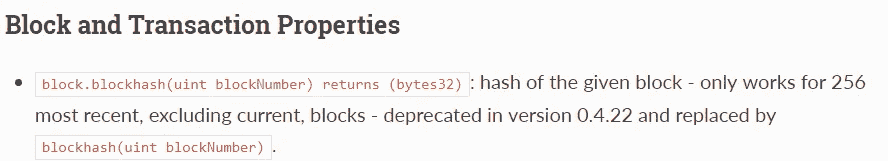

# 攻击以太坊 Cryptogs(CVE-2018–14715)中使用的伪随机数发生器(PRNG)

> 原文：<https://medium.com/coinmonks/attack-on-pseudo-random-number-generator-prng-used-in-cryptogs-an-ethereum-cve-2018-14715-f63a51ac2eb9?source=collection_archive---------9----------------------->

# 摘要

[Cryptogs](https://cryptogs.io/) 是以太坊区块链[1]上的 pogs 游戏。这是一种唇枪舌剑的游戏。这个游戏使用`blockhash(uint blockNumber)`产生随机数来决定赢家。在 Solidity 中，当`blockNumber`距离当前块(`block.number`)[【2】](https://solidity.readthedocs.io/en/latest/units-and-global-variables.html)大于 256 块时，`blockhash(uint blockNumber)`函数返回‘0’。Cryptogs 不会检查`blockNumber`是否太旧，因此攻击者可以预测随机数并总是获胜。

# 细节

产生随机数的函数有两个:`endCoinFlip()`和`throwSlammer()`。两个功能都需要预备功能:`startCoinFlip()`和`raiseSlammer()`。

首先我们来检查一下`startCoinFlip()`和`endCoinFlip()`。这两个函数决定谁先走。

Figure 1\. startCoinFlip()

在`startCoinFlip()`中，将当前块号`block.number`存储到`commitBlock[_stack]`中。

Figure 2\. endCoinFlip()

调用`startCoinFlip()`后，玩家要调用`endCoinFlip()`。在`endCoinFlip()`中，它使用带有`_reveal`的`keccak256()`和`commitBlock[_stack]`的 blockhash 生成随机数。如图 2 所示，在第 464 行，`uint32(block.number) > commitBlock[_stack]`是`commitBlock[_stack]`的唯一条件。所以玩家可以在很长一段时间后调用`endCoinFlip()`。然而在坚固性上，`blockhash(uint blockNumber)`只对 256 个最近的块[【2】](https://solidity.readthedocs.io/en/latest/units-and-global-variables.html)有效。

如果`blockNumber`比当前块老 256 块，则`blockhash(uint blockNumber)`返回‘0’。因此，如果玩家在呼叫`startCoinFlip()`的 256 个街区之后呼叫`endCoinFlip()`，则`pseudoRandomHash`与`keccak256(_reveal, 0)`相同，因为`block.blockhash(commitBlock[_stack])`为‘0’。`_reveal`是`endCoinFlip()`的一个参数，玩家可以随便放什么。所以攻击者可以生成随机数，得到第一阶。

接下来，`raiseSlammer()`和`throwSlammer()`有同样的漏洞。在`raiseSlammer()`中，当前块号`block.number`被存储到`commitBlock[_stack]`中。

Figure 3\. raiseSlammer()

然后，以与第 554 行的`endCoinFlip()`相同的方式计算`pseudoRandomHash`。

Figure 4\. a part of throwSlammer()

在第 573 行，选择`pseudoRandomHash`的一个字节作为`thisFlipper`。在第 575 行，检查`thisFlipper`是否低于 80。如果低于 80，则翻转一次 pog，该回合的玩家获得该 pog。

就像`endCoinFlip()`一样，如果攻击者在呼叫`raiseSlammer()`的 256 个街区后呼叫`throwSlammer()`，`keccak256(_reveal, block.blockhash(commitBlock[_stack])`与`keccak256(_reveal, 0)`相同。因此，攻击者可以生成他们想要的`pseudoRandomNumber`并获得所有的 pog。

# 剥削

因此，攻击场景如下:

1.  创建一个新游戏，等待受害者加入游戏。
2.  调用`startCoinFlip()`并等待，直到生成 256 个块
3.  256 块后调用`endCoinFlip()`得到第一单
4.  调用`raiseSlammer()`并等待直到生成 256 个块
5.  在 256 个街区之后，呼叫`throwSlammer()`并且在第一回合获得所有的 pog

如果我们想按上述情况进行，我们应该计算满足以下条件的合适的`pseudoRandomNumber`:

1.  偶数→获得第一个订单
2.  最高有效字节的所有 10 个字节都低于 80 →在第一轮获得所有 10 个 pog

由于该漏洞，`pseudoRandomNumber`被计算为`keccak256(_reveal, 0)`。所以我发现当`_reveal`为' **0x20182** '，`pseudoRandomNumber`为'**0x 262 f 33140 b 273901193 BC 3c c 78 C5 c 7 f 6 a BF 498 af 8 cc 1 FAA fc 5d 5454 DD 63 e 3 dec**'满足以上两个条件。

我在 Ropsten 测试网[【3】](https://ropsten.etherscan.io/tx/0xed84edc7644eb4da5f91182b8bb638e9e7ad8cb2f17ebfec9d14ecca542a3a9c)开发了 Cryptogs。

Figure 5\. exploit result

图 5 显示了我记录的利用结果。如你所见，我可以在第一回合获得所有 10 个 pog。

# 报告

我向开发商反映，他很快回复了我。他说他可能不会修复漏洞，因为 Cryptogs 中没有玩家。所以，我不建议玩密码游戏。但是，他说他将检查他的新游戏 [Galleass](https://austingriffith.com/portfolio/galleass/) ，是否存在同样的漏洞。

令人惊讶的是，他给了我一些虫子赏金。起初我拒绝了赏金，但他一直试图把赏金给我，所以我终于收到了赏金。到目前为止，我发现了几个脆弱的智能合同，但他是第一个给予赏金的开发者。作为一个安全研究者，我觉得应该有更多像 Cryptogs 的开发者这样的人。所以，我希望捕虫者得到适当的补偿。

# 结论

当你使用 blockhash 生成随机数时，你应该提醒一下`blockhash(uint blockNumber)`只适用于 256 个最近的块。如果您尝试将`blockhash`与太旧的块一起使用，它将返回‘0’。

# 参考

[1][https://cryptogs . io](https://cryptogs.io/)

[2][https://solidity . readthedocs . io/en/latest/units-and-global-variables . html](https://solidity.readthedocs.io/en/latest/units-and-global-variables.html)

[3][https://ropsten . ethers can . io/tx/0 xed 84 EDC 7644 EB 4 da 5 f 91182 b 8 bb 638 e 9 e 7 ad 8 CB 2 f 17 ebfec 9d 14 ecca 542 a 3 a9 c](https://ropsten.etherscan.io/tx/0xed84edc7644eb4da5f91182b8bb638e9e7ad8cb2f17ebfec9d14ecca542a3a9c)

> [直接在您的收件箱中获得最佳软件交易](https://coincodecap.com/?utm_source=coinmonks)

