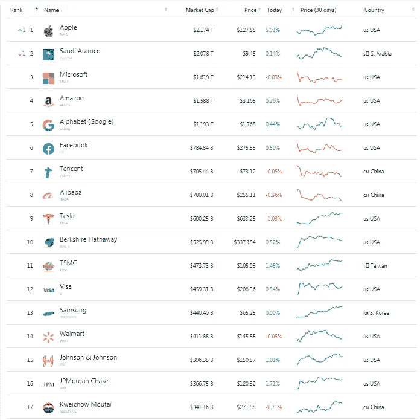
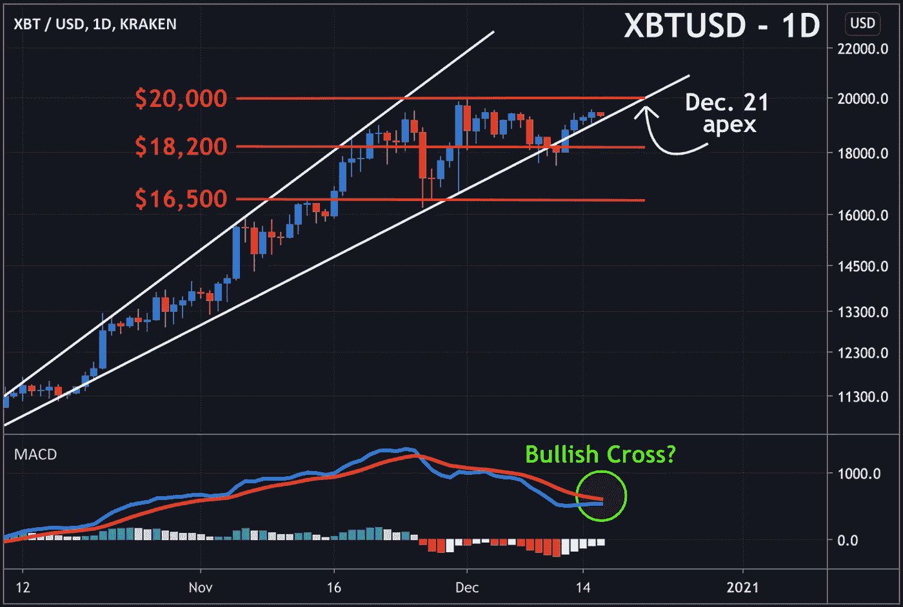
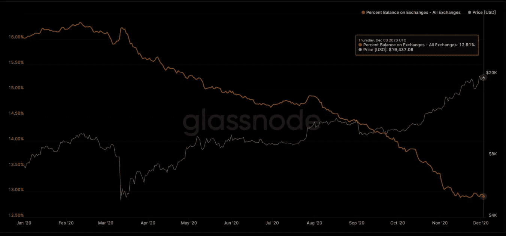
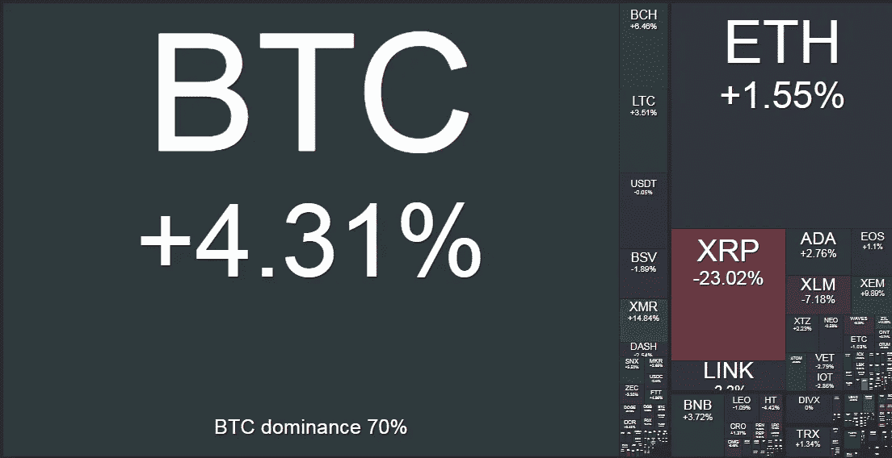

# 对自我主权的攻击？

> 原文：<https://medium.com/coinmonks/attack-on-self-sovereignty-dda9d8323f6d?source=collection_archive---------7----------------------->

## **本周在 Crypto**

随着我们开始结束这一年，并从非凡的 2020 年结束，最后一个季度让市场观察人士领略了 2021 年可能会发生的事情。SEC 13F 文件将于本季度末提交，这可能有助于机构进一步采用 BTC，这是 2020 年第四季度的主要趋势，因为拥有超过 1 亿美元 AUM 的投资经理必须向 SEC 披露他们的持股情况。几个月前，我们开始看到企业将 BTC 配置到自己的国债中，再加上宏观基金公开披露 BTC 配置的频率越来越高，这些因素很可能没有被美国乃至全球超过 1 亿美元的基金经理忽视，他们中的许多人将难以应对自己的表现。

虽然在 Kenetic Trading，我们坚信随着传统银行系统被互联网推动的全球数字转型所破坏，加密的采用是不可避免的，但 2020 年的 COVID 疫情很可能为加速这种采用提供了一种高辛烷值的催化剂。尽管我们原本预计随着 2017 年以来适当的基础设施继续建设(熊市的一个决定性特征)，机构资金最终会到来，但即使是我们也对比特币的合法性被真正的机构投资者——养老基金、保险基金和(间接)主权基金——验证的速度感到惊讶。

我们最近在本周讨论了美国和中国是如何通过扣押与犯罪有关联的 BTC 而“无意”成为大量比特币的持有者的。尽管这些世界超级大国可能仍会在市场上处置这些资产，但我们确实预测，主权国家和央行将在未来几年建立 BTC 头寸，并为比特币作为价值储存手段的用例提供最终验证。我们对此的推理是，市场正朝着一个清晰的轨迹前进，其速度让许多人摸不着头脑。[最近 Bridgewater Associate 的雷伊·达里奥](https://news.bitcoin.com/worlds-largest-hedge-fund-ray-dalio-bitcoin-gold-alternative-in-portfolios/?utm_source=hs_email&utm_medium=email&_hsenc=p2ANqtz--NFg1WaO0COo4943ybOrFaMEXVAjeHv1biE2ZrAphMxe83FZLK5FpYNRGVsgEsp6c5wPHz)在上周的 Reddit AMA 上投降，这表明即使是最有经验的金融怀疑论者也可能改变他们对 Satoshi 近 13 年发明的看法，一旦他们在经历了臭名昭著的比特币“兔子洞”后理解有所改善。

“我认为比特币(和其他一些数字货币)在过去十年里已经成为有趣的类似黄金的资产替代品，与黄金和其他有限供应的财富储存有相似之处和不同之处。至于相对于黄金的比特币，我更倾向于持有那些中央银行试图交易时想要持有和交换价值的东西。”——雷伊·达里奥，2020 年 12 月 9 日

*“货币有两种用途，一种是交易媒介，另一种是财富储存，而比特币现在在这两种情况下都不起作用。”——*达利奥今年 1 月在瑞士达沃斯举行的 2020 年世界经济论坛上发表讲话。

上周，随着马萨诸塞州相互人寿保险公司以 1 亿美元收购 BTC 进入市场，比特币的采用达到了一个关键的里程碑。这里的区别在于，保险资金买入比特币是真正的机构采纳。BTC 叙事已经从技术专家、高净值个人和家族理财室蔓延开来，最近还蔓延到了宏观对冲基金和一些知名企业的资产负债表。上周，这家有着 169 年历史的美国保险公司公开披露了一笔 1 亿美元的收购，这是比特币在真正的机构应用中迈出的新的、非常重要的一步，也代表着对这种领先加密货币的看法和基本理解正在迅速转变，并渗透到由城里最老的投资者管理的最保守的资本中。市场上的这些信号——雷伊·达里奥的投降/ Mass Mutual 的 1 亿美元收购——非常看涨，并强化了供应短缺加剧的积极反馈循环，从而推高了价格，并导致人们对 BTC 的兴趣不断增加。早期采用者可能会获得丰厚的回报，因为投资银行和经纪商(摩根大通是最新的一家)将继续支持该行业。JPM 肯定看好保险行业的这一举措，他们的策略师暗示，Mass Mutual 的第一笔拨款可能会为更多养老基金和保险资金进入这一领域打开闸门。尽管这些投资者不太可能购买 MicroStrategy 规模的%分配，但他所在行业的庞大规模意味着，根据摩根大通的说法，仅来自美国、欧洲和日本的 1%分配就能让[约 6000 亿美元流入 BTC。如果发生这种情况，这无疑会对比特币的价格产生不对称影响。](https://www.forbes.com/sites/youngjoseph/2020/12/14/bitcoin-faces-a-600-billion-catalyst-jpmorgan-strategists-say/?sh=614617eb1e6c&utm_source=hs_email&utm_medium=email&_hsenc=p2ANqtz--NFg1WaO0COo4943ybOrFaMEXVAjeHv1biE2ZrAphMxe83FZLK5FpYNRGVsgEsp6c5wPHz)

具有讽刺意味的是，我们不禁注意到，以目前约 3600 亿美元的市值计算，比特币的市场规模将仅次于全球最大的上市金融机构 JPM，在公司市值方面排名全球第 17 位。

*“我们将这笔初始投资视为第一步，像任何投资一样，我们可能会探索未来的机会”——*Mass Mutual 声明

在撰写本文之时，比特币继续在略低于 2017 年历史高点的位置盘整，尽管我们仍不能排除对 15%左右的修正，但市场认为在这些水平上的出价很好，现货市场对永久衍生品合约的交易持平甚至略有溢价，这表明对比特币的实物需求正在主导价格走势。我们还应该指出，几个月来，比特币一直在一条上升加宽楔形的上升趋势支撑线上运行，12 月 21 日似乎就要结束了——正如北海巨妖《每日市场简报》今天所指出的那样。

**对自我主权的攻击？**

比特币基地首席执行官 Brian Armstrong 是第一个向[发出国家对自我主权的潜在攻击警报的最杰出人物之一，我们已经在本周多次讨论了令人担忧的缓慢加密监管过程。随着特朗普政府即将结束，美国财政部长史蒂夫·姆努钦(Steve Mnuchin)似乎正在匆忙通过一些围绕数字资产自我保管限制的非常专制的监管。](https://twitter.com/brian_armstrong/status/1331744884856741888?utm_source=hs_email&utm_medium=email&_hsenc=p2ANqtz--NFg1WaO0COo4943ybOrFaMEXVAjeHv1biE2ZrAphMxe83FZLK5FpYNRGVsgEsp6c5wPHz)

我们已经注意到，最近几个月交易所持有的比特币数量急剧下降，许多人预计国家和分散资金之间的摩擦将会升温。投资者一直在关注阿姆斯特朗的警告，即国家瞄准的明显目标是个人和公司持有自己的资金并按照自己的意愿支出的权利。在美国，用户如何存储和移动数字资产的繁重限制似乎正在快速逼近。

Chart from Glassnode showing the reduction of BTC held on exchanges (as a % of total supply) vs BTC price

社交媒体渠道上流传着一些传言，要么是彻底禁止加密资产的自我保管，要么是将适用于交易所等金融机构的严厉新法规，这些机构需要在允许取款之前验证用户是否控制了自己的钱包。这将需要与这些中央机构分享更多的个人财务数据——问问爱德华·斯诺登(Edward Snowden)为什么会是这样一个问题。

上周三，当四名国会议员(戴维森、艾默、巴德和佩里)发表了一封给部长姆努钦的公开信，要求国会讨论、辩论和质疑任何限制使用所谓的“自我 T2”钱包的规定时，担忧加剧了。他们对机构和市场参与者被要求收集过多密码用户数据的可能性，以及中国金融体系的金融监管进行了比较。他们认为，当金融数字创新在他们身边发生，而他们却在扼杀他们的国内产业时，美国和美国人将被抛在后面……我们完全同意这一点。

戴维森、艾默、巴德和佩里对姆努钦的这种公众压力是 100%正确的。应该不惜一切代价维护社会控制他们生活和财务的能力，最近交易所持有的数字资产的减少(假定将被转移到自我保管)表明了这一人权在许多投资者眼中是多么重要。监管对于支持一个健康的市场当然很重要，但它不应该以损害社会保护和持有自己财产的自由为代价，这在这些不确定的时期是至关重要的。

Crypto weekly performance: 16th December 2020\. Source [www.bitgur.com](http://www.bitgur.com/?utm_source=hs_email&utm_medium=email&_hsenc=p2ANqtz--NFg1WaO0COo4943ybOrFaMEXVAjeHv1biE2ZrAphMxe83FZLK5FpYNRGVsgEsp6c5wPHz)

在 [www.kenetic.capital](http://www.kenetic.capital) 注册免费的每周简讯

## 另外，阅读

*   [密码交易机器人](/coinmonks/crypto-trading-bot-c2ffce8acb2a)
*   [Uniswap API](https://bitquery.io/blog/uniswap-pool-api) —如何获取 Uniswap 数据？
*   [Deribit 审查](/coinmonks/deribit-review-options-fees-apis-and-testnet-2ca16c4bbdb2) |选项、费用、API 和 Testnet
*   [FTX 密码交易所评论](/coinmonks/ftx-crypto-exchange-review-53664ac1198f)
*   [Bybit 交换审查](/coinmonks/bybit-exchange-review-dbd570019b71)
*   最好的比特币[硬件钱包](/coinmonks/the-best-cryptocurrency-hardware-wallets-of-2020-e28b1c124069?source=friends_link&sk=324dd9ff8556ab578d71e7ad7658ad7c)
*   [密码本交易平台](/coinmonks/top-10-crypto-copy-trading-platforms-for-beginners-d0c37c7d698c)
*   [Bitsgap vs 3 commas vs quad ency](https://blog.coincodecap.com/bitsgap-3commas-quadency)
*   最好的[加密税务软件](/coinmonks/best-crypto-tax-tool-for-my-money-72d4b430816b)
*   [最佳加密交易平台](/coinmonks/the-best-crypto-trading-platforms-in-2020-the-definitive-guide-updated-c72f8b874555)
*   最佳[加密贷款平台](/coinmonks/top-5-crypto-lending-platforms-in-2020-that-you-need-to-know-a1b675cec3fa)
*   [莱杰 Nano S vs 特雷佐 one vs 特雷佐 T vs 莱杰 Nano X](https://blog.coincodecap.com/ledger-nano-s-vs-trezor-one-ledger-nano-x-trezor-t)
*   [block fi vs Celsius](/coinmonks/blockfi-vs-celsius-vs-hodlnaut-8a1cc8c26630)vs Hodlnaut
*   [bits gap review](/coinmonks/bitsgap-review-a-crypto-trading-bot-that-makes-easy-money-a5d88a336df2)——一个轻松赚钱的加密交易机器人
*   为专业人士设计的加密交易机器人
*   [PrimeXBT 审查](/coinmonks/primexbt-review-88e0815be858) |杠杆交易、费用和交易
*   [Altrady 评论](https://blog.coincodecap.com/altrady-reivew)
*   [埃利帕尔泰坦评论](/coinmonks/ellipal-titan-review-85e9071dd029)
*   [赛克斯石评论](https://blog.coincodecap.com/secux-stone-hardware-wallet-review)
*   [BlockFi 评论](/coinmonks/blockfi-review-53096053c097) |赚取高达 8.6%的加密利息
*   开发人员的最佳加密 API
*   [最佳区块链分析工具](https://bitquery.io/blog/best-blockchain-analysis-tools-and-software)
*   [加密套利](/coinmonks/crypto-arbitrage-guide-how-to-make-money-as-a-beginner-62bfe5c868f6)指南:新手如何赚钱
*   顶级[比特币节点](https://blog.coincodecap.com/bitcoin-node-solutions)提供商
*   最佳[加密制图工具](/coinmonks/what-are-the-best-charting-platforms-for-cryptocurrency-trading-85aade584d80)
*   了解比特币的[最佳书籍有哪些？](/coinmonks/what-are-the-best-books-to-learn-bitcoin-409aeb9aff4b)

> [在您的收件箱中直接获得最佳软件交易](/coinmonks/newsletters/coinmonks)

