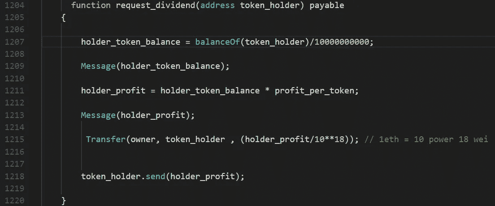
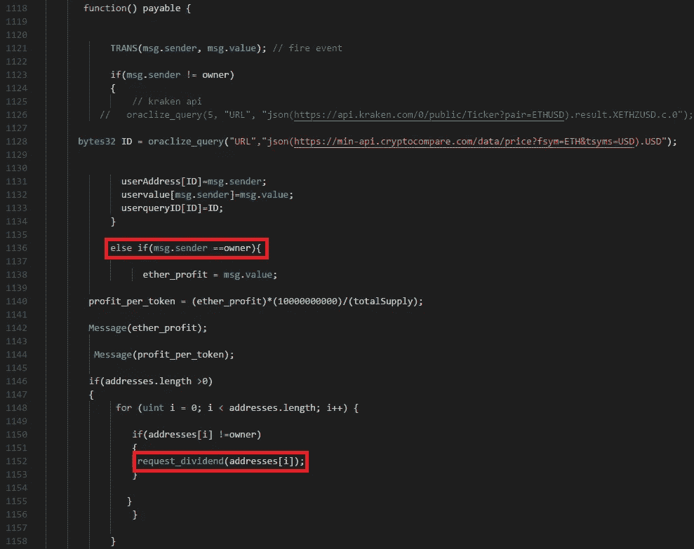

# 攻击者可以窃取 ROC (Rasputin Online Coin)令牌智能合约(CVE-2018–10944)中的所有乙醚

> 原文：<https://medium.com/coinmonks/attackers-can-steal-all-of-ether-in-roc-rasputin-online-coin-token-smart-contract-ae928b4a935a?source=collection_archive---------10----------------------->

# 摘要

我发现了一个 ROC(又名 Rasputin Online Coin)智能合约的漏洞，一个以太坊 ERC20 令牌([**CVE-2018–10944**](http://cve.mitre.org/cgi-bin/cvename.cgi?name=CVE-2018-10944))[【1】](http://cve.mitre.org/cgi-bin/cvename.cgi?name=CVE-2018-10944)。 *request_dividend()* 函数有一个类似于**重入攻击**的严重 bug。攻击者可以多次调用该函数来不断窃取以太，直到耗尽所有契约的以太。

# 细节

Figure 1\. Source code of the request_dividend() function

图 1 显示了 *request_dividend()* 函数[【2】](https://etherscan.io/address/0x1bcbc54166f6ba149934870b60506199b6c9db6d#code)的源代码。首先，这个函数使用作为函数参数的`token_holder`的余额来计算`holder_token_balance`和`holder_profit`。然后，它向`token_holder`发送和`holder_profit`一样多的乙醚。然而，在传输前后,`token_holder`的平衡不会降低。这意味着我们可以一次又一次地向`token_holder`发送相同数量的乙醚，直到合同中的乙醚全部耗尽。而且， *request_dividend()* 函数被声明为 public，没有权限检查，所以任何人都可以调用这个函数，将契约的以太发送到任何地址。

## 攻击者能做什么？

攻击者可以通过反复调用 *request_dividend()* 函数来获取所有的契约以太。他们所要做的就是购买一些 ROC 令牌，并使用他们的帐户地址调用 *request_dividend()* 函数。攻击者可以通过无限调用该函数来获取所有的契约以太。

## 为什么会这样？

我不确定他们为什么这样实现 *request_dividend()* 函数。在我看来，这里有两个错误。

首先， *request_dividend()* 函数不检查之前有多少乙醚被转移到特定地址。因此，request_dividend()函数发送相同数量的以太网，即使多次使用相同的地址调用它。与**重入攻击**类似，因 [**道攻击**【3】](https://blog.ethereum.org/2016/06/17/critical-update-re-dao-vulnerability/)而广为人知。一种解决方法是在函数的某处减少`token_holder`的平衡。在 DAO 攻击之后，开发人员通常会在传输之前插入减少帐户余额的代码。

第二， *request_dividend()* 函数中没有权限检查。它被声明为 public，也没有对`msg.sender`的检查。因此，任何人都可以用任何地址调用该函数。

Figure 2\. fallback function of the contract

图 2 显示了契约的回退功能。在回退函数中，当`msg.sender`为`owner`时，执行**request _ dividend()*函数。从这段代码中，我猜测开发人员打算设计只有所有者才能调用的 *request_dividend()* 函数。但是，他们忘记了函数的可见性，比如*内部的*，以及权限检查，所以导致了一个严重的 bug。*

# *毁坏*

*幸运的是，这个智能契约没有任何以太，因此没有攻击者可以窃取的以太。然而，攻击者不断地监视合同，然后只要有人向合同发送以太网，他们就可以窃取以太网。可悲的是，但幸运的是，ROC 令牌不是有前途的令牌(它还没有在任何交易所上市)，所以我预计不会有用户向 ROC 令牌的智能合约发送以太网。*

# *报告*

*我曾试图向 Rasputin 在线硬币的管理员报告此事。但是他们的 [ICO 官网](https://ico.rasputinonline.com/)宕机了，我找不到负责智能合约的邮箱。我在[*https://www.rasputinmansion.com/*](https://www.rasputinmansion.com/)*找到了一封邮件*livesupport@verotel.com*发了一封邮件但是没有回应。因此，我建议不要购买这个令牌，直到它是固定的。**

# **结论**

**开发人员在实现传递以太的函数时应该小心，因为一个小错误可能会导致严重的问题，比如这个 bug 和 DAO 攻击。他们应该考虑谁是函数的调用者，并仔细检查帐户的余额和重复传输的可能性。最后，购买没有完全验证的加密硬币是很危险的。**

# **参考**

*   **[1][http://cve.mitre.org/cgi-bin/cvename.cgi?name=CVE-2018-10944](http://cve.mitre.org/cgi-bin/cvename.cgi?name=CVE-2018-10944)**
*   **[2][https://ethers can . io/address/0x 1 bcbc 54166 f 6 ba 149934870 b 60506199 b 6 c 9 db 6d # code](https://etherscan.io/address/0x1bcbc54166f6ba149934870b60506199b6c9db6d#code)**
*   **[3][https://blog . ether eum . org/2016/06/17/critical-update-re-Dao-vulnerability/](https://blog.ethereum.org/2016/06/17/critical-update-re-dao-vulnerability/)**