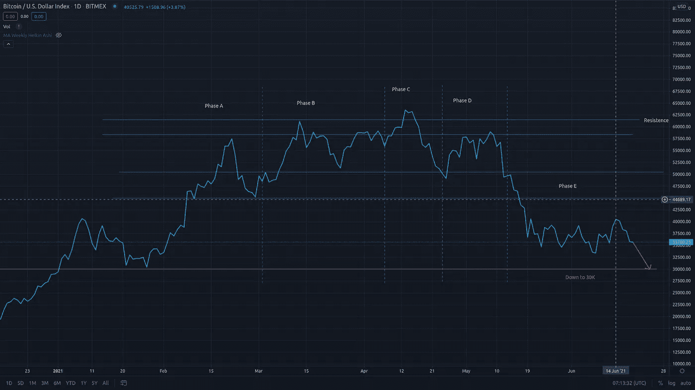

# 请注意:如何用威科夫方法准备下一次比特币修正

> 原文：<https://medium.com/coinmonks/attention-please-how-to-prepare-for-the-next-bitcoin-correction-with-the-wyckoff-method-c8570858a25e?source=collection_archive---------7----------------------->

## 一切都崩溃了。

BTCUSD 1D Chart on TradingView

我在 6 月 16 日给[发了一条推文](https://twitter.com/razvantomegea/status/1405244097808437249?ref_src=twsrc%5Etfw%7Ctwcamp%5Etweetembed%7Ctwterm%5E1405244097808437249%7Ctwgr%5E%7Ctwcon%5Es1_c10&ref_url=https%3A%2F%2Fpublish.twitter.com%2F%3Fquery%3Dhttps3A2F2Ftwitter.com2Frazvantomegea2Fstatus2F1405244097808437249widget%3DTweet)，提到[威科夫分布](https://school.stockcharts.com/doku.php?id=market_analysis:the_wyckoff_method)还没有结束，我在期待另一个最终修正。