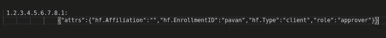

# Hyperledger 结构中基于属性的访问控制(ABAC)

> 原文：<https://medium.com/coinmonks/attribute-based-access-control-abac-in-hyperledger-fabric-1eb81330f67a?source=collection_archive---------0----------------------->


在 Hyperledger Fabric 中，ABAC 用于将访问权限限制在证书中具有必要属性的特定用户。

1.  先说带属性的认证创建。

通常，创建证书的过程是
1)注册
2)注册

注册是用户从给定的 CA 请求并获得数字证书的过程。注册通常由注册员完成，告诉 CA 发行数字证书。

*   一名**管理员**(注册员)在 CA 中注册。然后**管理员**接收这个**管理员**的签名密钥和证书。
*   管理员然后用正确的信息将**用户 1** 注册到 CA 中。CA 返回一个**秘密**。
*   然后，该密码用于将用户 1 注册到 CA。结果是**用户 1** 的签名密钥和证书。

我已经在 youtube 上传了一个详细的视频来实现基于属性的访问控制。

> [发现并回顾最佳区块链软件](https://coincodecap.com)

在我们的例子中，我假设 admin 已经注册，我们将使用属性注册 USER1。

```
fabric_ca_client.register({ enrollmentID: username, affiliation: ‘org1.department1’, role: ‘client’, attrs: [**{ name: ‘role’, value: ‘approver’, ecert: true }**] }, admin_user);
```

在使用 fabric-ca-client 注册用户时，我们需要提供属性，即键-值对对象的数组。在上面的代码片段中，我们提供了属性 **{ name: 'role '，value: 'approver '，ecert: true }。**对于用户 1，我们将添加角色作为审批者。一旦用户注册成功，我们也需要注册。

```
*fabric_ca_client.enroll({ enrollmentID: username, enrollmentSecret: secret,* ***attr_reqs: [{ name: “role”, optional: false }]****});*
```

注册时，请确保**选项**应为**假。**生成证书后，我们可以在证书中看到如下属性。

在证书的底部，我们可以看到在注册
“**角色”:“审批者”时给出的属性。**



**2。现在让我们先进入 go 中的链代码，然后再进入节点。**

1.  **Go 智能合约**

以下所有代码示例都假设了两个条件:

*   `stub`变量的类型是传递给链码的`ChaincodeStubInterface`。
*   您已经将以下 import 语句添加到您的 chaincode 中。

`import "github.com/hyperledger/fabric/core/chaincode/lib/cid"`

客户端身份(cid)包中有多种功能可用

在本文中，我们将讨论如何获取属性。

在上面的代码片段中，一旦我们获得了值，就在受限智能契约函数中实现您的业务逻辑。

2.**节点智能合约**

首先在函数顶部导入 fabric-shim 包。

就像 go smart contract 中提到的一样，根据您在 smart contract 中的业务逻辑实现添加以下代码片段。

就是这样，你在 Hyperledegr Fabric 中成功实现了基于属性的访问控制。您可以选择任何语言来编写智能合同，我在 go 和 node 语言中已经介绍过了，它对所有语言都是一样的。

希望这篇文章对你有帮助。如果你遇到任何问题，请告诉我，我很乐意帮助你。你可以通过 linked in 或 Instagram 与我联系。
[https://www.instagram.com/pavanadhavofficial/](https://www.instagram.com/pavanadhavofficial/)
[https://www.linkedin.com/in/pavan-adhav/](https://www.linkedin.com/in/pavan-adhav/)

谢谢你。

# 参考

*   [https://github.com/hyperledger/blockchain-explorer](https://hyperledger-fabric-ca.readthedocs.io/en/release-1.4/users-guide.html#attribute-based-access-control)
*   [https://hyperledger-fabric . readthedocs . io](https://hyperledger-fabric.readthedocs.io/en/release-1.3/prereqs.html)
*   [https://github.com/hyperledger/fabric-samples](https://github.com/hyperledger/fabric-samples)

> [直接在您的收件箱中获得最佳软件交易](https://coincodecap.com/?utm_source=coinmonks)

[](https://coincodecap.com/?utm_source=coinmonks)