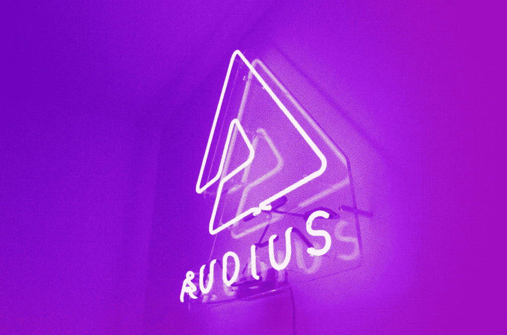

# 奥迪斯:音频内容的未来

> 原文：<https://medium.com/coinmonks/audius-the-future-of-audio-content-102958b02d9a?source=collection_archive---------9----------------------->

到 2021 年，音乐家不需要唱片公司就能获得最新的录音设备、发行黑胶唱片、接触粉丝、培养听众、计划发行或预订场地。那么，艺术家需要唱片公司做什么？答案是资本。上面列出的所有东西都是要花钱的，大多数流媒体服务为每个流媒体支付 0.003 到 0.005 美元。在数字流媒体的世界里，帮助艺术家获得资本的一个显而易见的方法是提高他们每流的报酬。这就是奥迪斯的用武之地。

Audius 的使命是让任何人和每个人都可以使用一种协议自由分发、货币化和流式传输任何音频内容，这种协议将永远存在，并由艺术家、开发人员和粉丝组成的分散社区共同拥有。Audius 还将授权艺术家访问和控制他们的所有数据，并允许他们直接与粉丝沟通。奥迪斯正在建立一个系统，激励粉丝和艺术家的互动，并允许粉丝直接资助艺术家。2021 年 7 月，奥迪斯拥有 3，822，997 个独立用户和 5，790，100 次播放。2021 年 8 月，奥迪斯拥有 6，042，136 个独立用户和 6，513，684 次播放。如果我们将这些数字与 Audius 仅在 2021 年 8 月收到的 84，190，191 个 API 调用进行比较，我们就可以开始了解 Audius 的影响和采用率。这当然是在 2021 年 8 月 16 日奥迪与抖音合作的消息之后，这使得奥迪成为首批与社交媒体应用程序签署协议的流媒体服务之一。由于使用他们音乐的视频在抖音迅速传播，许多不知名的音乐艺术家的人气飙升。奥迪斯现在在他们的流媒体平台上有一个简单的分享按钮，可以无缝地将音乐曲目导入抖音应用程序。

奥迪斯背后是谁和什么？

Audius 由首席执行官 Roneil Rumburg 和首席工艺官 Forrest Browning 创建。伦伯格和布朗宁都毕业于斯坦福大学，拥有可靠的科技背景。Rumburg 是比特币 p2p 交易平台 slashback 的联合创始人，最近又联合创立了凯鹏华盈(Kleiner Perkins)的早期种子基金，该基金最引人注目的是对闪电实验室(Lightning Labs)进行了种子投资，后者正在比特币的基础上建立第二层，允许更便宜、更快速的比特币交易。Browning 是 Stacksware 的联合创始人，该公司为财富 500 强客户提供数据分析。布朗宁也是福布斯 30 岁以下获奖者。奥迪斯已经从 Blockchange Ventures、Multicoin Capital 和 General Catalyst 等公司筹集了风险资本。

Audius 于 2019 年 9 月 24 日推出了他们的音乐流媒体和免费托管服务。自那以后，Audius 成为越来越受欢迎的流媒体服务，这很容易让人想起早期的 SoundCloud。Audius 与所有其他现有流媒体平台的重要区别在于 Audius 对区块链技术的依赖。Audius 使用区块链来保存分散的内容分类账，用户可以查看这些内容。这种分散的内容分类帐由充当用户和应用程序之间的 API(应用程序编程接口)的节点保存。理论上，任何程序开发人员都可以创建一个应用程序，利用 Audius 生态系统并与 Audius 的节点进行通信，以提供相同的内容。

这对$AUDIO token 来说是极为有利的。乍一看，Audius.co 看起来像一个全新的音频流媒体服务，但在幕后，是让奥迪斯有趣的品质。Audius 是一个区块链，意味着记录保存和分类账移动由节点记录和处理。个人以一定数量的美元音频作为他们通过录音或处理所提供价值的抵押品。节点被奖励网络费用和参与治理，而他们的赌注$音频令牌保持他们诚实和公平。一个行为不端的节点可能会使其部分或全部的$AUDIO 被“削减”,这意味着它们的$AUDIO 被破坏，这激励节点为区块链的公共利益而工作。

艺术家和用户可以用他们的$AUDIO 来获得特殊功能和管理。截至 2021 年 8 月 31 日，目前有 2.84 亿美元的音频赌注。这相当于 704，320，000 美元，当前价格为每美元音频 2.48 美元。然而，最终用户不需要知道幕后发生了什么就可以使用 Audius 及其$AUDIO 令牌。Audius 的流媒体服务与 Pandora 或 Spotify 一样容易使用，但它的潜力超过了当今的任何流媒体服务。

**我们为什么投资？**

奥迪斯非常符合我们的投资理念。这个团队很有信誉，也很有能力。白皮书很有意义，而且直截了当。令牌经济学以及押注和交易令牌的激励措施已经完全具体化。奥迪斯既有聪明的资金，也有已经存在的用户和开发者生态系统。在我们的研究中，购买$AUDIO token 是显而易见的。我们的初始投资是在 2021 年 7 月 6 日进行的，当时$AUDIO token 的交易价格是 0.84 美元。当时$AUDIO 的市值为 196，937，551 美元，交易量为 27，831，418 美元。

**现在怎么办？**

在计划退出时，跟踪关键绩效指标是必要的。目前，我们仍然认为$AUDIO 被低估，因此长期持有。奥迪斯的潜力不是无限的，但 room $AUDIO 在市值方面的增长令人震惊。9 月 3 日，也就是我写这篇文章的那天，AUDIO 的市值是 11 亿美元。比特币和以太坊等货币的市值徘徊在三位数十亿美元左右。现在，如果我们看看 Theta Network，这是一个使用区块链技术进行视频流传输的项目，看看他们的本地令牌$THETA，我们可以看到他们拥有大约 70 亿美元的市值。根据我们所知，我们可以想象$AUDIO 的销量会比现在高得多。要注意的关键性能指标是采用和开发。只要奥迪斯基金会继续发展并支持发展，音频代币的价值就会增加。

由 Istari Capital LP 的加密专家和分析师 David Coryat 撰写。

https://www.istari.io/

*本内容仅供参考，您不应将任何此类信息或其他材料理解为法律、税务、投资、财务或其他建议。本报告中的任何内容均不构成 Istari 或任何第三方服务提供商在该司法管辖区或任何其他司法管辖区购买或出售任何证券或其他金融工具的邀约、建议、认可或要约，根据该司法管辖区的证券法，此类邀约或要约是非法的。请注意，Istari Capital LP 投资于本文讨论的项目或与本文相关的项目。*

> 加入 Coinmonks [电报频道](https://t.me/coincodecap)和 [Youtube 频道](https://www.youtube.com/channel/UCbyDhTbOiKh2iUMKBi4-4Zg)了解加密交易和投资

## 也阅读

 [## 最佳加密交易所| 2021 年十大加密货币交易所

### 加密货币交易所的加密交易需要了解市场，这可以帮助你获得利润…

blog.coincodecap.com](https://blog.coincodecap.com/crypto-exchange)  [## 2021 年 9 大最佳加密贷款平台| CoinCodeCap

### 当谈到加密货币贷款时，大量因素等同于良好的收入状况。此外，借款的一部分…

blog.coincodecap.com](https://blog.coincodecap.com/crypto-lending)  [## 2021 年最佳加密交易机器人(免费和付费)

### 2021 年币安、比特币基地、库币和其他密码交易所的最佳密码交易机器人。四进制，位间隙…

medium.com](/coinmonks/crypto-trading-bot-c2ffce8acb2a)  [## 最佳 4 个加密交易信号电报通道

### 这是乏味的找到正确的加密交易信号提供商。因此，在本文中，我们将讨论最好的…

medium.com](/coinmonks/best-crypto-signals-telegram-5785cdbc4b2b)  [## BlockFi 评论 2021:利弊和利率

### 今天，我们提出了一个全面的 BlockFi 评论，这是一个成立于 2017 年的加密贷款平台，拥有其…

blog.coincodecap.com](https://blog.coincodecap.com/blockfi-review)  [## 如何在印度购买比特币？2021 年购买比特币的 7 款最佳应用[手机版]

### 如何使用移动应用程序购买比特币印度

medium.com](/coinmonks/buy-bitcoin-in-india-feb50ddfef94)  [## 加密税务软件——五大最佳比特币税务计算器[2021]

### 不管你是刚接触加密还是已经在这个领域呆了一段时间，你都需要交税。

medium.com](/coinmonks/best-crypto-tax-tool-for-my-money-72d4b430816b)  [## Pionex 评论-被动交易者的简单交易机器人

### 在本文中，我们将回顾 Pionex，它提供了加密交易机器人自动化工具，集成了一个…

blog.coincodecap.com](https://blog.coincodecap.com/pionex-review-exchange-with-crypto-trading-bot)  [## 存储比特币的最佳加密硬件钱包[2021]

### 保管您的数字资产很容易，但找到正确的存储方式却是一项繁琐的任务。在线钱包有一个风险…

blog.coincodecap.com](https://blog.coincodecap.com/best-hardware-wallet-bitcoin)