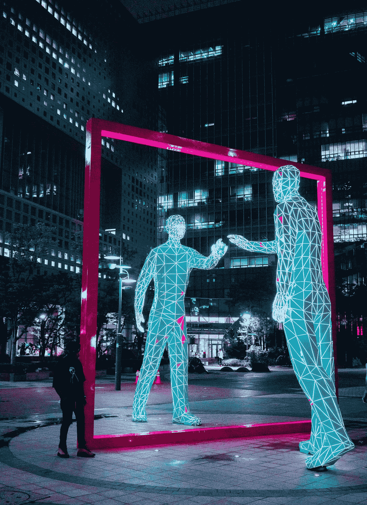
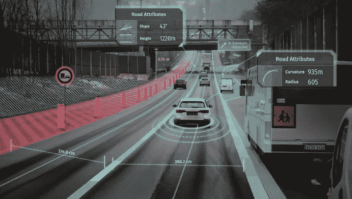
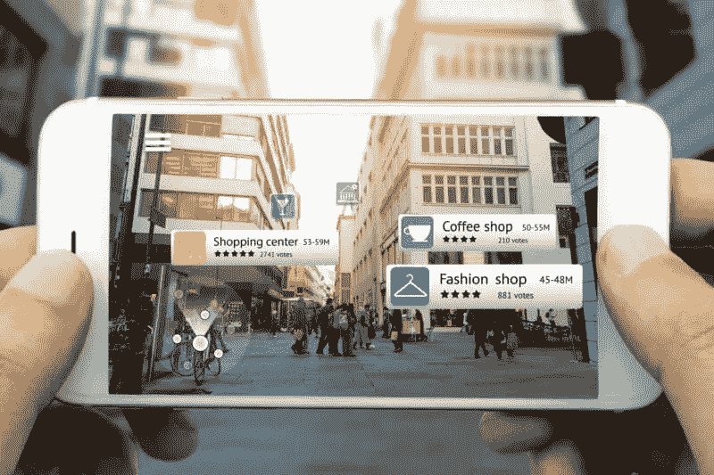
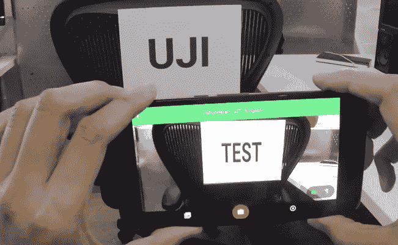
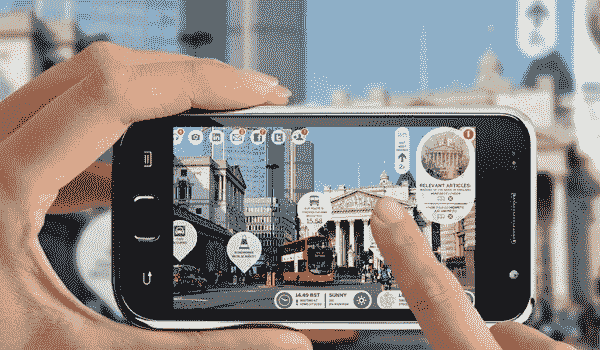

# 智能城市中的增强现实应用

> 原文：<https://medium.com/coinmonks/augmented-reality-applications-in-smart-cities-8f511fe5895?source=collection_archive---------3----------------------->

Photo by [Steve Roe](https://unsplash.com/@steveroe_?utm_source=medium&utm_medium=referral) on [Unsplash](https://unsplash.com?utm_source=medium&utm_medium=referral)

现在我们生活的大多数方面都涉及信息技术。城市生活也不例外。物联网使用的增加使得[智能城市](https://internetofthingsagenda.techtarget.com/definition/smart-city)的概念成为可能。它涵盖了从环境保护到计算机辅助交通管理的许多领域。智能城市包括尖端技术的组合，包括物联网、人工智能和[智能传感器](https://internetofthingsagenda.techtarget.com/definition/smart-sensor)。

许多城市开始实施智能城市技术。[领先位置](https://easyparkgroup.com/smart-cities-index/)由哥本哈根、新加坡、斯德哥尔摩、苏黎士和波斯顿占据。IESE 城市行动战略认为纽约、伦敦和巴黎是世界上最先进的智能城市。

智慧城市概念的一个主要组成部分是让城市环境更加以人为本。这就是增强现实发挥作用的地方。智能传感器，人工智能，物联网都是有助于现代城市生活质量的技术。然而，如果没有增强现实，这个画面是不完整的。其他技术被认为是“后端”技术，在后台工作，并保持隐藏状态。增强现实可以是一个界面，提供对智能城市所有好处的访问。有了增强现实，就有可能以一种完全不同的方式与正常环境互动。

## 航行

[Source](https://www.geospatialworld.net/news/dubai-technologies-partner-support-self-driving-transportation-expo-2020/)

导航是通常想到的第一个 AR 应用。现代城市的大都市区域甚至对当地居民来说都很难导航。许多人通过看智能手机屏幕来导航。这不是最安全的导航方法，因为你通常不知道你的周围，很容易发生事故。创建一个带有导航功能的[增强层](https://www.businessinsider.com/google-showcases-augmented-reality-navigation-on-google-maps-2018-5)可以极大地改善导航体验，提高您旅途的安全性。

## 物理对象的搜索引擎

[Source](https://searchengineland.com/augmented-reality-now-280884)

正如 [VentureBeat 文章](https://venturebeat.com/2017/11/20/augmented-reality-will-transform-city-life/)所指出的，谷歌等搜索引擎用来索引网络的相同方法，将被用于在智能城市环境中索引真实世界的对象。

> 试图获得你周围的物体、地点和人的信息是一个复杂的过程，这与在火狐上输入谷歌搜索截然不同。然而，一旦解决，这种“真实世界的索引”将使我们的城市生活更加丰富，更容易导航。VentureBeat。

当我们使用网络浏览器在互联网上导航时，将会有增强现实浏览器在增强现实世界中导航。然而，这种浏览方式将与我们在互联网上使用的方式截然不同。增强现实浏览不是简单地键入搜索查询，而是可能涉及到与世界的物理交互，使用手势和身体运动。

Blippar 是一个增强现实搜索引擎，旨在为室内商店带来新的购物体验。虽然购物是增强现实搜索引擎最明显的应用，但它绝对不受其限制。谷歌是否在增强现实搜索市场占据主动，或者增强现实搜索市场是否存在一种新的创业公司，仍然是一个悬而未决的问题。

## 公民社交网络

增强现实可以用作社交平台的框架，公民可以在社交平台上相互互动，分享信息，并对真实的物理对象发表评论，如餐厅、医院和其他设施。安道尔为其公民创建了一个 [AR 社交网络](https://www.citylab.com/life/2018/08/ar-is-transforming-tech-what-can-it-do-for-cities/566618/)，每个人都可以对该国的任何对象添加评论，其他用户也可以看到它们。把它想象成增强现实 Foursquare。

## 消除语言障碍

[Source](https://www.popsci.com/google-translate-adds-augmented-reality-translation-app)

外国游客经常去那些从导航到餐馆菜单都完全用当地语言书写的城市。为了改善在外国城市的旅行体验，增强现实翻译器将在任何有文本的表面上创建一个带有翻译的[层，在那里你可以指向你的智能手机摄像头。](https://www.popsci.com/google-translate-adds-augmented-reality-translation-app)

## 改善观光体验

[Source](https://www.mytechlogy.com/IT-blogs/13459/travel-tourism-experiences-with-augmented-reality/)

当你以游客的身份参观一个城市时，很容易迷失在这个城市的景点中。例如，你在一个古老的意大利小镇上看到一座文艺复兴时期的漂亮建筑，但却不知道它是什么。CultureClic 应用程序提供了一个关于城市景点的增强信息层。你只需将智能手机对准一栋建筑或一件艺术品，就能立即获得相关信息。

## 安全性

增强现实与物体识别(特别是人脸识别)相结合，可以帮助当局识别可疑行为，并在早期阶段预防犯罪。这项技术可以通过增强现实眼镜来实现，这种眼镜将突出显示表现出恶意行为或在犯罪记录中被发现的人。虽然这听起来像是来自未来反乌托邦世界的故事，但事实证明这正是中国当局最近实施的措施:

> 智能眼镜看起来很像谷歌眼镜，但它们用于识别潜在的嫌疑人。该设备连接到一个接入中国国家数据库的数据源，利用面部识别找出潜在的罪犯。警察可以通过抓拍他们的照片并将其与数据库进行匹配来识别人群中的嫌疑人。 [TechCrunch](https://techcrunch.com/2018/02/08/chinese-police-are-getting-smart-glasses/)

## 最后的想法

增强现实技术已经变得越来越普遍。智能城市应用将推动其增长。增强现实与能够为增强现实交互提供最佳体验的技术之间有着密切的联系。你的智能手机现在是查看增强现实世界最便宜但不是最方便的方式。[AR 眼镜的最新发展](https://www.investors.com/news/technology/click/magic-leap-first-augmented-reality-glasses/)可能会通过提供新的增强现实眼镜模型，将 AR 技术推向一个新的水平。

> [直接在您的收件箱中获得最佳软件交易](https://coincodecap.com/?utm_source=coinmonks)

