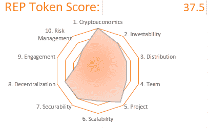

# 预兆:预测市场的未来

> 原文：<https://medium.com/coinmonks/augur-the-future-of-prediction-markets-5588126b6e83?source=collection_archive---------2----------------------->

REP 是一个可投资的代币，具有良好的加密经济基础。由于潜在的监管审查，这些积极因素被不参与的社区和高于平均水平的风险状况所缓解。结果得到 50 分中的 37.5 分。

[获得审核](http://cryptojungle.io/wp-content/uploads/2019/11/REP-Tear-Sheet.pdf)

[PDF 格式的完整报告](http://cryptojungle.io/wp-content/uploads/2019/11/REP-Report.pdf)

**概述**

Augur 是一个建立在以太坊区块链上的分散式预言和预测市场协议。用户为预测未来事件创造市场，并在结果上下赌注。

对正确结果下注的用户基于分配给他们的预测正确的赔率而被支付。

代表令牌确保这些市场被公平地创建和结算。

**密码经济学(满分 5 分)**

REP 用于在 Augur 协议上标记预测市场的创建和解析。在这些预测市场结果的创造者、使用者和解决者之间调整激励。

供应增加是有限的，只有在解决有争议的市场需要分叉时才有可能。价值产生于创造和参与市场的交易费用。

创造市场是主要的网络效应。市场需要销售代表去开拓和解决，随着市场的开放，需求也在增加。导致价格上涨，因为创造者和解析者获得代币来参与不断扩大的市场生态系统。

**可投资性(4/5)**

该项目没有正式的金库，因为它已经下放了权力。由项目领导建立的[预测基金会](https://messari.io/organization/forecast-foundation)旨在支持开发，迄今为止，其支出已得到控制。

该项目被积极使用。最近增长已经趋于平稳。积极参与市场决议是代表持有者获取价值的方式，因为决议者有权分享交易费。

Augur 是唯一一个积极运作的分散式预测市场。考虑到 Gnosis 等相邻竞争对手不追求 Augur 采用的分散式 oracle 方法，这是一个可以辩护的立场。

**分布(3.5/5)**

[内线令牌分配](https://messari.io/asset/augur#profile)不受归属或锁定的限制。供应量固定在 1100 万。尽管当要求 forks 解决有争议的市场时，名义上可能会增加。

因为当需要用叉子来解决有争议的结果时。代表持有者愿意向 fork 承诺他们的代表，以帮助解决结果。如果他们的分歧最终解决了争议，将额外获得 5%的销售代表分配。

某种程度上抵消了对长期使用的负面影响。用于分销代表的固定供应 ICO 模型是一种公平和广泛的象征性销售。在 2015 年 8 月 17 日至 2015 年 10 月 1 日的发行期内，80%的供应量直接出售给公众。

**团队(5 个中的 3.5 个)**

由于该项目是完全分散的，因此不存在正式的预测小组。非正式地，最初的项目领导继续以各种方式支持 Augur，主要是通过 Forecast Foundation。项目创始人乔伊·克鲁格(Joey Krug)和马尔科·桑托里(Marco Santori)分别担任潘迪拉资本的联席首席信息官和区块链总裁，在加密领域有着出色的表现。

Forecast Foundation 由具有市场营销、运营和法律事务背景的个人组成，以补充专注于增强协议的技术人才。然而，似乎没有任何人以前参与过预测市场的运作。

技术团队的背景信息中包含了构建分布式计算系统的经验。详细情况不容易全面评估。

该项目的杰出支持者行为合乎道德。透明度有时会受到阻碍，因为人们担心监管机构可能会对市场作出何种反应，这可能会导致在公开讨论时自然保持沉默。

**项目(5 分中的 4.5 分)**

该项目是现场与持续增长的[使用](https://newwebsite.coinmetrics.io/charts/#assets=rep_left=activeAddresses_zoom=1279324800000,1560729600000)和开放源代码。最初的[白皮书](http://www.smallake.kr/wp-content/uploads/2016/05/augur.pdf)写得很好。2018 年发布的[更新版本](https://www.augur.net/whitepaper.pdf)进一步扩展了如何设计和运营一个有效的去中心化 oracle。为用户提供独特的价值主张，因为这是唯一使用这种方法的预测市场项目。

*作者注—另一份白皮书更新似乎是。* **可扩展性(3.5 分，满分 5 分)**

而概述对预兆的看法的评论是频繁和详细的。对其他方法的评论很少。由于项目支持者自然不愿意提供评论，他们觉得这会引起不必要的关注。

虽然没有正式加入该项目。Forecast Foundation 由专注于支持 Augur 的人才组成。

项目开发是积极和持续的，表明可持续的资金。由于该项目没有专门的金库，所有这些努力和资金都是自愿捐助的。

概述项目目标的路线图日期为[。许多目标已经实现。随着新工具的推出，开发人员的体验在不断改善，以帮助构建 Augur 的功能和界面。](/@AugurProject/a-roadmap-for-augur-and-whats-next-930fe6c7f75a)

**安全性(4/5)**

目前，使用英语的主要是盎格鲁-撒克逊人(英国、美国、加拿大)。这主要是因为迄今为止，用于建立和访问市场的非英语用户界面的开发很少。

Augur 安全性的基础是以太坊协议及其庞大的节点网络。为了安全，它不使用自己的节点。

相反，它通过设定足够高的费用来建立平衡，以阻止垃圾邮件发送者和其他恶意行为者创造市场，但足够低的费用不会阻止合法创作者。这些费用是以销售代表当前市值的%来报价的。

当销售代表价格下降时，平衡很难维持。因为建立市场所需的代表数量随着价值的下降而上升。

该项目维持并激活了 [bug 赏金](https://www.augur.net/bounty/)计划。随着用户界面工作继续使协议更易访问，Staking 集中在早期采用者中。

**权力下放(5 选 4)**

决定市场结果的正确一方的解决者将根据其持股规模获得一部分交易费。作为一个 ERC-20 令牌，它很容易被安全地存储。

超过 50 名开发者对该项目做出了[贡献](https://github.com/AugurProject)，FCAS 计算的项目开发分数为 [855](https://app.flipsidecrypto.com/tracker/tokens) 。奥格于 2018 年 7 月完成了去中心化，烧坏了可用于关闭市场的项目领导的终止开关。

所有权表现出一定的集中度。前 10 名非交易所持有者拥有约 33%的股份，前 100 名持有者拥有约 55%的股份。所有权的分散得益于可被购买的交易所的数量。

交易所持有总供应量的 17.5%以上。可能分散在大量的个人投资者中。

没有它的创造者，占卜者也能正常工作。烧毁终止开关有效地从创始团队手中夺走了控制权，从那时起它就一直正常运行。

**参与度(5 分之 2.5)**

对于非英语使用者来说，可访问性是一个挑战，因为非英语用户界面的开发到目前为止还很少，主要集中在北美和英国。

开发人员一直采用该协议来构建应用程序。一个著名的合作伙伴，维尔，专注于建立一个用户界面，使市场更容易进入。2019 年 7 月[关闭](https://finance.yahoo.com/news/prediction-markets-platform-veil-shutting-102554994.html)，因为它努力获得牵引力。

该项目在 [Reddit](https://reddit.com/r/Augur) 上获得了积极的评论。讨论集中在操作预测市场的机制上。该项目的 [Discord](http://invite.augur.net/) 拥有大量成员，并通过其渠道深度参与。

**风险管理(3/5)**

Twitter 上的提及率很低，围绕该项目的情绪是[中性的，](https://thetie.io/coin-detail/REP.X)最少的 Google Trends 活动表明缺乏主流关注。

所有版本的奥格代码都经过了全面的[审核](https://github.com/AugurProject/augur-audits)。资金以美元筹集。

当 2017 年美国众议院选举结果的争议以有利于民主党的赌注解决时，表现出反脆弱性。进一步的证据表明，该项目能够在有争议和无效的市场中生存下来，这是确认抗脆弱性所必需的。

Augur 的主要攻击媒介是错误解析的市场和寄生市场。分叉机制理论上可以防止不正确的市场决议。这是未经测试的日期。通过分叉成功解决争议需要确认稳健性。

寄生市场无需支付报告费用。如果寄生市场的建立压倒了标准市场的建立，那么代表的价值就会大大降低。

虽然奥格的终止开关被烧毁，以防止监管机构关闭，其著名的支持者密切监视公众意见如何可以收到。监管风险是不可避免的，因为市场的建立随时都有可能招致监管机构不必要的审查。

想开始进行你自己的审计吗？在此下载审计模板[！](http://cryptojungle.io/wp-content/uploads/2019/10/CryptoJungle-Audit-Template.xlsx)

# 感谢阅读

注册我的[简讯](http://mpower365.com/newsletter-sign-up/)，了解我最新的加密资产研究。

> [在您的收件箱中直接获得最佳软件交易](https://coincodecap.com/?utm_source=coinmonks)

