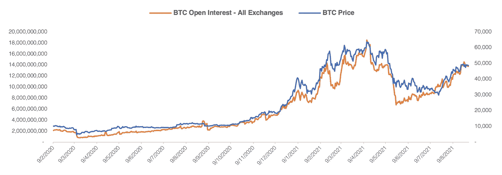

# 加密新闻更新—2021 年 8 月

> 原文：<https://medium.com/coinmonks/august-2021-crypto-news-update-2cc71bd24b27?source=collection_archive---------2----------------------->

## 您对数字资产世界的每月简报

> 文章作者 [Lesia M.](https://twitter.com/LesiaMrch)

Photo by [Silas Baisch](https://unsplash.com/@silasbaisch) on Unsplash.com

*   **比特币概述**
*   **以太坊概述** *- EIP 1559 升级*
*   **卡尔达诺案**
*   **索拉纳拉力赛**
*   **政府&法规:美国和世界**
*   加密新闻:
    *-交易所、DeFi &稳定账户*
    - *银行/金融服务
    -支付*

# **比特币概述**

在经历了两个月的横盘后，BTC 在 7 月份结束时价格出现了明显的上涨，这是许多多头所希望的。这种连续 8 天的价格飙升标志着 8 月份的总体上涨趋势，在此过程中出现了一些高达 10%的小幅回调。在 8 月 23 日测试了 50，000 美元的心理阻力位之后，月底 BTC 接近 47，500 美元的支撑位，这是自 5 月中旬以来从未见过的价格水平。

Source: Tradingview.com

测试上升趋势的支撑位代表了自 7 月 20 日以来上涨 70%后市场的获利回吐。

在 8 月份的上涨趋势中，BTC 未平仓合约的增长速度快于标的价格。鉴于融资利率处于正区间，这意味着新的长期投资头寸开始增加。与此同时，考虑到相对较低且稳定的融资利率环境和期货现货基础，市场似乎尚不具备反弹至 56K 美元阻力位的实力。目前回到横向漂移可能会导致进一步巩固期延长到 9 月初。

Source: app.intotheblock.com | JKL Research

宏观经济的不确定性以及日益加剧的缩减担忧对加密货币市场产生了影响，并可能在美联储 9 月 21/22 日会议之前延续到下个月。

# **以太坊概述**

8 月 5 日，伦敦福克终于推出了期待已久的 EIP-1559 以太坊升级版。EIP-1559 将确保以太坊的一部分天然气费用被烧掉，其余的归矿工所有，从而为该资产的稀缺性制造了一个案例。鉴于以太坊越来越多地被机构和零售采用，伦敦升级是确保加密货币未来成功的重要里程碑。从 7 月 21 日到 8 月中旬，这种升级已经反映在 ETH 的上涨趋势中。

价格稳步运行，在 2550 美元处突破 100 毫安，并在 8 月 23 日达到 3378 美元的峰值。在 7 月 20 日至 8 月 23 日的一个月内，ETH 升值超过 96%，从 1720 美元一路飙升至 3378 美元。ETH 目前正处于整个加密市场的整合期，为其下一步行动积累基础。

## **EIP-1559 详细**

伦敦的升级终于将人们期待已久的 EIP-1559 升级到了以太博物馆。EIP-1559 将确保 Ethereum 的一部分煤气费用被烧掉，剩下的给矿工。这一升级被计入了从 7 月 21 日到 8 月中旬的上涨趋势中。

EIP-1559 将对用户的以太网产生什么影响？

1.它承诺提供可预测的费用支付体验，减少网络上大量费用超额支付的情况。

2.新的基本费用燃烧机制将强制减少联邦医疗保险的发行，降低密码的通货膨胀率。

今天，Ethereum 的费用市场基于首次价格拍卖，根据竞争性交易的定价，费用会大幅波动。为了解决这些问题，EIP-1559 引入了一个可预测的基本费用机制。 [Coindesk Research](https://static.coindesk.com/wp-content/uploads/2021/06/EIP-1559-Ethereum-Fee-Market-Upgrade-Explained-1.pdf) 报告对此次升级的解释如下:

“基本费用是用户根据 EIP 1559 号法规在以太网上发送交易或完成操作所需的最低天然气价格。它根据以太网上每个区块的空间利用率而波动。理想情况下，Ethereum 上的每个区块最多可容纳 1500 万气体。然而，在网络拥塞时，EIP 1559 允许数据块大小增加到这个数量的两倍。

这些长期调整旨在确保 Ethereum 的天然气使用量趋向于平均每区块约 1500 万天然气。"

自伦敦硬叉计划实施以来，Ethereum 网络已经[烧掉了](https://watchtheburn.com/)超过 15 万个 ETH，价值约 5 亿美元。

# **卡尔达诺案**

8 月份，ADA 价格上涨超过 110%，从月初的约 1.3 美元涨到月底的 2.8 美元。以美元计算，卡达诺在密码领域的增长最为强劲，一个月内市值超过 450 亿美元。

那么，什么是卡尔达诺？为什么它如此特别？Cardano 于 2017 年推出，是区块链第二大支持智能合同功能的公司，为加密项目和分散应用提供了一个平台。在撰写本文的时候，智能合同还没有在卡达诺的区块链部署，但是根据开发者的更新，这似乎迫在眉睫。时间表是阿隆佐硬叉完成后的 9 月。([多看](https://www.coindesk.com/markets/2021/08/23/cardano-alonzo-hard-fork-what-you-need-to-know/))

Source: youtube.com | IOHK

随着智能合约的推出，Cardano 预计将超越以太坊:虽然后者只是过渡到股权证明协议，但 Cardano 已经成功地运行了它。事实上，卡达诺是目前世界上市值最大的区块链公司。

卡尔达诺最明显的优势之一是项目的高度分散化。卡尔达诺的 3000 个股份池运营商负责 100%的区块生产。网络上块生产者的数量越多，他们提供的安全性就越高，使得 51%攻击的可能性极小。

ADA 在流通中的分布是项目偏好去中心化的另一个证据，只有 16%的加密资产属于团队&创始人，84%掌握在投资者手中。

在 8 月份，ADA 升值超过 110%，从月初的 1.3 美元涨到月底的 2.8 美元。

# **索拉纳的集会**

Solana 是智能合约领域主导地位的下一个竞争对手，8 月份 SOL 增长了令人震惊的 224%。这一价格上涨使该加密机的市值增加了约 240 亿美元。

Solana 也是一个相对较新的网络规模的区块链，旨在提供快速、安全和可扩展的应用程序和市场。重点是交易速度，Solana 用历史证明机制解决。它为每个事务分配一个时间戳，以实现可伸缩性和高吞吐量。

Solana 领先于其最接近的竞争对手，如 Polkadot 或 Cardano，因为该项目已经部署了智能合同功能，并在其网络上运行了多个项目。在 8 月份的索尔拉力赛期间，我们已经看到了在其生态系统中拥有领先项目的好处，此前《退化的猿》——索拉纳的 NFT 项目——在网上疯传([了解更多](https://finance.yahoo.com/news/solana-reaches-time-high-following-142157225.html)，奥迪斯与抖音合作([了解更多](https://www.cnbc.com/2021/08/17/audius-lands-tiktok-partnership-and-its-token-audio-market-cap-surged.html))。

## **波动性和相关性**

# **政府&法规:美国**

8 月份，美国监管机构对加密市场的安全和控制进行了大量调查。

8 月 3 日，SEC 主席加里·詹斯勒在阿斯彭安全论坛上公开谈论加密货币监管。Gensler 强调了 SEC 在监管加密市场方面的权威，以及对加密交易所、借贷平台、DeFi 和 stablecoins 制定进一步规则的必要性。未来的一个热门话题是确定加密资产是否是一种证券，因此必须在 SEC 注册。([阅读更多](https://www.cnbc.com/2021/08/03/the-sec-needs-more-power-from-congress-to-fully-regulate-crypto-chair-gensler-says.html))

Gensler 的加密讨论中的一个亮点是，他暗示要审查比特币 ETF 提案，以纳入在 CME 交易的比特币期货。虽然对 SEC 监管的比特币交易所交易基金的希望仍然是一个梦想，但比特币**期货**交易所交易基金即将成为现实。在这一宣布之后，资产管理公司争相重写和提交比特币期货交易所交易基金的提案，包括瓦尔基里、瓦内克、银河数码、景顺、ProShares 等。([阅读更多](https://www.ft.com/content/5bbf4b76-e602-4740-aff8-18ecfa96d11c))

## **基础设施法案**

本月初，市场的担忧是围绕参议院的基础设施法案，该法案缩小了加密货币税收申报条款，该条款将在 10 年内筹集 280 亿美元。

该法案对“经纪人”的定义相当宽泛和不明确:它可以包括任何促进加密交易的实体(包括矿商、硬件和软件开发商)，并将强制这些“加密经纪人”进行财务报告和披露。提出了两项修正案，以缩小豁免采矿者、验证者和不提供托管和交易服务的实体的规定范围。有趣的是，其中一个修正案试图只豁免工作证明验证器，这可以被解释为比特币的隐含支持，而不是以太坊。([阅读更多](https://www.coindesk.com/policy/2021/08/07/senates-infrastructure-bill-what-to-expect-on-saturday/))

最终，参议院未能修改法案中的加密措辞，使得新的加密货币税收要求备受争议。与牛市中的通常情况一样，人们以“我们输掉了战斗，但没有输掉战争”的积极态度看待这条消息。市场参与者声称，华盛顿将税收监管扩大到加密是长期监管接受甚至支持的标志。([阅读更多](https://www.cnbc.com/2021/08/11/crypto-lawmakers-fought-over-the-infrastructure-bill-heres-whats-next.html))

## **其他美国法规**

> 加里·詹斯勒给伊丽莎白·沃伦的信表达了对投资者保护的担忧。
> 
> [SEC 主席说大多数 **DeFi** 项目](https://coinmarketcap.com/alexandria/article/sec-chief-says-most-defi-project-arent-decentralized)没有被分散，必须被监管。
> 
> 美国国务院向白帽黑客提供高达 1000 万美元的加密奖励。
> 
> 联邦法院命令 BitMEX 因非法运营加密货币交易平台支付 1 亿美元。
> 
> [SEC 对运营未注册数字资产交易所的 **Poloniex** 和](https://www.sec.gov/news/press-release/2021-147)收费。
> 
> -[**迈阿密市**](https://www.nasdaq.com/articles/city-of-miami-unveils-its-own-cryptocurrency-miamicoin-2021-08-05) 推出自己的加密货币“MiamiCoin”。

# **政府&监管:世界**

> [FCA 通知说**币安**没有能力在英国监管](https://www.bloomberg.com/news/articles/2021-08-25/binance-not-capable-of-supervision-in-u-k-regulators-say)
> 
> 所有币安用户现在都要接受 KYC 的即时核查。
> 
> [**Upbit** 是第一家在 9 月截止日期前向当局注册的韩国交易所](https://www.coindesk.com/markets/2021/08/23/upbit-is-first-korean-exchange-to-register-with-authorities-before-september-deadline/)。
> 
> -[**萨尔瓦多**准备在 200 台自动取款机上推出比特币](https://www.bloomberg.com/news/articles/2021-08-23/el-salvador-readies-bitcoin-rollout-with-200-atms-for-conversion?cmpid=socialflow-twitter-business&utm_content=business&utm_medium=social&utm_campaign=socialflow-organic&utm_source=twitter)用于兑换。
> 
> -[比特币没有价值:**中国人民银行**](https://finance.yahoo.com/news/bitcoin-no-value-people-banks-195931100.html) 官方宣布进一步打击。

# **密码交易所，DEFI & STABLECOINS**

> [**Tether**](https://tether.to/wp-content/uploads/2021/08/tether_assuranceconsolidated_reserves_report_2021-06-30.pdf) 发布 6 月认证报告。
> 
> ——黑客从 [**保利网络盗取并返还 6 亿美元股票。**](https://www.reuters.com/technology/how-hackers-stole-613-million-crypto-tokens-poly-network-2021-08-12/)
> 
> 澳大利亚的加密用户将可以通过[**Crypto.com**](https://cointelegraph.com/news/australian-crypto-users-will-have-access-to-tax-reporting-services-through-crypto-com)获得纳税申报服务。
> 
> 比特币基地 购买了 5 亿美元的加密技术，并将未来的利润投入到加密投资组合中。
> 
> 日本顶级交易所 [**Liquid**](https://www.cnbc.com/2021/08/19/liquid-cryptocurrency-exchange-hack.html) 被黑后，超过 9000 万美元的加密货币被盗。不久之后，黑客交易所从 FTX 获得了 1.2 亿美元的贷款。

# **机构**

## **银行/金融服务**

> -[全球前 100 大银行](https://zerocap.us17.list-manage.com/track/click?u=287cd3513c9a6346f9388e404&id=fa6874d03e&e=c11ff945bc)中有一半以上都有加密和区块链风险敞口。
> 
> -[**贝莱德**](https://news.yahoo.com/blackrock-invests-384m-bitcoin-mining-121211742.html) 向比特币矿业公司投资 3.84 亿美元。
> 
> [**花旗**](https://www.reuters.com/business/finance/citi-considering-bitcoin-futures-trading-some-institutional-clients-2021-08-24/) 考虑为部分机构客户进行比特币期货交易。
> 
> 美国银行家协会 发布加密报告。
> 
> 法国资产管理公司**Melanion Capital 获准在欧盟推出比特币 ETF。**
> 
> **MassMutual 和 NYDIG 结成新的合作伙伴关系。**
> 
> **-[**SIMON 和 NYDIG**](https://www.businesswire.com/news/home/20210825005593/en/Hello-Digital-Assets-SIMON-and-NYDIG-Partner-to-Deliver-Bitcoin-Education-and-Investments-to-Financial-Professionals?utm_medium=email&_hsmi=153389604&utm_content=153389604&utm_source=hs_email) 合作向金融专业人士提供比特币教育和投资。**
> 
> **□比特币基金 [**富国银行**](https://cointelegraph.com/news/wells-fargo-files-for-bitcoin-fund) 文件。**
> 
> **□美国比特币期货 ETF[**银河数码**](https://www.coindesk.com/markets/2021/08/17/galaxy-digital-files-for-us-bitcoin-futures-etf/) 文件。**
> 
> **[**银河数码**](https://cointelegraph.com/news/galaxy-digital-partners-with-bloomberg-for-defi-index) 与彭博合作 DeFi 指数。**

## ****支付****

> **——随着 [**Visa**](https://www.coindesk.com/markets/2021/08/23/cryptopunk-nfts-break-sales-record-as-visa-sparks-buying-frenzy/) 引发购买狂潮，并发布一篇关于 NFTs 的[论文，CryptoPunk NFTs 销量大减。](https://usa.visa.com/content/dam/VCOM/regional/na/us/Solutions/documents/visa-nft-whitepaper.pdf?utm_medium=email&_hsmi=153389604&utm_content=153389604&utm_source=hs_email)**
> 
> **—[**PayPal**](https://www.cnbc.com/2021/08/22/paypal-crypto-service-launches-in-the-uk.html)在英国推出加密货币服务。**
> 
> **—[**Square 的现金应用**](https://www.coindesk.com/squares-cash-app-q2-bitcoin-revenue-rose-200-45m-bitcoin-impairment-taken) Q2 比特币收入上涨 200%，计入 4500 万美元比特币减值损失。**
> 
> **-[**Venmo**](https://techcrunch.com/2021/08/10/venmo-to-allow-credit-cardholders-to-automatically-buy-cryptocurrency-with-their-cash-back/)**允许信用卡持有者自动用他们的现金返还购买密码。****

## ******其他******

> ****-[**AMC**](https://www.coindesk.com/business/2021/08/09/amc-to-accept-bitcoin-for-tickets-and-concessions-later-this-year/)**今年晚些时候接受比特币购票和优惠。******
> 
> ******-[**MicroStrategy**](https://www.sec.gov/Archives/edgar/data/1050446/000119312521254529/d384256d8k.htm?utm_medium=email&_hsmi=153389604&utm_content=153389604&utm_source=hs_email)以 45294 美元的均价多买了 1.77 亿美元的比特币。******
> 
> ****[**德勤 2021 年全球区块链调查:**](https://www2.deloitte.com/us/en/insights/topics/understanding-blockchain-potential/global-blockchain-survey.html?utm_medium=email&_hsmi=153389604&utm_content=153389604&utm_source=hs_email) 76%的受访者认为数字资产将在 5-10 年内匹敌或取代菲亚特。****
> 
> ****美国第二大 [**抵押贷款机构**](https://www.cnbc.com/2021/08/19/united-wholesale-mortgage-will-accept-bitcoin-other-cryptocurrency.html?utm_medium=email&_hsmi=153389604&utm_content=153389604&utm_source=hs_email) 将接受比特币支付。****

# ******免责声明******

*****本材料仅供专业投资者(根据开曼群岛金融管理局不时的定义)使用。虽然本材料中包含的信息是从据信可靠的来源汇编的，但 JKL 不代表或保证本材料中包含的信息的准确性、完整性或可靠性。*****

****本材料的内容未经任何监管机构审查。建议您对本材料的内容保持谨慎。如果您对本材料的任何内容有任何疑问，您应该获得独立的专业意见。JKL 或其任何关联公司，或其任何或其各自的董事、高级职员、员工和代表都不会对因使用或依赖本材料中包含的任何信息而导致的任何直接、间接或后果性损失承担任何责任或义务。本材料不构成认购或购买任何金融产品的要约或邀请。其目的不是提供任何信贷或其他评估的基础，也不应被视为购买任何金融产品的建议。****

*****JKL、其关联公司和/或任何或其各自的高级职员、董事、员工和代表可能不时地在本材料中描述的产品或与产品相关的任何投资中、为其专有账户和/或为其管理的账户和/或为客户拥有重大利益，这可能对产品的价值产生积极或消极的影响。*****

> ****加入 [Coinmonks 电报频道](https://t.me/coincodecap)，了解加密交易和投资****

## ****另外，阅读****

*   ****[什么是融资融券交易](https://blog.coincodecap.com/margin-trading) | [成本平均法](https://blog.coincodecap.com/dca)****
*   ****[BigONE 交易所评论](/coinmonks/bigone-exchange-review-64705d85a1d4) | [电网交易机器人](https://blog.coincodecap.com/grid-trading)****
*   ****[3 商业评论](/coinmonks/3commas-review-an-excellent-crypto-trading-bot-2020-1313a58bec92) | [Pionex 评论](/coinmonks/pionex-review-exchange-with-crypto-trading-bot-1e459d0191ea) | [Coinrule 评论](/coinmonks/coinrule-review-2021-a-beginner-friendly-crypto-trading-bot-daf0504848ba)****
*   ****[莱杰 vs n 格拉夫](/coinmonks/ledger-vs-ngrave-zero-7e40f0c1d694) | [莱杰纳诺 s vs x](/coinmonks/ledger-nano-s-vs-x-battery-hardware-price-storage-59a6663fe3b0) | [币安评论](/coinmonks/binance-review-ee10d3bf3b6e)****
*   ****[bit Exchange Review](/coinmonks/bybit-exchange-review-dbd570019b71)|[bit yard Review](https://blog.coincodecap.com/bityard-reivew)|[coin spot Review](https://blog.coincodecap.com/coinspot-review)****
*   ****[3 commmas vs crypto hopper](/coinmonks/3commas-vs-pionex-vs-cryptohopper-best-crypto-bot-6a98d2baa203)|[赚取加密货币利息](/coinmonks/earn-crypto-interest-b10b810fdda3)****
*   ****最佳比特币[硬件钱包](https://blog.coincodecap.com/best-hardware-wallet-bitcoin) | [比特币 02 点评](/coinmonks/bitbox02-review-your-swiss-bitcoin-hardware-wallet-c36c88fff29)****
*   ****[BlockFi vs 摄氏度](/coinmonks/blockfi-vs-celsius-vs-hodlnaut-8a1cc8c26630) | [Hodlnaut 点评](/coinmonks/hodlnaut-review-best-way-to-hodl-is-to-earn-interest-on-your-bitcoin-6658a8c19edf)|[ku 币点评](https://blog.coincodecap.com/kucoin-review)****
*   ****[Bitsgap 评测](/coinmonks/bitsgap-review-a-crypto-trading-bot-that-makes-easy-money-a5d88a336df2) | [四元评测](/coinmonks/quadency-review-a-crypto-trading-automation-platform-3068eaa374e1) | [Bitbns 评测](/coinmonks/bitbns-review-38256a07e161)****
*   ****[数字货币交易平台](/coinmonks/top-10-crypto-copy-trading-platforms-for-beginners-d0c37c7d698c) | [比特币点评](/coinmonks/coinmama-review-ace5641bde6e)****
*   ****[加密套利](/coinmonks/crypto-arbitrage-guide-how-to-make-money-as-a-beginner-62bfe5c868f6)如何做空比特币指南[Bybit vs 币安](/coinmonks/how-to-short-bitcoin-568a2d0b4ae5) |****
*   ****[币安交易机器人](/coinmonks/binance-trading-bots-d0d57bb62c4c) | [OKEx 点评](/coinmonks/okex-review-6b369304110f) | [Atani 点评](https://blog.coincodecap.com/atani-review)****
*   ****[最佳加密交易信号电报](/coinmonks/best-crypto-signals-telegram-5785cdbc4b2b) | [探月点评](/coinmonks/moonxbt-review-6e4ab26d037)****
*   ****[Godex.io 审核](/coinmonks/godex-io-review-7366086519fb) | [邀请审核](/coinmonks/invity-review-70f3030c0502) | [BitForex 审核](https://blog.coincodecap.com/bitforex-review)****
*   ****[火币交易机器人](https://blog.coincodecap.com/huobi-trading-bot) | [如何购买 ADA](https://blog.coincodecap.com/buy-ada-cardano) | [Geco？一次审查](https://blog.coincodecap.com/geco-one-review)****
*   ****[币安 vs 比特邮票](https://blog.coincodecap.com/binance-vs-bitstamp) | [比特熊猫 vs 比特币基地 vs Coinsbit](https://blog.coincodecap.com/bitpanda-coinbase-coinsbit)****
*   ****[如何购买 Ripple (XRP)](https://blog.coincodecap.com/buy-ripple-india) | [非洲最好的加密交易所](https://blog.coincodecap.com/crypto-exchange-africa)****
*   ****[非洲最佳加密交易所](https://blog.coincodecap.com/crypto-exchange-africa) | [胡交易所评论](https://blog.coincodecap.com/hoo-exchange-review)****
*   ****[eToro vs robin hood](https://blog.coincodecap.com/etoro-robinhood)|[MoonXBT vs by bit vs Bityard](https://blog.coincodecap.com/bybit-bityard-moonxbt)****
*   ****[有哪些交易信号？](https://blog.coincodecap.com/trading-signal) | [比特斯坦普 vs 比特币基地](https://blog.coincodecap.com/bitstamp-coinbase)****
*   ****[ProfitFarmers 回顾](https://blog.coincodecap.com/profitfarmers-review) | [如何使用 Cornix Trading Bot](https://blog.coincodecap.com/cornix-trading-bot)****
*   ****[如何在势不可挡的域名上购买域名？](https://blog.coincodecap.com/buy-domain-on-unstoppable-domains)****
*   ****[印度的秘密税](https://blog.coincodecap.com/crypto-tax-india) | [altFINS 审查](https://blog.coincodecap.com/altfins-review) | [Prokey 审查](/coinmonks/prokey-review-26611173c13c)****
*   ****[Blockfi vs 比特币基地](https://blog.coincodecap.com/blockfi-vs-coinbase) | [BitKan 点评](https://blog.coincodecap.com/bitkan-review) | [Bexplus 点评](https://blog.coincodecap.com/bexplus-review)****