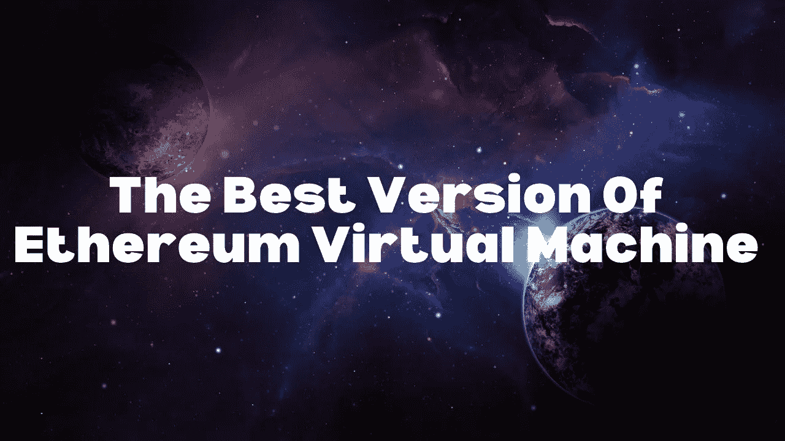

# 极光 EVM:以太坊虚拟机的高级版本

> 原文：<https://medium.com/coinmonks/aurora-evm-the-advanced-version-of-ethereum-virtual-machine-cce95170c69b?source=collection_archive---------2----------------------->

## 上周，NEAR protocol 推出了一款名为 Aurora 的 EVM，可用于开发以太坊兼容资产。

你有没有想过是什么让以太坊区块链不同于比特币区块链？为什么比特币区块链只能进行金融交易，而以太坊可以执行智能合约？

在以太坊区块链中，EVM(以太坊虚拟机)扮演着重要的角色，它为开发人员提供了嵌入在每个完整以太坊节点中的沙盒虚拟堆栈，有助于在以太坊上创建和实施智能合约。

EVM 可以运行计算函数的任何逻辑步骤；这就是为什么我们可以说 EVM 是图灵完备的。EVM 可以用各种编程语言实现，如 C++、Java、JavaScript、Python、Ruby 等。

EVM 收取一些气体来执行每个指令，这意味着在使用 EVM 之前，你需要持有一些以太坊。EVM 通过收取天然气费来保护自己免受潜在的攻击，为每一个指令进行交易，但高昂的天然气成本为开发人员使用 EVM 设置了障碍。

高成本并不是给开发者和 dApp 用户制造障碍的唯一问题，但是以太坊区块链的低可扩展性也产生了同样的影响，开发者和 dApp 用户受害最深。但是如果我告诉你 Aurora 是最终的以太坊虚拟机，它不仅可以帮助开发人员，还可以帮助用户克服低可扩展性和高燃气费问题，会怎么样？

# 极光是什么？

Aurora 是由 NEAR Protocol 的 stellar 团队创建的以太坊虚拟机，通过提供以太坊二层体验来解决当前所有的以太坊虚拟机问题。在这篇文章中，我们将讨论关于极光 EVM 的细节。

# 极光以太坊虚拟机的功能

在对 Defi(去中心化金融)和 NFT(不可替代代币)的需求爆炸式增长之后，对以太坊区块链的需求也增加了。众所周知，以太坊在扩展方面很糟糕，所以我们在以太坊变得更慢的地方表达了燃气费的激增，这些问题正在为现有用户或新用户制造障碍。Aurora 可以用它的高级特性来纠正这些问题，所以让我们一个一个地讨论它的所有特性。

*   **高吞吐量**

以太坊不是分片区块链，所以每当发起一个事务时，它都必须在队列中等待，因为以太坊的所有节点一次可以处理一个块，每个块需要 30.31 秒。因此，以太坊区块链中节点的增加只会有助于提高安全性，而不会提高交易速度或可伸缩性。与以太坊相比，Aurora 允许交易吞吐量增加约 10 倍，这对于[茄](https://hackernoon.com/nightshade-a-new-approach-to-blockchain-sharding-y7m339j)来说成为可能。

*   **第一次确认**

以太坊区块链确认交易的时间取决于燃气费，这意味着高燃气费有助于第一次交易，而低燃气费意味着长达 30 分钟的缓慢交易。但是 Aurora 可以帮助你在 1-2 秒内完成交易。

*   **天然气成本降低 1000 倍**

通过利用附近的区块链，Aurora 将帮助减少高达 1000 倍的天然气费用，即使用户群在未来增长，也不会增长。

*   **不可信桥**

奥罗拉创造了一座通往以太坊的稳定而不可信的桥梁。您可以将所有以太坊资产转移到 Aurora，包括 ERC-20 令牌(已经可用)、NFT、合同调用和合同状态(正在开发中)。

*   **完全符合以太坊**

如果你在问自己:‘完全符合以太坊’是什么意思，或者 Aurora 是不是以太坊虚拟机。这意味着 Aurora EVM 是根据 NEAR 协议创建的，而 NEAR 不是通过以太坊创建的，但是 Aurora EVM 完全兼容以太坊，因此开发人员和用户都不需要使用任何额外的工具或令牌来使用 Aurora。

现有的所有工具都兼容 Aurora，包括 Metamask、Hardhat、Truffle 等。此外，极光基本令牌是 ETH。用户和开发者不会被迫购买任何额外的无用令牌。

# 结论:

Aurora EVM 仍然是新的，因为它上周刚刚推出，但许多知名的区块链项目，如 1inch、DODO、Chainlink、SnowSwap、Band protocol、NEAR protocol、DeFiner 和 imToken 都与 Aurora 合作，探索为他们自己和他们的用户释放这些令人兴奋的好处的下一步。所以我们可以假设极光可以成为以太坊开发者或者用户最好的礼物。

## 另外，阅读

*   [Botsfolio vs nap bots vs Mudrex](/coinmonks/botsfolio-vs-napbots-vs-mudrex-c81344970c02)|[gate . io 交流回顾](/coinmonks/gate-io-exchange-review-61bf87b7078f)
*   [最佳比特币保证金交易](/coinmonks/bitcoin-margin-trading-exchange-bcbfcbf7b8e3) | [萝莉点评](/coinmonks/lolli-review-e6ddc7895ad8) | [比特币保证金交易](https://blog.coincodecap.com/bityard-margin-trading)
*   [创造并出售你的第一个 NFT](https://blog.coincodecap.com/create-nft) | [本地比特币评论](/coinmonks/localbitcoins-review-6cc001c6ed56)