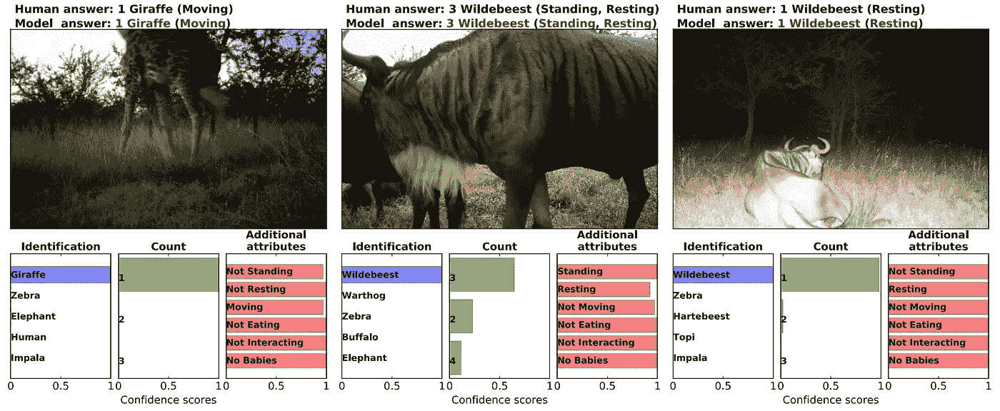
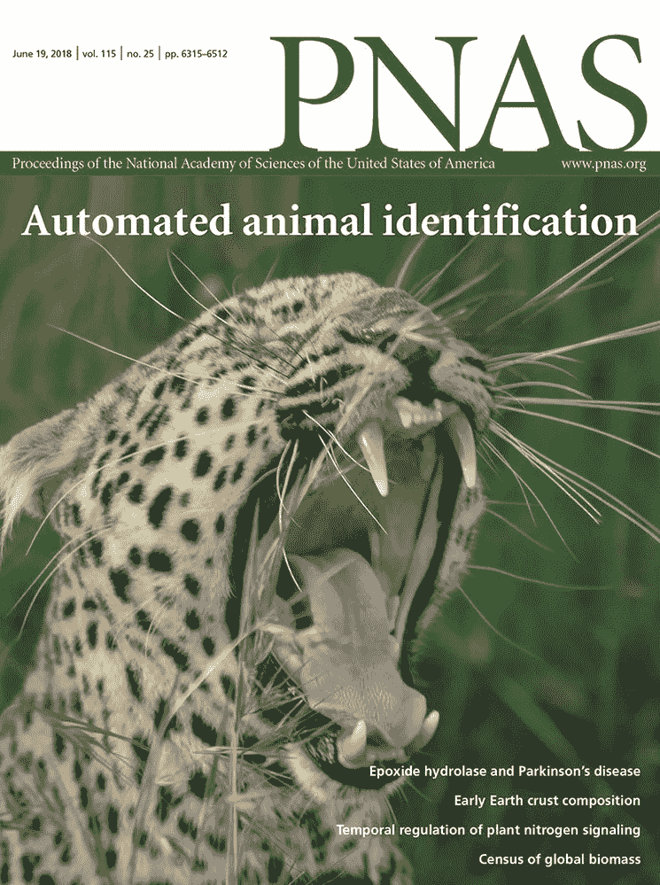
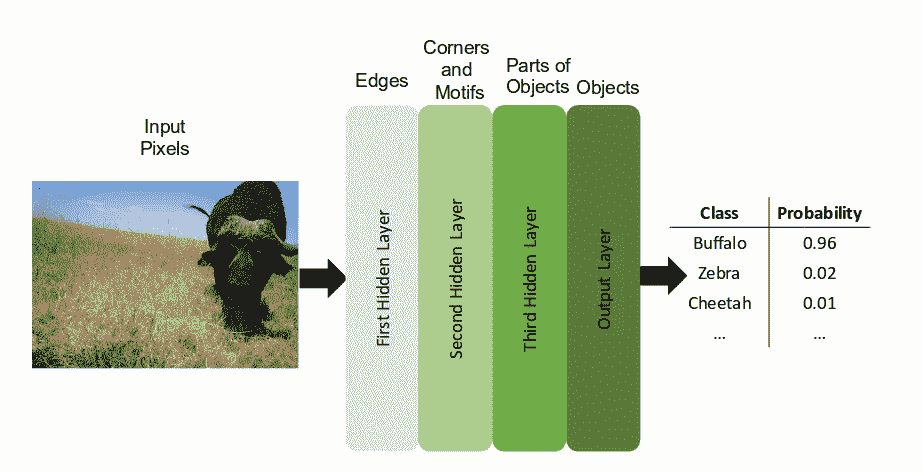
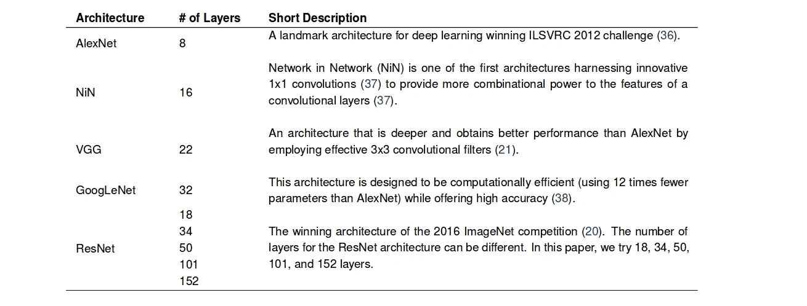
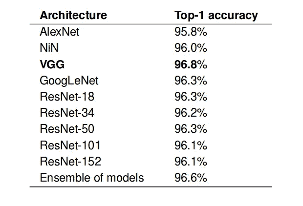
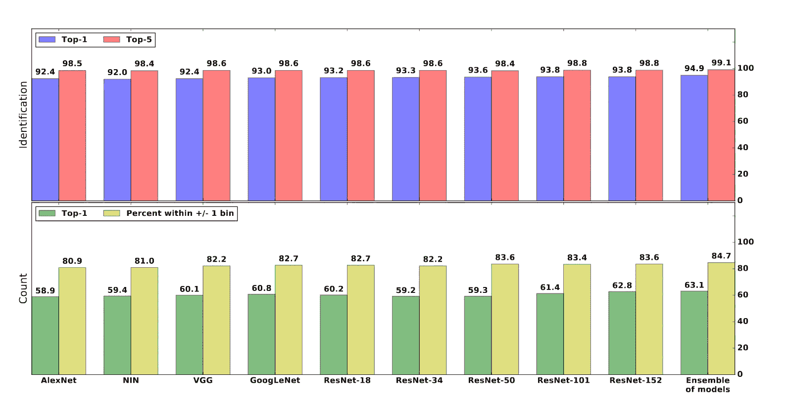
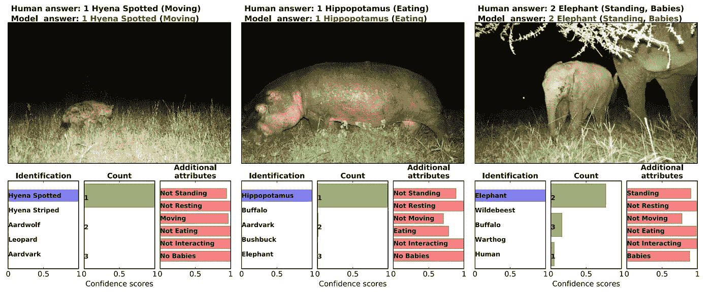
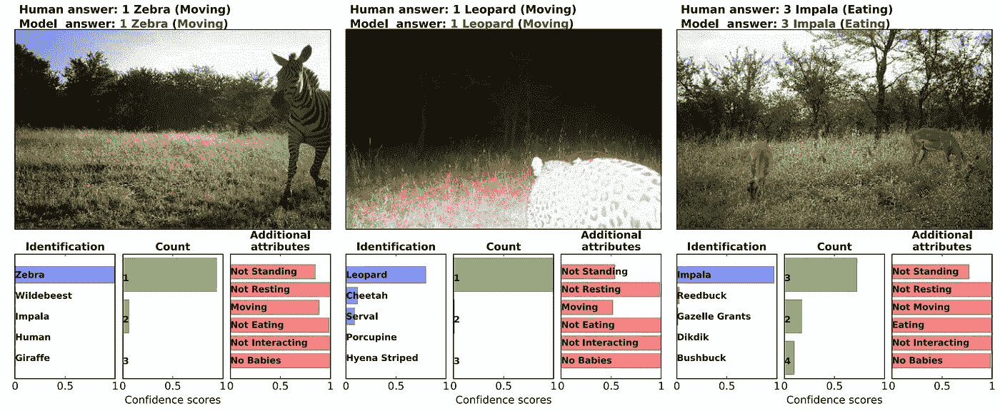

# 使用深度学习技术的自动动物识别

> 原文：<https://medium.com/coinmonks/automated-animal-identification-using-deep-learning-techniques-41039f2a994d?source=collection_archive---------2----------------------->

拥有足够大的数据量为将深度学习方法应用于几乎任何任务提供了机会。近年来，我们已经看到了深度学习方法和技术的成功，尤其是在计算机视觉领域。如今，获取大量的图像数据并不是一个大问题，因为我们的相机以及系统的传输和存储能力都有了很大的提高。同时，标记如此大量的获得的数据需要巨大的人力努力，并且在某种程度上，它代表了解决某些特定问题的整个过程中的瓶颈。

为了更好地了解野生动物生态系统，有必要对动物在自然生态系统中的位置和行为有详细、全面的了解。关于生态系统中动物状态的准确和最新信息对于研究和保护野生动物生态系统至关重要。在过去的几十年里，生态学家、生物学家和野生动物专家已经付出了巨大的努力来拯救野生动物，他们试图提高人们对野生动物和荒野重要性的认识。

生态学家和生物学家获取野生动物信息的一种常用方法是照相机捕捉项目。在野外的特定位置放置大量的摄像机使他们能够研究动物的数量和分布。然而，由于分析来自相机陷阱项目的图像需要人力，专家只能从他们拥有的大量数据中提取很少有价值的信息。

The cover page of PNAS Journal for June 2018 presenting this work.

怀俄明大学研究人员的共同努力；奥本大学、哈佛大学、牛津大学、明尼苏达大学、优步人工智能实验室已经产生了一种从相机捕捉的图像中自动识别动物的****的精确方法。**研究人员使用深度学习技术和大型标记数据集来解决在野外自动识别动物的问题。**

**这个项目的目标是应用深度学习，能够识别、计数和描述动物物种的行为。根据这个定义，这个问题可以被框架为使用来自相机陷阱项目的图像的多任务学习问题。研究人员认为上面提到的任务是相关的，并且所有任务都有共同的特征，他们通过一起学习来解决这个问题。他们还认为，通过这样做，可以更快、更有效地解决任务，并且可以更容易地存储和传输模型。**

# **资料组**

**研究人员使用了来自世界上最大的相机陷阱项目 的 [**快照塞伦盖蒂项目的大规模标记数据集。这个项目在坦桑尼亚的*塞伦盖蒂国家公园*有 225 个连续运行的摄像陷阱。
本项目中使用的公共 Serengeti 数据集包含 320 万幅图像，对应于 120 万个捕捉事件(**注** : *一个捕捉事件代表相机识别运动和拍摄几张照片的时刻*)。在这个项目中，研究人员专注于捕捉只包含一个物种的事件，他们从数据集中删除了包含多个物种的事件。**](https://www.nature.com/articles/sdata201526)**

**因为大多数时候，捕捉事件被触发，并且没有动物出现，所以大多数图像不包含任何动物。从人类的标签来看，75%的数据集是空的(不包括动物)。值得一提的是，该数据集是由志愿者标记的，他们实际上标记了整个捕捉事件(不仅仅是单个图像！).在这种方法中，作者专注于对单个图像进行标记和分类。为此，他们获取每个捕获事件的标签，并将其分配给所有单独的图像。**

**然而，采用这种方法可能对学习过程有潜在的危害，因为从事件转移到单个图像的标签可能经常不对应。在论文中，他们认为添加这种“*噪声*”可以被神经网络克服。**

## **测试装置**

**为了评估模型，作者创建了两个测试集:包含 3800 个捕获事件的专家标记的测试集和包含 17400 个捕获事件的志愿者标记的测试集。**

# **方法**

**研究人员在利用两阶段管道以两阶段方式解决问题时考虑到了这一点:**

*   ****检测动物的存在**(解决空对动物任务)**
*   **(II) **识别存在哪个物种**，**
*   **(III) **计算动物数量**，以及**
*   **(IV) **描述附加的动物属性**(它们的行为和幼仔是否存在)。**

**为了执行这两个主要任务以及信息提取任务中定义的子任务，研究人员训练了一个模型。事实上，在整个项目中，他们研究了不同的深度神经网络架构，以找到最适合在自动动物识别背景下进行多任务学习的架构。**

****

**Gradually converting raw data into more abstract concepts.**

****

**Description of some of the most popular Deep Neural Network architectures, also used in this project.**

## **任务一:检测包含动物的图像**

**第一项任务是最容易的。这是一种二元分类，在这种情况下出现的唯一问题是明显的阶级不平衡。为了解决这个问题，他们采用了 *25%* 的非空图像，并且他们从剩余的 *75%* 的空图像中随机选择了相同数量的数据。这样，他们最终得到了 150 万张图片，其中 140 万张用于训练，10 万张用于测试。正如他们报告的那样，所有分类器在这项任务上都达到了超过 *95.8%* 的准确率，其中 VGG 是最好的模型，达到了 **96.8%。****

****

**Evaluation of different models and the ensemble of all of them.**

## **任务二:识别物种**

**对于这项任务，作者报告了多标签分类的前 1 名和前 5 名准确性，其中 48 个类别对应于训练数据集中存在的 48 个物种。最终模型达到前 5 名准确率的 *99.1%* 。事实上，他们用于识别物种这一特定任务的方法是集成学习——通过对多个模型的所有预测进行平均来获得预测。在专家标记的测试集上评估，该方法具有 *94.9%* top-1 和 ***99.1%*** top-5 的准确率(其中最好的单个模型是 ResNet-152，获得了 *93.8%* top-1 和 *98.8%* top-5 的准确率。**

****

**Top-1 and top-5 accuracy of different models on the task of identifying the species of animal present in the image.**

## **任务三:数动物**

**为了解决这个问题，研究人员将可能的答案空间分成 12 个箱，分别对应于 1、2、3、4、5、6、7、8、9、10、11–50 或+51 个人。对于这项任务，通过专家标记的测试集上的模型集成，他们获得了 63.1%的顶级准确性和 84.7%的预测在+/- 1 箱内。**

## **任务四:动物行为和附加属性**

**塞伦盖蒂数据集包含 6 个不相互排斥的标签，定义了图像中动物的行为:站立、休息、移动、进食、互动以及幼仔是否存在。**

**二元分类解决了由于每个标签的分类问题的非排他性而具有多个标签的可能性(预测该行为是否存在于图像中)。综合所有属性，模型的集合产生了 76.2%的准确度、86.1%的精确度和 81.1%的召回率。**

********

# **结论**

**这项工作表明，深度学习技术可以用于许多领域的问题，它们可以帮助从大量数据中提取大量信息。这是深度学习非常有用的一个用例，可以帮助生物学家和生态学家等专家研究和保护野生动物。**

**[T21【戴恩】米特列夫 ](/@mitrevdane)**

> **加入 Coinmonks [电报频道](https://t.me/coincodecap)和 [Youtube 频道](https://www.youtube.com/c/coinmonks/videos)获取每日[加密新闻](http://coincodecap.com/)**

## **另外，阅读**

*   **[复制交易](/coinmonks/top-10-crypto-copy-trading-platforms-for-beginners-d0c37c7d698c) | [加密税务软件](/coinmonks/crypto-tax-software-ed4b4810e338)**
*   **[网格交易](https://coincodecap.com/grid-trading) | [加密硬件钱包](/coinmonks/the-best-cryptocurrency-hardware-wallets-of-2020-e28b1c124069)**
*   **[密码电报信号](http://Top 4 Telegram Channels for Crypto Traders) | [密码交易机器人](/coinmonks/crypto-trading-bot-c2ffce8acb2a)**
*   **[币安交易机器人](/coinmonks/binance-trading-bots-d0d57bb62c4c) | [OKEx 评论](/coinmonks/okex-review-6b369304110f) | [阿塔尼评论](https://coincodecap.com/atani-review)**
*   **[最佳加密交易信号电报](/coinmonks/best-crypto-signals-telegram-5785cdbc4b2b) | [MoonXBT 评论](/coinmonks/moonxbt-review-6e4ab26d037)**
*   **如何在 Bitbns 上购买柴犬(SHIB)币？ | [买弗洛基](https://coincodecap.com/buy-floki-inu-token)**
*   **[CoinFLEX 评论](https://coincodecap.com/coinflex-review) | [AEX 交易所评论](https://coincodecap.com/aex-exchange-review) | [UPbit 评论](https://coincodecap.com/upbit-review)**
*   **[十大最佳加密货币博客](https://coincodecap.com/best-cryptocurrency-blogs) | [YouHodler 评论](https://coincodecap.com/youhodler-review)**
*   **[最佳加密交易所](/coinmonks/crypto-exchange-dd2f9d6f3769) | [最佳加密交易所](/coinmonks/bitcoin-exchange-in-india-7f1fe79715c9)**
*   **面向开发者的最佳加密 API**
*   **最佳[密码借贷平台](/coinmonks/top-5-crypto-lending-platforms-in-2020-that-you-need-to-know-a1b675cec3fa)**
*   **[免费加密信号](/coinmonks/free-crypto-signals-48b25e61a8da) | [加密交易机器人](/coinmonks/crypto-trading-bot-c2ffce8acb2a)**
*   **[杠杆代币](/coinmonks/leveraged-token-3f5257808b22)终极指南**