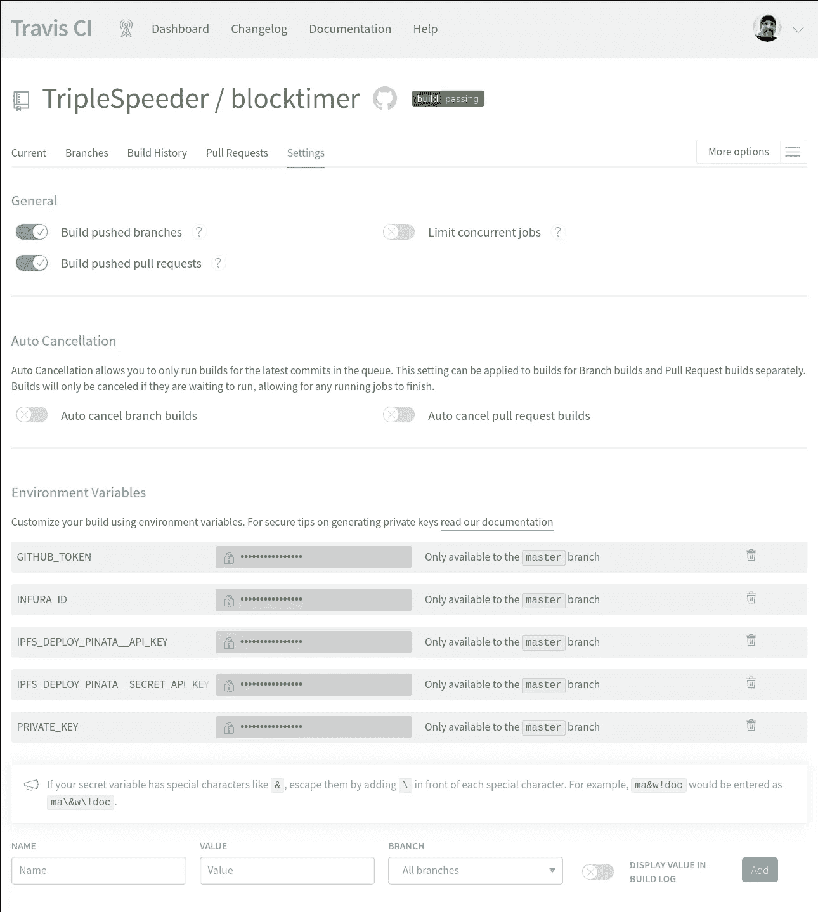
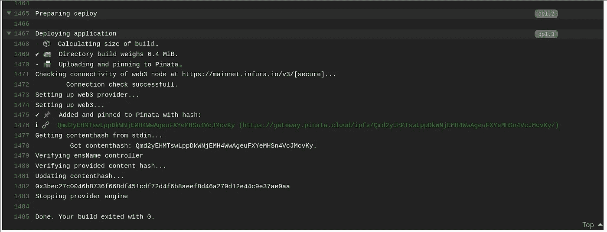

# 自动部署到 IPFS 和 ENS

> 原文：<https://medium.com/coinmonks/automated-deploy-to-ipfs-and-ens-12bae2f40302?source=collection_archive---------0----------------------->

## 如何用 IPFS 和以太坊名称服务自动发布你的去中心化网站

所以你已经注册了一个很好的 ENS 名称，并希望通过 IPFS 和以太坊名称服务提供你的站点/dapp。要使这成为部署脚本的一个无缝部分，需要几个步骤。

# 在我们开始之前…

在本指南中，我假设您已经知道如何使用 IPFS 和 ENS 托管站点的基础知识。重点是部署自动化和调整您的 CI 工作流。如果你不熟悉 ENS 和 IPFS，有些问题可能会出现:)

**Node.js 版本**:在撰写*时，ens-updater* 无法安装在版本≥ 12.x 的节点上，因为一些依赖项需要脚本模块，但无法构建。这个问题在[https://github.com/TripleSpeeder/ens-updater/issues/44](https://github.com/TripleSpeeder/ens-updater/issues/44)追踪。在问题解决之前，请使用节点版本 10 或更低版本。

# 要完成的任务

部署您的分散式站点是一个两步过程:

1.  将内容发布到 IPFS，获得新的 CID
2.  将您的 ENS 名称的 IPFS 记录设置为指向新的 CID

这两个步骤都有命令行工具。首先，我们将详细了解每个步骤，然后我们将创建一个 Travis 配置，该配置将完全自动化部署。

## 步骤 1-发布到 IPFS

对于此任务，我们将使用 CLI 工具 [*ipfs-deploy*](https://github.com/ipfs-shipyard/ipfs-deploy) 。通过 npm 在全球范围内安装:

`> npm install -g ipfs-deploy`

这个工具使用起来非常简单。您只需要提供想要部署的构建文件夹，并选择想要使用的 IPFS 锁定服务。

假设应用程序的生产版本位于文件夹`build`中，您可以运行以下命令，通过公共可用的 [infura](https://infura.io/) ipfs 节点进行部署:

`> ipfs-deploy build -p infura`

注意由 *ipfs-deploy* 提供的 CID 字符串 *Qm…* 。这是您的构建的唯一标识符，需要添加到您的 ENS 名称中。

*Ipfs-deploy* 支持多种不同的 IPFSpinning 服务，其中一些需要认证。查看[自述文件](https://github.com/ipfs-shipyard/ipfs-deploy)了解更多详情。

第一步到此结束——你的构建已经发布了！请继续阅读，了解如何更新您的 ENS 姓名记录。

## 步骤 2 —设置您的 ENS 名称的 contenthash 记录

对于这一步，我们将使用 cli 工具 [*ens-updater*](https://github.com/TripleSpeeder/ens-updater) *。*通过 npm 全球安装:

`> npm install -g @triplespeeder/ens-updater`

*ens-updater* 支持许多不同的命令来管理您的 ens 名称。对于本教程，我们只对设置您的姓名的 contenthash 条目感兴趣，使它指向您在步骤 1 中获得的 CID。查看`ens-updater --help`的输出以了解支持命令的概述，并查看 [github 页面](https://github.com/TripleSpeeder/ens-updater)以了解更多信息。

因为我们需要与 ENS 智能合约交互来更新 contenthash 条目，所以我们需要两件事情来继续:

*   访问以太坊节点与合同进行交互
*   控制 ENS 名称的帐户的私钥

您可以直接提供私钥，也可以通过助记符字符串(和可选的帐户索引)间接提供私钥。对于这两个选项，您需要将信息放在文件*中。env* 或设置环境变量。

对于本教程，我们将把私钥保存在一个. env 文件中。打开您选择的文本编辑器并创建文件。工作目录中的 env:

```
PRIVATE_KEY=<private key here, without leading 0x>
```

为了确保一切设置正确，使用`--dry-run`选项调用 *ens-updater* 。设置此选项后，将不会执行任何实际事务，但会报告潜在的配置或设置问题。

**例**:将 ENS name *mysite.eth* 的 contenthash 记录设置为 ipfs CID*qmd 2 yehmtswlppdkwnjem H4 wwageufxyemhsn 4 vcjmcvky*的完整命令:

`> ens-updater setContenthash mysite.eth ipfs-ns Qmd2yEHMTswLppDkWNjEMH4WwAgeuFXYeMHSn4VcJMcvKy --web3 http://localhost:8545 --verbose --dry-run`

检查结果输出，查看是否报告了任何错误。否则，没有`— dry-run`选项也可以继续！

现在把你的浏览器指向 [http://mysite.eth](http://mysite.eth) 。假设您的系统设置正确，可以使用。你应该看到你的网站在运行！

第 2 步到此结束——现在可以通过您的 ENS 名称访问您的网站了！请继续阅读为自动化部署设置 Travis。

# 将所有这些整合在一起，实现全自动部署

要使用 Travis 自动执行上述步骤，我们需要:

*   创建一个结合了 *ipfs-deploy* 和 *ens-updater* 的部署脚本，由 Travis 在部署阶段执行
*   设置 Travis 执行部署脚本
*   为特拉维斯设置环境变量，以便 *ens-updater* 可以访问私钥

## 部署脚本

由于 *ipfs-deploy* 通过 stdout 提供 CID，并且 *ens-updater* 可以设置为从 stdin 读取 CID，因此我们可以在一个小 shell 脚本中将这两个命令连接在一起，如下所示:

```
#!/bin/bash
ipfs-deploy build -p $1 -C -O | ens-updater setContenthash mysite.eth ipfs-ns stdin -v --web3 $2
```

该脚本期望 pinner 服务将用于部署作为第一个参数，将 web3 连接字符串作为第二个参数。还要注意，通过将特殊字符串“stdin”指定为 *ens-updater* 的 CID，它知道从 stdin 中读取 CID。

将该脚本添加到您的项目中，使其成为存储库的一部分，并可供 Travis 使用。

## 特拉维斯构型

现在编辑 travis.yaml 以在部署阶段执行您的脚本。这里是一个真实项目的(精简的)示例配置，强调了重要部分:

```
os: linux
language: node_js
node_js: 10
jobs:
  include:
    - name: "IPFS"
      install:
        - npm ci
        - **npm install -g ipfs-deploy
        - npm install -g @triplespeeder/ens-updater**
      script: npm run build
      **deploy:
        provider: script
        script: bash scripts/deploy_ipfs.sh pinata https://mainnet.infura.io/v3/$INFURA_ID
        skip_cleanup: true**
```

**安装**阶段包含安装工具 *ipfs-deploy* 和 *ens-updater* 的附加命令。

**部署**阶段使用 ipfs pinner 服务“pinata”和来自 infura 的 web3 实例执行我们刚刚创建的部署脚本。不要忘记`skip_cleanup`选项——否则，Travis 将在开始部署之前清除构建文件夹…

最后缺少的部分是提供 ENS 名称控制器帐户的私钥。让我们开始吧！

*   转到您在 Travis 的项目页面
*   打开设置页面
*   转到“环境变量”一节

添加一个名为“PRIVATE_KEY”的新环境变量，并将您的私钥粘贴到 VALUE 字段中。将分支字段设置为主分支，因为部署将仅从主分支运行。确保**而不是**选中“在构建日志中显示值”**——否则任何人都可以在构建日志中看到您的私钥。**

**在我的例子中，我还为 pinata IPFS 服务和 Infura web3 服务添加了环境变量，并为 Github-pages 的可选部署添加了 GitHub 令牌。以下是完整设置的屏幕截图:**

****

**有了这些变化，触发一个新的构建。如果一切顺利，您的构建日志将会像这样结束:**

****

****就是这样！每当您向主分支推送更新时，这些更改将被部署到 IPFS，并且您的 ENS 名称的 contenthash 记录将被更新。****

**这个故事比我想象的要长，所以谢谢你读到这里！如果你有任何问题或意见，请写信给我。你也可以通过[推特](https://twitter.com/TripleSpeeder) (@triplespeeder)或者发邮件给[michael@m-bauer.org](mailto:michael@m-bauer.org)联系我**

**[](https://coincodecap.com)**

> **[在您的收件箱中直接获得最佳软件交易](https://coincodecap.com/?utm_source=coinmonks)**

**[](https://coincodecap.com/?utm_source=coinmonks)**