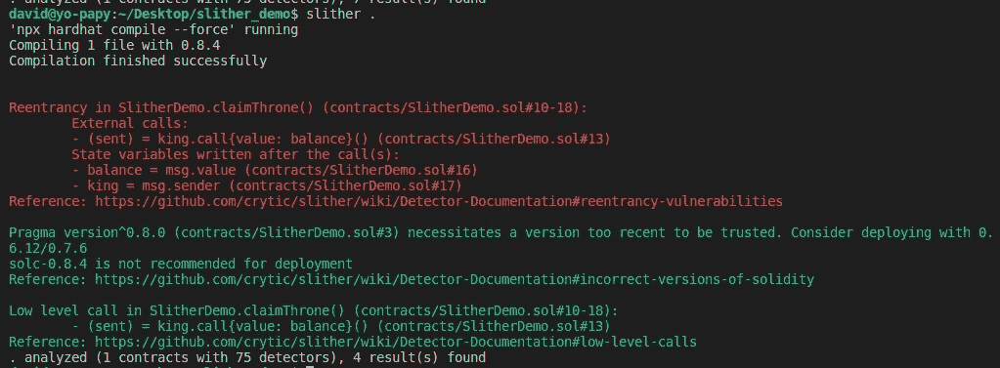

# 使用 Slither 进行自动化智能合同安全审查

> 原文：<https://medium.com/coinmonks/automated-smart-contract-security-review-with-slither-1834e9613b01?source=collection_archive---------2----------------------->


智能合约代码只能在部署到 Testnet 或 Mainnet 之前进行修改，部署之后它们就变得不可修改或不可更改。如果智能合约具有不安全的代码，漏洞可能会被恶意行为者利用，导致数百万美元的损失，正如一些智能合约所发生的那样。这就是智能合同在部署前必须经过严格审核的原因。

那么什么是 slither 呢？Slither 是一个智能合约的静态分析框架，它使开发者能够在几秒钟内找到他们的 solidity 智能合约代码中的漏洞，它也可以用于代码优化或审查。

# 装置

Slither 以 python 模块的形式出现，它需要在计算机上安装 python 3 +, slither 与 solc-select 携手工作，solc-select 是一种用于在 Solidity 编译器版本之间切换的工具。要安装 slither 和 solc-select，请在终端中运行以下命令。

```
$ pip3 install slither-analyzer
$ pip3 install solc-select
```

你可以在这里了解更多关于如何改变你的 solidity 编译器版本[。](https://github.com/crytic/solc-select)

**跑步滑行**

现在我们已经安装了 Slither 和 solc-select 模块，是时候对我们的智能合约运行自动化安全审查了。

在 hardhat 或 Truffle 应用程序上，打开终端并在项目目录中运行`slither .`,在 solidity 文件上运行`slither filepath/file.sol`

让我们来看看下面的合同

正如您在下图中看到的，slither 在我们的智能合约代码中检测到可重入性安全漏洞，并以红色突出显示，我们还得到一些绿色的改进建议



就这样，在几秒钟内，Slither 就能够检测和描述安全问题，包括潜在的漏洞、严重性以及为我们的智能合同推荐的修复方法。

> 加入 Coinmonks [电报频道](https://t.me/coincodecap)和 [Youtube 频道](https://www.youtube.com/c/coinmonks/videos)了解加密交易和投资

## 也阅读

[](https://blog.coincodecap.com/crypto-exchange) [## 最佳加密交易所| 2021 年十大加密货币交易所

### 编辑描述

blog.coincodecap.com](https://blog.coincodecap.com/crypto-exchange) [](/coinmonks/top-5-crypto-lending-platforms-in-2020-that-you-need-to-know-a1b675cec3fa) [## 2021 年最佳加密借贷平台| 6 大比特币借贷平台

### 获得比特币和其他加密货币的最佳贷款利率

medium.com](/coinmonks/top-5-crypto-lending-platforms-in-2020-that-you-need-to-know-a1b675cec3fa)