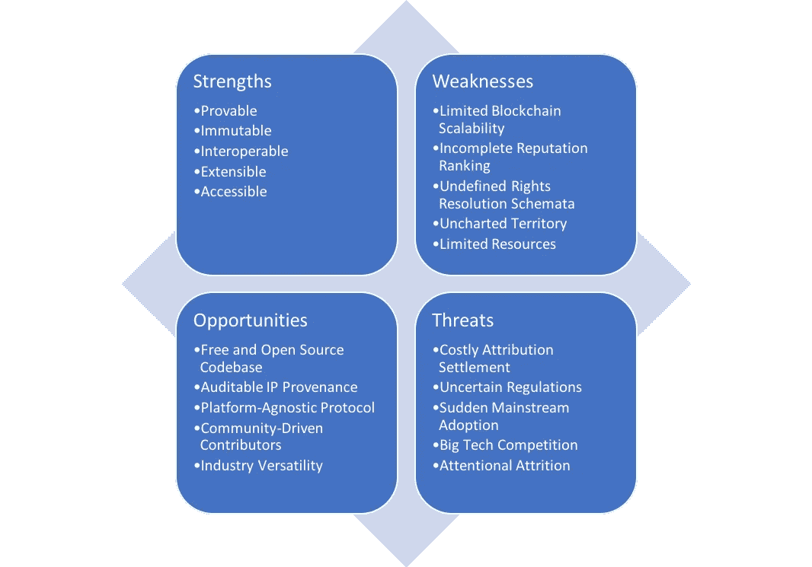
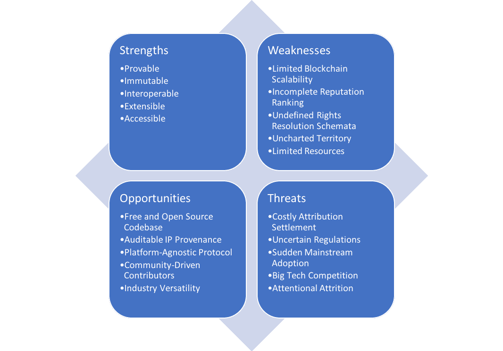

# 分散式网络的知识产权自动化

> 原文：<https://medium.com/coinmonks/automating-intellectual-property-for-the-decentralized-web-bf68cd049109?source=collection_archive---------7----------------------->

SWOT Matrix for COALA IP

# 自动化法律应用联盟—知识产权

为了方便读者，下面的 SWOT 分析被删节了。

# 执行摘要:

许多公司正试图解决定义一个[全球治理模型](https://github.com/COALAIP/specs)的问题，该模型用于“记录[知识产权(IP)]归属和关于作品的相关元数据，分配或许可权利，调解纠纷，以及认证他人的权利主张……而不需要集中控制。”如今，以太坊、Cardano 和 NEO 等分散式应用(DApp)平台实现了针对其自身技术和智能合同参数的合同治理模型。虽然它们拥有相似的价值观(例如，智能合同是消除第三方成本中介的有效工具)，但它们没有一个记录、分配或许可对有效智能合同治理至关重要的知识产权的全球标准。着手调整[“当前知识产权法和网络之间的根本不匹配”，](https://github.com/COALAIP/specs/blob/master/presentations/COALA%20IP%20Report%20-%20May%202016.pdf)[COALA IP](https://www.coalaip.org/)协议擅长统一技术规范框架和知识产权(IP)权利参考模型(RRM)。作为一个自由开源(FOSS)的分散协议，COALA IP 通过区块链和分布式账本技术(DLTs)为自动化 IP 归属、许可和发现奠定了基础。

**优势**

COALA IP 的独特价值主张有三个方面。它是可互操作的、可扩展的和不可变的。与现有标准组织、全球知识产权机构和不断发展的分布式账本技术的互操作使得 COALA IP 非常通用。COALA IP 能够协调不同技术和不同法规的各个组件，这使得该协议脱颖而出。此外，它用新的数据类型、属性模型和许可元数据支持、补充或补充当前 IP 模式的能力使 COALA IP 协议既具有互操作性又具有向前兼容性。随着区块链和 DLTs 的不断普及，COALA IP 的协议可以很容易地修改并扩展到未来。将带有时间戳的知识产权数据散列到区块链的永久性意味着知识产权属性是不可变的、可证明的和高度冗余的。这种持久性可以为内容创建者、连接者和发布者等提供保证，并实现自动知识产权发现和出处证明的机制。作为一个完整记录的协议，COALA IP 擅长于使创建者、连接器和发布者容易理解 IP 权利是如何存储、管理和使用的。总的来说，COALA IP 作为一个基础的、多方面的协议脱颖而出，具有发展空间。

**弱点**

作为一个新兴行业的先行者，COALA IP 面临着技术和资源的限制。目前，区块链不提供可扩展的解决方案。尽管比特币最近的[隔离见证](https://en.wikipedia.org/wiki/SegWit)软分叉增加了每块的交易数量，降低了交易成本，但其区块链仍然无法容纳高交易量。有限的区块链可扩展性仍然是以太坊和其他领先区块链的弱点。这些限制导致 COALA IP 无法大规模交付生产就绪的分散式 IP 管理解决方案。尽管 COALA IP 的互操作性为内聚的协议开发奠定了基础，但其不完整的信誉排名和未定义的权限解析模式目前限制了 COALA IP 的目标范围。今天，COALA IP 可以帮助创作者和出版商在区块链上注册知识产权、属性和许可，但它不能完全解决权利冲突或属性纠纷。缺乏交付能够解决归属错误和权利冲突的生产就绪协议所需的资源会减缓进度并限制功能用例。在信誉管理和权限解析程序发挥作用之前，COALA IP 不会是一个完全可交付的协议。目前，COALA IP 的弱点阻碍了它的主流部署和采用。

**机遇**

虽然 COALA IP 的内部弱点取决于技术和资源限制，但其自由/开源软件许可和社区驱动的精神特质为外部克服这些限制提供了机会。区块链和分布式账本技术处于新兴技术兴奋的前沿。这些革命性技术带来的激动人心的前景伴随着强大的经济刺激。《纽约时报》最近报道，“研究公司 Gartner 预测，2018 年，区块链技术的全球商业收益将达到 50 亿美元，到 2021 年将增长四倍以上，达到 210 亿美元。”作为免费和开源软件，COALA IP 为外部企业、非营利组织和大学提供了一个知识产权、属性和许可自动化的起点。因为 COALA IP 协议是免费和开源的，它降低了外部 IP 集成的门槛。该协议的平台无关功能意味着外部组织可以将 COALA IP 与他们自己的区块链或 DLT 集成。反过来，这些外部集成可以为跨行业发展和调整 COALA IP 协议提供有价值的用例。这种由社区推动的开发、协作和集成工作意义重大，因为它使使用当前 IP 管理标准的组织能够适应并受益于区块链技术的发展。如今，许多企业承认，知识产权许可冲突很难追踪，解决起来成本也很高。尽管知识产权在网上和网下的运作方式应该是一样的，但内容创作者没有自动注册知识产权的程序，出版商也没有在发生权利冲突时追踪出处的方法。COALA IP 为内容创建者、连接者和发布者提供了一个机会，通过快速、廉价的知识产权审计和知识产权归属模型来克服这些障碍，这些模型在默认情况下支持自动溯源。COALA IP 充满希望的外部机遇超过了其当前的局限性。

**威胁**

虽然在测试版中功能正常，但如果主流媒体合作伙伴加入进来，目前使用 COALA IP 协议的产品(如 [UjoMusic](https://ujomusic.com/) )可能会出现故障。这部分是由于区块链可伸缩性限制的潜在弱点。如果实现 COALA IP 的区块链或分布式分类账无法扩展以适应高交易量，它将减慢或崩溃，协议将变得无用。另一个可能给 COALA IP 带来麻烦的外部因素是它目前无法解决权利冲突。如果内容创建者或发布者使用 COALA IP 错误地赋予 IP 属性，则不完整的权限解析过程可能会给该方带来昂贵的外部法律麻烦。鉴于当今不断变化的监管环境，在生产中部署 COALA IP 可能会适得其反，并威胁到协议的成功。特别是，与一般数据保护法规(GDPR)不遵守相关的罚款和处罚可能会给过早部署 COALA IP 的小型组织带来巨大的财务麻烦。随着一项新的专横的欧盟著作权法在 7 月份走向立法，与不遵守或错误分配相关的成本可能会变得更大。相反，像脸书、苹果、微软和谷歌这样的全球科技巨头面临着不同的现实。他们承受违规罚款和处罚的财务和法律能力使他们与中小型企业不同。此外，大型科技公司已经在形成自己的合作伙伴关系，以改变知识产权管理领域。2018 年 6 月 21 日，T4 安永和微软推出了区块链解决方案 T5，用于媒体和娱乐业的内容版权和版税管理。他们的解决方案将利用[微软 Azure](https://azure.microsoft.com/en-us/) 和 [JPMC](https://www.jpmorganchase.com/) 的专有区块链协议 [Quorum](https://www.jpmorgan.com/global/Quorum) ，从 [XBOX](https://www.xbox.com/en-US) 及其长期游戏合作伙伴[育碧软件](https://www.ubisoft.com/)开始提供新颖的 IP 管理解决方案。来自 COALA 知识产权集中竞争的私人解决方案的地位和规模威胁到他们的基础自由/开源软件协议的注意力损耗。区块链空间每天都在以激动人心的突破和新的分散应用爆炸式增长；然而，区块链专家相对较少。除了面临激烈的协议竞争之外，COALA IP 还面临着寻找和留住技术人才的艰巨任务。

**结论**

COALA IP 成功地为能够集成区块链和分布式账本技术的知识产权管理和许可解决方案奠定了基础。它在一个非常年轻的行业中的早期立足点，使批判性思维和必要的联盟建设成为可能。作为一个协议，COALA IP 的成功很大程度上取决于部署它的技术和分散应用的成功。尽管未来的技术集成和适应机会比比皆是，但这对今天的 COALA IP 来说是一把双刃剑。更重要的是，COALA IP 已经成功地成为私有协议开发者的典范。微软、EY 和 JPMC 在 COALA IP 协议开始开发 3 年后宣布了 COALA IP 的私人竞争对手，这应该被视为成功的标志。鉴于其历史、独特的价值主张和良性竞争的好处，COALA IP 也可以被其他行业领导者纳入，并正式成为一个新的知识产权许可标准。

# SWOT 矩阵:

SWOT Matrix for COALA IP

# 优势:

*   **可证明:**公开证明知识产权数据的权利、归属和出处
*   **不可变:**将防篡改的知识产权和归属数据永久写入区块链
*   **可互操作:**在全球范围内、分类帐内和分类帐间交换与区块链无关的知识产权和许可数据*
*   **可扩展:**随着时间的推移，可以添加新的数据类型和实体属性元数据，以补充现有和未来的数据和协议
*   **可访问:**在线访问透明、强大的 IP 文档(变得更加多语言化)

***总结:*** *COALA IP 为整个区块链易于集成、更新和维护的自动化知识产权管理奠定了基础。*

# 缺点:

*   **有限的区块链可扩展性:**当前的区块链无法扩展以适应主流媒体 IP 集成的吞吐量
*   **不完整的声誉排名:**声誉排名治理的缺乏使得版权和许可争议成为冲突和升级的温床
*   **未定义的权利解决方案:**未定义的方案*将争议解决的责任转移给 dapp 开发人员和外部第三方
*   **未知领域:**缺乏用于自动化知识产权归属和发现的既定协议使得形式化变得不确定
*   **资源有限:**缺乏专用于正式 IP 规范 stall 协议开发的资源

***总结:*** *作为一个新生且基本未定义的行业中的早期推动者，COALA IP 面临着技术和资源的限制。*

# 机会:

*   **自由和开放源码软件代码库:**自由和开放源码软件的知识产权、归属和许可规范使开发者、权利持有人、企业等。处于控制地位
*   **合适的知识产权出处:**快速、廉价地搜索和验证知识产权、归属和许可出处，以利用当今知识产权的弱点
*   **平台无关协议:** COALA IP 协议支持 IP 权利和归属与许多区块链和分布式账本技术的集成
*   **社区驱动的贡献者:**贡献者、分散协议和区块链初创公司(如 Ujo Music、IPFS、Ascribe 等)的主体不断增长。)
*   **行业通用性:**自动化知识产权归属、许可和发现的用例遍布全球市场，能够快速适应不断发展、高度微妙的知识产权法律

***总结:*** *虽然 COALA IP 的内部弱点取决于技术和资源限制，但其免费和开源协议以及社区驱动的风气为外部克服这些限制提供了机会。*

# 威胁:

*   **昂贵的归属结算:**区块链不变的本质和结算模式的缺乏威胁着 COALA IP 在实践中的成功
*   **不确定的监管:**区块链和加密货币监管的零碎现实在全球范围内造成不确定性，并可能威胁 COALA IP 未来的成功
*   **突然的主流采用:**没有可扩展区块链的突然的主流采用威胁着网络拥塞和不起作用的协议
*   **大的技术竞争:**鉴于 COALA IP 有限的资源和区块链巨大的工业利益，大的技术竞争对手可以更快地提供可用的协议标准
*   **注意力损耗:**随着用于 IP 管理的新区块链协议成为焦点，FOSS COALA IP 协议的开发工作可能会褪色

***摘要:*** *COALA IP 面临着来自大型技术公司的激烈竞争，这些公司能够大规模提供功能齐全、经过全面审查的区块链协议。*

# 参考资料:

**未定义的图式:**

*   Schema.org: [版权所有者](https://schema.org/copyrightHolder)、[许可](https://schema.org/license)、[伦理政策](https://pending.schema.org/ethicsPolicy)、[修正政策](https://pending.schema.org/correctionsPolicy)和 [actionableFeedbackPolicy](https://pending.schema.org/actionableFeedbackPolicy)
*   COALA IP:[rights conflict](https://github.com/COALAIP/specs#the-rrm-rightsconflict-entity)， [proposedTransformation](https://github.com/COALAIP/specs#proposed-transformation-6)
*   互操作性:根据 [COALA ID 规范](https://github.com/COALAIP/specs#the-interledger-protocol)，Interledger 协议仍未定义；然而， [Interledger](https://interledger.org/) 提供了完整的文档并与 [W3C](https://interledger.org/community.html) 合作

# 关键词和定义:

*   [全球治理模式](https://github.com/COALAIP/specs)
*   自由和开放源码软件
*   CC —知识共享
*   [LCC 框架](http://www.linkedcontentcoalition.org/index.php/rights-data-network/lcc-framework) —链接内容联盟

[LCC EM](https://github.com/COALAIP/specs#the-lcc-entity-model) —链接内容联盟实体模型

*   实体模型定义了由 5 个关键属性组成的实体:
*   类别:实体所属的广泛类别(例如，Language = iso 3166–1 a2:EN(" English "))
*   描述符:实体的名称(例如，名称=“安迪·沃霍尔”)
*   数量:与实体相关的数值(如高度= 20 厘米)
*   时间:与实体相关的时间或日期(例如，DateOfCreation=1999)
*   链接:到另一个实体的链接(例如“安迪·沃霍尔”——isCreator→“32 个金宝汤罐”)
*   [LCC RRM](http://www.linkedcontentcoalition.org/phocadownload/framework/The%20LCC%20Rights%20Reference%20Model%20v1.0.pdf) —链接内容联盟权利参考模型

[LCC 权利参考模型](http://doi.org/10.1000/284) (LCC RRM)是表示知识产权的正式框架。RRM 描述了建立在 [LCC 实体模型](https://github.com/COALAIP/specs#the-lcc-entity-model)之上的高层数据模型，由以下实体类型组成:

*   当事人:一个人或一个组织(如“理查德·普林斯”、“美国服装”或“斯凯·费雷拉”)
*   创作:由一方创作的东西(例如“未命名的 Instagram 肖像”)
*   地点:虚拟或物理位置(例如“纽约市”或“[http://www.newyorkcity.com](http://www.newyorkcity.com/)”)
*   权利:一组许可，授权一方对一个创作做某事(例如，生产和销售带有该创作的 t 恤)
*   权利转让(RightsAssignment):一方做出的导致权利存在的决定(例如，“理查德·普林斯授予 American Apparel 在北美生产和销售带有无标题 Instagram 肖像的 t 恤的权利”)
*   主张:关于权利实质的主张(例如，“理查德·普林斯声称他拥有无标题 Instagram 肖像的版权”，或者“斯凯·费雷拉声称她拥有无标题 Instagram 肖像的版权”)
*   RightsConflict:对某项权利不同意的声明(例如，“斯凯·费雷拉和理查德·普林斯都声称拥有无标题 Instagram 肖像的版权”)

语义网 —数据网

*   数据网络的最终目标是使计算机能够做更多有用的工作，并开发能够支持网络上可信交互的系统。

RDF —资源描述框架

*   描述本体的框架

[URI](https://tools.ietf.org/html/rfc3986) —通用资源标识符

*   使资源和内容可寻址

[URL](https://tools.ietf.org/html/rfc1738) —通用资源位置

*   内容驻留的地址

[ccREL](https://www.w3.org/Submission/ccREL/) —知识共享权利表达语言

*   Creative Commons (CC)为版权许可条款和相关信息的机器可读表达推荐的标准。 [1](https://www.w3.org/Submission/ccREL/#foot548)

[ODRL](https://www.w3.org/ns/odrl/2/) —开放数字版权语言

*   开放数字版权语言(ODRL)是一种策略表达式语言，它提供了灵活且可互操作的信息模型、词汇和编码机制，用于表示关于内容和服务使用的声明。